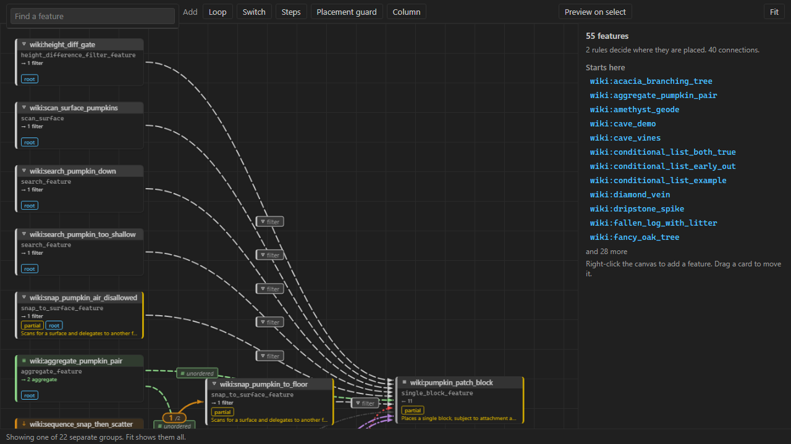
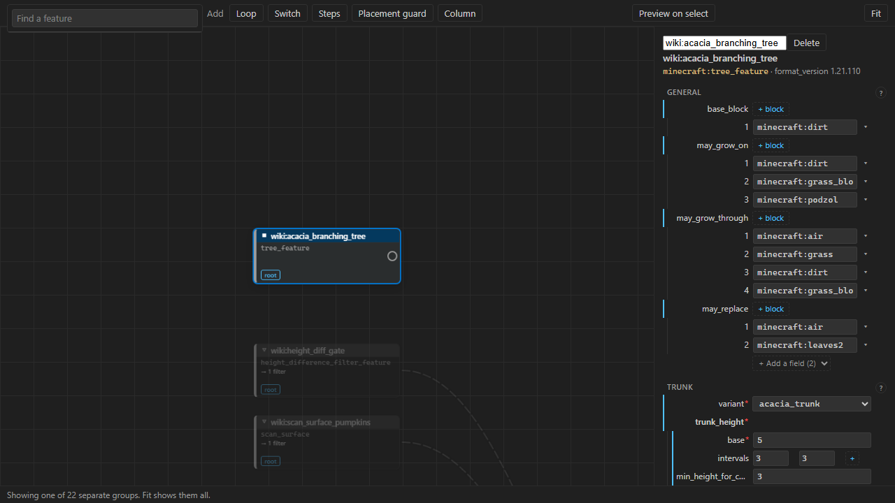
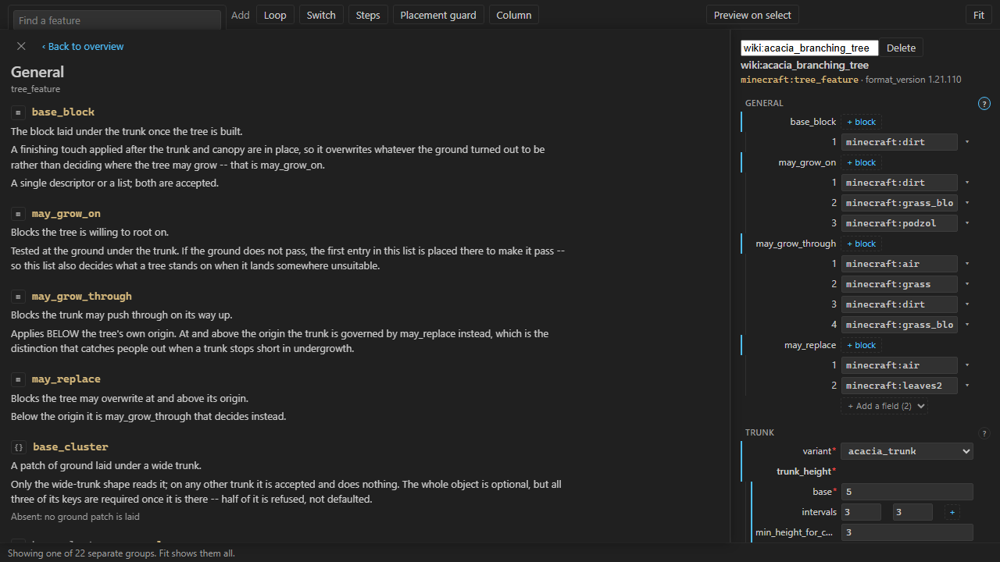
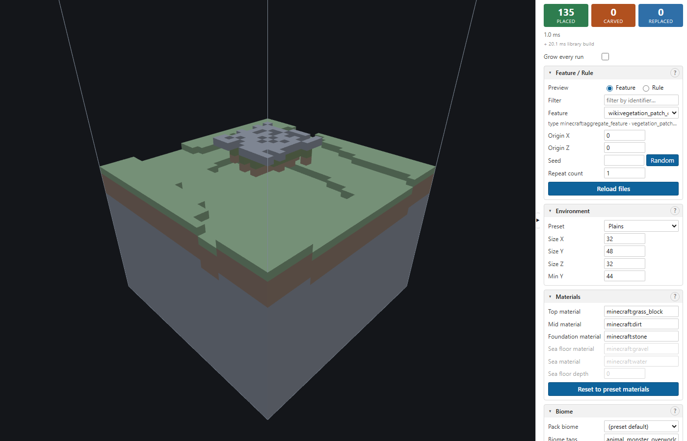

# Feature Lab

Feature Lab shows you what a Minecraft Bedrock worldgen feature actually does. Open a
`features/` or `feature_rules/` JSON file and it renders the blocks that file would place in a 3D
view beside your code — or draws your whole pack as a graph you can read, search and edit.

Two commands, both in the Command Palette from the moment the extension is installed:

| Command | Needs | What you get |
|---|---|---|
| **Feature Lab: Open Feature Graph** | The pack folder open | Every feature in the pack, as connected cards you can edit |
| **Feature Lab: Preview Feature** | A feature JSON open in the editor (`Ctrl+Alt+P` / `Cmd+Alt+P`) | The blocks this feature places, in a rotatable 3D panel |

## First run

1. **Open your behaviour pack folder** — anything with a `features/` directory in it. Open the
   pack folder itself, not the parent that holds both packs. (If you do open the parent, the
   graph still finds the pack inside it.)
2. **Run `Feature Lab: Open Feature Graph`** from the Command Palette — `Ctrl+Shift+P`, then type
   "Feature Lab". No file needs to be open: the graph is about the pack, not about one file.
3. **For the 3D preview instead**, open a feature JSON and press `Ctrl+Alt+P`. A preview is of one
   feature, so this one does need a file — or click a card in the graph.

Nothing to install. The engine ships inside the extension.

## The feature graph

Every feature and rule in the pack is a card; every `places_feature` is an edge. Cards are
colour-coded by what the delegation *is* — a scatter, a weighted pick, a sequence — so the shape
of a pack is visible before you read a line of it.

Select a card and the right-hand panel becomes a form for that feature, built from the type's real
schema: the fields it has, which are required, and which blocks and Molang expressions it holds.
Editing the form writes the file.

- **Search** (`Find a feature`, top left) matches identifiers, types and filenames, and tells you
  what is wrong with a hit before you click it.
- **Right-click empty canvas** to create a feature. The menu only offers what the engine can
  actually build at your pack's `format_version`.
- **Groups** — select several cards, `Ctrl+G`, and they become one named card you can fold and
  unfold. The grouping lives in the pack files, so it is yours and your team's, not a local
  setting. Groups are never guessed at: a group exists because somebody made it.
- **Patterns** in the create menu place several features wired together in one step — a loop, a
  column, a placement guard — for shapes the type list has no single entry for.

Every section of the form has a `?` that opens what that field does, in plain words.

## The 3D preview

`Ctrl+Alt+P` runs the feature into a small world generated for the purpose and shows you the
result. Saving the file re-renders it.

The sidebar controls the run:

| Section | What it is for |
|---|---|
| **Feature / Rule** | Which feature to place, where, and how many times. A rule preview runs the rule's own distribution across the chunks it would decorate. |
| **Environment** | The world to place into: ten terrain presets, from `plains` to `nether` to an empty `void`, and the size of the volume. |
| **Materials** | What the terrain is made of, so a feature that only attaches to one block can be tested without editing the pack. |
| **Biome** | A pack biome to run under, or a hand-written tag list, for features gated on biome tags. |
| **Budget** | Limits on writes, delegations and wall-clock time, so a feature that references itself truncates instead of hanging. |
| **View** | Slice by height, hide the surrounding terrain, colour cells by write count, frame the camera. |
| **Diagnostics** | Everything the run declined to do, and why — with the delegation chain that reached it and a button that moves the camera there. |

If the preview comes back empty, **Diagnostics** is where the reason is. The wiki's
[When the preview shows nothing](https://github.com/stirante/featurelab/blob/HEAD/docs/wiki/preview-shows-nothing.md)
page lists every reason the engine can give.

Ctrl+click (Cmd+click) a `places_feature` or `features` entry in the JSON to jump to the file that
defines it.

## When something goes wrong

Every command shows what step it is on and leaves a spinner in the status bar while it runs. On a
big pack the engine's own progress joins that line — the phase it is in, how many files it has
read, and a second count that keeps moving — so a long load reads as work rather than as a hang.
Every failure ends in a short message with a **Show log** button.

Run **Feature Lab: Show Log** for the whole story: which engine executable was chosen and its
version, the pack root it worked out, how long each step took, and everything the engine wrote,
verbatim. Load-time problems also appear as squiggles in the JSON and in the Problems panel.

## Settings

| Setting | Default | What it does |
|---|---|---|
| `featurelab.binaryPath` | *(empty)* | Path to the engine executable. Leave empty to use the bundled copy; set it to point at a local build. |
| `featurelab.requestTimeoutMs` | `30000` | How long the engine may go **silent** before a request is given up on — not how long the request may take. The engine reports progress once a second on anything slow, and each report buys another full wait, so a pack that needs a minute to load is never cut off while it is visibly working. Raising the panel's own placement time limit raises this with it. |
| `featurelab.env` | `plains` | Which environment preset a new panel starts on. |
| `featurelab.blockTextures` | `true` | Prepare real block textures for the preview. The first preview asks **once** whether to fetch Mojang's sample resource pack (about 150 MB, cached outside your pack); declining is remembered. Turning it off means nothing is fetched, built or asked about. Whether textures are actually *drawn* is the preview sidebar's own **Block textures** switch, which remembers what you choose; either one off leaves the preview in flat colours, and it says which. |

## What a preview is, and is not

The preview is a **bench**, not the game. It places one feature into a world it generated for the
purpose, so it can show that feature in isolation and say why a placement failed. It does not
generate a real chunk: no other feature runs beside yours, and nothing here proves the same JSON
behaves identically in Minecraft.

Where the two are known to differ, the tool says so — in a diagnostic when it affects your file,
and in the [project wiki](https://github.com/stirante/featurelab/blob/HEAD/docs/wiki/index.md)
otherwise. That wiki carries a page per feature type and a
[coverage page](https://github.com/stirante/featurelab/blob/HEAD/docs/wiki/coverage-and-known-gaps.md)
listing every known gap. It is the honest place to start when a preview and the game disagree.

## Requirements

VS Code 1.85 or newer. Nothing else.
