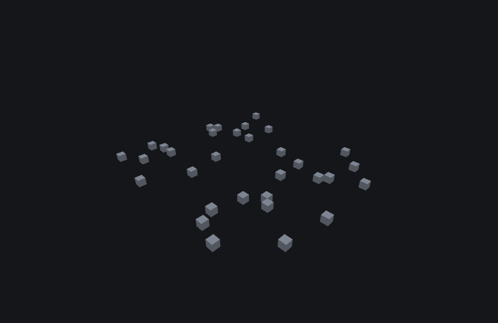

# Feature rules

<VersionBadge />

**A `minecraft:feature_rules` file is how a feature reaches a world at all.** Every feature type places blocks *when it is called*; a rule is what calls them. One JSON file per rule, under a behaviour pack's `feature_rules/` folder, names a feature, names the biomes it applies to, and says where in each of those biomes' chunks to try it. Without a rule pointing at it, a perfectly correct feature file is inert.

You need one for every top-level feature in your pack — the root of each delegation chain. You do not need one for the features *inside* a chain: a scatter's `places_feature`, an aggregate's list, a sequence's steps are all reached through the feature that names them.

A rule is also the one worldgen object that is *not* a feature, which is the source of most of the confusion around it. It cannot be delegated to, it cannot be named by any `places_feature` anywhere, and it has no placement of its own that another file could reach. It exists only at the top: the engine attaches it to chunks, and nothing below it can see it.

## Start here: a complete example

One file. It attaches the [scatter feature](./scatter_feature.md) page's pumpkin patch to every overworld biome's surface pass, four times per chunk, anywhere in the chunk:

```json title="feature_rules/pumpkin_patch.fr.json"
{
  "format_version": "1.21.110",
  "minecraft:feature_rules": {
    "description": {
      "identifier": "wiki:pumpkin_patch.fr",
      "places_feature": "wiki:pumpkin_patch"
    },
    "conditions": {
      "placement_pass": "surface_pass",
      "minecraft:biome_filter": { "test": "has_biome_tag", "value": "overworld" }
    },
    "distribution": {
      "iterations": 4,
      "x": { "distribution": "uniform", "extent": [0, 15] },
      "y": 0,
      "z": { "distribution": "uniform", "extent": [0, 15] }
    }
  }
}
```

What each choice buys you:

- **`placement_pass: "surface_pass"`** runs the rule after the terrain is shaped and the underground passes are finished, so the pumpkin patch has ground to attach to. It is the pass most new rules belong in — see [the placement passes](#placement-pass).
- **`has_biome_tag: "overworld"`** attaches the rule to every biome carrying that tag. `{}` would attach it everywhere, including the Nether and the End.
- **`extent: [0, 15]` on `x` and `z`** covers exactly the chunk being decorated and nothing else, because [the origin is the chunk's corner](#coordinates-are-chunk-relative) — and because `uniform` never produces its high end, `[0, 15]` is offsets 0 to 14; the sixteenth column is reached with `[0, 16]`.
- **`iterations: 4`** is four attempts *per chunk*. How many chunks is not a number in this file — it is however many chunks of matching biomes the world has.

## Fields

A rule has three members — `description`, `conditions`, `distribution` — and nothing else in the file is read. Those six keys and `description` itself are the whole accepted surface: anything else written at any of those levels is an unrecognised member, which the engine names and drops unread, so a misspelled key is silently inert rather than an error.

### The file

| Key | Required | Value | What it does |
|---|---|---|---|
| `description.identifier` | yes | this rule's own name | Not a feature reference — nothing can name a rule. Renaming it moves everything the rule places: see [what moves a rule's output](#seeding). |
| `description.places_feature` | yes | a feature identifier | The feature this rule places. Note it sits under `description`, unlike a scatter's, which sits on the feature body. Unresolved, the rule places nothing at any seed; `featurelab check` reports it against this file. |
| `conditions` | yes | object | The wrapper is required even when it holds only the pass. |
| `conditions.placement_pass` | **yes** | one of [the passes below](#placement-pass) | Which pass over the chunk this rule's entry attaches to. Missing: the file does not load. Wrong: the file loads and the rule never runs — a different failure, and the quieter one. |
| `conditions.minecraft:biome_filter` | no — default: every biome | one of [the filter shapes below](#biome-filter) | Which biomes the rule is attached to. Absent or `{}` means all of them. |
| `distribution` | no — **default: a distribution whose `iterations` is 0** | identical in shape to a scatter's `distribution` | Where in the chunk to try, and how often. Optional, and leaving it out is worse than an error — see the warning. |

::: warning `distribution` is optional, and leaving it out is worse than an error
The file loads. The rule is inserted, attached to its pass and to every biome its filter matches — and then places nothing, in every chunk, forever, because a rule with no distribution gets a default one whose `iterations` is 0. Nothing is logged at generation time. If a rule appears to do nothing at all, checking that it *has* a `distribution` is the first thing to do.

The four keys marked required are required in the stronger sense: a file missing any of them fails to load and the rule is never inserted at all.
:::

### Inside `distribution`

Key for key, a scatter's: `iterations`, `x`, `y`, `z`, `scatter_chance` and `coordinate_eval_order`, with the same axis object — `distribution`, `extent`, `step_size`, `grid_offset` — and the same six distribution kinds. Read the scatter page's [`distribution` tables](./scatter_feature.md#fields) and [the six kinds](./scatter_feature.md#the-six-distribution-kinds) as if they were here; the figure there shows each kind over exactly the `[0, 15]` extent a rule uses. One thing changes meaning: the origin is the chunk's minimum corner, so `x` and `z` are offsets *into the chunk*, and `[0, 15]` on both is "inside this chunk and nowhere else" — though it reaches only fifteen of the chunk's sixteen columns, because `uniform` never produces its high end. See [coordinates are chunk-relative](#coordinates-are-chunk-relative).

A rule body carries no `project_input_to_floor`. That key lives on a scatter's body, *outside* its `distribution`, and a rule has no feature body to put it on — a rule **is** the distribution. When placements need to find ground, the thing to reach for is a [snap-to-surface feature](./snap_to_surface_feature.md) inside the chain the rule places, not a key on the rule.

### The biome filter {#biome-filter}

The filter decides which biomes the rule is attached to. Five shapes:

| Shape | Matches |
|---|---|
| absent, or `{}` | Always — every biome. |
| `{"test": "has_biome_tag", "value": "<tag>"}` | Biomes carrying that tag. |
| `{"any_of": [ … ]}` | At least one child matches. |
| `{"all_of": [ … ]}` | Every child matches. |
| `{"none_of": [ … ]}` | No child matches. |

The combinators nest: a child of `any_of` is itself any of these shapes, including another combinator. `has_biome_tag` is the test this documentation covers; other test names are not covered here, and a rule that depends on one is outside what this page can vouch for.

::: warning A filter that matches nothing is the commonest reason a pack appears to do nothing at all
It is silent in the game — a rule that was never attached to a biome has nothing to report, because from the chunk's point of view it does not exist. Before debugging the feature, check the tag: a mistyped `value`, or a tag the target biome does not actually carry, produces exactly the same empty world as a broken feature does.
:::

### The placement passes {#placement-pass}

Chunks are not decorated in one sweep. The engine registers **eleven passes, in a fixed order**, and `placement_pass` chooses which one a rule's entry is attached to:

| # | Pass | Reach for it when |
|---|---|---|
| 1 | `first_pass` | Something must exist before anything else runs. |
| 2 | `before_underground_pass` | |
| 3 | `underground_pass` | Ores, caves' contents, anything below the surface. |
| 4 | `after_underground_pass` | |
| 5 | `before_surface_pass` | Reshaping the ground — flattening, filling, a platform — that surface decorations should land on. |
| 6 | `surface_pass` | Most new rules: trees, plants, patches, anything that attaches to the ground. |
| 7 | `after_surface_pass` | Reacting to what the surface decorations placed. |
| 8 | `before_sky_pass` | |
| 9 | `sky_pass` | Things above the terrain. |
| 10 | `after_sky_pass` | |
| 11 | `final_pass` | Cleanup that must see everything else. |

That is the complete ordered list. The three-way `before_`/plain/`after_` grouping around *underground*, *surface* and *sky* is the useful part of its shape: two hook points around each of the three regions, so an author never has to guess an ordinal to get in front of or behind something. What each pass is for, one at a time, is in the [field reference](#conditions-placement_pass) below.

**What the ordering buys you is a guarantee about the world your rule sees.** A rule in an earlier pass runs against a world that every later pass has not touched yet. That is what makes the terraform-then-decorate shape work: a rule that reshapes ground placed in `before_surface_pass` has finished before anything in `surface_pass` starts looking for a surface to attach to, so the decorations land on what the first rule built rather than on what was there before it. Run the two in the other order and the decoration attaches to the old terrain and then gets buried by the new. The converse is the cleanup case: a rule in `after_surface_pass` or `final_pass` sees everything the surface decorations placed, and can react to it.

::: note `pregeneration_pass` is a twelfth accepted value
It is kept in its own separate list rather than in the ordered eleven, and **only cave carvers may run in it**. Any other feature type paired with it is refused with `"cave_carver_feature" is the only valid feature in "pregeneration_pass" placement pass.` and places nothing, however well the rest of the rule is written. What that pass is for beyond carving, and where it sits relative to the eleven, is not known with certainty.
:::

::: warning `placement_pass` is required, and a wrong value fails differently from a missing one
- *Missing*: the file does not load. Nothing is inserted, and the whole rule is gone.
- *Unrecognised*: the engine logs `Feature rule identifier '<id>' specifies unknown pass '<pass>'.` — and then **keeps the value as written**. It does not fall back to a default. The rule is inserted and attached to its biomes, chunk decoration only ever visits the passes it knows, and so the rule is never reached. Nothing is logged again, in any chunk, ever.

The second is the one that costs an afternoon: everything about the file looks right, the rule is "loaded", and it simply never runs. Check the spelling against the table above.
:::

Two rules may share an identifier as long as their passes differ — the engine keys its store by pass first and then by identifier, so both are kept and both run. Two rules with the same identifier in the **same** pass are not: the first one loaded wins, and the second is dropped silently.

## Common mistakes: why nothing was placed {#why-nothing-was-placed}

Seven distinct failures produce the same empty chunk. An author can tell them apart — but not all of them from the game alone.

| Cause | How you tell | Fix |
|---|---|---|
| **The pass name is not one the engine knows.** | The rule loaded, one line was logged at load, and it has never run since. | Correct the spelling against [the pass table](#placement-pass). |
| **No `distribution`.** | Loads, attaches, places nothing, in every chunk, forever. Silent after load. | Give it one. A rule without a distribution has `iterations` 0. |
| **`pregeneration_pass` with a non-carver.** | Nothing places, and the engine says so once. | Move the rule to one of the eleven decoration passes. |
| **The biome filter did not match.** | The rule never ran at all, in any chunk. Silent in the game. | Correct the tag, or use `{}` while testing. |
| **`iterations` evaluated to zero.** | The rule ran and did nothing, at every seed. | Fix the expression — this is not luck. |
| **`scatter_chance` did not roll.** | Another seed places. | Nothing, if the odds were intended. A bare number here is a **percent**: `1.5` means 1.5%, not 150%. |
| **`places_feature` is unresolved.** | Constant across every seed and every biome. | Fix the identifier — and check its case only if you are comparing against a tool: the game lower-cases both sides of this lookup, so a case mismatch resolves in game. |

The first three are the ones a rule file can get wrong while looking entirely correct: in each case the file loads, the rule exists, and nothing ever runs it.

Of the remaining four, the biome filter and an unresolved reference will never place anything at any seed in any world; the middle two look identical to each other in-game and are separated only by retrying, since a chance rejection eventually places and a zero `iterations` never does. [Test at several seeds before believing a placement is broken](./rng_and_determinism.md#what-this-means-when-you-are-authoring) is the habit this table exists to make concrete.

One failure is *not* quiet: a rule whose delegation is refused by the recursion guard content-logs `Feature rule <name> can't place internal feature`. If a rule places nothing and that line appears, the problem is a reference loop, not the filter — see [the recursion guard](./feature_delegation.md#the-recursion-guard).

Everything else stays silent by design; a chunk runs hundreds of refusals per pass and a log line each would be unusable. [Failure is normal, and mostly quiet](./feature_delegation.md#failure-is-normal) covers why, and how to work down a chain instead of guessing.

## How a rule runs {#how-a-rule-runs}

A rule is a `{distribution, places_feature}` pair added to a chunk's **decoration list** — the same list that holds the features a biome names directly. When the chunk is decorated, that entry runs the **exact same scatter machinery** `minecraft:scatter_feature` uses: the same distribution kinds, the same `scatter_chance` gate, the same `variable.originx`/`worldx` Molang writes, the same rule that every iteration runs whether or not the previous one placed. There is no separate "rule placement algorithm" to learn, and everything the [scatter feature page](./scatter_feature.md) establishes about a distribution applies here verbatim.

Two things differ from a scatter, and both matter:

1. **The origin is the chunk's minimum corner**, not an arbitrary position handed down by a caller. Every decoration entry in a chunk — a rule's included — scatters from that same base point, so a rule's `distribution.x`/`z` are effectively chunk-relative offsets.
2. **It runs once per chunk, of every biome whose filter matches.** A rule is not invoked by anything; it is attached, and then it fires for each chunk it applies to. "How many times does my rule run?" is answered by "how many chunks", not by any count in the file.

That is what "once per chunk" looks like from above:



```
featurelab generate --pack docs/wiki/tools/fixtures --rule wiki:rng_rule_a.fr --env void --seed 42 --size 32x16x32 --min-y 0
```

A 32×16×32 volume starting at `-16, 0, -16` spans exactly four chunks, and the run reports **four** rule invocations — at origins `(-16, 0, -16)`, `(0, 0, -16)`, `(-16, 0, 0)` and `(0, 0, 0)`. Those are the four chunks' minimum corners. The rule is eight iterations of a `uniform` `[0, 15]` x/z distribution placing a one-block marker; the run makes **32 attempts** (8 × 4 chunks), eight inside each chunk rather than concentrated in one, and all 32 land — none of them wandering into a neighbour's 16×16. A feature scattering over the same footprint would have come from *one* call with a wider distribution; this is four calls that never see each other. The `void` preset is used so nothing but the rule's own output is visible.

### Coordinates are chunk-relative, so `x`/`z` usually want `[0, 16]` {#coordinates-are-chunk-relative}

Because the origin is the chunk's minimum corner, an `extent` of `[0, 15]` on `x` and `z` stays inside that chunk and touches no other — but it does not cover the whole of it: `uniform` never produces its high end, so those are offsets 0 to 14, fifteen of the chunk's sixteen columns and 225 of its 256 cells. `[0, 16]` is the extent that reaches all sixteen, and it is still confined to the one chunk. Ranges that reach outside it are not illegal — they place into neighbouring chunks — but they make the output depend on which chunk is being decorated as well as where, and two adjacent chunks then spill into each other, which is harder to reason about than it looks.

The Molang side follows from the same fact: `variable.originx`/`originy`/`originz` hold the **chunk corner**, written once before any axis is evaluated, and `variable.worldx`/`worldy`/`worldz` hold each axis's absolute coordinate the moment that axis is computed. Both behave exactly as [the variables a scatter writes](./scatter_feature.md#molang-variables) describes, including the rule that `iterations` and `scatter_chance` are evaluated *before* any axis and so cannot read this call's `world*`.

## What moves a rule's output {#seeding}

A rule does not carry a seed and cannot be given one. Three facts decide where its placements land, and each one is a change you can or cannot make safely:

1. **Every chunk decorates on its own.** A rule produces the same layout in chunk (10, 4) whether or not its neighbours ever existed, and in whatever order the game happens to load them. So testing at several world seeds tests genuinely different chunks, not the same layout shifted.
2. **Every rule has its own sequence of random values, derived from the chunk and from the rule's own `description.identifier`.** Adding a rule to a pack does not move the rules already in it. **Renaming a rule moves everything it places** — the name is an input — while renaming the *feature* it points at (and updating the reference) changes nothing about where that rule puts things. If a rename must not move existing content, it is not a rename you can make.
3. **Changing the feature a rule places never moves the positions the rule picked for it.** Give the delegate a `randomize_rotation`, or swap a one-block delegate for a whole tree: the rule's positions stay exactly where they were. (This is a property of a rule, not of every scatter — a scatter *inside* a feature does move when its delegate changes; see the [RNG page](./rng_and_determinism.md#3-that-seed-is-used-twice-for-two-independent-streams).)

Where the derivations come from is on [where a feature's seed comes from](./rng_and_determinism.md#where-a-features-seed-comes-from); the rename effect is reproduced from two committed fixtures in [the advanced section](#reproducing-it).

## Field reference

Generated from the editor's own catalogue — the same text the Feature Lab node editor shows for a rule's form, including one description per placement pass. The [tables above](#fields) are the summary. A rule's schema has no `format_version` bands: one schema, no per-key version gates, no legacy spellings.

<!--@include: ../generated/fields/feature_rules.md-->

## What the bench does differently

featurelab names all seven causes above in its diagnostics — including the biome-filter rejection the game has no reason to mention — because an unfiltered "nothing happened" is indistinguishable from a bug. That is bench tooling, not engine behaviour: the game does not print these lines. Two more things a preview of a rule does that the game does not:

- **A rule preview runs the rule over the chunks the bench covers**, once per chunk from that chunk's corner, exactly as the game applies it — but in a world built from a preset, with no other rule running beside it. Anything the game decides by consulting other generated content cannot happen there.
- **`featurelab check` reports an unresolved `places_feature` on a rule as an error against the rule file**, naming `$.minecraft:feature_rules.description.places_feature`, with a near-match suggestion. A rule's delegation is checked exactly like a feature's — and this is the one row of the table above that is found *between* two files, which no amount of reading either file finds.

See [how claims on these pages are backed](../engine/coverage.md#how-claims-on-these-pages-are-backed) for the distance between the bench and the game in general.

## Advanced: the seeding, reproduced {#reproducing-it}

You do not need this section to write a rule. It is the evidence behind [what moves a rule's output](#seeding), for anyone reading a preview against the game or reproducing the engine.

From the per-entry seed the engine builds **two** generators: one the distribution draws positions from, one every delegated feature draws from. That split is why a change *inside* the placed feature never moves the positions the rule picked for it — see [that seed is used twice, for two independent streams](./rng_and_determinism.md#3-that-seed-is-used-twice-for-two-independent-streams).

The fixture pack behind this documentation carries two rules that are identical except for their identifiers, [`rng_rule_a.fr.json`](https://github.com/stirante/featurelab/blob/main/docs/wiki/tools/fixtures/feature_rules/rng_rule_a.fr.json) and [`rng_rule_b.fr.json`](https://github.com/stirante/featurelab/blob/main/docs/wiki/tools/fixtures/feature_rules/rng_rule_b.fr.json), both placing the same one-block feature through eight iterations of a `uniform` `[0, 15]` x/z distribution with `y: 0`:

```json title="feature_rules/rng_rule_a.fr.json"
{
  "format_version": "1.21.110",
  "minecraft:feature_rules": {
    "description": {
      "identifier": "wiki:rng_rule_a.fr",
      "places_feature": "wiki:rng_marker"
    },
    "conditions": {
      "placement_pass": "surface_pass",
      "minecraft:biome_filter": {}
    },
    "distribution": {
      "iterations": 8,
      "x": { "distribution": "uniform", "extent": [0, 15] },
      "y": 0,
      "z": { "distribution": "uniform", "extent": [0, 15] }
    }
  }
}
```

```
featurelab generate --pack docs/wiki/tools/fixtures --rule wiki:rng_rule_a.fr   --env void --seed 42 --size 32x16x32 --min-y 0
featurelab generate --pack docs/wiki/tools/fixtures --rule wiki:rng_rule_b.fr   --env void --seed 42 --size 32x16x32 --min-y 0
```

Both runs report four invocations at the same four chunk corners and make 32 attempts (8 iterations × 4 chunks), eight in each chunk — that even spread is the per-chunk half of the seeding. Their *coordinates* share nothing:

| Rule | first four cells (x, z) | placed |
|---|---|---|
| `wiki:rng_rule_a.fr` | `(-16, 5)`, `(-16, 10)`, `(-15, -6)`, `(-14, -7)` | 32 |
| `wiki:rng_rule_b.fr` | `(-15, -10)`, `(-14, -16)`, `(-14, -13)`, `(-14, -11)` | 31 |

Only the rule identifier differs between the two files, so its hash is the whole of the difference. Rule B places 31 rather than 32 because two of its 32 attempts landed on the same cell — a coincidence of its own stream, not a rule about anything. The image in [how a rule runs](#how-a-rule-runs) is rule A's own output from the first of these two runs.

::: note
The per-cell arrays in that JSON are run-length encoded as `{"rle": [value, run, value, run, …]}` — expand them before indexing if you decode the block grid yourself. The counts and coordinates above come from exactly these two runs.
:::

## See also

- [Scatter feature](./scatter_feature.md) — the distribution block a rule uses, kind for kind. Read that page's field tables and its six-kinds figure as if they were this one's.
- [RNG and determinism](./rng_and_determinism.md) — where a rule's seed comes from, why renaming one moves it, and the two independent streams every decoration entry gets.
- [Feature delegation and composite features](./feature_delegation.md) — what happens below a rule: the shared stream and Molang scope, the recursion guard, and why most refusals are quiet.
- [Single block feature](./single_block_feature.md) — the far end of almost every rule's chain.

## How this page was checked

Everything above is a statement about Bedrock **1.26.50.24**. The per-chunk seeding, the two-stream split and the rename effect are reproduced by the two committed rule fixtures and the commands above, whose counts and coordinates were read back out of `featurelab generate`'s result; the image was rendered from rule A's result by the documentation's own [image pipeline](https://github.com/stirante/featurelab/blob/main/docs/wiki/tools/generate-images.mjs). The pass list, the accepted key set and the load-time behaviours (an unknown pass kept verbatim, a missing `distribution` defaulting to zero iterations) are stated as facts about the game; the `pregeneration_pass` note says what is not known. The "reach for it when" column of the pass table is advice about what the ordering guarantees, not a statement about what vanilla puts in each pass.
