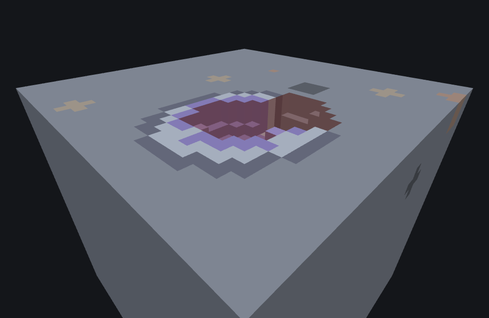

# Geode feature

<VersionBadge><CoverageBadge /></VersionBadge>

**`minecraft:geode_feature` builds a lumpy ball of concentric shells around its origin, usually hollow, usually with a crack cut through one side.** It is the type behind vanilla's amethyst geodes, and it is the one to reach for whenever you want a buried pocket with a lining: a crystal cave, an egg, a nest of ore in a rind of something else, a hollow boulder.

It is a **Scene feature**: it decides its own shape from a handful of randomly placed points and then writes every block itself, with no delegation. There is no `places_feature` here and nothing you name in it is a feature — all five layer keys are blocks, and `inner_placements` is a list of blocks too.

You do not need one for a plain lump of a single block, which is what an [ore feature](./ore_feature.md) is for. What a geode buys you is *layers*: five of them, in a fixed order from the outside in, each its own block.

## Start here: a complete example

One file. Every numeric field here is vanilla's own amethyst geode configuration verbatim, except `inner_placements`, cut to one entry so the picture reads as one block rather than four bud sizes competing for attention.

```json title="features/amethyst_geode.json"
{
  "format_version": "1.21.110",
  "minecraft:geode_feature": {
    "description": { "identifier": "wiki:amethyst_geode" },
    "filler": "minecraft:air",
    "inner_layer": "minecraft:amethyst_block",
    "alternate_inner_layer": "minecraft:calcite",
    "middle_layer": "minecraft:calcite",
    "outer_layer": "minecraft:smooth_basalt",
    "inner_placements": ["minecraft:amethyst_cluster"],
    "min_outer_wall_distance": 4,
    "max_outer_wall_distance": 6,
    "min_distribution_points": 3,
    "max_distribution_points": 4,
    "min_point_offset": 1,
    "max_point_offset": 2,
    "max_radius": 16,
    "crack_point_offset": 2,
    "generate_crack_chance": 0.95,
    "base_crack_size": 2.0,
    "noise_multiplier": 0.05,
    "use_potential_placements_chance": 0.35,
    "use_alternate_layer0_chance": 0.083,
    "placements_require_layer0_alternate": true,
    "invalid_blocks_threshold": 1
  }
}
```

What each choice buys you:

- **The five layer keys are the geode, read outside in**: `outer_layer` basalt, `middle_layer` calcite, then `inner_layer`/`alternate_inner_layer` amethyst-or-calcite, around a `filler` of air. That is a real geode's cross-section, and swapping those five blocks is the whole of restyling this type.
- **`min_outer_wall_distance` / `max_outer_wall_distance`** is the size knob. It is `[4, 6]` here, which gives 4 or 5 — never 6. See [how a range is read](#how-a-range-is-read), which is not what the field names suggest.
- **`inner_placements`** is the budding blocks. They are grown afterwards, onto the walls of the hollow centre, and only where two chance rolls and a wall check all allow it.
- **`max_radius: 16`** is not a size. It is how far out the feature bothers to look, and it only ever *clips* a geode that the other fields made bigger.



```
featurelab generate --pack <pack> --feature wiki:amethyst_geode --env underground_stone --seed 4 --origin 0,32,0
```

Run against the `underground_stone` preset (solid stone, no caves) with feature seed `4` and origin `(0, 32, 0)`, this geode changes **1,353 cells** spanning world `(-1..11, 30..42, -2..12)`: 383 `smooth_basalt`, 319 `calcite`, 206 `amethyst_block`, 434 cells of hollow-centre and crack `air`, and 11 `amethyst_cluster` buds at this seed.

::: tip The image is a cutaway, and that is a viewing choice
A geode this deep in solid rock is sealed on every side — every one of its cells borders either more geode or more stone — so an unsliced render would show nothing but the opaque `outer_layer` shell, the same problem [the ore feature's vein](./ore_feature.md) has. The picture above is cut at the geode's own vertical midpoint, world Y 36, with the surrounding rock drawn solid, which exposes a horizontal cross-section straight through the shells: hollow centre, `inner_layer` ring, `middle_layer` ring, `outer_layer` ring, from the middle out. Nothing about what the feature placed changes.
:::

## Fields

Twenty-one keys, and **every one of them is required** except `inner_placements`. There is no partial geode definition: a missing key is a build error naming it. "Default" below is therefore only meaningful for the one optional key. The long-form account of every key, in the editor's own words, is the [field reference](#field-reference) further down; these tables are the short version.

### The five layers, and the buds

Read top to bottom, these are the geode from the outside in.

| Key | Required | Value | What it does |
|---|---|---|---|
| `outer_layer` | yes | block descriptor | The outermost shell — the rind. |
| `middle_layer` | yes | block descriptor | The shell inside that. |
| `inner_layer` | yes | block descriptor | The innermost solid shell, the one the buds grow off. |
| `alternate_inner_layer` | yes | block descriptor | A second block that *some* cells of the innermost shell become instead, chosen per cell by `use_alternate_layer0_chance`. Write it the same as `inner_layer` if you do not want two. |
| `filler` | yes | block descriptor | The middle. `minecraft:air` makes the geode hollow; a solid block makes it a layered boulder. |
| `inner_placements` | no — the only optional key | array of block descriptors | The buds grown on the walls of the middle afterwards. Picked from **evenly** — there is no weight field here, unlike [weighted random features](./weighted_random_feature.md) or `places_block`'s own weighted list. An omitted or empty list simply means no buds. See [buds](#inner-placements). |

### Shape and size

| Key | Required | Value | Range | What it does |
|---|---|---|---|---|
| `min_distribution_points` | yes | integer | `[1, 10]` | The low end of how many points the blob is built around. More points make it lumpier and less spherical; fewer make it a cleaner ball. |
| `max_distribution_points` | yes | integer | `[1, 20]` | The high end — **never reached**. See [how a range is read](#how-a-range-is-read). Vanilla's `[3, 4]` is always 3. |
| `min_outer_wall_distance` | yes | integer | `[1, 10]` | The low end of how far each point is pushed from the origin, independently on X, Y and Z. This is the dominant size control. |
| `max_outer_wall_distance` | yes | integer | `[1, 20]` | The high end — never reached. Vanilla's `[4, 6]` gives 4 or 5. It also divides into the three outer shell thresholds, so lowering it grows the geode as well as shrinking the spread. |
| `min_point_offset` | yes | integer | `[0, 10]` | The low end of a per-point fudge that distorts the shells without moving the point. |
| `max_point_offset` | yes | integer | `[0, 10]` | The high end — never reached, and **if it equals `min_point_offset` the offset is `0`**, not that value. See [the two traps](#the-two-traps). |
| `max_radius` | yes | integer | not checked | How far from the origin the feature looks for cells at all. It is a bound, not a size: it cannot make a geode bigger, only clip one. |
| `noise_multiplier` | yes | number | not checked | How much the shell boundaries and the crack edge are roughened. `0` gives clean mathematical bands; vanilla's `0.05` gives visible roughness without losing the shape. The effect also scales with the number of points. |
| `invalid_blocks_threshold` | yes | integer | not checked | How many of the geode's points may land in `minecraft:bedrock`, `minecraft:packed_ice` or `minecraft:blue_ice` before the whole geode is abandoned. See [`invalid_blocks_threshold`](#invalid-blocks-threshold). |

### The crack keys

| Key | Required | Value | Range | What it does |
|---|---|---|---|---|
| `crack_point_offset` | yes | integer | `[0, 10]` | How wide the crack reads. This one does work — it enters the crack's own distance test the way a point's offset enters the shell density. |
| `generate_crack_chance` | yes | number | `[0.0, 1.0]` | **Nothing, at placement.** Validated when the file loads and then never read. See [the two lying fields](#the-crack). |
| `base_crack_size` | yes | number | `[0.0, 5.0]` | **Nothing, at placement.** Same. |

### The buds' three gates

| Key | Required | Value | Range | What it does |
|---|---|---|---|---|
| `use_alternate_layer0_chance` | yes | number | `[0.0, 1.0]` | Per cell of the innermost shell: the chance it becomes `alternate_inner_layer` instead of `inner_layer`. |
| `placements_require_layer0_alternate` | yes | boolean | — | When `true`, a bud is only ever attempted on a cell that became `alternate_inner_layer`. When `false`, every innermost-shell cell gets a chance. |
| `use_potential_placements_chance` | yes | number | `[0.0, 1.0]` | Per cell that got past the gate above: the chance a bud is attempted there at all. |

## Common mistakes

| You wrote | What happens | Do instead |
|---|---|---|
| `"min_distribution_points": 3, "max_distribution_points": 4` expecting 3 **or** 4 | Always 3. Both ends of every `min`/`max` pair here behave as *from `min`, up to but not including `max`*. | `[3, 5]` for a genuine 3-or-4. |
| `"min_outer_wall_distance": 4, "max_outer_wall_distance": 6` expecting up to 6 | 4 or 5. | `[4, 7]`. |
| `"min_point_offset": 2, "max_point_offset": 2` to pin the offset at 2 | The offset is **0**. A `min`/`max` pair that is equal means no offset at all, whatever the number is — and this is the one pair where an equal pair does not give you `min`. | `[2, 3]`, which pins it at 2. |
| `"generate_crack_chance": 0.1` to make cracks rare | No effect whatsoever. The roll is against a fixed value this field does not touch, and a crack appears roughly 19 times in 20 however you set it. | Nothing here will do it. If you need an uncracked geode, that is not a shape this type can be asked for. |
| `"base_crack_size": 4.0` for a wider crack | No effect. The crack's width comes from the number of points instead. | `crack_point_offset`, which really does widen it. |
| Raising `max_radius` to grow a geode | It is only how far the feature looks. A geode already inside the old radius does not change at all. | `min`/`max_outer_wall_distance`, and lower the `max` if you want the shells thicker. |
| `"invalid_blocks_threshold": 0` meaning "one bad point is tolerable" | The threshold is the number **tolerated**, so `0` abandons the geode on the first point that lands in bedrock or ice. | `1` tolerates exactly one, `2` two. |
| Weights inside `inner_placements` | There is no weight field. Every entry is equally likely. | List a block twice if you want it twice as often. |
| `"placements_require_layer0_alternate": true` with a small `use_alternate_layer0_chance` | Buds become very rare: only the few cells that took the alternate block are even eligible, and each of those still has to pass `use_potential_placements_chance`. Vanilla's 0.083 × 0.35 is the reason a real geode has a handful of clusters, not a lining of them. | Set it `false` if you want buds all round the cavity. |
| A `filler` that is not air, with `inner_placements` set | Buds grow into the first neighbouring cell that is air or water. With a solid filler there is usually no such cell, so nothing buds. | Hollow the geode, or drop `inner_placements`. |

## How it runs

1. **Pick the number of points** from `min`/`max_distribution_points`.
2. **Work out the five thresholds** that separate the bands, from that number and `max_outer_wall_distance`, and roll once for whether this geode cracks.
3. **Place the points.** Each one is pushed away from the origin by an independently chosen distance on X, then Y, then Z, and given its own offset. If a point lands in bedrock or one of the two ices, it still counts as a point — unless the tolerance is already used up, in which case the whole geode is abandoned on the spot and nothing is written.
4. **If the geode cracks**, pick one of four fixed crack shapes.
5. **Walk every cell within `max_radius`** and give it one *density* number: how close it is to the points, plus a noise sample. That number alone decides which band the cell is in, and therefore which block it gets — or whether it is carved to air by the crack.
6. **Grow the buds.** Every cell of the innermost shell that passed both chance rolls in step 5 is revisited, one `inner_placements` entry is picked for it, and the bud is written on the first neighbouring cell that is open — not on the shell cell itself.

## The concentric-shell model {#the-shell-model}

A geode is not a stack of literal spheres. Every cell within `max_radius` of the origin gets a single **density** value — how close it is to *all* of the geode's points at once, plus a noise sample scaled by `noise_multiplier` and by how many points there are — and that one number decides which shell the cell falls into.

Because density rises as a cell gets closer to *any* point rather than just the nearest one, the result is an irregular, lumpy blob loosely centred on the origin rather than a perfect sphere. A handful of points, offset from each other and from the origin, is what produces the recognisable geode silhouette instead of one clean ball.

Five bands, tested loosest first — "too far away" always wins before anything else is considered:

| Density | Result |
|---|---|
| below the loosest threshold | nothing — outside the geode entirely |
| next band up | `outer_layer` |
| next band up | `middle_layer` |
| next band up | the innermost shell — `inner_layer` or `alternate_inner_layer`, and possibly a bud |
| at or above the tightest threshold | `filler` — the middle |

The three thresholds separating "nothing" from `outer_layer`, `middle_layer` and the innermost shell all fall as the number of points rises and as `max_outer_wall_distance` falls, so those two fields move the shell boundaries as well as the spread. The innermost threshold, the one that turns a cell into `filler`, is a fixed constant that no field moves at all — which is why a geode's hollow centre keeps roughly the same size while its shells grow around it.

::: warning You cannot work out which block a given cell gets by hand
Two things make the density arithmetic unreproducible on paper: the distance term is the game's *fast approximate* reciprocal square root rather than an exact one, and the whole cascade — the running total, the noise term, every threshold it is compared against — is single precision. Each effect is tiny per term, but they accumulate across the sum, and the comparison at the end is a hard threshold. A cell sitting right on a shell boundary can land on either side of it. The model above tells you the shape; only a run tells you the block.
:::

## How a range is read, and the two traps in it {#how-a-range-is-read}

Every `min`/`max` pair on this page — the point count, the wall distance, the point offset — is read the same way: **from `min`, up to but not including `max`**.

That is not what the field names suggest, and it is the single commonest way a geode comes out different from the one that was written. Vanilla's own amethyst geode says `min_distribution_points: 3, max_distribution_points: 4` and gets **three** points, every time, at every seed. It says `min_outer_wall_distance: 4, max_outer_wall_distance: 6` and gets 4 or 5, never 6. It says `min_point_offset: 1, max_point_offset: 2` and gets 1, every time.

Two committed fixtures show it directly. Both are one-point geodes, so the whole blob is a single ball centred on that one point, and the point's position can be read straight off the result:

```
featurelab generate --pack <pack> --feature wiki:geode_wall_5_6 --env underground_stone --seed 1 --origin 0,32,0
featurelab generate --pack <pack> --feature wiki:geode_wall_6_7 --env underground_stone --seed 1 --origin 0,32,0
```

`wiki:geode_wall_5_6` writes `min_outer_wall_distance: 5, max_outer_wall_distance: 6` and puts its 33 cells over world x/z **3 to 7** and y **35 to 39** — a ball centred on `(5, 37, 5)`, which is the origin plus exactly `min` on every axis. `wiki:geode_wall_6_7` differs in those two numbers only and centres on `(6, 38, 6)`. Neither moves by a single block when the seed changes, because with `max` one above `min` there is nothing left to choose.

### The two traps {#the-two-traps}

**An equal pair means `min` — except for the point offset, where it means zero.** `min_distribution_points: 3, max_distribution_points: 3` gives three points, and `min_outer_wall_distance: 5, max_outer_wall_distance: 5` gives 5. But `min_point_offset: 2, max_point_offset: 2` gives an offset of **0**: that one pair is skipped entirely rather than collapsed to its `min`. The third committed fixture is `wiki:geode_wall_5_6` with nothing changed but those two numbers, set to `2` and `2`:

```
featurelab generate --pack <pack> --feature wiki:geode_offset_pinned --env underground_stone --seed 1 --origin 0,32,0
```

It produces exactly the same geode as `wiki:geode_wall_5_6`, which writes `0` and `0` — same cells, same blocks, at every seed tried. If you want a point offset of 2, write `[2, 3]`.

**A one-wide pair is not free.** `[5, 6]` and `[5, 5]` both give you 5, but they are not interchangeable: the first still asks for a random number it then has no use for, and everything the geode decides afterwards shifts. Two geodes whose points land in exactly the same cells can still come out with different shells and a different crack. If you are pinning a value, pin it with `min == max`.

## `invalid_blocks_threshold` {#invalid-blocks-threshold}

As each point is placed, the block already at its position is checked against a short list a geode can never anchor in: `minecraft:bedrock`, `minecraft:packed_ice`, `minecraft:blue_ice`.

A point that lands on one of those **while the tolerance still has room is kept anyway**. It is not discarded, moved or re-placed, and it goes on to pull the density field around exactly like any other point. The moment a point lands on one of the three with the tolerance already used up, the *whole* geode stops right there and writes nothing.

So the field is the number of bad points **tolerated**: `invalid_blocks_threshold: 1` allows exactly one of them, not zero, and the geode is abandoned on the second. The abort is immediate rather than at the end of the loop — the geode does not go on to place the points it had left.

## `generate_crack_chance` and `base_crack_size` {#the-crack}

::: warning Neither field controls what its name suggests
Both are required by the schema and both are range-checked when the file loads — `generate_crack_chance` in `[0.0, 1.0]`, `base_crack_size` in `[0.0, 5.0]` — but at placement time:

- The roll that decides **whether** a crack forms is against a fixed value that this field does not feed. Setting `generate_crack_chance` to `0.1` or to `1.0` makes no difference: a crack appears about 95 times in 100 either way. Microsoft's own worked example happens to set the field to `0.95`, which is why this is easy to miss.
- `base_crack_size` is not read at placement at all. The crack's width comes from the geode's own point count instead.

This is behaviour of the game, not a limitation of this tool, and it is specific to the version this page pins rather than a permanent fact about the format.
:::

The crack itself has a fixed geometry, not a configurable one: a three-point line at `origin.Y + 7`, `origin.Y + 5` and `origin.Y + 1`, with one of four fixed X/Z shapes chosen for it — offset along X only, along Z only, diagonally along both, or not offset at all, straight up through the origin. How far that offset reaches is not configurable either; it is an odd number worked out from the number of points.

A cell is carved to air when its own distance to that line clears a threshold **and** its density is below the `filler` threshold — so a crack never carves through the hollow centre, and never reaches outside the geode. The result reads as a visible notch through the outer shells, cut where the density field alone would have placed solid material. Two things feed that test besides the line:

- **`crack_point_offset`** enters the line-distance sum exactly the way a point's own offset enters the shell density, so it does have a real, visible effect on how wide the crack reads — even though the two fields named "chance" and "size" beside it in the schema do not.
- **`noise_multiplier`** roughens the crack's edges as well as the shell boundaries, because the same noise term is added to both. The threshold the crack sum is compared against also carries a small random component chosen once per geode, so two geodes with identical fields do not crack to identical widths.

## `inner_placements` — the budding blocks {#inner-placements}

`inner_placements` is a plain array of block descriptors, picked from **evenly**: there is no weight field, and vanilla's own amethyst geode lists its four candidates — small, medium and large bud, plus the cluster — the same unweighted way.

A bud is only attempted on a cell of the innermost shell that gets past two gates first:

- **`use_alternate_layer0_chance`** decides, per cell, whether that cell becomes `alternate_inner_layer` (roll succeeds) or `inner_layer` (roll fails).
- **`placements_require_layer0_alternate`**, when `true`, restricts buds to the cells that became `alternate_inner_layer`; cells that stayed `inner_layer` never get one. When `false`, every innermost-shell cell is eligible regardless of which block it became. This matches Microsoft's own wording for the field — "potential placement blocks will only be placed on the alternate layer0 blocks that get placed" — exactly.
- **`use_potential_placements_chance`** is then the per-cell chance that a bud is attempted at all.

A cell that passes all of that becomes a **candidate position**, not an immediate bud. Budding is resolved afterwards, once per candidate, by looking at that position's six neighbours in a fixed order — up, down, north, south, west, east — for the first one that is air or water. The picked block is written at **that neighbour**, not at the shell cell, facing back toward the cell it budded from — the same "grows toward open space" behaviour real budding amethyst has. A candidate with no open neighbour simply grows nothing.

## Field reference

The long-form account of every key, generated from the editor's own catalogue — the same text the Feature Lab node editor shows in its `?` pane and on hover, with the schema facts (required, kind, bounds) the editor's forms are built from. The [tables above](#fields) are the summary; where the two differ in precision, the tables are the measured version.

<!--@include: ../generated/fields/geode_feature.md-->

## What the bench does differently

featurelab implements the shells, the crack, the whole placement order and the traversal, and the two lying fields above are the game's behaviour rather than anything missing here. One gap is real, and it is narrow.

- **Whether a bud may attach to a cavity wall runs through the game's own per-block placement check, and one step of that check is not modelled.** Two of the three steps are: the support test on the cell the bud grows from, and the block's own placement filter — which faces it accepts, and what it requires the anchor to be. A face failing either is skipped rather than budded. What is not modelled is the last step, a data-driven multi-block component that lets a block declare itself one part of a larger structure. None of the four blocks the game registers as amethyst clusters carries one, so for a vanilla `inner_placements` list the gap cannot change a single placement.
- **The disclosure is therefore narrow rather than constant.** featurelab warns only when a pick resolves to a block **outside** those four, names the block, and says it at most once per geode placed — not once per bud, and not at all for a vanilla configuration. The warning says that where that block's buds end up here may not be where the game puts them.
- **`inner_placements` is treated as optional.** Every other key is required and a missing one is a build error. Whether the game's own schema also allows this one to be left out is not known, so featurelab accepts an omitted or empty list — read that as this tool's accepted behaviour, not as a claim about the game.
- **The geode-support check reads one block layer.** The game checks both the primary and the legacy layer at a point's position; featurelab's world model has no such distinction, so it is one lookup.
- **`featurelab check` reports a missing or out-of-range key and nothing else.** It never runs a placement, so an abandoned geode, a bud with nowhere to grow and a field that quietly does nothing are all invisible to it; those are `featurelab generate`'s `diagnostics`, and the preview panel's Diagnostics section.

## Advanced: how the random values are spent {#random-draws}

You do not need this section to build a geode. It is for reading a preview draw for draw against the game, or for reproducing the engine's behaviour exactly. [RNG and determinism](./rng_and_determinism.md) is the model these numbers fit into; this section is the geode's row in it.

**A geode is by far the most expensive type in the system, and almost all of it is fixed cost.** Before any of the schema-gated logic runs, `Place` unconditionally builds a noise generator out of the placement's own random stream — 2,608 advances, every geode, whatever its fields say. That generator is what the density formula's `noise_multiplier` term samples per cell. Everything else the type does is small change beside it.

The order, in full:

1. **The point count**, one two-argument integer draw.
2. **The noise generator**, 2,608 advances, unconditional, before any branch.
3. **The five thresholds.** Four are pure arithmetic. The fifth needs a radius jitter, one float draw, and is computed after the point ratio is reset to zero for a geode of three points or fewer. Then one more float draw for the crack roll, compared against a hardcoded `0.95`.
4. **Per point, in order**: the X distance, the Y distance, the Z distance, then — only when `max_point_offset` is strictly greater than `min_point_offset` — the point's own offset. The support check happens before the offset draw and spends nothing; a failure at or above `invalid_blocks_threshold` ends the placement on the spot, so the offending point never spends its offset draw, is never stored, and no later point is drawn at all. Finishing the loop instead would spend values the game never spends.
5. **The crack shape**, one bounded draw over 4, only if the crack roll succeeded. None of the four shapes draws anything further.
6. **Per cell of the innermost shell**: one float for the alternate-layer roll, unconditionally, and then one more for the potential-placements roll — but only when the first roll's outcome and `placements_require_layer0_alternate` allow it. Both are inside that one density band; no other band draws anything.
7. **Per candidate bud position**: one bounded draw over the length of `inner_placements`. The face scan and the placement check that follow it draw nothing, so a candidate that fails them still costs the pick.

### The density formula

Per cell, the number every band is decided from is the sum over the geode's own points of `1/sqrt(distance² + offset)`, plus the noise sample multiplied by the point count and by `noise_multiplier`. The `1/sqrt(...)` is the game's fast approximate reciprocal square root — the Quake bit hack, not a real reciprocal square root — and every value in the cascade, the running total included, is single precision. Both are why [the shell model](#the-shell-model) says the boundary cannot be worked out on paper.

The five thresholds are `1/sqrt(1.7)` for `filler`, then `1/sqrt(r + 2.2)`, `1/sqrt(r + 3.2)` and `1/sqrt(r + 4.2)` for the three shells, where `r` is the point count divided by `max_outer_wall_distance`. They are decreasing in that order for any `r` at or above zero, which is what fixes the band order. The crack's own threshold is `1/sqrt(jitter + r)` with `r` reset to zero for a geode of three points or fewer, and the jitter is the one float draw in step 3.

### The range helper, and why it is not the ordinary one

Every two-argument integer range on this page is `min + nextIntBound(max - min)`, with the draw skipped entirely when `max <= min`. That is uniform over `[min, max - 1]` — the maximum is exclusive, which is what [the range section](#how-a-range-is-read) is about — and it is **not** the engine's ordinary int-range sampler, which [vegetation patch features](./vegetation_patch_feature.md) use for their own ranges. The two produce the same *value* but disagree on the *draw* at `max - min == 1`: the ordinary sampler skips the draw there, while this one still makes an always-zero `nextIntBound(1)` call. So a geode with a one-wide range spends a value that changes nothing and shifts everything after it, which is visible from outside: `wiki:geode_wall_5_6` and a copy of it written `5` and `5` put their single point in exactly the same cell and still come out as different geodes — the same at seed 1, different at each of seeds 2 to 6.

The point offset is the exception, and it is a different mechanism: it is guarded by `max_point_offset > min_point_offset` before the helper is reached at all, so an equal pair spends nothing **and** yields 0 rather than `min`.

### The traversal order

Not a plain ascending sweep, and the order is what decides which cell receives which float. X walks from the origin outward to `+max_radius` first, then from `-1` back down to `-max_radius`, as two separate passes. For each X, Y does the identical up-then-down split around the origin. For each `(X, Y)`, Z is a single ascending pass across the whole width.

### The fixtures

The worked example is [`geode_amethyst.json`](https://github.com/stirante/featurelab/tree/main/docs/wiki/tools/fixtures/features). The three range fixtures are `geode_wall_5_6.json`, `geode_wall_6_7.json` and `geode_offset_pinned.json` — one-point geodes whose single ball makes the point's own position readable off the result.

## See also

- [Ore feature](./ore_feature.md) — the other self-contained type that writes a whole lump in one call with no delegation, contrasted by shape: one ellipsoidal vein of one block, against concentric shells of five.
- [Vegetation patch feature](./vegetation_patch_feature.md) — the other Scene feature, which combines a footprint search with a delegated feature instead of writing its own blocks.
- [Cave carver feature](./cave_carver_feature.md) — a Carver that also builds a noise-driven shape out of a handful of randomly placed anchor points, and then removes blocks with it rather than layering them.
- [Weighted random feature](./weighted_random_feature.md) — what to read if you expected `inner_placements` to take weights.
- [RNG and determinism](./rng_and_determinism.md) — the model the Advanced section above fits into, and why a geode's fixed noise cost matters to everything placed after it.

## How this page was checked

Everything above is a statement about Bedrock **1.26.50.24**, and holds for **1.26.40.26** too: this type's JSON surface and its whole placement are unchanged between the two, so nothing on this page splits between them.

The worked example was run end to end, and the block names, the cell counts and the extent quoted beside it were read back out of that run rather than predicted. The image was rendered from that exact result by the documentation's own [image pipeline](https://github.com/stirante/featurelab/blob/main/docs/wiki/tools/generate-images.mjs), sliced as the tip beside it describes.

The range behaviour is the part of this page that was re-measured rather than carried over, because the previous account of it was wrong in three places. `min`/`max` pairs here were described as inclusive of their maximum; they are not. Three committed fixtures were added to show it at the level a pack author can check: `wiki:geode_wall_5_6` and `wiki:geode_wall_6_7` are one-point geodes whose 33 cells centre on the origin plus exactly `min` on every axis, unchanged across five seeds, and `wiki:geode_offset_pinned` is the first of those two with `min_point_offset` and `max_point_offset` both set to `2`, which produces a byte-identical result — the proof that an equal point-offset pair means zero. The same three corrections follow through to the description of vanilla's own configuration: it has three points and not "three to four", a wall distance of 4 or 5 and not "4 to 6", and a point offset of 1 and not "1 to 2".

What this page deliberately does not claim: `base_crack_size` having no effect is the *absence* of any use of the field rather than a value anyone can point at, which is a weaker kind of certainty than the fixed `0.95` the crack roll really is against, and the warning above says so in those terms. Whether the game's own schema requires `inner_placements` is not known, so the field tables state what featurelab accepts rather than what the game demands.
