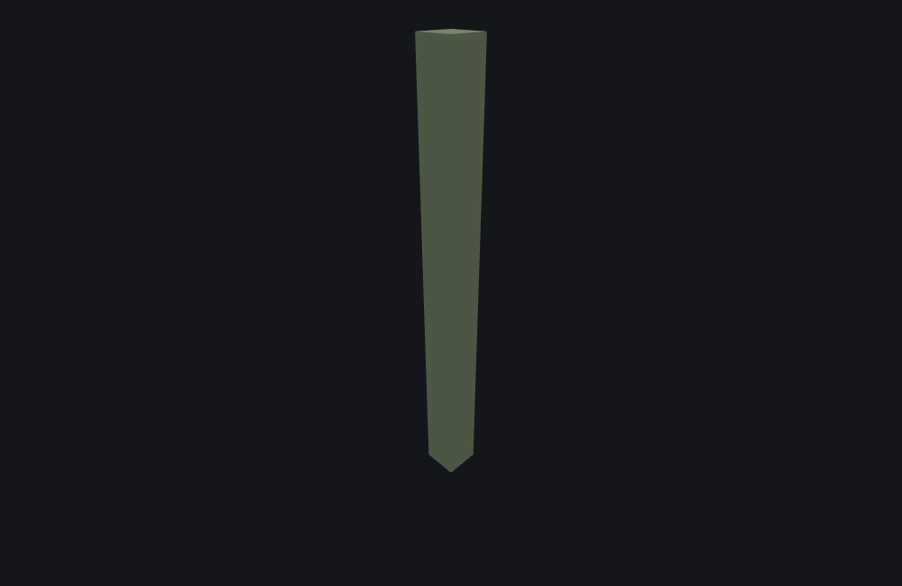
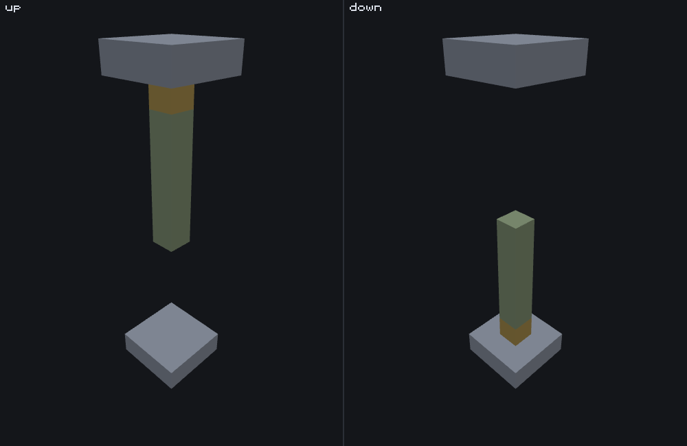

# Growing plant feature

<VersionBadge><CoverageBadge /></VersionBadge>

**`minecraft:growing_plant_feature` grows a one-block-wide column from its origin, either upward or downward, and finishes it with a different block at the tip.** It is what cave vines, weeping vines, twisting vines and kelp are made of: a stem of one block repeated, a head block on the end, and a height picked from a weighted list of ranges. It is a **Content feature** — it writes its own blocks and delegates to nothing.

You reach for it whenever "a plant of some length, hanging or climbing" is the thing you want and a [single block](./single_block_feature.md) is not enough. It places nothing sideways and never branches: for anything with a shape, you want a [tree](./tree_feature.md).

Two fields carry the whole type. `growth_direction` decides which way the column goes and therefore which end the head is on, and `height_distribution` decides how long it is — in two stages, with a top end that is **exclusive**.

## Start here: a complete example

One file, complete. Twelve cells of cave vine hanging down from the origin, with an age written into the tip.

```json title="features/growing_plant_cave_vines.json"
{
  "format_version": "1.21.110",
  "minecraft:growing_plant_feature": {
    "description": { "identifier": "wiki:cave_vines" },
    "height_distribution": [
      [[1, 13], 2],
      [[2, 7], 3],
      [[3, 5], 1]
    ],
    "growth_direction": "down",
    "body_blocks": [
      ["minecraft:cave_vines", 1]
    ],
    "head_blocks": [
      ["minecraft:cave_vines", 1]
    ],
    "age": { "range_min": 17, "range_max": 25 },
    "allow_water": false
  }
}
```

What each choice buys you:

- **Three `height_distribution` entries**, weighted 2, 3 and 1. The weights pick the *entry*, and the entry's own range then gives the height, so this file is much likelier to produce a short vine (the `[2, 7]` entry, weight 3 of 6) than a long one — but only the `[1, 13]` entry can produce anything above 6. Each range's top is exclusive: `[1, 13]` gives 1 to 12, `[2, 7]` gives 2 to 6, `[3, 5]` gives 3 or 4.
- **`growth_direction: "down"`** makes every layer step one cell lower than the last, and puts the head block at the **bottom**. It is required — there is no default to fall back on.
- **`age`'s range is `17` to `25`, so the value written is 17 to 24**, the top being exclusive here as everywhere else. It is written into the head block's `growing_plant_age` state, and into nothing else — not the body blocks, and not the block's identity: whether a vine carries berries is which block `head_blocks` names, not what age it is given.
- **`allow_water: false`** is the default, written out here for clarity. See [growing through water](#water).



```
featurelab generate --pack <pack> --feature wiki:cave_vines --env void --seed 1 --origin 0,10,0
```

Run against the `void` preset with feature seed `1` and the origin at `(0, 10, 0)`, the weighted pick lands on the `[1, 13]` entry and the height comes out at **12**, so the column runs from the origin at `y 10` down to `y -1`: **eleven** `minecraft:cave_vines` body cells and one head cell at the bottom, carrying `growing_plant_age` **21**. The feature reports the head's position, `(0, -1, 0)`.

::: tip The column is one block wide, and it starts *at* the origin
Layer zero is the origin cell itself, not the cell after it. A plant of height 1 is a single head block at the origin and nothing else.
:::

## Fields

Six keys, all on the feature body, and four of the six are required. "Default" is what the game uses when the key is absent. The long-form account of every key, in the editor's own words, is the [field reference](#field-reference) further down; these tables are the short version.

| Key | Required | Value | Default | What it does |
|---|---|---|---|---|
| `height_distribution` | yes | array of `[range, weight]` entries, at least one | — | The possible heights, as weighted ranges. One entry is picked by weight, then a height is taken from that entry's range. See [two stages](#height). |
| `growth_direction` | yes | `up` or `down` | — | Which way each layer steps, and therefore which end of the column the head block is on. See [the two values](#the-two-growth-directions). |
| `body_blocks` | yes | array of `[block, weight]` entries, at least one | — | The weighted stem blocks. Picked again for every body layer, so one column can mix entries up its length. |
| `head_blocks` | yes | array of `[block_descriptor, weight]` entries, at least one | — | The weighted blocks for the tip. Picked once, for the last layer only. |
| `age` | no | whole number, `[min, max]`, or `{range_min, range_max}` | `{range_min: 0, range_max: 0}` | A value written into the head block's `growing_plant_age` state. Only written when the range's top is non-zero. See [`age`](#age-state). |
| `allow_water` | no | boolean | `false` | Lets a layer be placed in water as well as air. It does **not** apply to the look-ahead — see [growing through water](#water). |

### A `height_distribution` entry

Each entry is a two-element array, both elements required.

| Element | Value | What it does |
|---|---|---|
| `0` | whole number, `[min, max]`, or `{range_min, range_max}` | The heights this entry covers. The top is exclusive, so `[1, 13]` means 1 to 12 and `[3, 4]` is a fixed height of 3. |
| `1` | number | This entry's share of the weighted pick — relative to the other entries, not a percentage. **Whole numbers only in practice**: weights are cut down to whole numbers as they are added up, so a list whose weights are all below 1 picks nothing at all and the feature fails. |

### A `body_blocks` or `head_blocks` entry

| Element | Value | What it does |
|---|---|---|
| `block` | block descriptor — a bare name, `{name, states}`, or `{tags: "<Molang query>"}` | The block this entry would place. |
| `weight` | number | This entry's share of the weighted pick, cut down to a whole number the same way. An entry weighted `0` can never be picked; a list that picks nothing leaves that layer **empty** rather than failing. |

### The two `growth_direction` values {#the-two-growth-directions}

| Value | What it does | Reach for it when |
|---|---|---|
| `up` | Each layer is one cell **higher** than the last, and the head block is on **top**. The plant needs clear space above the origin. | Anything that climbs: twisting vines, kelp, bamboo-like stalks. |
| `down` | Each layer is one cell **lower** than the last, and the head block is at the **bottom**. The plant needs clear space below the origin. | Anything that hangs: cave vines, weeping vines, roots from a ceiling. |

There is no default and no third value. The key is required, and a string that is neither is not a direction this type has.

One picture, two files that differ in one word. Both panels start from the same origin on the `void` preset, with a 3×3 stone plate six cells below it and another six cells above it, the same `height_distribution`, the same body and head blocks, the same `age` and the same seed — and nothing but `growth_direction` changes:



Both panels place **24 cells**: the two shared plates, five `minecraft:cave_vines` body cells and one `minecraft:cave_vines_head_with_berries` head cell carrying `growing_plant_age` 21. `up` runs the column from `y 6` to a head at `y 11`, one cell under the upper plate; `down` runs it from `y 6` to a head at `y 1`, one cell above the lower plate. Same origin, same length, opposite ends of one column — and the head is always at the far end, never at the origin.

The plates are doing a second job worth noticing. The `height_distribution` in both panels asks for a height of **8**, and both panels place **six** cells: at the sixth layer the look-ahead finds the plate instead of air, so that layer becomes the head and the column stops two layers short of what the file asked for. The configured height is an upper bound, not a promise — see [an obstruction does not fail the column](#obstruction).

## Common mistakes

| You wrote | What happens | Do instead |
|---|---|---|
| `[[1, 5], 1]` expecting a height of up to 5 | The top of a range is exclusive: this gives 1 to 4. | `[[1, 6], 1]`. |
| `[[3, 4], 1]` expecting 3 or 4 | A range that spans at most one value is a constant. This is a fixed height of 3. | `[[3, 5], 1]` for 3 or 4. |
| `{"min": 1, "max": 13}` as a height range or as `age` | This type reads `range_min`/`range_max` only. The game reports the object and quietly uses a zero-width range, so the file loads and the field is not what you wrote — and a zero-width height range of `{0, 0}` means nothing is ever placed. | `{"range_min": 1, "range_max": 13}`, or the `[1, 13]` array. |
| Weights of `0.5` and `0.5` on a two-entry list | Weights are cut down to whole numbers as they are added, so the total comes to `0` and **nothing is picked**. On `height_distribution` that means a height of 0 and a feature that places nothing; on `body_blocks` or `head_blocks` it means that layer is left empty. | Whole-number weights: `1` and `1`. |
| `"age": {"range_min": 0, "range_max": 0}`, or no `age` at all, on a cave vine | No age is written and the head block is placed in its default state — for a cave vine, no berries. The value is only written when the range's **top** is non-zero. | Give the range a non-zero top: `{"range_min": 17, "range_max": 25}`. |
| `"age": {"range_min": 20, "range_max": 40}` | `growing_plant_age` has 26 values, `0` to `25`. A value at or above that is dropped rather than wrapped, and the head block is placed unchanged — so the top of this range quietly produces ageless heads. | Keep the top at `26` or below. |
| An `age` on a head block that has no `growing_plant_age` state | The state cannot be written, so the head block is placed unchanged. No message. | Nothing to fix if that is what you meant; otherwise pick a block that has the state. |
| `"allow_water": true` expecting a column to grow down a water shaft | The look-ahead that decides whether there is room to keep going is **air-only** and never consults this key, so the column stops at the first water cell and puts its head there. | Accept the shorter column, or grow through air. See [growing through water](#water). |
| No `growth_direction` | Required. The file does not load. | Write `"up"` or `"down"` — there is no default. |
| `"growth_direction": "Down"` | Accepted here, and almost certainly accepted in game, because the value is matched with its case ignored. | Nothing, though lower case is what every vanilla file writes. |
| `"growth_direction": "north"` | Not a direction this type has. featurelab refuses the file; the game most likely loads it and grows the plant downward with no message at all. See [what the bench does differently](#what-the-bench-does-differently). | `"up"` or `"down"`. |
| Expecting one obstruction partway up to abort the plant | It does not. The layer before it ends the column early and a head goes there, so you get a short plant rather than no plant. | Nothing — but read [below](#obstruction) before you count on a length. |

## How it runs

1. **Pick a height range** from `height_distribution` by weight, then take a height from that entry's range.
2. **If the height is below 1, stop.** Nothing is placed and the feature fails, with `No air blocks at target location` — or `No air or water blocks at target location` when `allow_water` is on.
3. **Walk the column**, layer by layer, starting at layer zero — the origin cell itself — and stepping one cell in `growth_direction` per layer, for as many layers as the height asked for.
4. **At each layer, look at the cell.** If it is not air — or not water, with `allow_water` on — that layer is skipped silently and the walk carries on to the next one. Nothing is placed there and nothing fails.
5. **If the cell is usable, look one step further.** If this is the last layer the height asked for, **or** the next cell is not air, this layer is the **head**: the walk stops here. Otherwise a body block is picked and placed, and the walk goes on.
6. **Place the head block.** One pick from `head_blocks`, and when `age`'s top is non-zero the value taken for `age` is written into its `growing_plant_age` state. The block goes down unchanged if it has no such state, or if the value is outside the state's own range. The feature reports the head's position.
7. **The only way to fail after step 2** is for *every* layer the height asked for to be unusable. A single usable layer anywhere in the column guarantees a head block and a success.

## `height_distribution`: two stages, and an exclusive top {#height}

The field is a list of `[[min, max], weight]` entries and it is read in two stages, which is what makes one broad entry different from several narrow ones:

1. **One entry is picked by weight.** The weights are relative to each other and are cut down to whole numbers as they are added up.
2. **A height is taken from that entry's own range**, with the top exclusive: `[1, 13]` gives 1 to 12.

Two consequences worth keeping:

- **A range that spans at most one value is a constant.** A bare number, `[3, 3]` and `[3, 4]` all give exactly `3` — for `[3, 4]`, because the exclusive top leaves `3` as the only possibility. This is the same rule the [tree](./tree_feature.md) and [vegetation patch](./vegetation_patch_feature.md) ranges follow, and it is not the rule the [geode](./geode_feature.md) page's `min`/`max` ranges follow.
- **A height below 1 places nothing at all.** That is what an empty weighted pick comes to — every weight cut down to zero — and it is also what a range of `[0, 1]` produces.

## An obstruction does not fail the column {#obstruction}

The height is an upper bound on how far the walk goes, not a promise about how many blocks appear. Two separate rules shorten a column, and they behave differently:

- **A layer the walk cannot use is skipped**, silently — no block, no failure — and the walk moves on to the next layer. This is what happens when the *first* cells of a column are blocked: the plant starts further along than its origin.
- **A usable layer whose next cell is blocked becomes the head**, and the walk stops there. This is what happens to an obstruction in the *middle* of an otherwise clear column: the layer before it takes the head block and the column simply ends early.

Which is why a plant with a ceiling above it comes out shorter than its file asks for and still looks finished. In [the figure](#the-two-growth-directions) both panels ask for eight layers and place six, because the sixth layer's look-ahead finds the stone plate.

The only failure left is a column in which **every** layer the height asked for is unusable — not just the last one. A single usable layer anywhere guarantees a head block, and any body blocks already placed earlier in the same call stay where they are.

## Growing through water {#water}

`allow_water` widens what counts as a usable layer: with it on, a cell holding water is as good as air, and the plant's blocks go in. That is how kelp is written: `allow_water: true` on a column that starts in water.

**It does not widen the look-ahead.** The check for whether there is room to keep growing asks only whether the next cell is *air*, and never consults this key. So a plant growing into water is placed in the first water cell and then stops there, head and all, because the cell after it is water rather than air. In practice an `allow_water` column that starts in air and enters water is exactly one layer longer than the same column without the key, not as long as the water is deep.

The failure message follows the key rather than the situation: `No air or water blocks at target location` with it on, `No air blocks at target location` without it.

## `age` and the head block {#age-state}

`age` is a range like any other on this page — a bare number, a `[min, max]` array or a `{range_min, range_max}` object, with the top exclusive. A value is taken from it on **every** call, whether or not the key is written; with the key absent the range is `{0, 0}` and the value is `0`.

What the value does is gated on the range's **top end**, not on the value:

- **Top of `0`** — nothing is written. The head block is placed exactly as `head_blocks` gave it.
- **Top above `0`** — the value is written into the head block's `growing_plant_age` state. That state has 26 values, the range `[0, 25]`. A value at or above 26 is **dropped, not wrapped**: the state write simply fails and the head block is placed unchanged. So a range whose top runs past 26 quietly produces ageless heads for part of its span.
- **A head block with no `growing_plant_age` state** takes the same path: the write fails, the block is placed unchanged, and nothing is reported.

Nothing is ever written into a body block. The age is a property of the tip alone.

## Field reference

The long-form account of every key, generated from the editor's own catalogue — the same text the Feature Lab node editor shows in its `?` pane and on hover, with the schema facts (required, kind, absent-key default) the editor's forms are built from. The [tables above](#fields) are the summary; where the two differ in precision, the tables are the measured version.

<!--@include: ../generated/fields/growing_plant_feature.md-->

## What the bench does differently

This page documents the game. Three things belong to the **featurelab** bench used to illustrate it, and all three are about how `growth_direction`'s string is read:

- **The two accepted spellings are inferred, not confirmed.** That `growth_direction` stores a direction, and that the stored value means what this page says it means, is solid. That the JSON strings are exactly `up` and `down` is read across from the sibling field on [multipart block column](./multipart_block_column_feature.md#the-six-directions), which is known to go through the game's own enum-string parse. Every vanilla file writes those two words, so the risk is theoretical.
- **The match ignores case here, on purpose.** `"Down"` and `"UP"` load. The sibling field's parse lowercases before matching, so those files almost certainly load in game too, and accepting them costs nothing: every file this newly accepts means in the bench what it means in the game.
- **An unrecognised value is refused here, and probably is not in the game.** If the field really does go through that enum-string parse, the game discards a value it does not recognise and keeps the field's default, which is `down` — so the game most likely loads a file that says `"growth_direction": "north"` and grows the plant downward, silently. The bench refuses the file rather than pick a direction its author did not write, because a downward plant with no explanation is worse to debug than a load error. The default's own meaning is confirmed; the parse that would feed it is not.

Everything else about this type is implemented and measured: both weighted picks, both range values, the age write and its fallbacks, the per-layer walk, the air-only look-ahead, the silent skip of an unusable layer, and the rule that a single usable layer anywhere guarantees success.

## Advanced: what this type costs the random stream {#random-draws}

You do not need this section to use a growing plant. It is for reading a preview value for value against the game, or for reproducing the engine exactly. [RNG and determinism](./rng_and_determinism.md) is the model these numbers fit into; this is this type's row in it.

Every call spends its values in this order:

| Step | Cost | Which kind |
|---|---|---|
| The `height_distribution` pick | **0 or 1** | One bounded integer draw, with the truncated sum of the weights as its bound. A total of `0` skips the draw entirely and picks nothing, which becomes a height of `0`. |
| The height | **0 or 1** | The int-range draw over the picked entry's range. |
| The age | **0 or 1** | The same int-range draw over `age` — and **always taken**, before the height-below-1 check, whether or not the key is written. With the key absent the range is `{0, 0}` and the draw is skipped, but the call still goes through it. |
| Per body layer actually placed | 0 or 1 | One `body_blocks` pick, on the same bounded-integer-draw rule as the height pick. A skipped layer and the head layer cost nothing. |
| The head | 0 or 1 | One `head_blocks` pick, the same way. |

**The int-range draw**, shared with [tree](./tree_feature.md) and [vegetation patch](./vegetation_patch_feature.md): over `(min, max)` it returns `min` and spends nothing when `min >= max - 1`, and otherwise spends exactly one bounded integer draw of `max - min` added to `min` — uniform over `[min, max - 1]`. Note the `- 1`: a range whose top is exactly one above its bottom, such as `[3, 4]`, is degenerate too, and a rule written as `min >= max` predicts a draw there that never happens.

**The weighted pick** is a bounded integer draw of the total, not a float draw scaled by it, and the running totals are cut to whole numbers at every step — both while the weights are added up and while they are subtracted back off. That is why two entries of weight `0.5` come to a total of `0` and pick nothing, spending nothing on the way to saying so.

**The age draw is the one that catches people out.** It happens before the height is tested, so a feature that fails for being too short has still moved the stream by the same amount as one that succeeded — and a change to `age` shifts everything placed after this feature in the same pass, whether or not any age is ever written.

## See also

- [Single block feature](./single_block_feature.md) — one block at the origin, with the attachment and rotation machinery this type has none of.
- [Vegetation patch feature](./vegetation_patch_feature.md) — the usual way a growing plant reaches a world in bulk: a patch finds the ground or the ceiling and grows one of these out of every column it keeps.
- [Tree feature](./tree_feature.md) — for anything that branches or has a crown, and the other user of this page's range rule.
- [Multipart block column feature](./multipart_block_column_feature.md) — the other vertical column type: fixed roles per cell rather than a stem and a tip, and the sibling whose direction field this page's case-insensitive match is read across from.
- [Feature rules](./feature_rules.md) — how any of this reaches a world: a feature file is inert until a rule attaches it to the chunks of the biomes it belongs in.
- [RNG and determinism](./rng_and_determinism.md) — the model the picks and range values above fit into.

## How this page was checked

Everything above is a statement about Bedrock **1.26.50.24**, and holds for **1.26.40.26** too: this type's JSON surface — every key, its bounds and its required-or-optional status — and its placement are identical in both.

The two-stage height pick, the exclusive top of every range on the page, the air-only look-ahead, the silent skip of an unusable layer, the rule that a single usable layer guarantees a head, the gate on `age`'s top end and the unwrapped state write are stated as facts about the game. The worked example was run end to end and its changed cells read back out of `featurelab generate` before the prose was written: 12 cells from `y 10` down to `y -1`, eleven of them `minecraft:cave_vines` and the last carrying `growing_plant_age` 21, with a reported position of `(0, -1, 0)`. The up-against-down figure's two panels were each run the same way and their changed-cell coordinates read before the caption was written: 24 cells in both, 18 of them the two shared plates, five body cells and one head at `y 11` for `up` and at `y 1` for `down`, both carrying `growing_plant_age` 21 — and both stopping at six of the eight layers the file asked for. Both images were rendered from those exact results by the documentation's own [image pipeline](https://github.com/stirante/featurelab/blob/main/docs/wiki/tools/generate-images.mjs), which runs the real engine against [the fixtures](https://github.com/stirante/featurelab/tree/main/docs/wiki/tools/fixtures) with a fixed seed and a deterministic camera, so re-running it reproduces each picture byte for byte, and which refuses a figure whose panels come out nearly identical.

The fixtures are committed under [`docs/wiki/tools/fixtures/features/`](https://github.com/stirante/featurelab/tree/main/docs/wiki/tools/fixtures/features): `growing_plant_cave_vines.json` for the worked example, and for the figure `growplant_panel_up.json` and `growplant_panel_down.json` — two aggregates that lay the two plates and then run `growplant_panel_vine_up.json` / `growplant_panel_vine_down.json`, which differ in the word `up` and nothing else — over the shared `growplant_panel_plate_grid.json` plate. `featurelab check` is clean on all of them.

What is uncertain is named where it is relevant and collected in [what the bench does differently](#what-the-bench-does-differently): the two accepted spellings of `growth_direction`, the case-insensitive match, and what the game does with a value it does not recognise.
