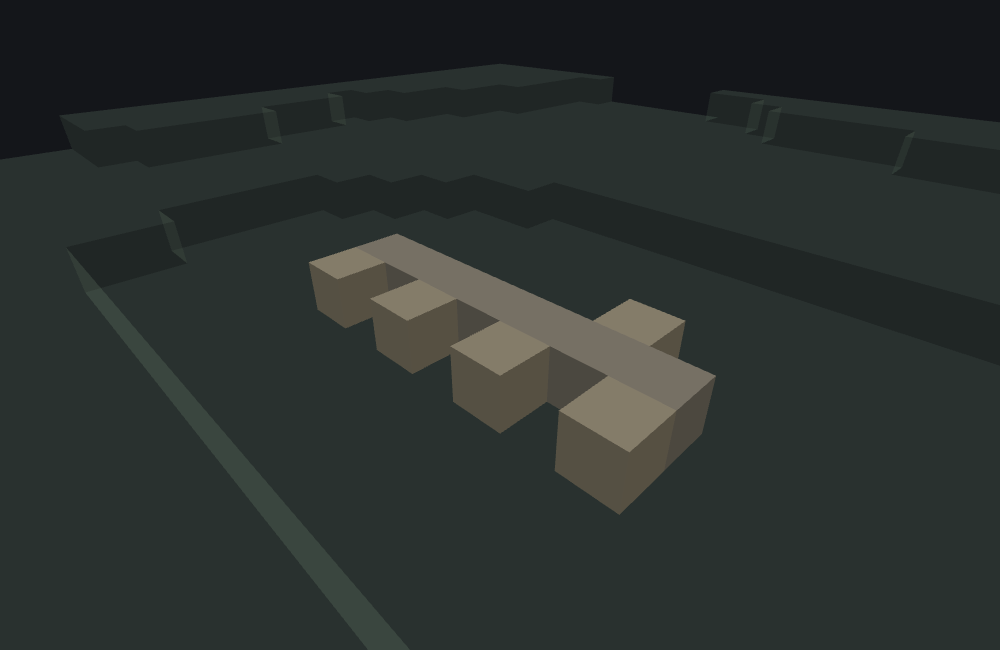

# Horizontal tree decoration feature

<VersionBadge><CoverageBadge /></VersionBadge>

**`minecraft:horizontal_tree_decoration_feature` places one decoration block against a horizontal side of the block at the origin.** It picks one of the four compass directions at random, steps one block that way, and — if the checks pass — puts `places_block` there, turned to face back at the block it is growing on and given a random growth stage.

You reach for it to decorate **tree trunks sideways**: a tuft of leaf litter on a fallen log, petals up the side of a standing one. It is a **Content feature** — it writes its one block itself and never delegates — and it has one of the smallest JSON surfaces in the system: one required key and two optional booleans.

Nothing ties it to trees. Any origin block works, unless you turn on `bark_side_only`, which asks the origin block for a `pillar_axis`. What *is* tied down is the block it places: it must carry two specific block states, and in vanilla exactly three blocks do. See [the two states](#required-states).

## Start here: a complete example

One file, complete. Leaf litter against the bark of a fallen log:

```json title="features/log_leaf_litter.json"
{
  "format_version": "1.21.110",
  "minecraft:horizontal_tree_decoration_feature": {
    "description": { "identifier": "wiki:log_leaf_litter" },
    "places_block": "minecraft:leaf_litter",
    "bark_side_only": true
  }
}
```

What each choice buys you:

- **`places_block: "minecraft:leaf_litter"`** is one of only three vanilla blocks this type will place at all — see [the two states](#required-states).
- **`bark_side_only: true`** keeps tufts off the sawn ends of a horizontal log. On an x-axis log it refuses the west and east sides; on a vertical one it refuses nothing.
- **`allow_adjacent` is left out**, so its default of `false` applies and the spacing rule is on. See [`allow_adjacent`](#allow-adjacent).

One call places at most one tuft, so the picture worth looking at is a whole trunk's worth of them. This scene lays a seven-block oak trunk along **x** (`pillar_axis: x`) and then runs the feature above once per trunk block, at feature seed `1`:



```
featurelab generate --pack <pack> --feature wiki:fallen_log_with_litter --env plains --seed 1
```

**Seven attempts, five tufts.** The long bar is the trunk and the five blocks stepping off its sides are the tufts — the preview draws leaf litter as a full cell in the trunk's own colour, so they read as steps rather than as carpet. Four of them are on the near side and one on the far side, and that is the whole of it: every tuft sits on a **north or south** side, which is `bark_side_only` doing its job, because the two x-facing faces of an x-axis log are its cut ends. The two attempts that placed nothing are the two whose side came up **west or east** — 2 of the 7, where an even four-way pick would average 3.5. Four of the five tufts came out at growth stage 0 and one at stage 1, which the preview does not draw differently.

::: tip The gaps are not the spacing rule
It is tempting to read the spaces between the tufts as `allow_adjacent` keeping them apart, and at this seed that is wrong: setting `"allow_adjacent": true` on the same scene and the same seed reproduces all five tufts, in the same cells, with the same growth stages. Nothing was refused for being too close here. The rule is real and does fire at other seeds — see [`allow_adjacent`](#allow-adjacent) — but on this trunk the only thing refusing anything is the bark rule.
:::

## Fields

Three keys, and that is the whole schema. "Default" is what the game uses when the key is absent. The long-form account of all three, in the editor's own words, is the [field reference](#field-reference) further down.

### On the feature body

| Key | Required | Value | Default | What it does |
|---|---|---|---|---|
| `places_block` | yes | block descriptor | — | The decoration. Its block **type** must carry both a `minecraft:cardinal_direction` state and a `growth` state, or nothing is ever placed — see [the two states](#required-states). The feature writes both states itself, on top of whatever else your descriptor sets. |
| `allow_adjacent` | no | boolean | `false` | Off by default, which is what spaces decorations out along a trunk. Turn it on to let them touch. See [`allow_adjacent`](#allow-adjacent). |
| `bark_side_only` | no | boolean | `false` | Restricts placement to the bark faces of a log, so a horizontal trunk gets nothing on its cut ends. It also makes a `pillar_axis` state on the **origin** block mandatory. See [`bark_side_only`](#bark-side-only). |

There is no chance field, no replace list and no survivability rule. What the checks below accept is written; what they refuse is skipped.

## Common mistakes

| You wrote | What happens | Do instead |
|---|---|---|
| `"places_block": "minecraft:moss_carpet"` (or any other carpet-looking block) | The block type carries neither required state, so the feature places nothing at all, every time, and writes two content-log errors naming the states. | One of the three blocks that qualify: `minecraft:pink_petals`, `minecraft:wildflowers`, `minecraft:leaf_litter` — or your own block, declaring both states. |
| `"places_block": { "name": "…", "states": { "growth": 0 } }` to satisfy the growth requirement | The requirement is on the block **type**, not on the states you write in the descriptor. Writing a state a type does not have does not give it one. | Change the block, not the descriptor. |
| `"bark_side_only": true` on something that is not a log | The origin block's type must carry a `pillar_axis` state. Dirt and stone do not, so **every** placement refuses, silently. | Leave `bark_side_only` off unless the origin really is a pillar-family block. |
| `"bark_side_only": true` expecting it to help on a standing tree | A vertical log shows bark on all four sides, so the flag refuses nothing there. It costs nothing either. | Nothing to fix — it is only worth writing for fallen or sideways trunks. |
| Expecting the feature to find a free side | It picks one side and stops. A blocked or refused side means the call places nothing; it does not look elsewhere. | Run it many times over many origins — a [scatter](./scatter_feature.md) along a trunk, or `log_decoration_feature` on a [tree](./tree_feature.md#fields-fallen_trunk). |
| Expecting a decoration against a submerged trunk | The target cell must be **air**. Water is not empty enough, so a drowned trunk refuses on every side. | Decorate above the waterline. |
| Expecting the `growth` state you wrote to survive | The feature overwrites `growth` with its own value, and that value is only ever **0 or 1** — never the higher stages the state has. | Nothing to fix. If you want a fuller tuft, this is not the type that places it. |
| Expecting a tuft where an identical block already touches | With `allow_adjacent` off, ten positions around the origin and the target are probed for a block of the same **type**, and any hit refuses the placement — states are not compared. | `"allow_adjacent": true`, if clustering is what you want. |
| Reading a missing tuft as a bug | Every refusal but the two state errors is **silent**: no content log, no message. | Check the side that was drawn, the target cell, the neighbours and the bark rule, in that order — that is [how it runs](#how-it-runs). |

## How it runs

Given an origin, the game runs these steps in this order:

1. **The state check.** `places_block`'s type is asked for a `minecraft:cardinal_direction` state and a `growth` state. If either is missing, nothing is placed and a content-log error names it.
2. **The side is picked** — one of north, south, west and east, evenly. The **target cell** is one block from the origin in that direction, at the same height.
3. **The empty check.** The target cell must be air. Water does not count.
4. **The spacing check**, skipped when `allow_adjacent` is true. Ten positions are looked at, and any of them already holding a block of the same type as `places_block` refuses the placement. See [`allow_adjacent`](#allow-adjacent).
5. **The bark check**, only when `bark_side_only` is true. See [`bark_side_only`](#bark-side-only).
6. **The growth stage is picked**, 0 or 1.
7. **The write.** `places_block` goes into the target cell with `minecraft:cardinal_direction` set to the name of the side that was picked and `growth` set to the stage, on top of whatever other states the descriptor set. The write is unconditional — no replace list, no survivability check: whatever the empty check accepted is simply overwritten.

Every refusal in steps 3 to 5 is **silent**. Only step 1 speaks.

::: note The side is picked before the world is looked at
Step 2 comes before every world read, and there is no second attempt: a call whose side happens to be blocked places nothing rather than trying one of the other three. Scattering this feature along a trunk therefore produces roughly the failure rate the local geometry implies, not a search for a free side.
:::

## The block must carry two specific states {#required-states}

Before anything else, the feature looks at `places_block`'s block **type** and requires it to declare both of these:

- **`minecraft:cardinal_direction`** — the placed decoration is turned to face the direction it was placed toward.
- **`growth`** — the placed decoration gets a growth stage.

If either is missing, nothing is placed and the content log says which:

```
'<block>' did not have the required block state 'cardinal_direction'.
'<block>' did not have the expected block state 'growth'.
```

This is a property of the type, not of the descriptor: listing `"states": { "growth": 0 }` on a block whose type has no growth state does not help.

**Exactly three vanilla blocks qualify**, and they are the petal-carpet family: `minecraft:pink_petals`, `minecraft:wildflowers` and `minecraft:leaf_litter`. All three have a `growth` state with **eight** stages, 0 to 7 — and this feature only ever writes 0 or 1, one or two petals or tufts. Anything else has to be a block from your own pack that declares both states.

## `allow_adjacent` and the ten probes {#allow-adjacent}

`allow_adjacent` defaults to **false**, which turns on a spacing rule: **ten** positions are probed, and if any of them already holds a block of the same type as `places_block`, the placement refuses. They are the four horizontal neighbours of the **origin**, then all six neighbours of the **target cell**.

Two things about it are easy to get wrong.

- **It matches on block type, not on the whole block.** A `pink_petals` with a different `growth` or a different facing still counts as an adjacent `pink_petals`.
- **It looks at the origin's neighbours as well as the target's**, so a decoration on one side of a trunk block blocks the other three sides of that same block, not just the cells around the target.

The rule fires often, but not always — which is why the picture at the top of this page is a poor demonstration of it. On that scene at feature seed `1`, turning `allow_adjacent` on changes nothing at all. Move to feature seed `18` and it does: three of the seven attempts draw a bark side there, two of them place, and the third — one block west of a tuft that is already there — is refused. Set `"allow_adjacent": true` on the same file and the same seed and all three grow, the two originals unchanged.

Turn it on when you want decorations to cluster, and leave it alone when you want a trunk that looks like vanilla's.

## `bark_side_only` {#bark-side-only}

`bark_side_only` defaults to **false**. Turn it on when you are decorating **fallen or sideways trunks**, so tufts only appear along the bark and never on the sawn ends.

It reads the `pillar_axis` state of the block at the **origin**:

| The origin's `pillar_axis` | Sides refused | What that is |
|---|---|---|
| `x` | west and east | An x-axis log's two cut ends |
| `z` | north and south | A z-axis log's two cut ends |
| `y` | none | A vertical log shows bark on all four sides |

And it costs something: with `bark_side_only` on, the origin block's **type** must carry a `pillar_axis` state at all. Point it at dirt, stone or anything else that is not a pillar and every placement refuses, silently and forever. On a vertical log it is free — over 60 seeds against a standing oak log, the same file places on 60 of 60 calls with the flag on and with it off, and the sides drawn are the same.

## Field reference

The long-form account of all three keys, generated from the editor's own catalogue — the same text the Feature Lab node editor shows in its `?` pane and on hover, with the schema facts (required, kind, absent-key default) the editor's forms are built from. The [table above](#fields) is the summary; where the two differ in precision, the table is the measured version.

<!--@include: ../generated/fields/horizontal_tree_decoration_feature.md-->

## What the bench does differently

featurelab implements `minecraft:horizontal_tree_decoration_feature` in full — all three keys, the side pick, all four checks and the two state writes. Three approximations are worth knowing when you read a preview of one.

- **Step 1 is answered from a catalogue of vanilla blocks, not from the pack.** For a vanilla `places_block` the bench knows whether the type declares both states, refuses exactly as the game does when it does not, and says which state is missing at build time. For a block your own pack declares, nothing is knowable: the bench assumes both states exist, places the block with both set, and says so in a build-time warning. If the real game logs *"did not have the required block state"* for one of your blocks, that is this gap firing.
- **The same catalogue answers step 5's question about the origin.** When the block at the origin carries a `pillar_axis` value, that value is honoured exactly. When it does not, the bench asks the type: a type that declares `pillar_axis` supplies its own default — `y` for every vanilla pillar, which is what a vertical trunk placed by this bench's own [tree feature](./tree_feature.md) is — and a vanilla type that declares none at all fails the placement, as the game does. Only a non-vanilla origin block still falls back to `pillar_axis: y`, with a warning.
- **"The target cell must be air" stands in for the game's material-level emptiness test.** For every block the bench models, the two agree.

## Advanced: the two random values, and their order {#random-draws}

You do not need this section to place a decoration. It is for reading a preview value for value against the game, or for reproducing the engine exactly. [RNG and determinism](./rng_and_determinism.md) is the model these numbers fit into; this section is this type's row in it.

A placement spends **two** bounded integer draws at most, and their positions in the sequence are the determinism contract:

| # | When | Bound | What it decides |
|---|---|---|---|
| — | the state check (step 1) | — | Fails having drawn **nothing at all** — before any world read and before any draw. |
| 1 | step 2, unconditionally once step 1 passes | `nextInt(4)`, plus 2 | The side: north, south, west or east. |
| 2 | step 6, only after every check in steps 3–5 has passed | `nextIntInclusive(0, 1)`, i.e. `nextInt(2)` | The `growth` stage. |

So a placement that fails anywhere after step 2 has still spent the first draw, and only a fully successful one spends the second. A file whose `places_block` does not carry the two states spends neither, on every call, for ever — which means switching to a block that does carry them moves everything drawn after it.

The measured shape of both draws, over 60 seeds of the fallen-log scene — 420 attempts, 182 tufts: the `growth` values are 86 zeros and 96 ones and nothing else, out of the eight stages the state has. Over 60 seeds against a vertical log, where every side places, the four sides come out 19 / 14 / 14 / 13 — an even four-way pick.

Two ordering details that are invisible unless you are matching a sequence:

- **The empty check's answer is latched, not acted on.** Step 3 reads the target cell and remembers the answer; steps 4 and 5 run regardless, and the three results are tested together. The ten probes are therefore read even when the target was never empty. No draw rides on it, but the world reads are real.
- **The origin's four probes include the target cell itself.** Step 4's first four positions are the origin's north, east, south and west neighbours in that order, and one of those four *is* the target. The game does not special-case it, so the target cell is effectively probed twice: once for emptiness in step 3 and once for same-type adjacency in step 4.

The fixtures behind this page are committed under [`docs/wiki/tools/fixtures/features/`](https://github.com/stirante/featurelab/tree/main/docs/wiki/tools/fixtures/features): `horizontal_tree_decoration_leaf_litter.json` (the worked example), and the scene around it — `horizontal_tree_decoration_scene.json`, `horizontal_tree_decoration_litter_run.json`, `fallen_log_run.json` and `fallen_log_block.json` — which lays the trunk and then runs the decoration once over each of its seven cells.

## See also

- [Tree feature](./tree_feature.md) — grows the trunks this type decorates, including the [`fallen_trunk`](./tree_feature.md#the-fallen-log-fallen_trunk) shape `bark_side_only` is clearly designed around, and whose `log_decoration_feature` is the natural way to run this one at every log.
- [Multiface feature](./multiface_feature.md) — the other "grow something against a block face" type, for vine and lichen style blocks that can cover several faces at once.
- [Single block feature](./single_block_feature.md) — one block with full placement and survivability rule enforcement, instead of this type's four fixed checks.
- [Scatter feature](./scatter_feature.md) — how one decoration call becomes a trunk's worth of them.

## How this page was checked

Everything above is a statement about Bedrock **1.26.50.24**. It carries no "also holds" badge because there is nothing to compare against: the type does not exist in **1.26.40.26** at all.

Every number on this page was read back out of a run of the committed fixture pack. The example scene's five tufts from seven attempts at seed `1`, their cells, their four `south` and one `north` facings and their growth stages; the 86 / 96 split of growth stages and the 182 tufts over seeds 1 to 60; the 19 / 14 / 14 / 13 side counts and the 60 of 60 placements against a vertical log, with and without `bark_side_only`; and that a stone block at the origin with `bark_side_only` on places nothing while the same file with the flag off places normally.

Two claims are comparisons between two runs rather than single readings. That the spacing rule refuses **nothing** at seed `1` was checked by running the same scene with `"allow_adjacent": true` — and again with `bark_side_only` off as well — and reading the changed cells back: all three runs place the same five tufts, in the same cells, with the same states. That leaves the two failed attempts with only one possible cause, the bark rule, and so pins the side draw at 2 west-or-east out of 7. That the rule does fire elsewhere was checked the same way at seed `18`, where `allow_adjacent` adds exactly one tuft, one cell west of an existing one, and leaves the other two untouched.

The list of exactly three qualifying vanilla blocks was read out of the block-state catalogue by asking which types declare both `minecraft:cardinal_direction` and `growth`, not by inspection.

The image was rendered from the same run by the documentation's own [image pipeline](https://github.com/stirante/featurelab/blob/main/docs/wiki/tools/generate-images.mjs), which runs the real engine against [the fixtures](https://github.com/stirante/featurelab/tree/main/docs/wiki/tools/fixtures) with a fixed seed and a deterministic camera, so re-running it reproduces the picture byte for byte.

Two corrections to the wiki page this replaces, both about the sentence under that picture. It said the gaps were "the rest refused by the ten-probe adjacency rule"; the adjacency rule refuses nothing at this seed, and `allow_adjacent: true` reproduces the same five tufts exactly. And it said "roughly half the draws came up west or east"; the measured number is 2 of 7.

What is **not** established: what the game does with a `places_block` from a pack whose type declares only one of the two states, since the bench cannot inspect a pack's own block types — the content-log strings above are what the game writes, but which of them it writes for a half-declaring custom block has not been observed.
