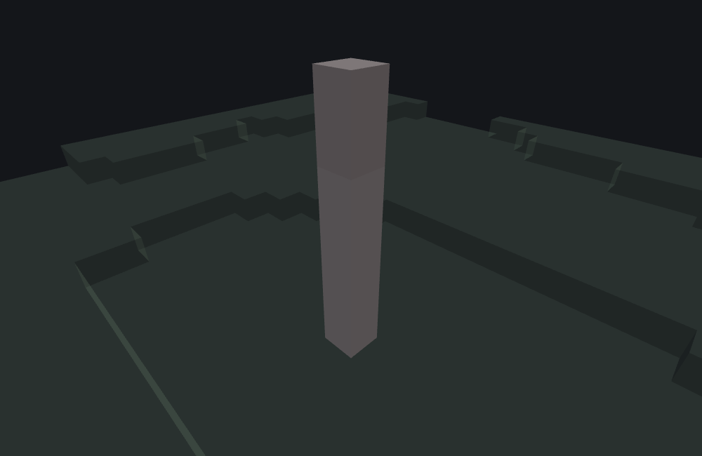
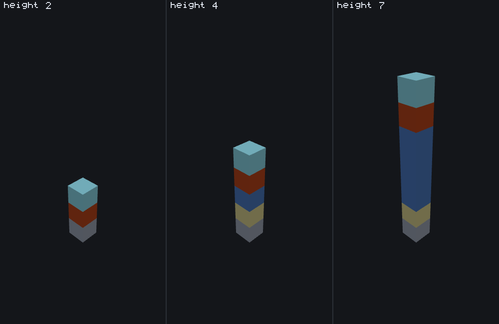

# Multipart block column feature

<VersionBadge><CoverageBadge /></VersionBadge>

**`minecraft:multipart_block_column_feature` builds one straight column of blocks out of four named parts — a `base_block` at the origin, a repeating `middle_block`, a tapering `frustum_block`, and a `tip_block` at the far end.** You reach for it for anything spike-shaped: dripstone, icicles, pillars, stalks, a coral finger, a sideways spine growing out of a wall. It is a **Content feature**: it writes blocks itself and never delegates to another feature.

It is new in **1.26.50.24** — it does not exist in 1.26.40 or earlier, so nothing on this page applies to an older build.

The other block-column type is a [growing plant](./growing_plant_feature.md), and the two are not interchangeable. A growing plant picks every layer's block by a weighted draw and probes the world layer by layer; a multipart column has fixed per-role blocks, settles its height **once**, and then stands or falls on two block lists.

## Start here: a complete example

One file, complete. A dripstone-like floor spike that grows only through air and comes out at one of three heights:

```json title="features/dripstone_spike.json"
{
  "format_version": "1.26.50",
  "minecraft:multipart_block_column_feature": {
    "description": { "identifier": "wiki:dripstone_spike" },
    "direction": "up",
    "base_block": "minecraft:dripstone_block",
    "middle_block": "minecraft:dripstone_block",
    "frustum_block": "minecraft:pointed_dripstone",
    "tip_block": "minecraft:pointed_dripstone",
    "weighted_heights": [
      { "value": 2, "weight": 3 },
      { "value": 4, "weight": 4 },
      { "value": 7, "weight": 1 }
    ],
    "may_replace": [ "minecraft:air" ]
  }
}
```

What each choice buys you:

- **`weighted_heights` with three entries** is the height. The weights are shares of their own total, which here is 8: a height of 2 comes up three times in eight, 4 four times in eight and 7 one time in eight. Over 60 seeds of this file that came out **24 / 29 / 7**. The tall spike is the rare one.
- **`may_replace: ["minecraft:air"]`** is what lets the column shorten under a low ceiling instead of failing. See [a blocked column shrinks](#truncation).
- **`direction: "up"`** is also the default, written out because a column's direction is the first thing a reader of your file wants to know. All six directions are legal — see [`direction`](#the-six-directions).
- **All four role blocks are written, even though this file's shortest height never places two of them.** They are required keys whatever heights you ask for.
- **`may_place_on` is deliberately absent**, so the spike will stand on anything. Adding `[ "minecraft:dripstone_block", "minecraft:stone" ]` is what a real cave pack would write.

At feature seed `7` the height comes out at the rarest of the three — the only one of them that shows the whole role vocabulary at once:



```
featurelab generate --pack <pack> --feature wiki:dripstone_spike --env plains --seed 7
```

Seven blocks, bottom to top: `base_block`, four repeats of `middle_block`, then `frustum_block` and `tip_block`. You cannot see any of that in the picture, and that is not the renderer's fault — this file writes one block for base and middle and another for frustum and tip, and the two are the same colour, which is exactly what makes a real dripstone spike look like dripstone. [The figure below](#the-four-roles) takes the same type with four flatly different blocks so the roles are visible.

Both of the commoner heights — 2 and 4 — place a column with **no `middle_block` in it at all**, which is worth remembering when a pack's middle role looks like it is being ignored: at those heights it genuinely is not placed.

::: tip This example would place nothing if it had a `may_place_on`
`may_place_on` is checked against the block one step *behind* the origin, and none of this documentation's environment presets offers a stone floor with open air above it at the height this example runs at. That is a property of the presets, not of the feature: the spike above is shown without the key so the picture is of the column rather than of a refusal. In a real pack, write it.
:::

## Fields

Four required block roles, one of two height sources, and three optional keys. "Default" is what the game uses when the key is absent. The long-form account of every key, in the editor's own words, is the [field reference](#field-reference) further down; these tables are the short version.

### On the feature body

| Key | Required | Value | Default | What it does |
|---|---|---|---|---|
| `tip_block` | yes | block descriptor | — | The cell at the far end of the column. The only role present at every height. |
| `frustum_block` | yes | block descriptor | — | The cell one before the tip. Appears from a height of 2 up. |
| `middle_block` | yes | block descriptor | — | The repeating shaft between base and frustum. Appears only from a height of **4** up. |
| `base_block` | yes | block descriptor | — | The cell at the origin. Appears from a height of 3 up. |
| `height_range` | one of the two | range — `[min, max]`, `{range_min, range_max}` or a bare number | absent — `[-1, -1]` | The height, picked evenly over **`[min, max-1]`**: the maximum is **exclusive**, so `[2, 7]` gives 2 to 6. Its `min` doubles as the shortest column that may stand. See [the two height sources](#height-sources). |
| `weighted_heights` | one of the two | array of `{ "value": n, "weight": m }` | absent — empty | The height, picked from an explicit list instead of a range. The **smallest `value` in the list** doubles as the shortest column that may stand, whichever entry was picked. |
| `weighted_heights.value` | yes, per entry | integer | — | The height this entry stands for, in blocks along `direction`. A fraction is truncated — `4.9` is a height of 4. |
| `weighted_heights.weight` | yes, per entry | integer | `0` | This entry's share of the list's total. A missing weight is `0`, which means the entry can never be picked. |
| `direction` | no | `down` `up` `north` `south` `west` `east` | `up` | Which way the column is built from the origin. Matched case-insensitively; an unrecognised spelling is silently read as `up`. See [`direction`](#the-six-directions). |
| `may_place_on` | no | array of block descriptors | absent — anything | What the block **one step behind the origin** must be. Absent or empty means no constraint. |
| `may_replace` | no | array of block descriptors | absent — anything | What each cell of the column may overwrite. The first cell that does not match **shortens** the column rather than failing it. Absent or empty means no constraint; there is no way to spell "replace nothing". |

Exactly one of `height_range` and `weighted_heights` should be given. Writing both, or neither, is reported in the content log and the feature still loads and still runs — see [the two height sources](#height-sources) for what it then does.

### What height puts which block where {#the-four-roles}

The roles that appear depend on the height the placement ends up with, and only a column of 4 or more contains any `middle_block` at all:

| Height | Layout, from the origin outward |
|---|---|
| 1 | `tip_block` |
| 2 | `frustum_block`, `tip_block` |
| 3 | `base_block`, `frustum_block`, `tip_block` |
| 4 or more | `base_block`, `middle_block` × (height − 3), `frustum_block`, `tip_block` |

One picture, three columns that differ in one number — the three heights the example above lists in its `weighted_heights`. Every panel grows up from the same origin at feature seed `1`, in the same volume with the same camera, and each writes the four roles as four flatly different blocks so the boundary between one role and the next is visible: **gold** is `base_block`, **blue** is `middle_block`, **dark red** is `frustum_block`, **cyan** is `tip_block`. The grey cube under each column is one shared stone block, one cell behind the origin, so all three columns visibly start from the same cell.



Nobody would build a spike out of those four blocks. The example's own dripstone spike writes `minecraft:dripstone_block` for **both** base and middle and `minecraft:pointed_dripstone` for **both** frustum and tip, which is what makes a real one look like dripstone — and also what makes a picture of one unable to show where the roles change.

## Common mistakes

| You wrote | What happens | Do instead |
|---|---|---|
| `"height_range": [2, 7]` expecting a height of 7 to be possible | The maximum is exclusive: the heights are 2 to 6. | `[2, 8]`. |
| `"height_range": { "min": 2, "max": 7 }` | This field is a **range**, and a range is not read from `min`/`max`. The game reports it and substitutes a zero-width range, so the file loads and the column never appears. `featurelab check` refuses the file outright rather than letting it look fine. | `[2, 7]`, or `{ "range_min": 2, "range_max": 7 }`. |
| Both `height_range` and `weighted_heights` | Reported — *"height_range and weighted_heights can't be given at the same time"* — and the file still loads. `weighted_heights` wins. | Pick one and delete the other. |
| Neither of them | Reported — *"height_range or weighted_heights has to be given"* — the file still loads, and the feature then **places nothing and reports success**. See [the place-nothing success](#place-nothing). | Give one of the two. |
| `"height_range": [-1, 7]`, meaning "no minimum" | `-1` is the value the game uses for *absent*, so a range with `-1` at either end is reported as not given — and then used anyway, heights and all. Half the time it produces a height below 1 and the column silently vanishes. | Give the real minimum you want. `1` is the shortest column that places anything. |
| A `weighted_heights` entry with no `weight` | A missing weight is `0`, and an entry with weight 0 can never be picked. Three entries where two have weights is a two-entry list. | Write a weight on every entry. |
| `{ "value": 4.9, "weight": 1 }` | Both numbers are truncated to whole numbers: that is a height of 4. | Whole numbers only. |
| Weights that are all zero, or negative | Nothing can be picked. The game's own pick walks off the end of the list, which is undefined behaviour; `featurelab` refuses the placement with a diagnostic rather than guessing. | Positive integers. |
| `"direction": "upward"` | Not one of the six spellings, so it is read as the default `up` with no complaint from the game. `featurelab check` warns where the game says nothing. | `"up"`. Check the spelling of the other five too. |
| `may_place_on` naming what the column grows *through* | It names the block **behind** the origin — below it for `up`, above it for `down`, one block east of it for `west`. The cells the column passes through are `may_replace`'s business. | `may_place_on` for the floor, `may_replace` for the air. |
| Leaving `middle_block` out because your column is never 4 tall | All four roles are required keys. A column that never grows past 2 still has to declare a `middle_block` it will never place. | Write it anyway; anything will do. |
| Expecting a blocked column to fail | It shrinks instead, and places at its new length as long as that length still reaches the minimum. | Nothing to fix — [use the minimum as the knob](#truncation). |

## How it runs

Given an origin, the game runs these steps in this order:

1. **The surface check.** The block **one step behind the origin** — below it for `direction: "up"`, above it for `"down"`, and so on — must match `may_place_on`. An absent or empty list accepts anything. Failing here stops the placement before the height is settled.
2. **The height is settled**, from `weighted_heights` if that list has anything in it, otherwise from `height_range`.
3. **The obstruction scan.** Starting **at the origin itself** and stepping along `direction`, each cell is tested against `may_replace`. The scan stops at the first cell that does not match, or once it has cleared as many cells as the height asked for. The column is then **shortened** to the number of cells it actually cleared.
4. **The minimum check.** The shortened height must still reach a minimum: `height_range`'s `min`, or — on the weighted path — the **smallest `value` anywhere in `weighted_heights`**, not the one that was picked. Falling short fails the placement and writes nothing.
5. **The cells are written**, unconditionally, per [the role table above](#the-four-roles). Nothing is re-checked: every cell already passed the scan.

The position the feature reports as its own is the **tip cell** — the far end of the column, not the origin. That is the value a [sequence feature](./sequence_feature.md#origin-threading) would thread into whatever comes next.

Two consequences worth spelling out. The scan **includes the origin cell**, so the origin itself must satisfy `may_replace`: a column standing on stone and growing through air wants `"may_place_on": ["minecraft:stone"]` and `"may_replace": ["minecraft:air"]`, not the other way round. And every failure here is silent in the game — only the two height-source complaints in the content log ever say anything.

## The two height sources, and picking exactly one {#height-sources}

| Source | Shape | What you get |
|---|---|---|
| `height_range` | `[min, max]`, `{ "range_min": a, "range_max": b }`, or a bare number | A height picked evenly over `[min, max-1]`. **`max` is never produced**: `[2, 7]` gives 2, 3, 4, 5 or 6. A bare number, or a range whose ends are equal, always gives that number. |
| `weighted_heights` | `[ { "value": n, "weight": m }, … ]` | One entry picked in proportion to its weight; that entry's `value` is the height. |

They are alternatives, not a pair. The check the game makes is on the **values**, not on which keys appear in the file: `weighted_heights` counts as given when the list is not empty, and `height_range` counts as given only when **neither** of its ends is `-1`, which is the value it holds when the key is absent. So an explicit `"height_range": [-1, -1]` reads exactly like leaving the key out.

Writing both logs *"height_range and weighted_heights can't be given at the same time"*; writing neither logs *"height_range or weighted_heights has to be given"*. **Neither message stops anything.** The file loads and the feature runs: with both present, `weighted_heights` is what is used; with neither, the height comes out below 1 and you get [the place-nothing success](#place-nothing).

The two sources also disagree about where the minimum comes from, and that is the more useful difference. On the range path the minimum is `height_range`'s own `min`. On the weighted path it is the **smallest `value` in the whole list**, regardless of which entry was picked — which is what makes a list with a short entry in it far more tolerant of a low ceiling than a list without one. See [a blocked column shrinks](#truncation).

## `direction` takes all six directions {#the-six-directions}

`direction` accepts `"down"`, `"up"`, `"north"`, `"south"`, `"west"` and `"east"`, matched case-insensitively — `"EaSt"` is east — and defaults to `"up"`. Horizontal columns are ordinary: a sideways spike growing out of a wall is `"direction": "east"` with `may_place_on` naming the wall material.

The direction is a direction of *travel*, not a facing. The parts are laid out along it in order — base first at the origin, then any middles, then the frustum, then the tip at the far end — and the block the column needs under it is on the **opposite** side of the origin. With `"direction": "down"`, a column hanging from a ceiling has its `base_block` at the origin, its `tip_block` at the bottom, and its `may_place_on` check on the block **above** the origin.

::: note An unrecognised `direction` is not an error
The game silently uses the default `"up"`. A typo therefore produces a working feature that grows the wrong way, with nothing in the content log to say so. `featurelab check` raises a warning where the game says nothing.
:::

## A blocked column shrinks rather than failing {#truncation}

A column that runs into something does not refuse; it comes out shorter. The obstruction scan counts consecutive cells that match `may_replace` and the column is cut to that count — and then the minimum check decides whether what is left is acceptable.

That makes the minimum the knob for "the shortest acceptable spike", and on the weighted path the minimum is the smallest `value` in the list. Two files, the same seed, the same ceiling three cells above the origin:

| `weighted_heights` | Height picked | Cells clear | What is placed |
|---|---|---|---|
| `[{ "value": 7, "weight": 9 }, { "value": 2, "weight": 1 }]` | 7 | 3 | `base_block`, `frustum_block`, `tip_block` — a three-block column |
| `[{ "value": 7, "weight": 1 }]` | 7 | 3 | **nothing** — 3 is below the list's smallest value of 7 |

Both drew the same height and both cleared the same three cells. The only difference is that the first list contains a short entry, so 3 is an acceptable length. Lower the ceiling to two cells and the first file places a `frustum_block` and a `tip_block` and no base; lower it to one and it places nothing, because 1 is below 2.

## The place-nothing success {#place-nothing}

If the height ends up below 1 — most easily by giving neither height source, or by writing a `weighted_heights` entry with `"value": 0` — the feature places **no blocks at all and still reports success**, returning a position *behind* the origin: one cell behind for a height of 0, two for the −1 that "no height source" produces.

Nothing downstream notices. A composite that contains one of these sees a successful entry; a [sequence](./sequence_feature.md) threads that behind-the-origin position into its next delegate. If a pack "works" but no columns appear anywhere, check that a real height source is present before suspecting the block lists.

## Field reference

The long-form account of every key, generated from the editor's own catalogue — the same text the Feature Lab node editor shows in its `?` pane and on hover, with the schema facts (required, kind, absent-key default) the editor's forms are built from. The [tables above](#fields) are the summary; where the two differ in precision, the tables are the measured version.

<!--@include: ../generated/fields/multipart_block_column_feature.md-->

## `format_version` gates this whole type

The game keeps a separate schema per `format_version` band, and this type belongs to the **1.26.40** band and newer. A file declaring an older `format_version` cannot name `minecraft:multipart_block_column_feature` at all: the schema it is matched against has no such type, so the file does not load — no diagnostic about any individual key, just a file the game will not take. Give the file a `format_version` of `1.26.40` or newer.

That is separate from the game version. The band is 1.26.40; the build that has the type is **1.26.50.24**.

## What the bench does differently

featurelab implements `minecraft:multipart_block_column_feature` in full: both height sources, all six directions, both block lists, the shortening scan and the minimum check. Three differences are worth knowing when you read a preview of one.

- **Block matching ignores two block states in the game and not here.** When the game matches a candidate against `may_place_on` or `may_replace`, it first clears that block's `update_bit` and `persistent_bit` states, so a listed descriptor matches regardless of either bit. The bench matches block identity directly and does not model that normalisation. The difference is only observable for descriptors that differ from a world block *solely* in one of those two states.
- **Weights that can never pick anything are refused rather than guessed at.** A `weighted_heights` whose weights are all zero or negative puts the game's own pick past the end of its own list, which is undefined behaviour. The bench fails the placement with a diagnostic instead.
- **`featurelab check` is stricter than the game about `height_range`'s spelling.** A `{ "min", "max" }` range is a load error here; in the game the file loads and the column quietly never appears. That is the one place the bench refuses something the game accepts, and it is deliberate — a file that loads and does nothing is worse than a file that says why.

## Advanced: the one random value {#random-draws}

You do not need this section to build a column. It is for reading a preview value for value against the game, or for reproducing the engine exactly. [RNG and determinism](./rng_and_determinism.md) is the model these numbers fit into; this section is this type's row in it.

A placement spends **at most one draw**, always a bounded integer draw, and always between the `may_place_on` gate and the `may_replace` scan:

| Path | Draws | Bound |
|---|---|---|
| `may_place_on` refuses | 0 | The gate runs before anything is drawn, so a refused surface costs nothing and shifts nothing after it. |
| `weighted_heights`, weights summing to anything but 0 | 1 | the sum of the weights |
| `weighted_heights`, weights summing to 0 | 0 | the walk runs as if the draw were 0 |
| `height_range` with `min < max - 1` | 1 | `max - min`, so the value is `min + nextIntBound(max - min)` — which is why `max` is never produced |
| `height_range` with `min >= max - 1` | 0 | returns `min` without drawing |

Two consequences for anything sharing the stream. **A degenerate range costs nothing**, and that is wider than it looks: `[4, 4]` *and* `[4, 5]` both return 4 without drawing, because the skip is on `min >= max - 1` rather than on `min >= max`. And the obstruction scan, the minimum check and every write are all draw-free, so a column that is shortened, or refused for being too short, spends exactly what a full one spends.

The worked example, `multipart_dripstone_spike.json`, is committed under [`docs/wiki/tools/fixtures/features/`](https://github.com/stirante/featurelab/tree/main/docs/wiki/tools/fixtures/features). The three `multipart_panel_*.json` scenes behind [the heights figure](#the-four-roles), with their own `multipart_panel_column_*.json` columns and the shared `multipart_panel_anchor.json` / `multipart_panel_anchor_block.json` that lay the stone cube under each one, are committed in the documentation's own pack under [`docs/wiki/tools/figure-fixtures/features/`](https://github.com/stirante/featurelab/tree/main/docs/wiki/tools/figure-fixtures/features).

## See also

- [Growing plant feature](./growing_plant_feature.md) — the other block column, and the one to reach for when every layer's block should be a fresh weighted pick and the plant should probe the world as it grows.
- [Single block feature](./single_block_feature.md) — for when a "column" of height 1 is really all you need, with proper attach and survivability rules.
- [Ore feature](./ore_feature.md) — the other prominent `may_replace` consumer, and a good contrast: an ore blob refuses where this type shortens.
- [Scatter feature](./scatter_feature.md) — how a spike gets repeated across a cave floor rather than placed once.
- [Feature rules](./feature_rules.md) — what invokes the scatter. A column needs both to reach a world.

## How this page was checked

Everything above is a statement about Bedrock **1.26.50.24**. It carries no "also holds" badge because there is nothing to compare against: the type does not exist in 1.26.40.26, and a file naming it does not load there.

Every number on this page was read back out of a run of the committed fixture pack. The worked example's seven blocks and their role order at seed `7`; the 24 / 29 / 7 split of its three heights over seeds 1 to 60; that `height_range: [2, 7]` produces 2, 3, 4, 5 and 6 over 40 seeds and never 7, while `[4, 4]` and `[4, 5]` both produce 4 every time and a bare `5` produces 5; that `"EaSt"` builds east and `"upward"` builds up; that `may_place_on` is checked below the origin for `up` and above it for `down`, run both ways against a stone block laid on each side; the shortening pair in [its own table](#truncation), run at one seed against ceilings one, two and three cells up; that a `{ "value": 4.9 }` entry places a column of 4; and that a file with no height source places nothing and returns a position two cells behind the origin, while one with both places the weighted height.

The figure and the example image were rendered from those exact results by the documentation's own [image pipeline](https://github.com/stirante/featurelab/blob/main/docs/wiki/tools/generate-images.mjs), which runs the real engine against [the fixtures](https://github.com/stirante/featurelab/tree/main/docs/wiki/tools/fixtures) and [the documentation's own pack](https://github.com/stirante/featurelab/tree/main/docs/wiki/tools/figure-fixtures) with a fixed seed and a deterministic camera, so re-running it reproduces each picture byte for byte. The three-panel figure is additionally refused by that pipeline if any two of its panels come out nearly identical; the closest pair here is height 2 against height 4, at 4.7% of pixels differing.

One correction to the wiki page this replaces: it said the example's weights place "short spikes twice as often as tall ones". No reading of 3 / 4 / 1 gives two to one, and the measured counts over 60 seeds are 24, 29 and 7 — the *middle* height is the commonest, and the tall one is one in eight.

What is **not** established: what the game does with a `weighted_heights` whose weights are all zero or negative, because that walks past the end of its own list. The bench refuses it; this page does not claim to know what a real world would do.
