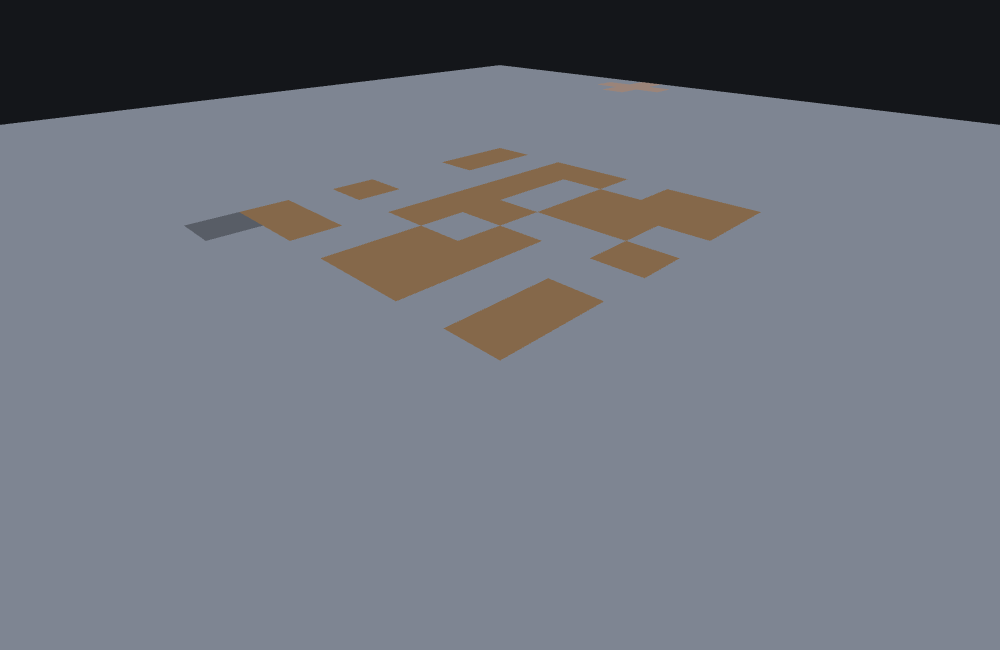
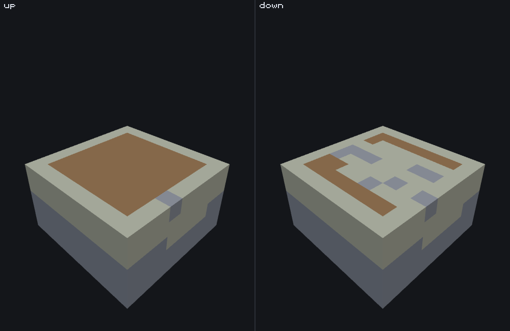

# Partially exposed blob feature

<VersionBadge><CoverageBadge /></VersionBadge>

**`minecraft:partially_exposed_blob_feature` fills a cube of cells around the block below the origin with one block, keeping a cell only if it and its neighbours are not underwater — with the one face you name exempted from that test.** That exemption is the whole point of the type: it is how you get a patch of magma that is buried in the seabed on five sides and open to the water on the sixth, rather than a lump floating in the sea.

It is a **Scene feature** and a self-contained leaf: it delegates to nothing, writes one block type, and has no list of what it may replace — whatever is in the way is overwritten. You do not reach for it for a vein through rock, which is an [ore feature](./ore_feature.md) with its replace rules, nor for a hollow shell, which is a [geode](./geode_feature.md); you reach for it when the thing that matters is *where the blob is allowed to touch water*. Something has to call it, which is a [feature rule](./feature_rules.md).

## Start here: a complete example

One file, complete. A magma pocket three blocks out from the floor, filling about half the cells it considers, open upwards:

```json title="features/magma_blob.json"
{
  "format_version": "1.21.110",
  "minecraft:partially_exposed_blob_feature": {
    "description": { "identifier": "wiki:magma_blob" },
    "placement_radius_around_floor": 3,
    "placement_probability_per_valid_position": 0.5,
    "exposed_face": "up",
    "places_block": "minecraft:magma"
  }
}
```

What each choice buys you:

- **`placement_radius_around_floor: 3`** makes the candidate region a **7 × 7 × 7 cube** — three cells out in every direction from the cell one below the origin. It is a cube, not a ball; see [the blob is a cube of candidates](#shape).
- **`placement_probability_per_valid_position: 0.5`** is what makes the blob ragged rather than a solid box. Each cell is decided on its own, with no memory of its neighbours.
- **`exposed_face: "up"`** exempts the upward neighbour from the water test — the setting for magma on a seabed. It does nothing at all where there is no water; see [what `exposed_face` actually does](#exposed-face).
- **`places_block: "minecraft:magma"`** is written over whatever is in the cell. There is no `may_replace` on this type.



```
featurelab generate --pack <pack> --feature wiki:magma_blob --env underground_stone --seed 1 --origin 0,32,0
```

Run against the `underground_stone` preset (solid rock, no water, no caves) with feature seed `1` and origin `(0, 32, 0)`, this writes **174** blocks spanning world `(-3 to 3, 28 to 34, -3 to 3)` — 173 of them over stone and one over a `minecraft:coal_ore` that happened to be in the way. Note the vertical span: it is centred on `Y 31`, one below the origin, not on the origin. With no water anywhere in that preset the water test never refuses a cell, so those 174 are purely the probability's doing: 174 of the cube's 343 cells came up at or below `0.5`.

::: tip A blob you cannot see is usually there, one block lower than you looked
Two ordinary things hide a correct blob. It is **centred one cell below the origin** — `(origin.X, origin.Y - 1, origin.Z)` — so a blob placed at the surface sinks into the ground by one. And a blob fully buried in solid rock is correctly invisible from outside it: a cell with solid neighbours on every side has no face to draw, in a preview as in the game. The picture above is a cutaway for that reason.

The failure that *is* worth chasing is a blob that places nothing. It has one cause: every cell was refused. Put the whole thing in open water and that is exactly what happens — `featurelab generate --env ocean --origin 0,55,0` against this same file writes nothing and reports `No blocks could be placed`.
:::

## Fields

Four keys, three of them required. "Default" is what the game uses when the key is absent. The long-form account of every key, in the editor's own words, is the [field reference](#field-reference) further down; these tables are the short version.

| Key | Required | Value | Default | What it does |
|---|---|---|---|---|
| `placement_radius_around_floor` | yes | integer, `[1, 8]` | — | How far the candidate cube reaches from the cell below the origin, in every direction. A radius of `r` considers `(2r + 1)³` cells: **343** at `3`, **4,913** at the maximum of `8`. See [the blob is a cube of candidates](#shape). |
| `placement_probability_per_valid_position` | yes | number, `[0.0, 1.0]` | — | The chance each individual cell is filled. `1.0` fills every cell the water test allows — a solid box in dry ground. `0.0` fills nothing at all and the feature then fails. |
| `places_block` | yes | a block descriptor | — | The one block the blob is made of. It overwrites whatever is already in the cell; this type has no `may_replace` and no replace rules. |
| `exposed_face` | no | one of the six faces below | `"up"` | The single neighbour direction left out of the water test. See [what `exposed_face` actually does](#exposed-face). |

### `exposed_face`: the one direction allowed to be wet {#exposed-face-values}

Every value behaves the same way — it names the one neighbour the water test skips. The name is **not** an orientation: nothing about the blob's shape changes with it, and the named face is neither required to be water nor required not to be.

| Value | Reach for it when |
|---|---|
| `"up"` (the default) | The blob sits in a floor or seabed with water above it. This is the vanilla case, and it is why the default is what it is. |
| `"down"` | The blob hangs from a ceiling with water beneath it. |
| `"north"`, `"south"`, `"west"`, `"east"` | The blob is set into a vertical face — the wall of a flooded shaft or a ravine. Pick the side the water is on. |

One picture, two blobs that differ in that one word. Both panels are the same radius-3 blob of `minecraft:magma` from the same origin on the same seabed at the same seed, with `placement_probability_per_valid_position` turned up to `1.0` so that nothing but the water test is deciding anything. Both are cut away at `Y 46` — the layer where they differ — so that layer is the top face you see; the pale material around and between the magma is the seabed itself.



Underneath the cut the two are identical — three complete `7 × 7` layers, buried on all six sides, where no exemption is needed. The whole difference is the layer in the picture: `"up"` keeps all 49 of its cells, `"down"` keeps 17, and those 17 are exactly the columns with seabed rather than water directly above them. See [what `exposed_face` actually does](#exposed-face) for the counts.

## Common mistakes

| You wrote | What happens | Do instead |
|---|---|---|
| An origin at the cell you want the blob centred on | The blob is centred **one below** it. A blob placed on a surface sinks a block into it. | Aim one cell higher than you mean, or accept the offset — it rarely matters once a rule is scattering the feature anyway. |
| `exposed_face` expecting it to flatten, orient or open the blob | It changes nothing about the shape. It exempts one neighbour from a water test, and where there is no water it has no effect whatsoever. | Use it only to decide which side may touch water. See [what it actually does](#exposed-face). |
| The feature placed in open air, expecting nothing to happen | Air is **not** water, so every cell passes the test and the blob hangs in mid-air. The same file on the `void` preset writes the same 174 cells with nothing around them. | Put the feature where it belongs — a [feature rule](./feature_rules.md) or a wrapping feature that finds ground first. There is no ground check in this type. |
| `"placement_probability_per_valid_position": 0.0` to switch the feature off for now | It loads, considers every cell, fills none, and reports `No blocks could be placed` on every call. | Take the feature out of whatever calls it. |
| `"placement_radius_around_floor": 0`, or `9` | Refused at load: `placement_radius_around_floor must be in [1, 8] (the game's own schema bound)`. The whole file is gone. | A radius in `[1, 8]`. |
| `"placement_probability_per_valid_position": 1.5` for "definitely fill it" | Refused at load: `placement_probability_per_valid_position must be in [0.0, 1.0] (the game's own schema bound)`. | `1.0` is the maximum, and it already fills every allowed cell. |
| `"exposed_face": "upward"`, `"top"`, `"+y"` | Refused at load: `exposed_face must be one of down, up, north, south, west, east`. | One of those six words, lower case. |
| `"placement_radius_around_floor": 8` casually | The cube is **4,913** cells, fourteen times the radius-3 example, and every one of them is considered whatever the probability is. It is the most expensive knob on the type. | Use the smallest radius that gives the look, and repeat the feature if you want more of it. |
| Expecting a ball | Every cell of the cube is a candidate, so at `1.0` in dry ground you get a solid `7 × 7 × 7` box, corners included. | Lower the probability for a ragged edge, or wrap the feature if you need a rounder shape. See [the shape](#shape). |
| Expecting the blob to leave ores, air pockets or existing blocks alone | There is no list of what it may replace. Everything inside it is overwritten, as the example's one coal ore shows. | Use an [ore feature](./ore_feature.md) if you need "only where I find these blocks". |

## How it runs

Given an origin, the feature runs these steps in this order:

1. **Take the floor cell**, one block below the origin: `(origin.X, origin.Y - 1, origin.Z)`. Everything below is measured from there, not from the origin.
2. **Walk every cell of the cube** `[-radius, +radius]` around that centre, starting at offset `(0, 0, 0)` — the centre itself — and working outwards.
3. **For each cell, roll once** against `placement_probability_per_valid_position`. A cell that does not come up at or below it is skipped and nothing else about it is looked at.
4. **For a cell that did, run the water test.** The cell itself must not be water, and neither may any of its six face neighbours — except the one `exposed_face` names, which is skipped entirely. `minecraft:water` and `minecraft:flowing_water` both count as water; nothing else does.
5. **Write `places_block`** in every cell that passed both.
6. **If at least one cell was written**, the call succeeds and returns the origin it was given. If none was, it fails with `No blocks could be placed`.

Nothing here moves the blob, searches for ground, or reads the terrain for anything other than water.

## What `exposed_face` actually does {#exposed-face}

It exempts one neighbour direction from step 4's water test, and that is all it does. It is not a facing, it does not tilt the blob, and in ground with no water anywhere near it — the `underground_stone` preset of the example above, or any dry cave — **changing it changes nothing at all**.

To see it do something you need water on one side. This second file is the example with the probability turned up to `1.0`, so that the water test is the only thing deciding anything:

```json title="features/seabed_magma_blob.json"
{
  "format_version": "1.21.110",
  "minecraft:partially_exposed_blob_feature": {
    "description": { "identifier": "wiki:seabed_magma_blob" },
    "placement_radius_around_floor": 3,
    "placement_probability_per_valid_position": 1.0,
    "exposed_face": "up",
    "places_block": "minecraft:magma"
  }
}
```

Run against the `ocean` preset at the seabed — sand up to `Y 46` at that column, water from `Y 47` — with feature seed `1`:

```
featurelab generate --pack <pack> --feature wiki:seabed_magma_blob --env ocean --seed 1 --origin 0,47,0
```

**199** cells are written. Four complete `7 × 7` layers at `Y 43` to `Y 46`, and three lonely cells at `Y 47` where the seabed happens to rise a block higher. Editing your own copy to say `"exposed_face": "down"` and re-running the same command is the check: **164** cells, and the difference is entirely in the top layer — `Y 46` drops from 49 cells to **17**, and the three cells at `Y 47` go altogether. Those 32 refused cells are the seabed's own surface: the water directly above each of them is the neighbour that `"up"` forgave and `"down"` does not.

Nothing else moves. The three layers underneath are `49` cells either way, because they are buried on all six sides and no exemption is needed. That is the pair [the figure above](#exposed-face-values) shows, cut away at `Y 46` so the layer that changes is the one you are looking at.

The practical rule: **name the direction the water is on.** Anything else, including leaving the key out where the water is not above, seals the blob off from the surface it was meant to open onto.

## The blob is a cube of candidates, not a ball {#shape}

`placement_radius_around_floor` bounds a cube. A radius of `3` considers every one of the `7 × 7 × 7` = 343 cells around the floor cell, corners and all, and at `placement_probability_per_valid_position: 1.0` in dry ground **all 343** are written — a solid box, not a sphere:

```
featurelab generate --pack <pack> --feature wiki:seabed_magma_blob --env underground_stone --seed 1 --origin 0,32,0
```

writes 343 blocks. The round-ish look of a real blob comes entirely from the probability knocking holes in the box, plus the water test shaving the side that is exposed — never from the geometry.

That has two consequences worth planning around. The cell count grows as the cube of the radius, so `8` is not "a bit bigger than `3`", it is **4,913** cells against 343. And at a high probability the blob's silhouette reads as a box, so if you want a rounder shape the answer is a lower probability, a smaller radius, or a different type — [geode](./geode_feature.md) builds real concentric shells.

## Field reference

The long-form account of every key, generated from the editor's own catalogue — the same text the Feature Lab node editor shows in its `?` pane and on hover, with the schema facts (required, kind, bounds, absent-key default) the editor's forms are built from. The [tables above](#fields) are the summary.

<!--@include: ../generated/fields/partially_exposed_blob_feature.md-->

## What the bench does differently

Nothing type-specific: every key of this type is implemented, nothing about it refuses, and no part of its behaviour is stood in for. Two things about *previewing* it are worth knowing, and neither is a claim about the game.

::: warning `--size` is a preview control, and shrinking it below the blob changes the result
The water test reads the block at each of a cell's six neighbour positions. A neighbour that falls *outside the previewed volume* has no real block to report and reads back as not-water — which, for this type, is the permissive answer. So a blob that reaches the edge of a small preview keeps cells the game would refuse.

Measured on the seabed file: `--size 8x16x8` writes **245** cells where the default `32x48x32` volume writes 199, and reports 147 of them as written outside the preview. An unbounded world has no such edge, so keep the volume wide enough to hold the blob and a one-cell margin around it — for a radius of `8` that is 19 cells across at the least.
:::

The other is that the game keeps two block layers per position — the block, and the waterlogging layer underneath it — and tests both for water. The bench has one layer, so both tests collapse into one. For a blob in ordinary water or ordinary ground that is the same answer; for a blob next to a waterlogged stair or fence it is the case the bench cannot represent at all.

Blocks in the picture are coloured, not textured, and the image is a cutaway with the surrounding rock left solid. Read it as "which cells did this feature touch", not as a texture-accurate preview.

## Advanced: how the random values are spent {#random-draws}

You do not need this section to use a partially exposed blob. It is for reading a preview value for value against the game, or for reproducing the engine exactly. [RNG and determinism](./rng_and_determinism.md) is the model these numbers fit into; this is this type's row in it.

This type has the simplest and most expensive accounting on the site: **one float draw per candidate cell, unconditionally**, taken *before* the water test is consulted at all. The comparison is `roll <= placement_probability_per_valid_position` — inclusive, unlike most of the engine's other gates — and the water test is only reached when the roll has already passed, so a refused cell costs exactly the same as a filled one.

| Radius | Cells considered | Draws per call |
|---|---|---|
| `1` | 27 | 27 |
| `3` | 343 | 343 |
| `5` | 1,331 | 1,331 |
| `8` | 4,913 | 4,913 |

Measured at radii `1`, `3` and `5` against a delegate chain whose next feature's positions record the sequence position: each one advances the sequence by exactly `(2r + 1)³`, and the same radius advances it identically at `placement_probability_per_valid_position` `0.0` and `0.5` — the count depends on the radius alone, never on the probability, the water, or how many blocks ended up being written.

The consequence for a chain is the one thing on this page a pack author might actually act on: **changing `placement_radius_around_floor` shifts everything placed after this feature in the same chain**, by a lot. Going from `3` to `4` moves the sequence on by another 386 values.

The walk order matters if you are reproducing the engine cell for cell. Candidates are not enumerated in a plain nested loop: they come out ring by ring in increasing Manhattan distance from the centre — `|dx| + |dy| + |dz|`, from `0` up to three times the radius — with offset `(0, 0, 0)`, the floor cell itself, always first. Within a ring, `dx` ascends, then `dy` ascends, and the third coordinate is derived from what is left, yielding the `+` sign and then, when it is not zero, the `-` one. Every cell of the cube is visited exactly once.

## See also

- [Ore feature](./ore_feature.md) — the other type that fills a rounded region with one block, but through an ordered list of replace rules, so it converts existing material instead of overwriting everything.
- [Geode feature](./geode_feature.md) — multi-layer concentric shells with a hollow interior, when the shape itself is the point rather than what it may touch.
- [Vegetation patch feature](./vegetation_patch_feature.md) — the other Scene feature that starts from the floor below its origin, and the one to reach for when you want a surface rather than a volume.
- [Feature rules](./feature_rules.md) — how a blob reaches a world at all.

## How this page was checked

Everything above is a statement about Bedrock **1.26.50.24**, and holds for **1.26.40.26** too: this type's JSON surface — every key, enum value, bound and default — and its behaviour are identical in both.

Both JSON examples are committed fixtures and were run end to end, and every count and coordinate on this page was read back out of `featurelab generate`: the magma blob's 174 cells at `(-3 to 3, 28 to 34, -3 to 3)` and the one coal ore among the 173 stone cells it replaced, the seabed blob's 199 cells and their layer-by-layer counts, the 343 cells of a full cube, and the `No blocks could be placed` failure in open water and at probability `0.0`. The three load refusals are quoted verbatim from `featurelab check`. The image was rendered from the magma blob's own result by the documentation's own [image pipeline](https://github.com/stirante/featurelab/blob/main/docs/wiki/tools/generate-images.mjs), which runs the real engine against [the fixtures](https://github.com/stirante/featurelab/tree/main/docs/wiki/tools/fixtures) and [the documentation's own pack](https://github.com/stirante/featurelab/tree/main/docs/wiki/tools/figure-fixtures) with a fixed seed and a deterministic camera, and sliced for visibility as described above.

Three figures do not come from the commands printed beside them, and each is named as a control run where it is used: the 164-cell `"exposed_face": "down"` result and its 17-cell top layer, the 174 cells on the `void` preset, and the 245 cells at `--size 8x16x8` — each from re-running a printed command with the one change its passage describes. The draw counts in the Advanced section were measured at radii `1`, `3` and `5`; the radius-`8` row is arithmetic over the same rule.

The `exposed_face` figure's two panels are committed fixtures of their own — `blob_panel_up.json` and `blob_panel_down.json`, identical but for the one word, in the documentation's own pack under [`docs/wiki/tools/figure-fixtures/features/`](https://github.com/stirante/featurelab/tree/main/docs/wiki/tools/figure-fixtures/features), which is also where `seabed_magma_blob.json` lives — and were rendered by the documentation's own image pipeline from their own results. Its two panels differ over 5.4% of their pixels, above the pipeline's 2% refusal. It is drawn in a `9 × 9 × 9` volume rather than the default one, which the `--size` warning above makes a claim worth checking: that box holds the whole candidate cube plus the one cell of margin the water test reads, and both panels reproduce the default `32 × 48 × 32` volume's results cell for cell — the same 199 and 164 cells at the same coordinates, not merely the same counts. The picture is cut away at `Y 46`, so `"up"`'s three cells at `Y 47` are above the cut and are not in it.

What is uncertain is named here rather than in the prose: the six strings `exposed_face` accepts are the six the schema rejects anything else against, and the face each one selects is unambiguous from how it is used, but the parsing itself is not independently established. The two-layer water test the bench collapses into one is in [what the bench does differently](#what-the-bench-does-differently), and is a statement about the bench, not about the game.
