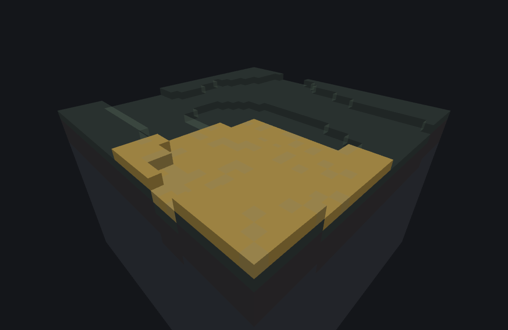

# Scan surface

<VersionBadge><CoverageBadge /></VersionBadge>

**`minecraft:scan_surface` runs one wrapped feature at the surface of every column of a chunk — all 256 of them.** You reach for it when something should cover ground wall to wall rather than dot it: a carpet of moss over a whole chunk, snow on every exposed column, a sweep that lets the delegate itself decide which columns qualify. It places nothing of its own, which makes it a **Proxy feature** — it produces positions and hands each one to `places_feature`.

Where a [scatter](./scatter_feature.md) picks a handful of random offsets and leaves gaps between them, this one skips nothing: every column of the chunk gets a real placement attempt, with real consequences. That is the whole difference between the two, and it is a difference of intent, not of quality — a sparse patch and a wall-to-wall cover are different jobs.

Two things need saying before anything else. **The id has no `_feature` suffix**, and there is no alias — see the note below. And Microsoft's own Bedrock Creator reference classifies this type as internal or deprecated, the same caveat [conditional list](./conditional_list.md) used to carry. Published packs use it anyway, and in this version it works exactly like any other feature type; documenting it is a statement about what the game does, not a recommendation from Mojang.

::: note The id is `minecraft:scan_surface` — no `_feature` suffix
There is no `minecraft:scan_surface_feature` to fall back on if you type the suffix out of habit, and no alias: `"scan_surface_feature"` is not a JSON type id and will never work as a component key. A file that uses the suffixed name names a type the game does not have, and does not load. The suffixed spelling does appear inside the game — as a label on log lines — which is exactly why the mistake is easy to make.
:::

## Start here: a complete example

Two files, both complete. The scan runs a single-block feature at every column of its chunk; the block feature is the one from the [single block page](./single_block_feature.md), unchanged.

::: code-group

```json [features/scan_surface_pumpkins.json]
{
  "format_version": "1.21.110",
  "minecraft:scan_surface": {
    "description": { "identifier": "wiki:scan_surface_pumpkins" },
    "places_feature": "wiki:pumpkin_patch_block"
  }
}
```

```json [features/pumpkin_patch_block.json]
{
  "format_version": "1.21.110",
  "minecraft:single_block_feature": {
    "description": { "identifier": "wiki:pumpkin_patch_block" },
    "enforce_placement_rules": false,
    "enforce_survivability_rules": false,
    "places_block": [
      { "block": "minecraft:pumpkin", "weight": 3 },
      { "block": "minecraft:jack_o_lantern", "weight": 1 }
    ],
    "may_replace": ["minecraft:air"],
    "may_attach_to": { "bottom": "minecraft:grass_block" }
  }
}
```

:::

What each choice buys you:

- **`places_feature` is the only key there is.** This type has no radius, no count, no chance and no filter: the area is always one whole chunk, and every column in it is always attempted. If you want fewer, the filtering belongs in the delegate — see [choosing which columns qualify](#filtering).
- **The delegate is given each column's own surface position**, not this feature's origin. The pumpkin lands wherever that column's ground is, so a cover follows rolling terrain rather than sitting at one height.
- **The delegate's own rules still apply at every one of those positions.** `wiki:pumpkin_patch_block` refuses a column whose ground is not grass, and 256 attempts with 200 refusals is a perfectly ordinary, healthy result.



```
featurelab generate --pack <pack> --feature wiki:scan_surface_pumpkins --env plains --seed 1
```

Run against the `plains` preset with feature seed `1` and the default origin, this attempts all 256 columns of the chunk `(0..15, 0..15)`. The preset's grass is unbroken, so every attempt succeeds and **256 blocks change** — the cover follows the surface up and down as it goes, between `y 63` and `y 65` in this shot. The last column visited, `(15, 65, 15)`, is what the call hands back.

Compare that with [the scatter page's own pumpkin patch](./scatter_feature.md) on the same terrain: 14 randomly offset attempts, 12 of them succeeding, with visible ground between them. Same delegate, same preset, same seed, and two entirely different pictures.

## Fields

One key, on the feature body. The long-form account of it, in the editor's own words, is the [field reference](#field-reference) further down.

| Key | Required | Value | Default | What it does |
|---|---|---|---|---|
| `places_feature` | **yes** | feature identifier | — | The feature run once at every column of the chunk. A name nothing defines fails the whole call before a single column is visited. See [the note on this key's spelling](#field-name). |

There is no key for the area, the step, the order or the count: all four are fixed. A chunk is always 16 by 16, every column is always attempted, the order is always the same, and there is no way to ask for a subset.

### The name of this key is this page's one uncertainty {#field-name}

::: warning `places_feature` is the best-known spelling, not a confirmed one
Everything on this page about *what the type does* is measured. The exact JSON key name for its one field is not: the placement needs a single feature reference and the name it is written under could not be confirmed. `places_feature` is used here because it is what [scatter](./scatter_feature.md) calls the field of the identical purpose. If a file of yours will not load, that key is the thing to suspect first — and nothing else on this page depends on it. See [what the bench does differently](#what-the-bench-does-differently).
:::

## Common mistakes

| You wrote | What happens | Do instead |
|---|---|---|
| `"minecraft:scan_surface_feature"` as the type key | The file names a type the game does not have and does not load. | `"minecraft:scan_surface"`. |
| A heavy delegate — a tree, a big structure | It runs **256 times per placement**, and again for every placement the rule makes. This is the commonest way to make a pack generate slowly. | Keep the delegate cheap, or use a [scatter](./scatter_feature.md) for something you want a handful of. |
| Expecting a 16×16 area **centred on** the origin | The area is the chunk the origin falls in. An origin at `x 20` covers `x 16` to `x 31`: twelve columns to its west and eleven to its east. | Place it anywhere in the chunk you mean; where in the chunk makes no difference. |
| Expecting the returned position to mean "where it worked" | It is whichever column succeeded **last** in the fixed walk, which is very often the far corner and says nothing about the rest. | Do not build on the returned position unless you know the walk order. |
| Chaining it as the first entry of a [sequence](./sequence_feature.md) | The next entry inherits that far-corner position, not the origin you started from. | Put the scan last, or wrap it so its return value is not threaded on. |
| Expecting a diagnostic for each column that refused | There is none, for any of them. 256 quiet refusals and 256 quiet successes look the same from outside. | Run the delegate on its own at a known position to see why it refuses. |
| A delegate that reads Molang variables another feature wrote | All 256 columns share **one** variable scope, so a variable the delegate writes on column 3 is still there on column 4. | Have the delegate set what it reads, or do not rely on the scope being fresh. |
| Nesting a scan inside a scan | The inner one is refused by the recursion guard, and the whole call fails. | One scan per chain. |

## How it runs

1. **Resolve `places_feature`.** A name no loaded file defines fails the entire call, with no column visited and nothing placed.
2. **Check the recursion guard.** If this feature is already running somewhere up the chain, the call is refused — the guard is on this wrapper, not on the delegate.
3. **Work out the chunk.** Not a box around the origin: the 16 by 16 chunk the origin's own `(x, z)` falls in, aligned to multiples of 16.
4. **Walk every column**, `x` ascending on the outside and `z` ascending on the inside. Nothing is skipped, nothing is sampled, and nothing ends the walk early — not a failure, not a success, not a hundred failures in a row.
5. **For each column**, read its surface height, build a position at `(x, height, z)` and run the delegate there. Whatever it does is real: blocks written on column 5 are there to be read on column 6.
6. **Remember the last success.** Each column that succeeds overwrites the remembered result rather than adding to it.
7. **Hand back** that last remembered position, or nothing at all if every one of the 256 refused.

## Which chunk it covers {#which-chunk}

The area is the chunk containing the origin, not an area measured from it. Both coordinates are rounded down to a multiple of 16 and the walk covers that and the next fifteen on each axis. Three worked cases, all run:

| Origin | Columns covered | Last column visited |
|---|---|---|
| `(0, *, 0)` | `x 0`–`15`, `z 0`–`15` | `(15, *, 15)` |
| `(20, *, 20)` | `x 16`–`31`, `z 16`–`31` | `(31, *, 31)` |
| `(-1, *, -1)` | `x −16`–`−1`, `z −16`–`−1` | `(-1, *, -1)` |

Negative coordinates round *down*, not towards zero, so `x −1` belongs to the chunk that starts at `−16` — the same rule the game uses everywhere else for chunks. The practical consequence: moving this feature's origin one block can move the whole cover sixteen blocks, if that one block crosses a chunk boundary. Moving it fifteen blocks inside the same chunk changes nothing at all.

## What it hands back, and why that matters {#return-value}

Every column that succeeds replaces the remembered result. Nothing accumulates, nothing is averaged, and the first success is not special — the value handed back is the position of the **last** column that worked, in the fixed `x`-then-`z` walk. [Conditional list](./conditional_list.md) follows the same last-success-wins rule, and for the same reason: there is one slot for a result and every success writes to it.

For most packs this never comes up, because a feature rule ignores what a feature returns. It comes up sharply in a [sequence](./sequence_feature.md#origin-threading), where each entry starts from the position the previous one returned: put a scan in the middle of a sequence and everything after it starts from the far corner of the chunk, which is almost never what was meant.

If every column refused, the call reports nothing at all — the same outcome as a delegate that placed nothing anywhere.

## Choosing which columns qualify {#filtering}

This type has no filter of its own, and that is by design: the judgement belongs to the delegate, which is given a real position and can refuse it. Three ways to narrow a cover:

- **The delegate's own placement rules.** A [single block feature](./single_block_feature.md)'s `may_replace` and `may_attach_to` already refuse columns whose ground is wrong, which is what the example above relies on.
- **A [conditional list](./conditional_list.md) as the delegate**, when the test is about *where* the column is — a height, a Molang variable — rather than what is under it.
- **A [height difference filter](./height_difference_filter_feature.md) as the delegate**, when the test is about the shape of the ground around the column: a cover that appears only on slopes, or only away from cliffs.

All three run 256 times, so a cheap test is worth more here than anywhere else.

## Field reference

The long-form account of every key, generated from the editor's own catalogue — the same text the Feature Lab node editor shows in its `?` pane and on hover. The [table above](#fields) is the summary.

<!--@include: ../generated/fields/scan_surface.md-->

## What the bench does differently

This page documents the game. Three things belong to the **featurelab** bench used to illustrate it:

- **The bench accepts three spellings of the one field, where the game accepts one.** `places_feature`, `feature` and `feature_to_scan` all load here. That is deliberate defensiveness about a key name that could not be confirmed, not a claim that the game is generous: in the game exactly one of them is right and the other two do not load. This is the page's one real uncertainty, and it is flagged in the [Fields](#field-name) section as well.
- **The surface height is the bench's own terrain reading** rather than the game's own surface concept — the same substitution the [surface relative threshold page](./surface_relative_threshold_feature.md#surface-height) documents, and it applies to every one of the 256 columns identically.
- **256 delegations per placement is a real cost here too.** A scan whose delegate is expensive will hit the bench's own placement budget and come back partial, with a diagnostic saying so. That is the bench protecting itself, not the game refusing anything.

## Advanced: what this type costs the random stream {#random-draws}

You do not need this section to use a scan surface feature. It is for reading a preview value for value against the game, or for reproducing the engine exactly. [RNG and determinism](./rng_and_determinism.md) is the model these numbers fit into; this is this type's row in it.

**This type spends nothing of its own.** No draw is taken to choose a column, an order or a position — all three are fixed — so every value consumed during a call belongs to the delegate. What it does do is multiply: a delegate that spends `n` values per attempt spends `256n` here, in the order of the walk, and a column that refuses still costs whatever the delegate spent before refusing. That makes this the type where a delegate's own draw accounting matters most, because it is paid 256 times over and everything after it in the same pass is shifted by the total.

The chunk bounds are `floor(originX / 16) * 16` and `floor(originZ / 16) * 16` through `+15` on each axis — ordinary chunk-local arithmetic, with the floor rounding down rather than towards zero. The walk is `x` ascending on the outside, `z` ascending on the inside. Each column's position is `(x, height(x, z), z)`. The Molang scope handed to every column is the **same object**, not a copy and not a child: a variable one column's delegate writes is readable by the next one, and by whatever runs after the scan.

## See also

- [Scatter feature](./scatter_feature.md) — the sparse, random alternative to this type's exhaustive cover, contrasted directly above; also the page whose `places_feature` this type's field name was taken from.
- [Conditional list](./conditional_list.md) — the other type in this set that Microsoft's reference calls internal, and the one that shares this type's last-success-wins return rule.
- [Height difference filter](./height_difference_filter_feature.md) — a gate to put *under* a scan when only some columns should be covered.
- [Single block feature](./single_block_feature.md) — the delegate this page's example reuses verbatim, and where its per-column refusals come from.
- [Sequence feature](./sequence_feature.md#origin-threading) — why a scan's returned position is worth knowing about: a sequence threads it into the next entry.
- [Feature rules](./feature_rules.md) — how any of this reaches a world: a feature file is inert until a rule attaches it to the chunks of the biomes it belongs in.

## How this page was checked

Everything above is a statement about Bedrock **1.26.50.24**, and it holds for **1.26.40.26** too: this type's JSON surface and its placement are unchanged between the two.

The chunk alignment, the fixed `x`-then-`z` walk with no skipping and no early exit, the last-success-wins return value, the shared Molang scope and the absence of any field but the feature reference are stated as facts about the game. The one thing that is **not** certain is the JSON key name itself, flagged in [Fields](#field-name) and in [what the bench does differently](#what-the-bench-does-differently).

The worked example was run end to end from the committed fixture [`scan_surface_pumpkins.json`](https://github.com/stirante/featurelab/blob/main/docs/wiki/tools/fixtures/features/scan_surface_pumpkins.json), and its 256 changed cells and its returned position — `(15, 65, 15)` — read back out of `featurelab generate`. The image was rendered from that exact result by the documentation's own [image pipeline](https://github.com/stirante/featurelab/blob/main/docs/wiki/tools/generate-images.mjs), which runs the real engine against [the fixtures](https://github.com/stirante/featurelab/tree/main/docs/wiki/tools/fixtures) with a fixed seed and a deterministic camera, so re-running it reproduces the picture byte for byte.

The chunk table was measured rather than derived: the same fixture was run at `(20, *, 20)` and at `(-1, *, -1)` and the covered columns and returned positions read from each result, which is what confirms the round-down rule for negative coordinates rather than a round-towards-zero one.

What is uncertain is collected in [what the bench does differently](#what-the-bench-does-differently): the field name, the bench's extra accepted spellings of it, and the surface height standing in for the game's own.
