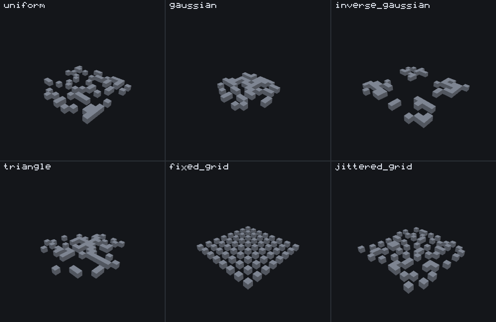

# Scatter feature

<VersionBadge><CoverageBadge /></VersionBadge>

**`minecraft:scatter_feature` repeats another feature at random offsets around one origin.** You reach for it whenever "one block in one spot" is not enough: a patch of pumpkins, undergrowth strewn across a chunk, blobs through a layer, a ring of decoration around something else. It places nothing itself. It picks positions — one `distribution` per axis — and hands each position to the feature named in `places_feature`. That makes it a **Proxy feature**, and it is the single most common feature type in published packs, almost always wrapping a [single block feature](./single_block_feature.md).

You do not need one to get a feature into a world at all — a [feature rule](./feature_rules.md) does that, and a rule *is* this same distribution machinery attached to a chunk. A scatter is for spreading *within* what a rule has already placed, or for spreading below any other Proxy feature.

## Start here: a complete example

Two files, both complete. The scatter picks 14 offsets in a 16×16 square around its origin and places `wiki:pumpkin_patch_block` at each; the block feature it delegates to is the one from the single block page, unchanged.

::: code-group

```json [features/pumpkin_patch.json]
{
  "format_version": "1.21.110",
  "minecraft:scatter_feature": {
    "description": { "identifier": "wiki:pumpkin_patch" },
    "places_feature": "wiki:pumpkin_patch_block",
    "distribution": {
      "iterations": 14,
      "x": { "distribution": "uniform", "extent": [-8, 8] },
      "y": 0,
      "z": { "distribution": "uniform", "extent": [-8, 8] }
    }
  }
}
```

```json [features/pumpkin_patch_block.json]
{
  "format_version": "1.21.110",
  "minecraft:single_block_feature": {
    "description": { "identifier": "wiki:pumpkin_patch_block" },
    "enforce_placement_rules": false,
    "enforce_survivability_rules": false,
    "places_block": [
      { "block": "minecraft:pumpkin", "weight": 3 },
      { "block": "minecraft:jack_o_lantern", "weight": 1 }
    ],
    "may_replace": ["minecraft:air"],
    "may_attach_to": { "bottom": "minecraft:grass_block" }
  }
}
```

:::

What each choice in the scatter buys you:

- **`y: 0`** is a bare number, so the vertical axis is fixed. The delegate's own `may_attach_to.bottom` is what pins each pumpkin to the surface; the scatter does not need to find the ground itself.
- **`x` and `z` are `uniform` ranges**, so the patch is genuinely random. An `extent` of `[-8, 8]` gives offsets from -8 to 7 — `uniform` never produces its top end — so the patch is 16 blocks wide, not 17. See [the six kinds](#the-six-distribution-kinds).
- **`iterations: 14`** is the number of rounds, not the number of pumpkins. Every round runs; how many succeed is the delegate's decision.


```
featurelab generate --pack <pack> --feature wiki:pumpkin_patch --env plains --seed 9
```

Run against `plains` with feature seed `9`, **12 of the 14 iterations attach** — 11 pumpkins and 1 jack o'lantern — and 2 fail the delegate's own `may_attach_to` check, because the terrain is not perfectly flat across a 16-block spread and a couple of offsets land where the block below is not grass. The 3:1 weighting is a per-draw probability, not a quota; twelve draws are far too few to expect it to show.

::: tip The two failures are not a bug to work around
They are `wiki:pumpkin_patch_block`'s own `may_attach_to.bottom` doing exactly its job at two of the sampled offsets. A scatter reports every iteration's delegate diagnostics the same way any other delegated call does: `featurelab generate`'s `diagnostics` array names the position and the delegation chain for each one, rather than dropping the failure. `featurelab check` will not show you these — it never runs a placement, so a per-iteration refusal is not a thing it has; what it checks is whether the files load and whether every `places_feature` resolves.
:::

## Fields

Three keys sit on the feature body; everything about *where* and *how often* is inside `distribution`. "Default" is what the game uses when the key is absent. The long-form account of every key, in the editor's own words, is the [field reference](#field-reference) further down; these tables are the short version.

### On the feature body

| Key | Required | Value | What it does |
|---|---|---|---|
| `places_feature` | yes | a feature identifier | The feature placed at every position the scatter picks. Some loaded file must define it: an unresolved reference fails the whole call before anything runs, and `featurelab check` reports it with a near-match suggestion. |
| `distribution` | yes | object — the next table | Where each round lands and whether the scatter runs at all. Files with a `format_version` below **1.21.10** write the same keys flat on the body instead: see [the flat spelling](#the-flat-spelling-before-1-21-10). |
| `project_input_to_floor` | no — default `false` | boolean | Before anything else, drops the origin straight down through air until it lands on a block or the world floor. Every offset is then measured from there rather than from the position the scatter was handed. |

### Inside `distribution`

| Key | Required | Value | Default | What it does |
|---|---|---|---|---|
| `iterations` | yes | number or Molang string | — | How many rounds to run. Each round picks one position and hands it to `places_feature`. Rounds, not blocks: the delegate can still refuse. Evaluated once, before any axis. `0` is the one honest way to switch a scatter off; a negative constant is reported and becomes `1`. |
| `x`, `y`, `z` | no | number, Molang string, or an axis object | `0` — the origin | The offset on that axis for each round. A bare number or Molang string is a fixed offset; an axis object (the next table) is what makes it vary. |
| `scatter_chance` | no | a percent — number or Molang string — or `{"numerator", "denominator"}` | `100` | Rolled once per call to decide whether the scatter runs *at all*. Failing it means zero rounds, not fewer. **`0` does not mean never** — see [`scatter_chance`](#scatter-chance). |
| `coordinate_eval_order` | no | `xyz` `xzy` `yxz` `yzx` `zxy` `zyx` | `xzy` | Which axis is computed first, second, third. Decides which axis's Molang expression can read which other axis's result — and moves every placement when more than one axis is random. See [`coordinate_eval_order`](#coordinate-eval-order). |

### An axis object

| Key | Required | Value | Default | What it does |
|---|---|---|---|---|
| `distribution` | yes | one of the six kinds below | — | The shape of the spread along this axis. |
| `extent` | yes | `[min, max]`, each a number or Molang string | — | The range, as an offset from the origin. Both ends are rounded to whole blocks. The kinds do not all treat the ends alike: `uniform` never produces `max`, `triangle` and `inverse_gaussian` do, and the grid kinds read the extent as a *width* and count from `0` upward — see the table below. |
| `step_size` | grid kinds only | number | `1` — not established; write it | The gap between lattice cells. On `jittered_grid` it is also how far a placement can be nudged; below `2` there is no room to nudge and the axis behaves as `fixed_grid`. The other four kinds ignore it. |
| `grid_offset` | grid kinds only | number | `0` | Shifts the whole lattice along the axis. The other four kinds ignore it. |

### The six `distribution` kinds {#the-six-distribution-kinds}

One picture, six scatters that differ in one word. Every panel is 64 iterations over an `extent` of `[0, 15]` on `x` and `z`, `y` pinned to `0`, feature seed `42`, on the `void` preset so nothing but the placements is visible, and the same camera in every panel. The two grid panels carry `step_size: 2`, which the other four kinds do not read.



| Kind | Where placements land | Reaches the ends? | Reach for it when |
|---|---|---|---|
| `uniform` | Anywhere in the extent, evenly. In the picture: 54 distinct cells, spread flat. | `min` yes; **`max` never**. `[0, 15]` gives 0 to 14 — write `[0, 16]` for 0 to 15. | You want a random patch. The default choice. |
| `gaussian` | Bunched in the middle of the extent, thinning towards the ends. In the picture: 48 cells, all inside 2 to 13. | Neither end, ever. | You want a soft cluster around a point: a clearing, a nest, a mound. |
| `inverse_gaussian` | Bunched at both ends, thinning towards the middle; the exact ends are the single most likely results. In the picture: 55 cells at the corners and along the edges, the middle empty. | Both ends, often. | You want a ring or a border: things at the edge of an area and not in it. |
| `triangle` | Bunched in the middle like `gaussian`, but looser. In the picture: 57 cells, and it does reach 0 and 15. | Both ends. | You want a cluster that still reaches its edges. At a glance it looks like `gaussian`; the difference is at the edges. |
| `fixed_grid` | A regular lattice: a cell every `step_size` blocks, wrapping at `max - min + 1` blocks, no randomness at all. So the number of distinct cells is that width divided by `step_size`, not the width itself — and a `step_size` that does not divide the width wraps onto new blocks instead, which is how `[0, 15]` with `step_size: 3` reaches all sixteen. In the picture: an 8×8 lattice, every other block, 64 cells from 64 rounds. | From `0` upward — `min` does not move the grid (see the warning below). | You want rows, columns or a tiled fill. Match `iterations` to the number of cells: extra rounds revisit cells already filled. |
| `jittered_grid` | The same lattice, with each placement nudged by 0 to `step_size - 1` blocks inside its cell. In the picture: 64 cells, one somewhere inside each 2×2 cell of the lattice. | Same as `fixed_grid`, plus the nudge. | You want even coverage that does not look mechanical. |

::: warning A grid counts up from the origin; its extent is a width, not a range
`fixed_grid` and `jittered_grid` read `extent` as *how many cells* (`max - min + 1`) and where the phase starts — not as the range to stay inside. With `extent: [0, 15]` the cells are 0 to 15 from the origin, which is what the figure shows and what a [feature rule](./feature_rules.md) wants. With a negative `min` the grid is **not** centred on the origin: `extent: [-8, 7]` with `step_size: 4` puts cells at **-8, -4, 0, 4, 8 and 12** — the first two on the negative side, the last two past the extent's own `max` of 7. To centre a grid, keep the extent at `[0, N - 1]` and move the origin instead: wrap the scatter in one with bare `x: -8` and `z: -8`, which is exactly what the figure's fixtures do.
:::

## Common mistakes

| You wrote | What happens | Do instead |
|---|---|---|
| `"scatter_chance": 0` to switch a scatter off | A constant percent outside `(0, 100]` is reported and replaced with **100**: the scatter runs every time. | `"iterations": 0`, or take the feature out of the rule that places it. |
| `"scatter_chance": 1.5` meaning "one and a half times" | A bare number is a **percent**. `1.5` is 1.5%, the single commonest cause of "it almost never places". | Write the percent you mean, or a `{numerator, denominator}` fraction. |
| `{"distribution": "uniform", "extent": [0, 15]}` expecting `15` to be possible | `uniform` never produces its `max`: the offsets are 0 to 14. | `[0, 16]`. |
| `{"distribution": "uniform", "extent": [5, 5]}` as a "random" axis | Identical to the bare number `5`. Nothing about it is random. | Write `5`, or give the range a real width. |
| `{"distribution": "fixed_grid", "extent": [-8, 7], "step_size": 4}` to centre a grid on the origin | The cells land at -8, -4, 0, 4, **8 and 12** — a grid is a width counted up from `0`, not a range. | `extent: [0, 15]`, and move the origin with an enclosing scatter whose `x`/`z` are bare `-8`. |
| `{"numerator": 1.5, "denominator": 4}` | Both are truncated to whole numbers: a one-in-four chance. | Whole numbers only. |
| `{"numerator": 4, "denominator": 2}` | `denominator <= numerator` is reported and the denominator becomes `1`: the gate always passes. | `denominator > numerator`. |
| `"iterations": "v.worldx > 0 ? 4 : 0"` | `iterations` runs before any axis, so `v.worldx` is whatever an *enclosing* feature left there, not this scatter's position. | Read `v.originx` for this scatter's own origin. |
| A `distribution` object in a file whose `format_version` is below `1.21.10` | Dropped by name as not in the schema, then the file fails on the missing flat `iterations`. | Match the spelling to the version: see [the flat spelling](#the-flat-spelling-before-1-21-10). |
| Treating the returned position as "the origin" | A scatter returns its **last successful** round's position, which is what a sequence threads into its next entry. | Put the scatter last in a sequence, or accept that the next entry runs at a scattered position. |
| Expecting `iterations` to be the block count | It is the number of rounds. Each round's delegate can still refuse, and the preview counts cells, not rounds. | Read the delegate's own diagnostics for the refusals; raise `iterations` only if the refusals are the intended kind. |

## How it runs

1. **Resolve `places_feature`.** If the reference is unresolved — no loaded file defines it — or this scatter is disallowed from placing an internal feature (the [recursion guard](./feature_delegation.md#the-recursion-guard)), the whole call fails and nothing else happens.
2. **If `project_input_to_floor` is set**, descend the origin straight down through air until it lands on something solid or the world floor.
3. **Roll `scatter_chance`** once, to decide whether to scatter *at all* this call.
4. **If it passed, evaluate `iterations` and run that many rounds.** Each round computes an x/y/z offset from `distribution`, adds it to the origin, and delegates to the resolved feature at that position. Every round runs to completion regardless of whether earlier rounds succeeded or failed.

The last **successful** round's result is what the scatter reports as its own; a round that fails does not erase it. So a scatter whose final iteration failed still returns the position an earlier one reached, and a scatter is a failure only when *no* round succeeded. That distinction is load-bearing one level up: it is the value a [sequence feature](./sequence_feature.md#origin-threading) threads into the next delegate's origin, and the value an aggregate's `early_out` tests.

## `scatter_chance` {#scatter-chance}

Gates the *entire* scatter — a failed roll means zero rounds run, not fewer. Two JSON shapes:

| Shape | Example | Meaning |
|---|---|---|
| a percent | `25`, or `"query.… ? 25 : 0"` | Runs 25 times in 100. The default is `100`: always. |
| a fraction | `{"numerator": 1, "denominator": 4}` | Runs one time in four. Whole numbers only. |

::: warning A constant `scatter_chance` outside `0 < chance <= 100` does not mean "never"
The accepted range for a **constant** percent is above 0 and up to 100. A value outside it — `0`, a negative, `150` — is not honoured and is not an error that stops the file loading: the game reports it in the content log and then uses **100**, so the scatter runs **every time**. `scatter_chance: 0` is therefore the opposite of what it looks like. To make a scatter place nothing, set `iterations` to `0` or remove the feature from the rule that calls it.

A **Molang string** is exempt from that check unless it is a constant — an expression that evaluates to `0` at run time really does skip the scatter.
:::

Two more values the game rewrites rather than refuses:

- **`numerator` and `denominator` are whole numbers.** A fractional value is truncated toward zero before the gate sees it, so `{"numerator": 1.5, "denominator": 4}` is a one-in-four chance, not one-and-a-half-in-four.
- **`denominator` must be greater than `numerator`.** If it is not, the game reports it and uses a denominator of `1`, which makes the gate pass every time.

## `coordinate_eval_order` {#coordinate-eval-order}

The default `xzy` — x, then z, then y — puts `y` last on purpose: a vertical coordinate usually depends on the lateral ones, and evaluating it last is what lets its expression read them (see [the variables a scatter writes](#molang-variables)).

The order also **moves blocks**, in a scatter with no Molang in it at all, whenever more than one axis is random: each random axis is computed when its turn comes, so the order decides which random value lands on which axis. Two committed fixtures are identical except for this key, and both give `y` **and** `z` a real range:

```
featurelab generate --pack <pack> --feature wiki:rng_scatter_evalorder_default --env void --seed 42 --size 64x16x64
featurelab generate --pack <pack> --feature wiki:rng_scatter_evalorder_xyz     --env void --seed 42 --size 64x16x64
```

Both place exactly 8 blocks, and not one of the eight positions survives the swap; the scatter also *returns* a different position, which is what an enclosing feature sees. The exact coordinates are in [the advanced section](#random-draws). The advice is short: if your scatter has two or more random axes, write the key out explicitly — not because the default is unclear, but because a reader of your file should not have to know this to predict where the blocks go.

## The Molang variables a scatter writes {#molang-variables}

A scatter shares its Molang `variable.`/`temp.` scope, unmodified, with whatever it delegates to — see [scope lifetime](./molang.md#scope-lifetime-temp-versus-variable). What it *writes* into that scope, and exactly when, is part of this type's contract:

- **`variable.originx` / `originy` / `originz` — written once, up front**, from this scatter's own origin (after `project_input_to_floor`, if set). They stay fixed for the whole call, so every expression in the `distribution` block can read the origin regardless of evaluation order.
- **`variable.worldx` / `worldy` / `worldz` — written per axis, per iteration**, each holding that axis's **absolute** coordinate (the offset plus the origin's own component), the moment that axis is evaluated. Consequences worth knowing:
  - An axis expression sees the axes evaluated **before** it in `coordinate_eval_order` — under the default `xzy`, `y` is evaluated last, so its expression can read both the `x` and the `z` this iteration just produced. It sees the axes evaluated *after* it as whatever the **previous iteration** left, or whatever an enclosing feature left on the first iteration.
  - `iterations` and `scatter_chance` are evaluated *before* any axis, so they read whatever `world*` already held — **not** this scatter's origin. Use `origin*` if you want the origin.
  - After the call, `world*` holds the last iteration's absolute position, which is what a delegated feature's own Molang reads unless that feature overwrites it.

## Field reference

The long-form account of every key, generated from the editor's own catalogue — the same text the Feature Lab node editor shows in its `?` pane and on hover, with the schema facts (required, kind, absent-key default, `format_version` gates) the editor's forms are built from. The [tables above](#fields) are the summary; where the two differ in precision, the tables are the measured version.

<!--@include: ../generated/fields/scatter_feature.md-->

## Older `format_version`s: the flat spelling (before 1.21.10) {#the-flat-spelling-before-1-21-10}

The nested `distribution` object is not how this feature has always been written. The game keeps a separate schema per `format_version` band, and `distribution` arrived in the **1.21.10** band. A file declaring anything older writes the same parameters as keys directly on the feature body:

```json title="features/legacy_scatter.json"
{
  "format_version": "1.20.0",
  "minecraft:scatter_feature": {
    "description": { "identifier": "wiki:legacy_scatter" },
    "places_feature": "wiki:pumpkin_patch_block",
    "iterations": 8,
    "x": { "distribution": "uniform", "extent": [-7, 7] },
    "y": 0,
    "z": { "distribution": "uniform", "extent": [-7, 7] }
  }
}
```

The six flat keys are `iterations` (required), `x`, `y`, `z`, `scatter_chance` and `coordinate_eval_order` — the same names, in the same value shapes, as their nested counterparts. `places_feature` and `project_input_to_floor` are outside the split and are written on the feature body in both spellings.

The two shapes are mutually exclusive, not alternatives. In a file below `1.21.10`, a `distribution` object is an unrecognised member: the game reports it by name, drops it, and then fails the file for missing the required flat `iterations`. In a file at `1.21.10` or newer, the flat keys are unrecognised in exactly the same way and `distribution` is required. Raising a pack's `format_version` across 1.21.10 therefore means restructuring every scatter in it.

## What the bench does differently

Nothing specific to this type: featurelab implements `minecraft:scatter_feature` in full, and both schema shapes are read. Two bench-wide behaviours are worth knowing when you read a preview of one:

- **An unresolved Molang read stops the expression in the game; the bench reads it as `0` and carries on**, reporting every swallowed read by name. A scatter whose `iterations` reads a slot only a parent feature writes will preview as running, with a diagnostic, where the game would stop the expression. See [bench-wide approximations](../engine/coverage.md#bench-wide-approximations).
- **`featurelab check` never runs a placement.** It reports an unresolved `places_feature` — with a near-match suggestion — and nothing about lost chance rolls or refused offsets; those are in `featurelab generate`'s `diagnostics`, and in the preview panel's Diagnostics section.

## Advanced: how the random draws are spent {#random-draws}

You do not need this section to use a scatter. It is for reading a preview draw for draw against the game, or for reproducing the engine's behaviour exactly: which kinds spend random numbers, how many, and in what order — the facts that decide whether a change "that should not matter" moves everything placed after it. [RNG and determinism](./rng_and_determinism.md) is the model these numbers fit into; this section is the scatter's row in it.

**Where the draws sit in a call.** Resolving `places_feature` and `project_input_to_floor` spend nothing. `scatter_chance` spends one draw only when its outcome is genuinely in question: a percent `>= 100`, a Molang percent that evaluates to `0` or less, and a fraction whose `numerator` equals its `denominator` are all decided without a draw (a constant percent that is out of range is rewritten to `100` first, so it is draw-free too). Then, per iteration, each axis is evaluated in `coordinate_eval_order` and spends what its kind spends:

| `distribution` kind | Draws per axis, per iteration | Notes |
|---|---|---|
| (bare number or string) | 0 | Fixed value — this is `distribution: "kind"` absent entirely. |
| `uniform` | **0 or 1** | One bounded integer draw, `nextInt(max - min)`. Degenerates to 0 draws when `max <= min` — see [the degenerate case](#a-degenerate-uniform-axis-draws-nothing). |
| `gaussian` | **0 or 2** | Two draws of the same bound — but that bound is `(max - min) >> 1`, so an axis narrower than 2 has a bound of `0` and spends nothing at all. |
| `inverse_gaussian` | **1, or 3** | The same two draws, plus a boolean tie-break on an exact tie. When the two halves collapse (extent narrower than 2) only the tie-break is left, so this kind never spends zero. |
| `fixed_grid` | 0 | Deterministic — walks a grid index, no draw at all. |
| `jittered_grid` | 0 or 1 | Draws only when `step_size >= 2`, and the jitter is bounded by `step_size`, so it never leaves its own grid step. |
| `triangle` | 2 | Always two draws — including when the extent is degenerate, because the inclusive bounded draw skips only when `max` is **strictly** below `min`, and `max == min` still draws — `nextInt(1)`, a draw whose only value is 0. **Inclusive** of each half's top value, which is why it reaches both ends. |

::: note Which draw each kind takes is part of its contract
It decides the value ranges as well as the position in the stream. `uniform` takes one bounded integer draw with bound `max - min`; `gaussian` and `inverse_gaussian` take `nextInt(half)` twice, plus a boolean draw on an exact inverse-gaussian tie; `jittered_grid` takes `nextInt(step_size)`; `triangle` takes `nextIntInclusive(0, half)` twice, which is `nextInt(half + 1)` — so unlike every other kind, each of a triangle's two halves **can** produce its top value. `fixed_grid` and a bare number or Molang string draw nothing. The [RNG page](./rng_and_determinism.md#the-generator-and-its-five-draw-kinds) has the five draw kinds and their ranges.
:::

### A degenerate `uniform` axis draws nothing {#a-degenerate-uniform-axis-draws-nothing}

`{"distribution": "uniform", "extent": [5, 5]}` behaves exactly like the bare number `5`, including consuming **no** draw — the draw is skipped entirely under `max <= min` rather than drawn and discarded — which shifts every subsequent axis's value compared to what you would get if you assumed `uniform` always draws. Running the same 8-iteration scatter with `distribution.x` set three different ways (seed `42`, `distribution.z` fixed at `uniform, extent: [0, 20]` in every run) produces these `z` outcomes:

| `distribution.x` | resulting `z` values (world Z, sorted) |
|---|---|
| `5` (bare number) | `0, 2, 6, 10, 11, 16, 18` |
| `{"distribution": "uniform", "extent": [5, 5]}` | `0, 2, 6, 10, 11, 16, 18` — **identical** |
| `{"distribution": "uniform", "extent": [5, 6]}` | `4, 6, 7, 13, 14, 15, 18` — different |

The bare-number and degenerate-uniform rows are byte-identical; only the genuinely non-degenerate range shifts the `z` stream. Reproduce it yourself:

```
featurelab generate --pack <pack> --feature wiki:rng_scatter_bare          --env void --seed 42 --size 64x16x64
featurelab generate --pack <pack> --feature wiki:rng_scatter_degenerate    --env void --seed 42 --size 64x16x64
featurelab generate --pack <pack> --feature wiki:rng_scatter_nondegenerate --env void --seed 42 --size 64x16x64
```

### `coordinate_eval_order` is draw order {#eval-order-is-draw-order}

Because axis evaluation order *is* draw order, the two `wiki:rng_scatter_evalorder_*` fixtures from [above](#coordinate-eval-order) spend exactly **24 draws** each and place exactly **8 blocks** each, land the same random values on different axes, and not one position survives the swap (`x` is a constant `5` in both):

| order | resulting `(y, z)`, sorted |
|---|---|
| `xzy` (the default, key omitted) | `(0,16) (1,0) (1,10) (2,12) (3,7) (3,14) (4,2) (5,13)` |
| `xyz` (written out) | `(-3,4) (-3,14) (-1,7) (-1,15) (0,18) (1,6) (3,13) (4,6)` |

### A grid axis counts down {#a-grid-axis-counts-down}

`fixed_grid` and `jittered_grid` walk their grid by an iteration index, and that index runs `iterations - 1` down to `0`, not `0` up. The set of cells visited is the same either way, but the *order* is reversed — which decides which placement wins when two grid cells resolve to the same block position, and which position the scatter returns as its own result (the last round's). The cell itself is `(grid_offset + min + index * step_size [+ jitter]) % (max - min + 1)`, with the sign of the dividend kept, and the index handed to the next axis in `coordinate_eval_order` is `(index * step_size + grid_offset) / (max - min + 1)` in unsigned arithmetic with no `min` term — which is both why a negative `min` does not centre a grid and why two grid axes walk a lattice together rather than moving in step.

The fixtures behind every table in this section are committed under [`docs/wiki/tools/fixtures/features/`](https://github.com/stirante/featurelab/tree/main/docs/wiki/tools/fixtures/features): the three `wiki:rng_scatter_*` features — `rng_scatter_bare.json`, `rng_scatter_degenerate.json`, `rng_scatter_nondegenerate.json` — and their shared `wiki:rng_marker` delegate (`rng_marker.json`), the two `rng_scatter_evalorder_*.json` files, and the six `dist_*.json` files (plus their `dist_panel_*.json` centring wrappers) behind the distribution figure.

## See also

- [Feature rules](./feature_rules.md) — a scatter still needs something to invoke it. A rule is the same distribution machinery attached to a chunk instead of to a caller, which is how anything on this page reaches a world at all.
- [Single block feature](./single_block_feature.md) — the delegate type this example uses, and the single most common `places_feature` target in real packs.
- [RNG and determinism](./rng_and_determinism.md) — where the stream a distribution draws from comes from, and why renaming a feature moves it.
- [Molang in world generation](./molang.md) — scope lifetime for `variable.`/`temp.` across a scatter's delegation chain, and how `math.random` inside a `distribution` expression shares the same stream this page describes.
- [Aggregate feature](./aggregate_feature.md) and [sequence feature](./sequence_feature.md) — this page's `wiki:pumpkin_patch` is reused, unmodified, as one delegate in both of those pages' examples, showing the difference between those two Proxy types by how each one's origin reaches this scatter.

## How this page was checked

Everything above is a statement about Bedrock **1.26.50.24**, and holds for **1.26.40.26** too: the JSON surface — every key, enum value and default — and the behaviour — draw kinds, bounds and ordering — are identical in both.

Four findings can be reproduced directly from the committed fixture pack: the degenerate-`uniform` skip (the three-way comparison), the `coordinate_eval_order` swap (the two-way comparison), the grid extent behaviour (the `fixed_grid` cells at -8, -4, 0, 4, 8, 12 were read out of a run of a `[-8, 7]`, `step_size: 4` axis in a volume wide enough not to clip them), and the worked example, whose placed-block counts and per-iteration diagnostics were read back out of `featurelab generate`'s result. Both images were rendered from those exact results by the documentation's own [image pipeline](https://github.com/stirante/featurelab/blob/main/docs/wiki/tools/generate-images.mjs), which runs the real engine against [the fixtures](https://github.com/stirante/featurelab/tree/main/docs/wiki/tools/fixtures) with a fixed seed and a deterministic camera, so re-running it reproduces each picture byte for byte. The distribution figure is additionally refused by that pipeline if any two of its panels come out nearly identical, and the per-panel cell counts in the kinds table were read out of the six panel runs.
