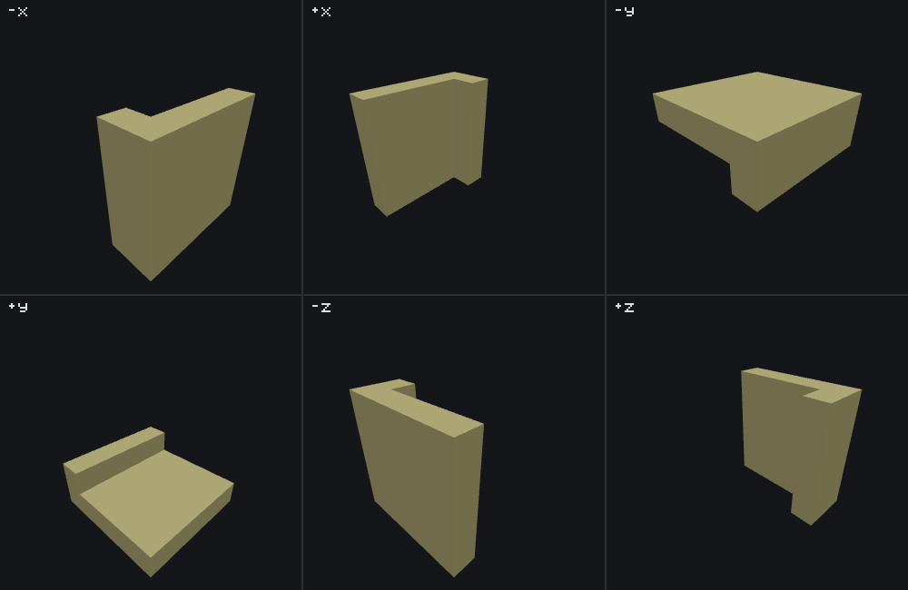

# Search feature

<VersionBadge><CoverageBadge /></VersionBadge>

**`minecraft:search_feature` tries another feature at every position in a box around its origin, and keeps the first ones that work.** You reach for it when you know roughly where something belongs but not exactly: a chest somewhere along a corridor, a plant somewhere on the floor of a room, anything whose own placement rules will tell you whether a position is right if you offer it one. It places nothing itself, which makes it a **Proxy feature**, and it is the general-purpose member of that family — [snap-to-surface](./snap_to_surface_feature.md) scans one straight line for a floor or a ceiling, and this searches a whole volume in any of six orders.

Two things separate it from every other Proxy type. Nothing it tries is written to the world until the search has succeeded — a search that runs out of positions leaves the world exactly as it found it, half-finished attempts included. And `search_axis` decides which position you get when several would work, because the search stops at the first one that does.

You do not need one to place something at a known offset — that is a [scatter](./scatter_feature.md) with a bare axis — and you do not need one to reach the ground under a floating origin, which [snap-to-surface](./snap_to_surface_feature.md) does in one field.

## Start here: a complete example

Two files, both complete. The search starts 7 blocks above open ground and walks downward one cell at a time until the pumpkin it is carrying finds somewhere it can attach; the block feature it delegates to is the one from the [single block page](./single_block_feature.md), unchanged.

::: code-group

```json [features/search_pumpkin_down.json]
{
  "format_version": "1.21.110",
  "minecraft:search_feature": {
    "description": { "identifier": "wiki:search_pumpkin_down" },
    "places_feature": "wiki:pumpkin_patch_block",
    "search_volume": { "min": [0, -10, 0], "max": [0, 0, 0] },
    "search_axis": "-y",
    "required_successes": 1
  }
}
```

```json [features/pumpkin_patch_block.json]
{
  "format_version": "1.21.110",
  "minecraft:single_block_feature": {
    "description": { "identifier": "wiki:pumpkin_patch_block" },
    "enforce_placement_rules": false,
    "enforce_survivability_rules": false,
    "places_block": [
      { "block": "minecraft:pumpkin", "weight": 3 },
      { "block": "minecraft:jack_o_lantern", "weight": 1 }
    ],
    "may_replace": ["minecraft:air"],
    "may_attach_to": { "bottom": "minecraft:grass_block" }
  }
}
```

:::

What each choice buys you:

- **`search_volume` fixes `x` and `z` at `0`** and opens only `y`, from `-10` to `0` relative to the origin. The volume is a box of *offsets*, inclusive on every axis, so this is eleven candidate positions in one column.
- **`search_axis: "-y"`** makes the column count downward, which is what turns "eleven positions" into "the highest one that works". Point it `+y` on the same file and the search starts at the bottom of the column instead.
- **`required_successes: 1`** — the default, written out for clarity — means the search commits as soon as one position works.
- **The delegate decides what "works" means.** `wiki:pumpkin_patch_block` needs air to write into and, through its own `may_attach_to.bottom`, a grass block directly below it. This feature has no opinion of its own about a position; it hands each one over and watches what comes back.


```
featurelab generate --pack <pack> --feature wiki:search_pumpkin_down --env plains --seed 1 --origin 0,70,0
```

Run against the `plains` preset (surface height 63) with feature seed `1` and the origin floated at `(0, 70, 0)` — 7 blocks above the ground — the first seven candidates, `y` 70 down to 64, are open air with nothing below them to attach to and the pumpkin refuses each one. The eighth, `(0, 63, 0)`, is one cell above the grass at `y 62`: it works, the search commits, and one block is written. The position the feature returns to whatever called it is that eighth one, not the origin it was given.

::: tip A search that finds nothing leaves nothing
Shrink `search_volume.min` to `[0, -3, 0]` on the same file — that is `wiki:search_pumpkin_too_shallow` in the committed fixtures — and the column never reaches the ground. All four candidates (`y` 70 down to 67) refuse, the search runs out, and the result is **exactly** as if nothing had been tried:

```
featurelab generate --pack <pack> --feature wiki:search_pumpkin_too_shallow --env plains --seed 1 --origin 0,70,0
```

reports `"level":"warning"`, `"message":"Could not find a valid position for the feature"`, and zero blocks changed. That is the feature working, not failing: it either finishes the job or leaves the world alone. This particular delegate has nothing to undo — a single block feature either writes its one block or writes nothing — so the run shows the giving-up path rather than the rolling-back one; seeing writes actually rolled back needs a delegate that writes more than one cell per attempt.
:::

## Fields

Four keys on the feature body, one of which opens an object. "Default" is what the game uses when the key is absent. The long-form account of every key, in the editor's own words, is the [field reference](#field-reference) further down; these tables are the short version.

### On the feature body

| Key | Required | Value | Default | What it does |
|---|---|---|---|---|
| `places_feature` | yes | feature identifier | — | The feature offered each position in turn. It decides which positions work; this feature only supplies them. Unresolved, nothing is searched at all. |
| `search_volume` | yes | object — [`min` and `max`](#inside-search_volume) | — | The box of candidate positions, as offsets from the origin. |
| `search_axis` | **yes** | one of `-x`, `+x`, `-y`, `+y`, `-z`, `+z` | — (required; see below) | The order the positions are tried in — **not** a restriction to one axis. See [the six orders](#the-six-search-axis-orders). |
| `required_successes` | no | non-negative integer | `1` | How many positions must work before anything is written. The search stops the moment it reaches this count. See [`required_successes`](#required-successes). |

`search_axis` is required by the game's schema: a file that omits it does not load. There is an internal default of `+y` behind it, but no JSON can reach it, so it is not a default you can rely on.

### Inside `search_volume` {#inside-search_volume}

| Key | Required | Value | Default | What it does |
|---|---|---|---|---|
| `min` | yes | `[x, y, z]` whole-number offsets | — | One corner of the box. Negative numbers are ordinary here — they are how you search below or behind the origin. |
| `max` | yes | `[x, y, z]` whole-number offsets | — | The other corner. Both corners are **inclusive**, so `min: [0, -10, 0]`, `max: [0, 0, 0]` is eleven positions, not ten. |

::: note `search_volume` really is spelled `min`/`max`, and that is not the range spelling
Other feature types have *range* fields — `depth`, `age`, `y_scale`, `trunk_height` — whose object form is `{ "range_min": …, "range_max": … }`, and writing `min`/`max` there fails silently in game. `search_volume` is a different thing: a pair of positions describing a box, not a numeric range, so its two members genuinely are `min` and `max` and take `[x, y, z]` arrays. Mojang's own files use both conventions side by side; which one applies follows the field's type.
:::

### The six `search_axis` orders {#the-six-search-axis-orders}

`search_axis` does not narrow the search. Every position in `search_volume` is still visited whichever value you write. What it picks is which axis is the outermost loop and which way each loop counts — and because the search stops at the first position that works, that is what decides **which** of several workable positions you get.

One picture, six searches that differ in one word. Every panel is the same 5×5×5 `search_volume` (`min: [-2, -2, -2]`, `max: [2, 2, 2]`, 125 candidate positions) from the same floating origin on the `void` preset at seed `42`, with the same camera. The delegate is `wiki:threshold_marker`, a bare gold block that succeeds at every position, and `required_successes` is `30` — so each panel is simply **the first 30 positions that order reaches**, and the shape they make is the order itself.



| `search_axis` | Outer loop | Middle | Inner | In the picture | Reach for it when |
|---|---|---|---|---|---|
| `-x` | `x`, counting down | `z`, down | `y`, up | The `x = +2` face, then a line down the `z = +2` edge of the next slab | You want the position furthest along `+x` that works. |
| `+x` | `x`, counting up | `z`, up | `y`, up | The `x = -2` face, then a line at the `z = -2` edge | You want the position furthest along `-x`. |
| `-y` | `y`, counting down | `x`, down | `z`, up | The top layer, then a line along the `x = +2` edge below it | You want the **highest** workable position — a lamp under a ceiling, a nest at the top of a shaft. The common choice. |
| `+y` | `y`, counting up | `x`, up | `z`, up | The bottom layer, then a line at the `x = -2` edge | You want the **lowest** workable position — something on the floor of whatever it is dropped into. |
| `-z` | `z`, counting down | `x`, **up** | `y`, up | The `z = +2` face, then a line at the `x = -2` edge | You want the position furthest along `+z`. |
| `+z` | `z`, counting up | `x`, **down** | `y`, up | The `z = -2` face, then a line at the `x = +2` edge | You want the position furthest along `-z`. |

Two patterns in that table are worth naming, because neither is guessable from the value's name:

- **The innermost loop always counts up**, whichever axis it happens to be.
- **The middle loop follows the outer loop for the `x` and `y` values and runs against it for the two `z` values.** A `-z` search walks `z` downward while walking `x` *upward*; a `+z` search does the opposite. In the picture that is the difference between `-x`, whose trailing line sits at the far `z` edge, and `-z`, whose trailing line sits at the near `x` edge.

::: warning The order is invisible in most real files
None of this shows unless the volume is more than one cell wide on more than one axis. A **fully degenerate** `search_volume` — `min` equal to `max` on all three axes, a single candidate — is common in real packs and hides the loop order completely. A single-column volume like the example above hides two thirds of it: with `x` and `z` pinned, only the sign of a `y` search means anything, and `-x`, `-y` and `-z` are not interchangeable even then.
:::

## Common mistakes

| You wrote | What happens | Do instead |
|---|---|---|
| `"search_volume": {"min": [0, 0, 0], "max": [0, -3, 0]}`, meaning "search three blocks down" | `max` is below `min`, so the box contains no positions and the feature places nothing, anywhere, at any seed. It is not an error the game is known to report. | Swap them: a downward search is `"min": [0, -3, 0]`, `"max": [0, 0, 0]`. |
| `"search_axis": "-y"` expecting the search to be confined to the `y` axis | It is not a filter. Every position in the box is still visited; the value only decides the order. A volume that is wide on `x` will be searched wide on `x`. | Narrow the volume, not the axis: pin `x` and `z` to the same value in `min` and `max`. |
| `search_axis` left out | The key is required by the game's schema, so the file does not load. The `+y` behind it is unreachable. | Write one of the six values. |
| `"required_successes": 3` on a delegate that can only work once | The search visits every position, never reaches 3, gives up, and discards the two successes it did have. Two thirds of a job is not a result this type can return. | Match the count to what the delegate can actually do, or leave it at `1`. |
| `"required_successes": 0` | Nothing is placed. See [`required_successes`](#required-successes) — and note this is one of the few places the bench states its own reading rather than the game's. | Write `1` if you meant "commit as soon as one works". |
| Expecting the positions that worked to survive a search that ran out | They do not. A search that does not reach `required_successes` throws away everything it did, including whole delegated features that had succeeded. | Lower `required_successes`, or widen the volume. |
| `"search_volume": {"min": [0, -1e300, 0], "max": [0, 0, 0]}` for "a very long way down" | The number does not fit in a whole number and wraps; there is no number of positions that large. | Write the real distance. |
| Expecting the origin back from the feature | It returns the **last position that worked**, not its own origin — which is the whole point of putting one in a [sequence](./sequence_feature.md#origin-threading). | Nothing to do; just do not assume otherwise. |

## How it runs

1. **Resolve `places_feature`.** If nothing in the pack defines it, the call fails here and not a single position is visited.
2. **Start holding writes back.** From here to the end, everything the delegate writes goes into a buffer instead of the world. Reads see that buffer layered over the real world, so a delegate that writes and then reads its own work sees it — but nothing outside the search does, yet.
3. **Walk `search_volume`** as three nested loops whose axis roles and directions are fixed entirely by `search_axis`. For each candidate offset, build a position at `origin + offset` and offer it to the delegate.
4. **Count the ones that work**, remembering the latest. The moment the count reaches `required_successes`, **stop** — do not visit the rest — write everything that was held back, in the order it was made, and return that latest position.
5. **If the positions run out first**, throw the whole buffer away. Nothing is written, and the feature reports `Could not find a valid position for the feature`.

The recursion guard applies to the wrapper, as it does for every Proxy type: a search that is already running cannot be reached again from inside its own delegate. That refusal has its own message, `Cannot place internal feature`, distinct from the one in step 5.

## `required_successes` {#required-successes}

The count of positions that must work before anything is written. The default is `1`, which is what almost every real file wants: try positions until one takes, keep it, stop.

A value above 1 is for "fill several of these, or none" — and the *or none* is the part to weigh. The search does not stop early when it becomes obvious the count will not be reached; it visits every remaining position and only then discards the work. A delegate that can succeed only once will always cost you a full sweep of the volume and always place nothing.

`0` is accepted by the file loader and places nothing. Whether that is what the game does with it is [not settled](#what-the-bench-does-differently) — it is one of the two places on this page where the bench says what *it* does rather than what the game does.

## What an exhausted search leaves behind {#exhaustion}

Nothing. That is worth stating on its own because it is unusual: every other Proxy type in this set writes as it goes, so a run that gives up halfway leaves half a feature in the world. This one buffers every write and applies them only on success, so the two outcomes are "all of it" and "none of it" with nothing in between.

The consequence for a pack author is that a search is safe to point at a delegate that writes a lot. A structure, a multi-block, a whole scatter of its own — if the search does not find enough positions, the world does not carry a fragment of any of them. The consequence for reading a preview is that a failed search is quiet: the only sign of it is the warning diagnostic, since there are no placements to look at.

## The two failures that report the same thing {#failure-messages}

Three different things go wrong here and two of them say the same thing, which is worth knowing before you debug one:

| What happened | The message |
|---|---|
| `places_feature` names nothing the pack defines | `Could not find a valid position for the feature` |
| The volume ran out before `required_successes` | `Could not find a valid position for the feature` |
| The search was reached from inside its own delegate | `Cannot place internal feature` |

The first two are genuinely indistinguishable from the message alone. `featurelab check` separates them for you: an unresolved `places_feature` is reported as an error against the file, with a near-match suggestion, without anything being run.

## Field reference

The long-form account of every key, generated from the editor's own catalogue — the same text the Feature Lab node editor shows in its `?` pane and on hover, with the schema facts (required, kind, absent-key default) the editor's forms are built from. The [tables above](#fields) are the summary.

<!--@include: ../generated/fields/search_feature.md-->

## What the bench does differently

featurelab implements `minecraft:search_feature` in full: the six orders, the inclusive volume, the buffering and the commit are all the game's. Three edges are the bench's own reading, because the game's behaviour at them is not established, and each one says so where you meet it:

- **An inverted `search_volume`** — `max` below `min` on any axis — visits no positions here, and `featurelab check` warns and says the search will place nothing. A do-while would visit exactly one position and a normalised box would visit the whole thing, so this is a choice between plausible readings, not a finding. Do not read it as the game's answer.
- **A volume too wide to count** is refused outright, with a message naming the axis and its two ends. The realistic way to write one is not a 19-digit literal: a very large or very small number such as `-1e300` does not fit in a whole number and arrives as the smallest one there is.
- **`required_successes: 0`** loads, warns, and places nothing: the counter this bench keeps is compared for equality after it has been increased, so a counter tested only at 1 or more never matches 0 and the search runs to the end. Whether the game compares the same way, or with a "this many or more" test — under which `0` would behave like `1` and commit on the first success — has not been established. Every file anyone writes in practice has `required_successes` of 1 or more, where the two readings are indistinguishable.

One bench-wide behaviour matters more for this type than for most: **`featurelab check` never runs a placement.** It will tell you that `places_feature` resolves and that your volume is not inverted, and nothing at all about whether any position in it would ever work. An exhausted search only exists in `featurelab generate`'s `diagnostics`, and in the preview panel's Diagnostics section.

## Advanced: what this type costs the random stream {#random-draws}

You do not need this section to use a search feature. It is for reading a preview value for value against the game, or for reproducing the engine exactly. [RNG and determinism](./rng_and_determinism.md) is the model these numbers fit into; this is this type's row in it.

**This feature draws nothing itself.** Not for the axis order, not per candidate, not on commit — zero draws, in both supported versions. Every random value spent inside a search belongs to whatever the delegate does at each position it is offered.

That is not the same as saying a search is free. The delegate is invoked at every candidate until the search stops, and **a candidate that fails has already spent whatever its delegate spent before failing**. A single block feature, for instance, makes its weighted pick before it checks whether it may attach — so each of the seven refusals in the example above cost one value, and the eighth placement is the eighth value, not the first. Three consequences:

- **A search that finds nothing still moves the stream.** It writes nothing, and everything after it in the same pass still shifts. The rollback covers writes, not random values.
- **Widening `search_volume` changes every later feature in the pass**, even when the search finds the same position it found before, because the failures before it are what changed.
- **Changing `search_axis` reorders the failures**, so it changes the values too — not only which position is chosen.

The example's own numbers: `wiki:search_pumpkin_down` visits eight positions and the delegate spends one value at each, so the call costs eight; `wiki:search_pumpkin_too_shallow` visits four, costs four, and writes nothing.

## See also

- [Snap-to-surface feature](./snap_to_surface_feature.md) — the narrow version of this page: one straight line, a floor or a ceiling, and a field for it instead of a volume. That page's example reaches the same block from the same floating origin as this one.
- [Single block feature](./single_block_feature.md) — the delegate this page's example uses, and the type whose own refusals are what make a search meaningful at all.
- [Scatter feature](./scatter_feature.md) — the other way to try a feature in more than one place. A scatter runs every round whether or not it worked; a search stops at the ones that do.
- [Feature rules](./feature_rules.md) — how any of this reaches a world: a feature file is inert until a rule attaches it to the chunks of the biomes it belongs in.
- [RNG and determinism](./rng_and_determinism.md) — where the values a delegate spends come from, and why a search that places nothing still moves everything after it.
- [Sequence feature](./sequence_feature.md) — a sequence threads each step's *returned* position into the next, which is where a search's "the position that worked" becomes useful to something else.

## How this page was checked

Everything above is a statement about Bedrock **1.26.50.24**, and holds for **1.26.40.26** too: this type's JSON surface — every key, enum value and default — and its behaviour are identical in both.

The loop-order table and the two patterns under it are stated as facts about the game, and the picture is how they were confirmed: the six panel fixtures differ only in `search_axis`, and each panel's cells were read back out of `featurelab generate`'s own changed-cell coordinates before the caption was written. Both images were rendered from those exact results by the documentation's own [image pipeline](https://github.com/stirante/featurelab/blob/main/docs/wiki/tools/generate-images.mjs), which runs the real engine against [the fixtures](https://github.com/stirante/featurelab/tree/main/docs/wiki/tools/fixtures) with a fixed seed and a deterministic camera, so re-running it reproduces each picture byte for byte; the figure is additionally refused by that pipeline if any two of its panels come out nearly identical. The worked example and the too-shallow variant were both run end to end and their placements, returned positions and diagnostics read out of the result.

The fixtures behind this page are committed under [`docs/wiki/tools/fixtures/features/`](https://github.com/stirante/featurelab/tree/main/docs/wiki/tools/fixtures/features): `search_pumpkin_down.json` and `search_pumpkin_too_shallow.json` for the example, the six `search_panel_*.json` files for the figure, and their shared `threshold_marker.json` delegate.

What is uncertain is named where it is relevant and collected in [what the bench does differently](#what-the-bench-does-differently): the inverted volume, the over-wide volume and `required_successes: 0` are all statements about the bench, not about the game.
