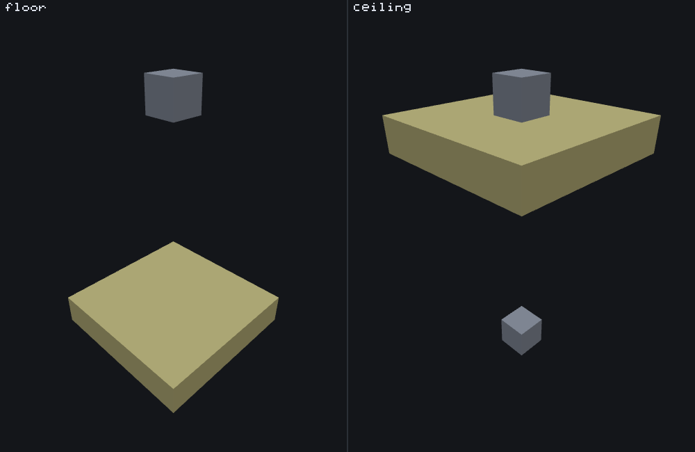

# Snap-to-surface feature

<VersionBadge><CoverageBadge /></VersionBadge>

**`minecraft:snap_to_surface_feature` walks a straight line from its origin until it meets a surface, and places another feature there.** You reach for it whenever you know roughly where something goes but not what height the ground is: a mushroom on a cave floor, a lantern under an overhang, moss on a wall, anything that has to sit *on* terrain you did not generate. It places nothing itself, which makes it a **Proxy feature** — it finds a position and hands it to the feature named in `feature_to_snap`.

Where a [scatter](./scatter_feature.md) spreads a delegate sideways across an area, this one moves it along a single line until the world stops it. Where a [search](./search_feature.md) tries a whole box of positions and lets the delegate judge each one, this one judges the *surface* itself and offers the delegate exactly one position.

Two things need saying before anything else. Its most important field **changed name at `format_version` 1.26.50**, and which name your file may use depends on the version that file declares — see [`search_range`](#search-range). And if you leave `surface` out, the default is **floor**, not ceiling.

## Start here: a complete example

Two files, both complete. The snap starts 8 blocks above open ground and walks down until it finds something to stand on; the block feature it delegates to is the one from the [single block page](./single_block_feature.md), unchanged.

::: code-group

```json [features/snap_pumpkin_to_floor.json]
{
  "format_version": "1.21.110",
  "minecraft:snap_to_surface_feature": {
    "description": { "identifier": "wiki:snap_pumpkin_to_floor" },
    "feature_to_snap": "wiki:pumpkin_patch_block",
    "surface": "floor",
    "vertical_search_range": 12
  }
}
```

```json [features/pumpkin_patch_block.json]
{
  "format_version": "1.21.110",
  "minecraft:single_block_feature": {
    "description": { "identifier": "wiki:pumpkin_patch_block" },
    "enforce_placement_rules": false,
    "enforce_survivability_rules": false,
    "places_block": [
      { "block": "minecraft:pumpkin", "weight": 3 },
      { "block": "minecraft:jack_o_lantern", "weight": 1 }
    ],
    "may_replace": ["minecraft:air"],
    "may_attach_to": { "bottom": "minecraft:grass_block" }
  }
}
```

:::

What each choice buys you:

- **`vertical_search_range: 12`, and not `search_range`**, because this file declares `format_version` `1.21.110` — below the 1.26.50 rename. The same file redeclared at `1.26.50` or newer would have to say `search_range: 12`, and would be refused for saying `vertical_search_range`. See [`search_range`](#search-range).
- **`surface: "floor"`** makes it walk downward. It is also the default, so the key could have been left out — it is written here because "the default is floor" is the single most commonly mis-remembered fact about this type.
- **`allow_air_placement` is not written at all**, and that is deliberate: it defaults to **true**, so the scan can already cross the open air above its origin. Setting it to `false` is what breaks this file — see the tip below.
- **The delegate is placed at the position the scan found**, not at this feature's origin. `wiki:pumpkin_patch_block` still runs its own `may_attach_to.bottom` check there; snapping is what puts it somewhere that check can pass.


```
featurelab generate --pack <pack> --feature wiki:snap_pumpkin_to_floor --env plains --seed 1 --origin 0,71,0
```

Run against the `plains` preset with feature seed `1` and the origin floated at `(0, 71, 0)` — well above open ground at this column — the downward walk crosses 8 open cells, stops on the grass block at world `y 62`, confirms it as something that can hold a block on its top face, and places the pumpkin one cell above it, at `(0, 63, 0)`. That is the same position the [single block](./single_block_feature.md) example lands on by having its origin resolved to the top of the terrain column; here it is reached by an explicit walk from a floating origin instead.

::: tip `allow_air_placement: false` on this exact file breaks it, and that is the point of the default
The committed fixture [`snap_pumpkin_air_disallowed.json`](https://github.com/stirante/featurelab/blob/main/docs/wiki/tools/fixtures/features/snap_pumpkin_air_disallowed.json) is this file with that one explicit `false` added. Run it the same way and the origin cell — open air — is no longer somewhere the scan may stand, so it fails before taking a single step: zero blocks placed, one warning saying no surface was found. An absent `allow_air_placement` does **not** mean "never scan through air"; it means the opposite, and a floating origin above open ground needs it.
:::

## Fields

Nine keys, all on the feature body, and two of them are the same key under two names. "Default" is what the game uses when the key is absent. The long-form account of every key, in the editor's own words, is the [field reference](#field-reference) further down; this table is the short version.

| Key | Required | Value | Default | What it does |
|---|---|---|---|---|
| `feature_to_snap` | yes | feature identifier | — | The feature placed at the surface the scan found — at that position, not at this feature's origin. |
| `search_range` | **yes**, from `format_version` 1.26.50 | whole number | — | How far the scan may travel. A surface at exactly this many blocks still counts. See [`search_range`](#search-range). |
| `vertical_search_range` | **yes**, below `format_version` 1.26.50 | whole number | — | The same field under its old name. No version accepts both; the wrong one for your version is dropped, and the file is then refused for missing the right one. |
| `surface` | no | `floor`, `ceiling`, `wall` or `random_horizontal` | **`floor`** | Which way to walk, and which side of the surface to land on. See [the four values](#the-four-surface-values). |
| `allowed_surface_blocks` | no | array of block descriptors | any block that can hold something on the face the scan arrived at | Restricts what counts as the surface. **Only an array** — the single-descriptor shorthand `may_attach_to`'s faces have does not exist here. Read [what the bench does differently](#what-the-bench-does-differently) before relying on it. |
| `allow_air_placement` | no | boolean | **`true`** | Whether air counts as something the scan may pass through. Off, a scan that begins in the open fails at once. |
| `allow_underwater_placement` | no | boolean | `false` | Whether **water** counts as something the scan may pass through. It means water specifically — lava is never passable, whatever this says. |
| `allow_non_air_placement` | no | boolean | `false` | Whether a scan that begins *inside* a solid block may walk out of it instead of failing. New in 1.26.50.24. See [starting inside a block](#buried-starts). |
| `embed_in_surface` | no | boolean | `false` | Puts the delegate **in** the surface block instead of in the open cell next to it. See [`embed_in_surface`](#embedding). |

### The four `surface` values {#the-four-surface-values}

| Value | What it does | Reach for it when |
|---|---|---|
| `floor` | Walks **down** and places on top of the first surface it finds. **The default** when the key is absent. | Anything that sits on the ground: plants, mushrooms, rubble, a chest on a cave floor. |
| `ceiling` | Walks **up** and places underneath the first surface it finds. | Anything that hangs: roots, lanterns, stalactites, vines under an overhang. |
| `wall` | Tries the four horizontal directions in a random order and takes the first that works; the delegate goes in the open cell beside the wall. New in 1.26.50.24. | Anything on the side of something: moss, ore exposed in a tunnel wall, sconces. |
| `random_horizontal` | Picks **floor or ceiling** at random, once per placement. Despite the name, nothing horizontal happens — it has always chosen between the two *vertical* directions. If you want the four side directions, that is `wall`. | A cave decoration that should sometimes grow up from the floor and sometimes down from the roof. |

One picture, two files that differ in one word. Both panels start from the same floating origin on the `void` preset, with one stone block four cells below it and another four cells above it, the same delegate, the same `search_range` of 8 and the same seed — and nothing but `surface` changes:



`floor` walks down across three open cells, stops on the lower marker, and the delegate lands in the open cell on top of it. `ceiling` walks up the same three cells, stops on the upper marker, and the delegate lands in the open cell beneath it. Same origin, same range, opposite ends of one column. (In the `floor` panel the lower marker is hidden *under* the delegate's sheet, which is exactly where the sheet went; the cube you can see there is the ceiling that the floor scan ignored.)

The other two values are not in the picture, and the reason is worth stating. `random_horizontal` **is** one of these two panels, chosen afresh at every placement, so a picture of it would be a picture of one of them. And `wall` needs a vertical surface beside the origin, which is a different scene rather than a different value. The delegate in the figure is a 5×5 sheet rather than a single block so the snapped position reads at a glance; the fixtures behind it are named in [how this page was checked](#how-this-page-was-checked).

::: note A `surface` value outside these four does not fail the file
The game logs ``Bad value for surface - should be 'ceiling', 'floor', 'random_horizontal', or `wall` `` as a content error and carries on with the default, `floor`. A typo here snaps downward rather than doing nothing, which is harder to notice than a refusal.
:::

## Common mistakes

| You wrote | What happens | Do instead |
|---|---|---|
| `"search_range": 12` in a file whose `format_version` is below `1.26.50` | The key is not in that version's schema: it is reported by name, its value is dropped, and the file is then refused for missing the required `vertical_search_range`. | Match the name to the version — [the table](#search-range) has both rows. |
| `"vertical_search_range": 12` in a file at `1.26.50` or newer | The mirror image, with the same result. | The same. |
| Raising a pack's `format_version` across 1.26.50 and leaving the snap files alone | Every `snap_to_surface_feature` in the pack stops loading at once. | Rename the field in all of them in the same change. |
| Leaving `surface` out expecting a ceiling | It snaps **downward**. `floor` is the default, in this version and in 1.26.40.26 alike. | Write `"surface": "ceiling"`. |
| `"surface": "random_horizontal"` wanting one of the four side directions | It picks floor or ceiling. Nothing horizontal happens. | `"surface": "wall"`. |
| `"allow_air_placement": false` on a feature whose origin floats in the open | The origin cell is not somewhere the scan may stand, so it fails before its first step and places nothing. | Leave the key out; its default is `true`. |
| `"allow_underwater_placement": true` expecting a lava column to be scannable | It means water, not "any liquid". Lava is never passable — and a lava *origin* is not even an open start, so it takes the [buried path](#buried-starts). | Nothing will scan lava. Place directly, or snap from above it. |
| `"allowed_surface_blocks": "minecraft:stone"` | Refused: only an array is accepted here. The bare-descriptor shorthand belongs to `may_attach_to`'s faces. | `["minecraft:stone"]`. |
| `"allowed_surface_blocks": [{"tags": "…"}]` | **Nothing is ever placed in the world.** The game cannot resolve a tag to a block here, so every surface fails to match — and the preview looks fine. See [what the bench does differently](#what-the-bench-does-differently). | List the block names. |
| `allowed_surface_blocks` listing the solid blocks around a buried origin, with `allow_non_air_placement` | A buried scan confirms the **open cell** it escapes into, so the list would have to contain air or water. Listing the solid fails every time. | Leave the list out for buried starts. |
| A range of `1` or `0`, expecting the origin cell itself to be checked | A range below 2 walks no cells, but it still examines the origin's *neighbour*, not the origin. | Write at least the distance you mean, counted from the origin. |
| Expecting the delegate to be turned to face the wall on a `wall` snap | This feature moves the delegate; it never rotates it. Any facing comes from the delegate's own rotation fields. | Use the delegate's `may_attach_to` / `auto_rotate`, or its `randomize_rotation`. |

## How it runs

1. **Pick a direction.** `floor` walks down, `ceiling` walks up. `random_horizontal` flips a coin and becomes one of those two. `wall` puts north, east, south and west in a random order and tries each in turn, keeping the first that works.
2. **Classify the origin cell.** Air or water is an ordinary *open start*. Anything else — stone, sand, even lava — is a *buried start*, which is only allowed at all with [`allow_non_air_placement`](#buried-starts), and which walks in the **opposite** direction.
3. **Walk the line**, starting at the cell next to the origin, while the cells stay passable, as far as the range reaches. A range below 2 walks no cells at all but still examines that first neighbour.
4. **Confirm the surface.** The cell the walk stopped at has to pass the test in [what counts as a surface](#passable). If it does not, that direction has failed — and for every value except `wall`, that fails the whole feature, with nothing placed.
5. **Place `feature_to_snap`** at the snapped position: by default the open cell next to the surface, or the surface block itself with [`embed_in_surface`](#embedding). The delegate runs its own checks there and may still refuse. The name is looked up only at this point, so a file naming a feature nothing defines reports that only on the runs where the scan actually worked.

The recursion guard applies to the wrapper, as it does for every Proxy type, and refuses with `Cannot place internal feature`.

## `search_range`, and the name your file must use {#search-range}

1.26.50 renamed `vertical_search_range` to `search_range` — it is no longer purely vertical, now that `wall` exists. The game picks which name your file may use from the file's own declared `format_version`, and the schema only ever contains **one** of them:

| Your file's `format_version` | The name you must write | The other name |
|---|---|---|
| below `1.26.50` | `vertical_search_range` | not in the schema: reported by name, value dropped |
| `1.26.50` and newer | `search_range` | the same |

There is **no** version at which both are accepted, and the wrong name is not quietly ignored: the game reports it and then, because the accepted name is required, refuses the file for missing it. Updating a pack's `format_version` across 1.26.50 therefore means renaming this field in every `snap_to_surface_feature` at the same time.

There is no third row for a file that declares no `format_version` at all. The key is required by every version band's schema, so such a file matches no schema and does not load in the game — nothing in it, this field included, is ever read. The bench is deliberately more forgiving; see [what the bench does differently](#what-the-bench-does-differently).

The field means the same thing under both names: how far the scan may travel, counted in blocks from the origin. Two subtleties:

- **A surface at exactly that many blocks counts.** In 1.26.40.26 the reach was one block shorter, so a surface at the maximum distance snaps in this version and did not in the previous one.
- **The cell at maximum distance is confirmed without being checked for passability.** A solid block exactly that far away is a found surface even though the walk never got to ask whether it could pass through it. Closer surfaces are found by the walk stopping on them.

## What the scan may pass through, and what counts as a surface {#passable}

Two different tests, and mixing them up is the usual reason a scan that "should obviously work" does not.

**Passing through**, for a scan that started in air or water: a cell is passable when `allow_air_placement` is true and the cell is air, **or** `allow_underwater_placement` is true and the cell is water. Both gates apply to every cell, every step, including the origin cell itself — which is why `allow_air_placement: false` fails a floating origin immediately rather than after a step or two. `allow_underwater_placement` means water, not "any liquid": a lava-filled column is never passable.

**Confirming the surface**, for the same scan:

- With `allowed_surface_blocks` **left out** (the default), the cell has to be a block that can genuinely hold something on the face the scan arrived at. That is not the same as asking whether it is solid, and it is directional: a floor scan accepts a top slab, a right-way-up stair, a fence, a wall, a pane and glass, and refuses a bottom slab, farmland, a dirt path, a chest, leaves, a carpet, a torch and a snow layer below full height. A **ceiling** scan asks about the other face, so some of those flip — farmland and a bottom slab are perfectly good ceilings and are not floors. A block your own pack defines supports every face, which is what the game does with anything that does not opt out: naming a block `..._stairs` does not give it a stair's behaviour, here or in the game.
- With `allowed_surface_blocks` **given**, that list replaces the test entirely: the surface must be one of those descriptors and nothing else qualifies, however solid it is. This field is the one place on the page where the bench and the game are known to disagree, in two specific ways — read [what the bench does differently](#what-the-bench-does-differently) before relying on it.

## Starting inside a block: `allow_non_air_placement` {#buried-starts}

New in 1.26.50.24, default `false`. It decides what happens when the origin cell is neither air nor water — buried in stone, in sand, in lava.

- **`false`** — the scan fails immediately, exactly as it did in 1.26.40.26.
- **`true`** — the scan walks the *opposite* direction through the solid, keeps going while the cells stay solid, and confirms the first open cell it escapes into. That cell must itself pass the `allow_air_placement` / `allow_underwater_placement` gates. The delegate goes in that opening, or with `embed_in_surface` in the last solid cell before it.

The direction inversion is why this is called snapping *out*: a feature buried under a field that asks for a `floor` comes out standing on that field's surface — exactly where an open-start scan falling from above would have put it.

Two consequences worth keeping:

- **`allowed_surface_blocks` and a buried start rarely make sense together.** A buried scan confirms the *opening*, so a non-empty list would have to contain air or water; listing the solid blocks around it fails the scan every time.
- **The key is not gated on `format_version`.** Unlike the rename above, any file may write it — the behaviour is the game's, not the schema's.

## `embed_in_surface` {#embedding}

An optional boolean, default `false`, that moves the delegate by exactly one cell along the scan direction:

- **`false`** — the delegate goes in the open cell *next to* the surface: one above a floor, one below a ceiling, one beside a wall, or the first open cell past the solid on a buried start.
- **`true`** — the delegate goes **on the surface block itself**, replacing it, subject to the delegate's own `may_replace` — or, on a buried start, in the last solid cell before the opening.

Reach for it for anything that should be part of the ground rather than sitting on it: a patch of a different block set into a floor, an ore exposed in a wall face.

## Field reference

The long-form account of every key, generated from the editor's own catalogue — the same text the Feature Lab node editor shows in its `?` pane and on hover, with the schema facts (required, kind, absent-key default, `format_version` gates) the editor's forms are built from. The [table above](#fields) is the summary.

<!--@include: ../generated/fields/snap_to_surface_feature.md-->

## What changed in 1.26.50 {#what-changed-in-12650}

More changed here than in any other type in this set, which is why this page carries no "and it holds for 1.26.40.26 too" line. Relative to 1.26.40.26:

- **`vertical_search_range` was renamed to `search_range`**, gated on the file's declared `format_version` against 1.26.50 — one name or the other, both required, never both accepted. See [its own section](#search-range).
- **`surface: "wall"` is new.** `random_horizontal` kept its behaviour unchanged.
- **`allow_non_air_placement` is new**, and with it the whole buried-start path: a start inside a solid block used to fail unconditionally, and can now walk out of the solid in the inverted direction. The new key is *not* gated on `format_version` — any file may use it.
- **The scan reaches one block further.** A surface at exactly the range now snaps, where the effective reach used to be `vertical_search_range - 1`. Likewise a range below 2 now examines the origin's *neighbour*, where it previously examined the origin cell itself.
- **The scan is a single directional walk now.** 1.26.40.26 always worked out both an upward and a downward candidate and then used one. For plain floor and ceiling snaps the visible behaviour is the same, but any description that says "it looks both ways" no longer applies.

Unchanged: the `allow_air_placement` and `allow_underwater_placement` defaults and meanings, the water-not-lava rule, `embed_in_surface`, `allowed_surface_blocks`, the fact that `random_horizontal` chooses between floor and ceiling, and `feature_to_snap` being required.

## What the bench does differently

This page documents the game. Four things belong to the **featurelab** bench used to illustrate it, and the first is the most consequential divergence anywhere on this site:

- **A `{"tags": …}` entry in `allowed_surface_blocks` matches nothing in the game, and everything it should in the bench.** The game cannot resolve a tag descriptor to a block here: it logs `It's not valid to get a block reference that is described by tags` and substitutes a block that equals nothing real, so every surface fails to match and the feature places nothing, anywhere, ever. The bench evaluates the tag predicate for real and accepts matching surfaces. This is the one case in this documentation where **a preview that works means a feature that does nothing in the world**, which is why the bench reports it as a warning at load time instead of quietly working. List block names explicitly if the feature has to run in game.
- **A partly-spelled state map is stricter here.** With an allow-list the game compares the surface's full block state — the name together with every one of its states at its concrete value — completing *both* sides to the block's full state set first, so `{"name": "minecraft:oak_log"}` matches an oak log standing on its default axis. The bench compares the written maps literally, so that same entry does not match a surface whose palette entry spells `pillar_axis` out. Spell the states the same way on both sides and the two agree.
- **The no-allow-list surface test is modelled, not approximated — but a handful of enum states are matched by name.** The bench asks the same per-face question the game asks, so the accept-and-refuse list in [what counts as a surface](#passable) is the bench's answer as well as the game's. What is still approximate: a stair's or a shelf's facing, a chain's axis and a grindstone's attachment are matched by their documented value names rather than by the numbers the game stores, so an unusual spelling falls back to that block's default orientation.
- **The rename gate is applied, and then the file is loaded anyway.** The wrong name for the declared version is dropped with a diagnostic that names the rename, and the file then warns about the missing required field instead of refusing to load — the bench prefers a loud, explained load over a game-faithful hard failure, so the rest of the pack stays inspectable. A file that declares **no** `format_version` at all, which the game would not load in the first place, is loaded too, with a warning saying exactly that, and this field is then read under whichever of the two spellings the file actually wrote rather than being judged against a version band its author never picked.

## Advanced: what this type costs the random stream {#random-draws}

You do not need this section to use a snap-to-surface feature. It is for reading a preview value for value against the game, or for reproducing the engine exactly. [RNG and determinism](./rng_and_determinism.md) is the model these numbers fit into; this is this type's row in it.

This type spends random values only on choosing a direction, before any scanning, and the count depends on nothing but `surface`:

| `surface` | Cost | Which kind |
|---|---|---|
| `floor`, `ceiling` | 0 | The direction is fixed by the field; nothing is rolled. |
| `random_horizontal` | **1** | One boolean draw, taken before anything else. An even draw selects floor, an odd one ceiling. |
| `wall` | **3** | Three bounded integer draws, with bounds 2, 3 and 4 **in that order** — an ascending Fisher-Yates shuffle of the four horizontal directions. |

Both are unconditional for their mode. A `wall` snap that fails in all four directions has still spent exactly three values, and a `random_horizontal` that finds nothing has still spent its one — so everything downstream in the same pass sees the same stream whether the snap worked or not. Nothing else here costs anything: the walk, the confirm and the position arithmetic are free, and every value spent after this point belongs to the delegate.

**The snapped position**, as one expression covering all four combinations of embedded and buried:

```
snapped = origin + direction × (steps + (embed_in_surface XOR buried))
```

where `steps` is how many passable cells the walk crossed — at most `search_range - 1` of them, since the walk starts at the cell after the origin and the cell it stops on is confirmed without being walked into. An open start with `embed_in_surface` off gives the last open cell, adjacent to the surface; with it on, the surface block itself. A buried start with it off gives the first open cell past the solid; with it on, the last solid cell before that opening. The example above walks 8 cells down from `y 71`, so `steps` is 8, both flags are off, and the delegate lands at `y 63`.

## See also

- [Search feature](./search_feature.md) — the general version of this page: a whole box of candidate positions instead of one line, with the delegate rather than the surface deciding which ones work. Its example reaches the same block from the same floating origin as this one.
- [Single block feature](./single_block_feature.md) — the delegate this page's example reuses verbatim, and the page with the `may_attach_to.<face>` single-descriptor shorthand note that is exactly what `allowed_surface_blocks` does **not** accept.
- [Scatter feature](./scatter_feature.md) — the other Proxy type that names its delegate through a feature-reference field (`places_feature` there, `feature_to_snap` here), with its own offset machinery instead of a surface scan.
- [Feature rules](./feature_rules.md) — how any of this reaches a world: a feature file is inert until a rule attaches it to the chunks of the biomes it belongs in.
- [Sequence feature](./sequence_feature.md#origin-threading) — this page's example is reused as the first step of a sequence, precisely because a snap's *returned* position, not its input origin, is what the next step inherits.
- [RNG and determinism](./rng_and_determinism.md) — the model the direction-choosing values above fit into.

## How this page was checked

Everything above is a statement about Bedrock **1.26.50.24** specifically, and for this type that matters more than usual: the behaviour is **not** the same in 1.26.40.26, so instead of claiming both versions the page lists every difference in [what changed in 1.26.50](#what-changed-in-12650).

The rename gate, the `floor` default, the reach, the two passability gates, the per-face surface test and the buried-start inversion are stated as facts about the game. The worked example was run end to end and its returned position — `(0, 63, 0)`, from an origin of `(0, 71, 0)` — read back out of `featurelab generate`, along with the zero-placement result and the warning from the `allow_air_placement: false` variant. The floor-against-ceiling figure's two panels were each run the same way and their changed-cell coordinates read before the caption was written: 27 cells in both, the delegate's 25-cell sheet at `y 1` for `floor` and at `y 7` for `ceiling`. Both images were rendered from those exact results by the documentation's own [image pipeline](https://github.com/stirante/featurelab/blob/main/docs/wiki/tools/generate-images.mjs), which runs the real engine against [the fixtures](https://github.com/stirante/featurelab/tree/main/docs/wiki/tools/fixtures) and [the documentation's own pack](https://github.com/stirante/featurelab/tree/main/docs/wiki/tools/figure-fixtures) with a fixed seed and a deterministic camera, so re-running it reproduces each picture byte for byte, and which refuses a figure whose panels come out nearly identical.

`snap_pumpkin_to_floor.json` and `snap_pumpkin_air_disallowed.json`, the example's fixtures, are committed under [`docs/wiki/tools/fixtures/features/`](https://github.com/stirante/featurelab/tree/main/docs/wiki/tools/fixtures/features). The figure's own scenes are in the documentation's pack, [`docs/wiki/tools/figure-fixtures/features/`](https://github.com/stirante/featurelab/tree/main/docs/wiki/tools/figure-fixtures/features): `snap_panel_floor.json` and `snap_panel_ceiling.json` — two aggregates that lay the two markers and then run `snap_panel_snap_floor.json` / `snap_panel_snap_ceiling.json`, which differ in the word `floor` and nothing else — over the shared `snap_panel_patch.json` sheet. Those two snap fixtures declare `format_version` `1.26.50` and write `search_range`, deliberately: with the example above declaring `1.21.110` and writing `vertical_search_range`, the pack exercises the rename in both directions, and `featurelab check` is clean on all three.

What is uncertain is named where it is relevant and collected in [what the bench does differently](#what-the-bench-does-differently): the tag-descriptor divergence, the literal state-map comparison, the handful of enum states matched by name, and the bench's deliberate leniency about the rename gate are all statements about the bench, not about the game.
