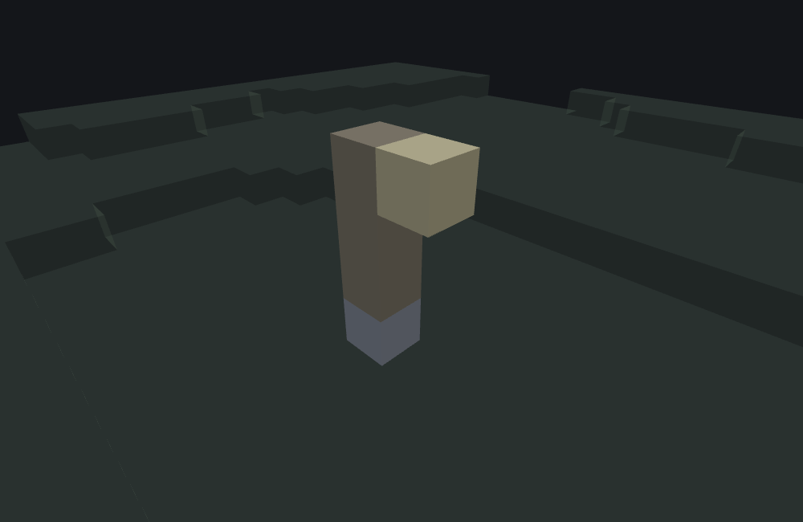
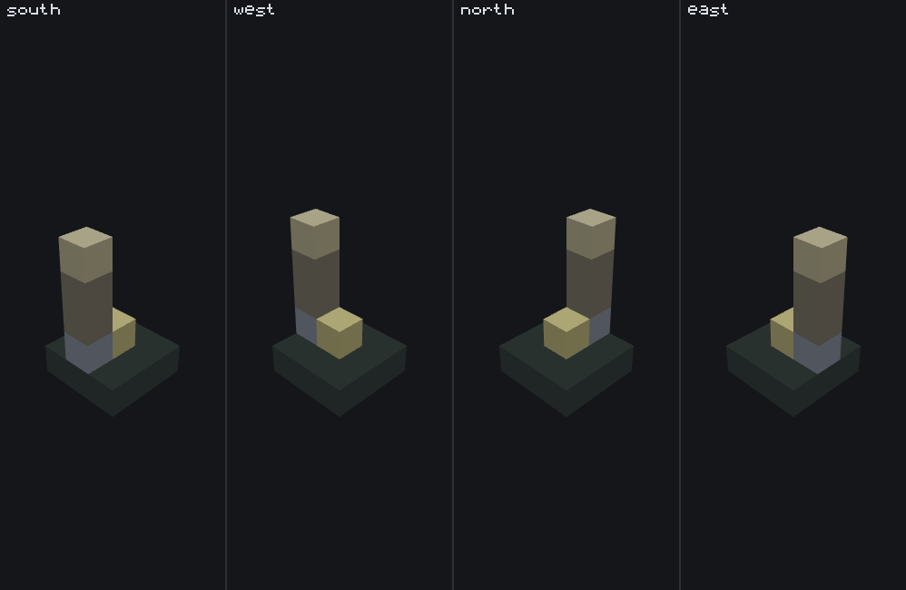

# Structure template feature

<VersionBadge><CoverageBadge /></VersionBadge>

**`minecraft:structure_template_feature` copies a `.mcstructure` file into the world, block by block, at a position it looks for near its origin.** You reach for it whenever the thing you want to place was easier to build than to describe: a hut, a ruin, a well, a shipwreck, a bit of set dressing you made in a structure block and exported.

It is a **Content feature** — it writes blocks itself and never delegates to another feature — but unlike a [single block feature](./single_block_feature.md) or an [ore feature](./ore_feature.md), *what* it places is not in the JSON at all. The shape, the size and every block come from the structure file. The JSON only says which file, which way round it goes, which row of it counts as the ground, and how far the feature may slide sideways looking for a spot where the structure's own `constraints` are satisfied.

You do not need one for a shape you could describe in JSON, and you cannot use one to build a shape that varies: the same file produces the same blocks every time, in one of four rotations.

## Start here: a complete example

Two files: the feature, and the structure it names. `structure_name` resolves against the `.mcstructure` files loaded with the pack — here [`fixtures/structures/wiki/lamp_post.mcstructure`](https://github.com/stirante/featurelab/tree/main/docs/wiki/tools/fixtures/structures/wiki), a deliberately small (1×4×2) and **asymmetric** lamp post: a `minecraft:cobblestone` foundation, a three-block `minecraft:oak_log` shaft, and a `minecraft:glowstone` lantern offset to one side. Asymmetric on purpose, so the rotation is visible in the result instead of turning the structure into itself.

```json title="features/lamp_post_structure.json"
{
  "format_version": "1.21.110",
  "minecraft:structure_template_feature": {
    "description": { "identifier": "wiki:lamp_post_structure" },
    "structure_name": "wiki:lamp_post",
    "facing_direction": "east",
    "constraints": {}
  }
}
```

What each choice buys you:

- **`constraints: {}`** is how you configure none. The key is required by the schema and every constraint inside it is optional, so an empty object means every candidate position passes and the search stops at the origin on its first try.
- **`facing_direction: "east"`** turns the structure a quarter turn. The lantern sits one cell along the structure's local **+Z** from the shaft, and `facing_direction` is the name of the world direction that local +Z ends up pointing — so with `"east"` the lantern lands east of the shaft rather than south. See [the four directions](#the-four-facing-directions).
- **No `adjustment_radius` and no `rotate_around_center`**, so the structure is stamped exactly at the origin it was handed, and `ground_level` defaults to `0`, so the structure's bottom row is the row that lands there.



```
featurelab generate --pack <pack> --feature wiki:lamp_post_structure --env plains --seed 1
```

Run against `plains` with feature seed `1`, the origin resolves to `(0, 63, 0)` — the same "top of the terrain column at `(0, 0)`" default [the single block feature example](./single_block_feature.md#start-here-a-complete-example) resolves to — and **all five of the structure's painted cells copy in**: `minecraft:cobblestone` at `(0, 63, 0)`, `minecraft:oak_log` at `(0, 64, 0)`, `(0, 65, 0)` and `(0, 66, 0)`, and the `minecraft:glowstone` lantern at `(1, 66, 0)`, one block **east** of the shaft. No diagnostics of its own, and no constraint could fail because none were configured.

::: tip A structure feature never places "part of" a structure
Either every candidate position fails its constraints and **nothing at all** is written — with one warning, `Structure could not be placed.` — or one candidate passes and the whole file is copied. There is no partial stamp to debug: if you are seeing half a building, something else is overwriting it.
:::

## Fields

Six keys, one of which is an object holding the four constraints. "Default" is what the game uses when the key is absent. The long-form account of every key, in the editor's own words, is the [field reference](#field-reference) further down; these tables are the short version.

### On the feature body

| Key | Required | Value | Default | What it does |
|---|---|---|---|---|
| `structure_name` | yes | a structure identifier | — | Which `.mcstructure` file to copy. Some loaded structure file must define it; an unresolved name fails the feature when the pack loads, and `featurelab check` reports it with a near-match suggestion. |
| `facing_direction` | no | `south` `west` `north` `east` `random` | `south` | Which way round the structure goes — see [the four directions](#the-four-facing-directions). `random` picks one of the four per placement. |
| `rotate_around_center` | no | boolean | `false` | Puts the structure's horizontal **centre** on the found position instead of its `(0, 0)` corner. See [`rotate_around_center`](#rotate-around-center). |
| `ground_level` | no | number, minimum `0` | `0` | Which **row of the structure** lands at the found position's own Y. See [`ground_level`](#ground-level). |
| `adjustment_radius` | no | number in `[0, 16]` | `0` — the origin cell only | How far sideways the feature may look for a position where every constraint passes. **Sideways only** — see [the search](#the-search). Outside `[0, 16]` the file does not load. |
| `constraints` | yes | object — the next table | — | Which of the four conditions a candidate position must satisfy. `{}` means none, and is the normal thing to write. |

### Inside `constraints`

All four are optional, all four are armed by the **presence of their key**, and a candidate has to satisfy every one that is armed. Each is checked over points worked out from the structure's own blocks, so how much work a constraint does depends on what you built, not on what you wrote here.

| Key | Required | Value | Default | What it does |
|---|---|---|---|---|
| `grounded` | no | `{}` | not armed | One row **below** the structure's `ground_level` row must be something you can stand on, for every column that has a block on that row. |
| `unburied` | no | `{}` | not armed | One row **above** the whole structure must be air, for every column that has a block on the structure's **top** row. |
| `block_intersection` | no | object — needs `block_allowlist` | not armed | Every cell the structure is about to occupy must already hold a block from a list you give. |
| `block_intersection.block_allowlist` (alias `block_whitelist`) | **yes**, when `block_intersection` is present | array of block descriptors | — | The blocks the structure is allowed to be stamped into. A `block_intersection` without it does not load. |
| `block_intersection.only_check_intersection_for_motion_blocking_blocks` | no | boolean | **`true`** | With the default `true`, only the structure's own solid cells are checked; write `false` to check every non-empty cell, air included. |
| `leveled` | no | object | not armed | The same points `grounded` uses, but the ground under each has to be level to within `max_steepness`. |
| `leveled.max_steepness` | no | number (a fraction truncates) | `2` | How far up or down the ground may step under the footprint before the position is refused. |

::: warning `"grounded": false` does not turn a constraint off
`grounded` and `unburied` take no options at all, so the game reads only whether the key is **there**. Writing `false`, `null` or `0` as the value arms the constraint exactly as `{}` does. The only way to turn one off is to remove the key.
:::

### The four `facing_direction` directions {#the-four-facing-directions}

One picture, four placements of one structure that differ in one word. Every panel is the same 1×4×2 structure from the same origin at feature seed `1`, on `plains`, in the same 3×5×3 volume with the same camera, and the structure used is not the lamp post above but [`wiki:facing_post`](https://github.com/stirante/featurelab/tree/main/docs/wiki/tools/fixtures/structures/wiki) — the same five blocks rearranged so the picture works: the **gold block** is the structure's own origin cell, and the four-block post stands one cell along the structure's local **+Z** from it.



| Value | Where the structure ends up | Reach for it when |
|---|---|---|
| `south` | Unturned. In the picture the post stands at world `(0, 1)` relative to the marker — due south. This is what an absent key gives you. | The structure is already the right way round, which for anything you exported facing south it is. |
| `west` | A quarter turn. The post lands at `(-1, 0)` — due west. | You want it turned once. |
| `north` | A half turn. The post lands at `(0, -1)` — due north. | You want it facing back the way it came. |
| `east` | Three quarters. The post lands at `(1, 0)` — due east. This is the value the example above uses, and why its lantern is east of the shaft. | You want it turned the other way. |
| `random` | One of the four above, picked fresh for every placement. | You are scattering the same building across a biome and you do not want a row of identical, identically-oriented huts. |

The pattern the picture shows is the one worth remembering: **`facing_direction` names the world direction the structure's own local +Z ends up pointing.** Whatever you built facing local +Z in the structure block faces that way in the world. Y is never touched — no rotation of this type tips a structure over.

::: warning In the `east` panel the gold marker is partly behind the post
The preview's camera looks down from the south-east corner, so in that one panel the post stands between you and the marker and clips its near corner. The marker is on the same cell in all four panels; it is the post that moves.
:::

## Common mistakes

| You wrote | What happens | Do instead |
|---|---|---|
| `"grounded": false` to switch that constraint off | It is **armed**. Only the key's presence is read, and no value turns one off. | Delete the key. |
| A `block_intersection` with no `block_allowlist` | The file does not load: the schema marks the child required. An empty list would not help either — it matches nothing, so every position would fail. | Write the blocks the structure may be stamped into, or remove `block_intersection`. |
| `"adjustment_radius": 20` for a wider search | Outside the schema's `[0, 16]`, so the file does not load. Nothing clamps it. | `16` is the widest search there is. |
| `"ground_level": -1` to sink a structure one block | The file does not load: the schema gives this field a minimum of `0`. | Add an empty row to the bottom of the structure, or raise `ground_level` and let a higher row be the ground row. |
| Raising `adjustment_radius` so the structure finds the ground under a floating origin | It never will. The search keeps the origin's own Y and only moves in X and Z. | Wrap the feature in a [snap to surface feature](./snap_to_surface_feature.md) or a [search feature](./search_feature.md), which are the types that move a placement vertically. |
| Expecting `unburied` to check each column's own headroom | It samples one **fixed** height for the whole footprint — one row above the structure's top row — and a column that stops short of the top row is not checked at all. | If you need clearance over a low part of the structure, put a block there in the structure file so that column reaches the top row. |
| Exporting from a structure block and expecting the empty cells to count | A structure block writes empty-but-selected cells as **explicit air**, and `grounded`, `unburied` and `leveled` treat explicit air exactly as they treat an unpainted cell: it contributes no point. | Nothing to fix — this is what makes those constraints check the columns you meant. `minecraft:structure_void` is a real block and *does* contribute a point. |
| Leaving `constraints` out because you do not want any | The key is required; the game refuses the file. | `"constraints": {}`. |
| Relying on `rotate_around_center` to centre an odd-sized structure exactly | The offset is `-(size / 2)` rounded down on each horizontal axis, so a 5-wide structure moves by 2, not 2.5. | Build with the centre where you want it, or accept the half-block bias. |

## How it runs

1. **Work out the rotation.** `facing_direction` names it; `random` picks one of the four.
2. **Work out the two offsets.** `rotate_around_center` gives a horizontal one, `ground_level` a vertical one, both from the structure's own size. Neither reads the world.
3. **Look for a position.** Starting at the origin itself and spiralling outward through `(2r + 1)²` cells in all, every constraint that is armed is tested at each candidate. The first candidate where **every** one passes wins. `adjustment_radius: 0` means the origin is the only candidate.
4. **If no candidate passed**, fail with a warning and place nothing.
5. **Otherwise copy the structure**, cell by cell, rotated and offset as worked out in step 2. Unpainted cells are skipped, so they never overwrite what is already there.

Nothing in steps 2 to 5 is random: for any `facing_direction` other than `random`, the same file at the same position produces the same blocks every time.

## `facing_direction` and `rotate_around_center` {#rotate-around-center}

The rotation turns the structure's local X/Z axes around its own **origin cell** — the cell at local `(0, 0)`, which is where the placement position lands. Y passes through untouched.

`rotate_around_center` (default `false`) changes which part of the structure sits on the found position. When it is set, the structure is shifted by `-(sizeX / 2)` and `-(sizeZ / 2)`, rounded down, *before* the rotation is applied, so the structure's horizontal centre lands on the position instead of its `(0, 0)` corner. Both halves of a building therefore straddle the origin rather than growing away from it, which is usually what you want for anything you are placing "at" a spot rather than "from" one.

The two interact the way you would hope: the centring offset is rotated along with every cell, so a centred structure stays centred in all four rotations.

## `ground_level` {#ground-level}

Which **row of the structure** — Y, counted from the structure's own bottom — lands exactly at the found position's Y. The default `0` means the bottom row sits at the position and everything else stacks upward from there.

A non-zero value pins some other row to the position instead, which is how you place a structure by the row that matters rather than by its bottom. A hut with a two-deep foundation can be given `ground_level: 2` so that its floor, not its footings, meets the ground. Anything below the ground row ends up below the position.

Two things to know: the value is clamped at placement time to `[0, sizeY - 1]` — the structure's own height — so a `ground_level` larger than the structure has can only pin its top row; and it also moves the points `grounded` and `leveled` sample, because those are defined relative to the ground row rather than to the structure's bottom.

## `adjustment_radius` and the search {#the-search}

With the default `0`, the origin is the only position tried: if a constraint fails there, the feature fails. A larger radius widens the search to a spiral of up to `(2r + 1)²` cells, tried origin-first and then outward, and the first cell where every armed constraint passes wins.

::: warning `adjustment_radius` searches sideways only
Every candidate keeps the **origin's own Y**. The search is `(2r + 1)²` cells across X and Z; it is never a column. A radius will slide a structure around an obstacle or off a slope, and it will never drop one onto the ground below it. Raising the radius under a floating origin changes nothing except how many candidates are rejected before the feature gives up. Landing on terrain from a floating origin is what [snap to surface features](./snap_to_surface_feature.md) and [search features](./search_feature.md) are for; wrap the structure feature in one of those rather than widening the radius.
:::

## The four constraints, and the points each one checks {#the-four-constraints}

Each constraint works out a list of points from the structure's own blocks once, when the pack loads, and then tests one condition on the world block at each of those points for every candidate position. A constraint with an empty point list passes every time, and a constraint fails a candidate the moment one of its points fails.

| Constraint | Which points it checks | What has to be true there |
|---|---|---|
| `grounded` | One row **below** the structure's `ground_level` row, for every column whose cell *on* that row is not empty. | The world block can be stood on — the game's own solid-blocking test, not a comparison against a block name. |
| `unburied` | One row **above** the whole structure, for every column whose cell on the structure's **top** row is not empty. Columns that stop short of the top row are not checked at all. | The world block is exactly air. |
| `block_intersection` | The cells the structure will occupy. With `only_check_intersection_for_motion_blocking_blocks` at its default `true`, only the structure's **motion-blocking** cells; write `false` and the rest are checked too, explicit air included. | The world block is in `block_allowlist`. |
| `leveled` | The same points as `grounded`. | Somewhere within `± max_steepness` rows of the point there is a solid block with air above it — the ground under the footprint is level to that tolerance. |

Two things about `unburied`'s point list are worth stating plainly, because they are easy to assume the other way round: it checks a **single height** for the whole footprint rather than each column's own clearance, and a column whose blocks stop below the structure's top row is **skipped entirely** rather than checked at its own top.

### "Empty" has two spellings, and three of the four constraints read them alike {#empty-cells}

`grounded`, `unburied` and `leveled` compare each sampled cell against air, and an unpainted cell reaches that comparison too, because the engine substitutes air for it. So a cell holding explicit `minecraft:air` contributes no point, exactly as an unpainted cell does.

This matters because a `.mcstructure` saved from a structure block writes **empty-but-selected cells as explicit air**, not as unpainted void. A structure that looks like it has an open top in the editor may be full of air cells, and reading those as occupied would make the constraints check columns the game never looks at. `minecraft:structure_void` is *not* covered by this — it is a real block with its own identity, so it does contribute a point.

`block_intersection` has no air test at all. It splits the structure's non-empty cells into the motion-blocking ones and everything else, and `only_check_intersection_for_motion_blocking_blocks` picks which half is checked — so for that one constraint an explicit air cell is a cell, and lands in the second half.

### Constraints and the search, worked through {#constraints-worked}

The example at the top of the page configures no constraints and no radius, so nothing in it exercises any of this. This file does:

```json title="features/lamp_post_constrained.json"
{
  "format_version": "1.21.110",
  "minecraft:structure_template_feature": {
    "description": { "identifier": "wiki:lamp_post_constrained" },
    "structure_name": "wiki:lamp_post",
    "adjustment_radius": 2,
    "constraints": {
      "grounded": {},
      "unburied": {},
      "leveled": { "max_steepness": 1 }
    }
  }
}
```

The same 1×4×2 lamp post, with `facing_direction` left out entirely — so this one takes the `"south"` default, the unturned case the first example deliberately avoids — and three of the four constraints over a 5×5 search area.

```
featurelab generate --pack <pack> --feature wiki:lamp_post_constrained --env plains --seed 1
```

All five painted cells copy in, with no diagnostic of the feature's own: `minecraft:cobblestone` at `(0, 63, 0)`, `minecraft:oak_log` at `(0, 64, 0)`, `(0, 65, 0)` and `(0, 66, 0)`, and the lantern at `(0, 66, 1)` — one block **south** of the shaft, where the first example's `facing_direction: "east"` put it at `(1, 66, 0)`. Same structure, same origin, same seed; only the rotation differs.

The spiral never leaves its first cell, because all three constraints already pass at the origin. Each checks fewer points than it looks like it should, which is worth tracing once against a real structure:

- **`grounded`** samples the structure's `ground_level` row (row 0) per column and keeps only the columns that have a block there. This structure's `z = 1` column is empty on row 0 — the lantern is up at row 3 — so the constraint has exactly **one** point, one below the `z = 0` column, world `(0, 62, 0)`. That is the plains surface: solid, so it passes.
- **`unburied`** samples the fixed top row (row 3) instead, where *both* columns are occupied (log and lantern), giving **two** points one row above the structure: `(0, 67, 0)` and `(0, 67, 1)`. Both are open sky, so it passes.
- **`leveled`** reuses `grounded`'s single point and scans the rows from `62 - 1` to `62 + 1 + 1` for a solid block with air above it. It finds solid at `62`, air at `63`, and passes.

Move the same JSON into the air and the whole thing fails:

```
featurelab generate --pack <pack> --feature wiki:lamp_post_constrained --env plains --seed 1 --origin 0,71,0
```

Nothing is placed, and the run reports one warning — `Structure could not be placed.` — with no partial copy of any kind. Eight blocks of open air (`y 63`–`70`) sit between that origin and the top solid block of the plains column at `y 62`, so `grounded` samples air at `y 70` and fails — and it fails identically at all twenty-five candidates the spiral offers, because every one of them keeps the origin's Y.

## Field reference

The long-form account of every key, generated from the editor's own catalogue — the same text the Feature Lab node editor shows in its `?` pane and on hover, with the schema facts (required, kind, absent-key default) the editor's forms are built from. The [tables above](#fields) are the summary; where the two differ in precision, the tables are the measured version.

<!--@include: ../generated/fields/structure_template_feature.md-->

## What the bench does differently

featurelab implements `minecraft:structure_template_feature` in full: both offsets, the spiral search and all four constraints, each over the same sample points the game uses. Five things are worth knowing when you read a preview of one.

- **The blocks are copied exactly as the structure file stores them, rotation and all.** A rotation turns the structure's *positions*; it does not turn the blocks. A structure holding anything directional — a log on its side, stairs, a sign, a door — previews with those blocks facing the way you built them, whichever `facing_direction` the feature uses. The cells are in the right places; the facings in them are not turned. This is the one thing on this page a preview will show you differently from the game, and it is specific to this type: `minecraft:fossil_feature`, which also stamps a structure, does turn its logs.
- **The game refuses to place a structure during world generation at all**, and this bench copies it anyway. A worldgen-time structure-placement request is declined unconditionally in this build; placed in-game outside world generation, the copy does happen. featurelab mirrors the in-game path, on the reasoning that a preview tool which always reports "nothing placed" for a real, working feature type would defeat its own purpose. So the example and the picture above show what this type does **when actually placed**, not what this build's own worldgen pass would produce. That is this project's documented choice, not a claim about the game.
- **A missing `constraints` key loads here with a warning.** The game's schema marks it required and refuses the file; featurelab reports it and continues with no constraints, because an empty constraint set is harmless. Do not read a clean preview as evidence that the key is optional.
- **"Can this be stood on" and "does this stop movement" are answered per block type, from the game's own tables**, which pin 1,257 of the 1,261 vanilla ids exactly and fall back to a default for the other four. Stairs, single slabs, walls, fences, panes, doors, trapdoors, buttons, pressure plates, signs, carpets, candles and chests do **not** stop movement, nor do snow layers, cactus, bamboo, ladders, scaffolding or powder snow; a double slab does. Leaves, glass and ice stop movement but are not solid enough to stand on.
- **A block your own pack defines is assumed to do both.** featurelab does not read a custom block's material, so it takes one to stop movement and to be stand-on-able — right for an ordinary custom cube, wrong for one whose collision box was removed.

## Advanced: the one random value, and the arithmetic behind the search {#random-draws}

You do not need this section to place a structure. It is for reading a preview against the game value for value, or for reproducing the engine's behaviour exactly. [RNG and determinism](./rng_and_determinism.md) is the model these numbers fit into; this section is this type's row in it.

**This type is the cheapest in the system.** The whole placement — the position search, every constraint check, the per-block copy — spends exactly **one** random value, `nextIntBound(4)`, and only when `facing_direction` is `"random"`. It is taken before the search and before any constraint. Every other `facing_direction`, including the `"south"` default an absent key gives you, spends **nothing at all**: a published pack that names its rotation gets a byte-for-byte deterministic structure placement at zero cost to the stream, which is a useful property when you are trying to keep the rest of a chunk stable.

Structures in general support an integrity setting — a per-block random skip during the copy, so a structure can look worn down — but it is **not exposed as a JSON key anywhere** in this feature type. There is no field to set. Every placement behaves as if integrity were `100.0`: keep every block, nothing drawn during the copy. That is the game's own unconditional behaviour here, not an approximation.

### The enum's own values

`facing_direction` is stored as a byte: `south` = 0, `west` = 1, `north` = 2, `east` = 3, `random` = 255. The rotation applied is that number of quarter turns of the structure's local X/Z about its origin cell, by the ordinary quarter-turn rotation matrix; the `random` sentinel is what triggers the `nextIntBound(4)`, and the result of that is itself a 0–3 rotation.

### The point lists, and the linearization behind them

Each constraint walks the structure's blocks once at load time and stores a vector of relative points; the per-candidate test only iterates that vector. The structure index is `z + sizeZ * (y + x * sizeY)` in all four.

- `grounded` loops x then z with no y loop, samples `(x, ground_level, z)`, and pushes the relative point `(x, -1, z)` for every non-empty one.
- `unburied` loops x then z, samples the fixed top row `sizeY - 1`, and pushes `(x, sizeY, z)`.
- `leveled` reuses `grounded`'s point list and scans the rows from `y - max_steepness` to `y + 1 + max_steepness`.
- `block_intersection` loops all three axes and pushes the actual `(x, y, z)`, with no air test anywhere. It fills **two** vectors that partition the non-empty cells — the motion-blocking ones, and everything else — rather than "all cells plus a subset". Reading it the other way makes `only_check_intersection_for_motion_blocking_blocks`'s default come out backwards.

Each point is rotated with the same matrix the copy uses, so a constraint tests `origin + rotate(point + offset)` and a rotated structure is checked against the ground it will actually stand on.

### The search budget

`adjustment_radius` is schema-validated to `[0, 16]` and **never clamped** afterwards: the search computes its budget straight from the value, `(2r + 1)²` candidates, with no guard, which is why the range is enforced hard and a value outside it stops the file loading rather than being repaired. At the maximum that is 1,089 candidate positions, each one running every armed constraint over its whole point list.

The fixtures behind this page are committed under [`docs/wiki/tools/fixtures/`](https://github.com/stirante/featurelab/tree/main/docs/wiki/tools/fixtures): `structure_lamp_post.json` and `structure_lamp_post_constrained.json`, the four `structure_panel_*.json` files behind [the directions figure](#the-four-facing-directions), and the two structures themselves, `structures/wiki/lamp_post.mcstructure` and `structures/wiki/facing_post.mcstructure`.

## See also

- [Single block feature](./single_block_feature.md) — the simplest Content feature, and the one to reach for when the shape you want is one block rather than a file.
- [Ore feature](./ore_feature.md) — the other self-contained Content feature that writes more than one block per call, contrasted with this type's fixed, pre-authored shape.
- [Snap to surface feature](./snap_to_surface_feature.md) — what to wrap a structure in when the origin is in the air. `adjustment_radius` will not do it.
- [Search feature](./search_feature.md) — the general per-axis version of the same idea, when you want the structure to look along an axis you choose.
- [Scatter feature](./scatter_feature.md) — how one structure becomes many across a chunk, and where `facing_direction: "random"` earns its keep.

## How this page was checked

Everything above is a statement about Bedrock **1.26.50.24**, and holds for **1.26.40.26** too: this type's JSON surface — every key, enum value and default, constraints included — and its behaviour are unchanged between the two.

Both JSON examples were run end to end and produced the described results: the placed block names and coordinates, the constrained run's three constraint point lists, and the floating-origin run's warning text, which is quoted from it verbatim. The directions figure's four panels were each read back off their own results before the caption was written — the post's world position in each is `(0, 1)`, `(-1, 0)`, `(0, -1)` and `(1, 0)` relative to the marker, and all four report no writes outside the volume. Both images were rendered from those exact results by the documentation's own [image pipeline](https://github.com/stirante/featurelab/blob/main/docs/wiki/tools/generate-images.mjs), which runs the real engine against [the fixtures](https://github.com/stirante/featurelab/tree/main/docs/wiki/tools/fixtures) with a fixed seed and a deterministic camera, so re-running it reproduces each picture byte for byte. The figure is additionally refused by that pipeline if any two of its panels come out nearly identical; the closest pair is `south` against `west`, at 4.6% of pixels differing. It was refused once, at 1.84%, when it used the lamp post — four of that structure's five cells sit on the cell the rotation turns about, so only the lantern moved.

The claim that **block states are not turned by a rotation** was read out of the copy step itself, which writes each cell's block exactly as the structure file stores it, and is not something the type's own coverage note mentions. It is stated here as a fact about the bench; what the game does with a directional block in a rotated structure was not measured for this page.

Two things are less certain than the rest, and are marked as such rather than smoothed over. The rotation arithmetic is certain for the X half of each of the three non-identity cases and assumed for the paired Z half, from the standard self-consistent relationship between them. And the **order** the spiral visits candidates in after the origin is a reconstruction: the origin-first rule and the `(2r + 1)²` budget are both certain, and the order only becomes visible when two different candidates would each satisfy every constraint.
