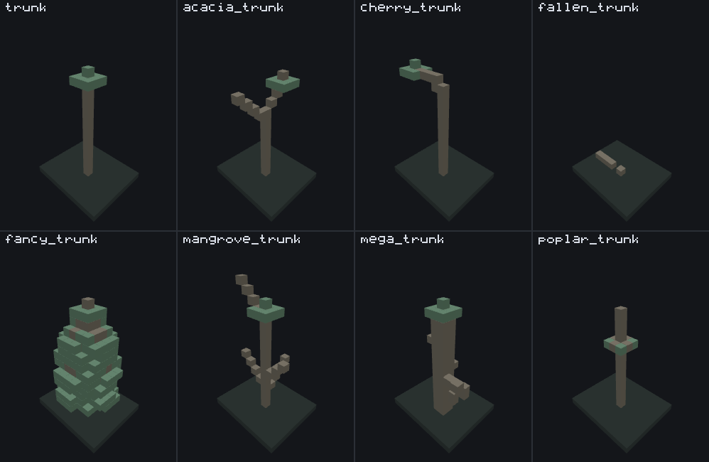

# Tree feature

<VersionBadge><CoverageBadge /></VersionBadge>

**`minecraft:tree_feature` grows a tree at the origin.** You reach for it for anything tree-shaped — a forest's oaks, a savanna's leaning acacias, a swamp's vine-hung trunks, a log lying on a forest floor — and for a good deal that is not a tree at all, because a trunk is a column of blocks and a canopy is a blob of blocks around it.

It is a **Content feature**: it writes blocks itself and never delegates to another feature. The one key that looks like delegation is not — a trunk's `branches.branch_canopy` nests a canopy *shape*, not a feature reference. (Two keys genuinely do delegate: `log_decoration_feature`, on the fallen and poplar trunks.)

What makes it the most configurable type in the system is that it is **not one algorithm**. A tree body names exactly one **trunk key** and exactly one **canopy key**, and *which keys are present is what selects the algorithm* — there is no `"type"` field. Eight trunk shapes, twelve canopy shapes, each with its own field set. You do not need to read all twenty: find the trunk you want in [the trunk table](#the-eight-trunk-keys), the canopy you want in [the canopy table](#the-twelve-canopy-keys), and read those two.

## Start here: a complete example

One file, complete. A leaning acacia trunk that grows a side branch, with a big crown on the trunk and a small one on the branch tip.

```json title="features/acacia_branching_tree.json"
{
  "format_version": "1.21.110",
  "minecraft:tree_feature": {
    "description": { "identifier": "wiki:acacia_branching_tree" },
    "acacia_trunk": {
      "trunk_width": 1,
      "trunk_height": { "base": 5, "intervals": [3, 3], "min_height_for_canopy": 3 },
      "trunk_block": { "name": "minecraft:log2", "states": { "new_log_type": "acacia" } },
      "trunk_lean": {
        "allow_diagonal_growth": true,
        "lean_height": { "range_min": 1, "range_max": 5 },
        "lean_steps": { "range_min": 1, "range_max": 4 }
      },
      "branches": {
        "branch_chance": 100.0,
        "branch_length": { "range_min": 4, "range_max": 6 },
        "branch_position": { "range_min": 1, "range_max": 3 },
        "branch_canopy": {
          "acacia_canopy": {
            "canopy_size": 1,
            "leaf_block": { "name": "minecraft:leaves2", "states": { "new_leaf_type": "acacia" } },
            "simplify_canopy": true
          }
        }
      }
    },
    "acacia_canopy": {
      "canopy_size": 2,
      "leaf_block": { "name": "minecraft:leaves2", "states": { "new_leaf_type": "acacia" } },
      "simplify_canopy": true
    },
    "base_block": ["minecraft:dirt"],
    "may_grow_on": ["minecraft:dirt", "minecraft:grass_block", "minecraft:podzol"],
    "may_replace": ["minecraft:air", "minecraft:leaves2"],
    "may_grow_through": ["minecraft:air", "minecraft:grass", "minecraft:dirt", "minecraft:grass_block"]
  }
}
```

What each choice buys you:

- **`acacia_trunk` and `acacia_canopy`** are the two keys that select the algorithm. Swap `acacia_trunk` for `trunk` and this becomes a straight-column tree without touching anything else; swap `acacia_canopy` for `pine_canopy` and it keeps its lean and grows tiers instead.
- **`trunk_height: { "base": 5, "intervals": [3, 3] }`** samples 5 to 9: a base of 5 plus one random value per entry in `intervals`, each from 0 to that entry minus one. `min_height_for_canopy: 3` means only logs from index 3 upward are offered to the canopy as a place to sit.
- **`branch_chance: 100.0`** is a percent, and 100 always succeeds — which is what makes the two-canopy silhouette reproducible rather than a coin flip.
- **`branch_canopy`** is a whole canopy body nested inside `branches`. It is not a feature reference and it is shaped independently of the tree's own canopy: here it is a `canopy_size: 1` acacia crown against the trunk's `canopy_size: 2`.
- **`may_replace` lists `minecraft:leaves2`** as well as air, so the branch's crown and the trunk's crown may overlap instead of the second one stopping at the first.


```
featurelab generate --pack <pack> --feature wiki:acacia_branching_tree --env plains --seed 3
```

Run against `plains` with feature seed `3`, this writes **47 blocks**: 13 acacia logs and 34 acacia leaves. The trunk leans away from its base; the branch steps diagonally out of it and up; the large canopy sits at the trunk's own top and the small one at the branch tip.

::: tip The branch is not guaranteed to look like this
The branch's direction is random, and one of the four directions it can pick is the trunk's own lean direction — in which case the branch is abandoned and the tree comes out with one crown. `branch_chance: 100` only guarantees the branch is *attempted*. At other seeds it comes out on the opposite side, or not at all.
:::

## Fields

A tree body has three parts: a handful of keys that apply whatever shape you chose, **exactly one trunk key**, and **exactly one canopy key**. Writing none of either, or two of either, is reported rather than resolved — there is no default shape. "Default" below is what the game uses when the key is absent. The long-form account of every key, in the editor's own words, is the [field reference](#field-reference) further down; these tables are the short version.

### The eight trunk keys {#the-eight-trunk-keys}

One picture, eight trees that differ in one key. Every panel grows from the same origin at feature seed `3`, in the same 12×19×10 volume with the same camera, with the same `minecraft:oak_log` and a trunk 15 blocks tall wherever the shape has a height at all. The crown is cut down to a 10-cell marker in every panel, because an ordinary crown hides the thing this figure is about — so what you are looking at is the **log skeleton each trunk key builds**, and where it hands its canopy over.



| Trunk key | What it builds | Reach for it when |
|---|---|---|
| `trunk` | [A plain vertical column](#the-plain-column-trunk), and nothing else: no lean, no branch, no random direction anywhere in it. It is the only trunk that can start *below* its origin — `can_be_submerged` lets it descend through `may_grow_through` cells and grow from the deepest one it reaches. Hands the canopy a single anchor and an **empty** anchor list. | You want an ordinary tree. Vanilla's oak, birch, jungle, spruce, pine and swamp trees are all this key; what makes them look different is the canopy, not the column. |
| `acacia_trunk` | [A column that can lean diagonally](#the-leaning-trunk-acacia_trunk) and grow a side branch that carries its own crown. Despite the name, nothing about it is tied to acacia wood. | You want a tree that is not vertical, or a second crown off to one side. Vanilla's savanna and roofed trees. |
| `cherry_trunk` | A column with long horizontal branches, and a crown **at every branch tip** rather than on the trunk. `tree_type_weights` picks between one branch, two branches, and two branches plus a crowned trunk top. | You want a wide, low, several-lobed crown carried on visible limbs. |
| `fallen_trunk` | [A horizontal log lying on the ground](#the-fallen-log-fallen_trunk) with a short stump at one end. It grows **no canopy at all**. Since 1.26.50.24 the log also drops through and replaces ground cover such as leaf litter instead of failing on it. | You want forest-floor debris. Pair it with `log_decoration_feature` to grow something on each log. |
| `fancy_trunk` | [A scaled column that scatters foliage coordinates around itself](#the-scattered-foliage-trunk-fancy_trunk), grows a canopy at every one of them, and draws a limb out to each. The lumpy multi-lobed big-oak silhouette falls out of those crowns overlapping. | You want a big irregular tree rather than a tidy one. Vanilla's fancy oak. |
| `mangrove_trunk` | A column with branches that step outward and upward, aerial roots (through the separate `mangrove_roots` key) and hanging decoration. | You want stilted, branching, swamp-shaped growth. |
| `mega_trunk` | A wide (`trunk_width` 2 or more) column with branches radiating at random angles, trunk decoration, and an optional `base_cluster` ground patch — the only shape that reads that key. | You want a giant: vanilla's mega jungle and mega spruce. |
| `poplar_trunk` | [A perfectly straight column that never leans](#the-branch-crowned-trunk-poplar_trunk), crowned by a ring of short sideways branch stubs — and its canopy sits a fixed number of cells **below** the top, so the upper trunk spears through the crown. New in 1.26.50.24. | You want a tall narrow tree whose trunk is visible above its leaves. |

### The twelve canopy keys {#the-twelve-canopy-keys}

The trunk decides *where* the canopy goes; the canopy decides what shape it is. Most canopies use only the **last** anchor the trunk collected — the top of the trunk, or the last branch tip.

| Canopy key | Shape | Reach for it when |
|---|---|---|
| `canopy` | [A step pyramid](#the-step-pyramid-canopy): a stack of filled square layers narrowing with height, with the corners optionally rolled away. | You want the ordinary crown. Most of vanilla's trees use this. |
| `acacia_canopy` | Flat, wide octagonal layers — the umbrella silhouette. One size knob, `canopy_size`. | You want a flat, wide top. |
| `pine_canopy` | Tiered rings that shrink and regrow with height. | You want the stepped conifer look. |
| `spruce_canopy` | The same kind of tiering on a different layer schedule, driven by two offsets rather than a height. | You want a conifer whose taper you control from both ends. |
| `fancy_canopy` | A stack of tapered discs. The crown `fancy_trunk` grows at every one of its foliage coordinates. | You are writing a `fancy_trunk`, or you want a small round blob. |
| `roofed_canopy` | A thick slab with a randomized peak, sized from an inner and an outer radius. | You want a dark-forest roof. |
| `mega_canopy` | A wide crown sized from the trunk's own width. | You are writing a `mega_trunk` (or an `acacia_trunk` at width 1). |
| `mega_pine_canopy` | The same, with a radius that steps as it climbs. | You want the mega spruce taper. |
| `mangrove_canopy` | A scattered crown with hanging blocks, built by repeated random placement rather than in layers. Reads the **whole** anchor list. | You want an irregular crown and hanging growth. |
| `cherry_canopy` | A crown placed per branch tip, with holes and hanging leaves. | You are writing a `cherry_trunk`. |
| `random_spread_canopy` | Leaves scattered randomly around several trunk positions rather than in layers. Reads the **whole** anchor list. | You want leaves through the trunk rather than above it. |
| `poplar_canopy` | [A tall rounded crown of stacked diamonds](#the-poplar-crown-poplar_canopy) with a log cross buried inside it. New in 1.26.50.24. | You are writing a `poplar_trunk`. |

::: warning Three pairings grow a bare pole, and one grows a bare log
The anchor list is not filled by every trunk. `trunk` and `cherry_trunk` hand the canopy an **empty** one, and `random_spread_canopy` and `mangrove_canopy` are the only two canopies that read it — they return immediately when it is empty, without placing a leaf. So `trunk` or `cherry_trunk` paired with either of those two grows a **bare pole**. That is engine behaviour, not a bench limit. Pair those two canopies with `acacia_trunk`, `mega_trunk` or `mangrove_trunk`, which push every placed log onto the list.

Two more pairings that surprise people, for different reasons. A **`cherry_trunk` reads its canopy from `cherry_trunk.branches.branch_canopy`**, not from a canopy key on the feature body: a body-level `canopy` on a cherry tree loads without complaint and never grows. And a **`fallen_trunk` grows no canopy under any circumstances** — the key is accepted and never used.
:::

### On the feature body

| Key | Required | Value | Default | What it does |
|---|---|---|---|---|
| *one trunk key* | yes | `trunk` `acacia_trunk` `cherry_trunk` `fallen_trunk` `fancy_trunk` `mangrove_trunk` `mega_trunk` `poplar_trunk` | — | [The table above](#the-eight-trunk-keys). Exactly one. |
| *one canopy key* | yes, except on `fallen_trunk` and `cherry_trunk` | one of the twelve above | — | [The table above](#the-twelve-canopy-keys). Exactly one. A cherry tree writes it inside `branches.branch_canopy` instead. |
| `base_block` | no | block descriptor, or an array of them | absent — no fixup | The cell under the trunk is converted to this list's first entry if it does not already match. An absent or empty list means no fixup at all. |
| `may_grow_on` | no | array of block descriptors | absent — no restriction | The ground the trunk will accept. If the cell below does not match, the tree fails outright. |
| `may_replace` | no | array of block descriptors | absent — no restriction | The cells a log or a leaf may overwrite. This is the gate on every trunk cell at or above the origin, and on every canopy cell. |
| `may_grow_through` | no | array of block descriptors | absent — no restriction | The cells the trunk may pass through **below** its own origin. Only the plain [`trunk`](#the-plain-column-trunk) ever has cells below its origin, and only when `can_be_submerged` is set — everywhere else this key is read, accepted and never consulted. See [what the bench does differently](#what-the-bench-does-differently). |
| `base_cluster` | no | object — the next table | absent — no patch | A ground-level patch of replaced blocks. Read by `mega_trunk` and nothing else. |
| `mangrove_roots` | no | object — the table below | absent — no roots | The aerial-root pass. It is a **sibling of the trunk key, not part of `mangrove_trunk`**, and it runs for every trunk shape — see [`mangrove_roots` decides where the trunk starts](#mangrove-roots-pass). |

#### `base_cluster` {#fields-base_cluster}

The whole object is optional; all three keys are required once it is there.

| Key | Required | Value | What it does |
|---|---|---|---|
| `may_replace` | yes | array of block descriptors | Which ground cells the patch may overwrite. Its own list, not the tree's. |
| `num_clusters` | yes | integer ≥ 0 | How many patches to lay. |
| `cluster_radius` | yes | integer ≥ 0 | How wide each one is. |

#### `mangrove_roots` {#fields-mangrove_roots}

| Key | Required | Value | Default | What it does |
|---|---|---|---|---|
| `max_root_width` | yes | integer ≥ 0 | — | How far the root spread may reach horizontally. |
| `max_root_length` | yes | integer ≥ 0 | — | How far a single root may run. |
| `y_offset` | yes | range | — | How far above or below the origin the root pass starts. |
| `root_block` | yes | block descriptor | — | The root block in ordinary ground. |
| `muddy_root_block` | yes | block descriptor | — | The root block where it runs through `mud_block`. |
| `mud_block` | yes | block descriptor | — | The block that counts as mud for the rule above. |
| `roots_may_grow_through` | yes | array of block descriptors | — | The roots' own pass-through list. Unlike `may_grow_through`, this one is consulted on every trunk shape. |
| `above_root` | no | object | absent — nothing on top | What to put on top of a root. |
| `above_root.above_root_chance` | no | percent, or `{numerator, denominator}` | absent — never placed | How often to place it. |
| `above_root.above_root_block` | no | block descriptor | absent | What to place. |
| `root_decoration` | no | a decoration object | absent — roots left bare | Attached to the sides of roots, the same shape as `trunk_decoration`. |

### `trunk` {#fields-trunk}

| Key | Required | Value | Default | What it does |
|---|---|---|---|---|
| `trunk_block` | yes | block descriptor | — | The log. |
| `trunk_height` | yes | range | — | How tall the column is. A range, and its **maximum is exclusive**: `{7, 9}` gives 7 or 8, never 9. |
| `height_modifier` | no | range | `{0, 0}` — no effect | Added to the sampled height. A combined height below 1 fails the tree. |
| `can_be_submerged` | no | `true`, `false`, or `{ "max_depth": n }` | absent — depth 0, no descent | How deep the column may descend below its origin before growing. `true` means 255; `{ "max_depth": n }` means `n`; absent or `false` means no descent at all. |
| `can_be_submerged.max_depth` | yes, inside the object | integer | — | The depth, when the object spelling is used. |
| `trunk_decoration` | no | object — [the shared table](#fields-trunk_decoration) | absent | Blocks attached to the sides of logs. On this key **all four** horizontal sides of every log are eligible. |

### `acacia_trunk` {#fields-acacia_trunk}

| Key | Required | Value | Default | What it does |
|---|---|---|---|---|
| `trunk_block` | yes | block descriptor | — | The log. |
| `trunk_width` | yes | integer ≥ 1 | — | The footprint is `trunk_width` × `trunk_width`. |
| `trunk_height` | yes | object | — | Not a range on this key — an object with the three sub-keys below. |
| `trunk_height.base` | yes | integer | — | The floor of the height. |
| `trunk_height.intervals` | no | array of integers | `[]` — the height is exactly `base` | One random addition per entry, each from 0 to that entry minus one. `[3, 3]` on a base of 5 samples 5 to 9. |
| `trunk_height.min_height_for_canopy` | no | integer | `3` | Only logs at or above this index are offered to the canopy as an anchor. It never changes which logs are placed — see [`min_height_for_canopy`](#min-height-for-canopy). |
| `trunk_lean` | yes | object | — | Required, even for a tree you do not want to lean. |
| `trunk_lean.allow_diagonal_growth` | **yes** | boolean | — | Picks which of [the two branch routines](#the-two-branch-routines) runs. It has a default of `true` behind it, but the default only applies to a tree with no `trunk_lean` at all, and `trunk_lean` is itself required — so leaving it out is a load error, not a silent fallback. |
| `trunk_lean.lean_height` | yes | range | — | Where the lean starts, **measured down from the crown** — see [`lean_height` is measured from the top](#lean-height-is-measured-from-the-top). |
| `trunk_lean.lean_steps` | yes | range | — | The most cells the column may shift sideways. |
| `trunk_lean.lean_length` | no | range | `{0, 0}` — no effect | Extra loop iterations past the top of the trunk. They march sideways at the top log's level: a horizontal run at the crown, **not** a taller tree. |
| `branches` | no | object — the next rows | absent — no branch is grown | Optional as a whole; all three of its own range keys are required once it is present. |
| `branches.branch_length` | **yes** | range | — | Diagonal steps (`allow_diagonal_growth: true`) or column cells (`false`). |
| `branches.branch_position` | **yes** | range | — | Offset from the lean start (diagonal) or below the canopy anchor (sweep). |
| `branches.branch_chance` | **yes** | percent, or `{numerator, denominator}` | — | Whether a branch is grown. A number is a percentage; 100 or more always succeeds, 0 or less always fails. |
| `branches.branch_canopy` | no | object with exactly one canopy key | absent — bare branch tips | A whole canopy body, grown at the branch tip, always sized as a 1×1 branch whatever `trunk_width` says. |
| `trunk_decoration` | no | object — [the shared table](#fields-trunk_decoration) | absent | On this key only the sides facing **out** of the footprint are eligible. |

### `cherry_trunk` {#fields-cherry_trunk}

| Key | Required | Value | Default | What it does |
|---|---|---|---|---|
| `trunk_block` | yes | block descriptor | — | The log. Branch logs are laid on their side. |
| `trunk_height` | yes | object | — | Spelled as `acacia_trunk`'s — `base` and `intervals`, no `min_height_for_canopy` — but sampled one wider; see the next row. |
| `trunk_height.base` | yes | integer ≥ 2 | — | The floor of the height. |
| `trunk_height.intervals` | no | array of integers | `[]` — the height is exactly `base` | One random addition per entry, each from 0 to that entry **inclusive** — not to one below it, as `acacia_trunk`'s is. `[2]` on a base of 5 samples 5, 6 or 7. |
| `branches` | **yes** | object | — | Required on this key: a cherry tree *is* its branches. |
| `branches.tree_type_weights` | no | object | absent — always the single-branch shape | A weighted pick between the three shapes below. |
| `branches.tree_type_weights.one_branch` | yes, inside the object | integer ≥ 0 | — | Weight for one branch. |
| `branches.tree_type_weights.two_branches` | yes, inside the object | integer ≥ 0 | — | Weight for two branches in opposite directions. |
| `branches.tree_type_weights.two_branches_and_trunk` | yes, inside the object | integer ≥ 0 | — | Weight for two branches *and* a crown on the trunk top. |
| `branches.branch_horizontal_length` | **yes** | range, minimum 2 — maximum **inclusive** | — | How far out a branch reaches. |
| `branches.branch_start_offset_from_top` | **yes** | range, maximum 0 — maximum **inclusive** | — | Where on the trunk a branch starts, counted down from the top. |
| `branches.branch_end_offset_from_top` | **yes** | range — maximum **inclusive** | — | What height the branch tip ends at, counted from the top. |
| `branches.branch_canopy` | no | object with exactly one canopy key | absent — bare tips | **This is where a cherry tree's canopy goes.** Grown once at every branch tip. |

### `fallen_trunk` {#fields-fallen_trunk}

| Key | Required | Value | Default | What it does |
|---|---|---|---|---|
| `trunk_block` | yes | block descriptor | — | The log, laid on its side along the direction it fell. |
| `log_length` | yes | range | — | The nominal length. The log itself comes out `log_length` minus two blocks long. |
| `height_modifier` | no | range | `{0, 0}` — no effect | Added to the length. |
| `stump_height` | no | range | `{1, 1}` — a single block | How tall the upright stump at the near end is. |
| `log_decoration_feature` | no | feature identifier | absent | Another feature, run once at every log of the fallen log — never at the stump. Drawn as a connection in the node editor rather than as a form field. |
| `trunk_decoration` | no | object — [the shared table](#fields-trunk_decoration) | absent | Applied to the stump column. |

### `fancy_trunk` {#fields-fancy_trunk}

Every key here is required, including `branches` and all three of its own — the opposite of `acacia_trunk`, where the whole object is optional.

| Key | Required | Value | What it does |
|---|---|---|---|
| `trunk_block` | yes | block descriptor | Used for the trunk columns and the limbs alike. |
| `trunk_width` | yes | integer ≥ 1 | The trunk is drawn as `trunk_width²` vertical columns. |
| `trunk_height.base` | yes | integer | The floor of the height. |
| `trunk_height.variance` | yes | integer ≥ 1 | The height is `base` plus a random value from 0 to `variance` minus one. Vanilla's oak samples 5 to 16, so the same file yields anything from a shrub to a full canopy tree. |
| `trunk_height.scale` | yes | number | The fraction of the sampled height the trunk actually reaches, capped at `height - 1`. This is why **foliage routinely sits above the highest log**. |
| `width_scale` | yes | number | Multiplies each level's radius: how far the foliage coordinates spread horizontally. |
| `foliage_altitude_factor` | yes | number | Levels below `height ×` this get no coordinates at all. |
| `branches.slope` | yes | number | Drops each limb's attachment point down the trunk in proportion to how far out its coordinate sits. |
| `branches.density` | yes | number | Scales how many coordinates are attempted per level. |
| `branches.min_altitude_factor` | yes | number | A coordinate whose attachment height is below `height ×` this keeps its canopy but grows no limb. |

### `mangrove_trunk` {#fields-mangrove_trunk}

| Key | Required | Value | Default | What it does |
|---|---|---|---|---|
| `trunk_block` | yes | block descriptor | — | The log. |
| `trunk_width` | no | integer | absent | **Accepted and never read** on this shape. The mangrove column is always one block across whatever this says. |
| `trunk_height` | yes | object | — | An object, not a range. |
| `trunk_height.base` | yes | integer | — | The floor of the height. |
| `trunk_height.height_rand_a` | yes | integer ≥ 0 | — | One random addition, 0 to `height_rand_a` minus one. |
| `trunk_height.height_rand_b` | yes | integer ≥ 0 | — | A second one. |
| `branches` | no | object | absent — `branch_length` and `branch_steps` both `{0, 0}` | The branch pass runs either way; with the defaults it grows nothing. |
| `branches.branch_length` | no | range — maximum **inclusive** | `{0, 0}` | How far a branch reaches. Drawn **twice** per branch; see [the draw table](#random-draws). |
| `branches.branch_steps` | no | range — maximum **inclusive** | `{0, 0}` | How many steps it climbs on the way. |
| `branches.branch_chance` | no | percent, or `{numerator, denominator}` | absent | Whether each branch is grown. |
| `trunk_decoration` | no | object — [the shared table](#fields-trunk_decoration) | absent | All four sides eligible. |

### `mega_trunk` {#fields-mega_trunk}

| Key | Required | Value | Default | What it does |
|---|---|---|---|---|
| `trunk_block` | yes | block descriptor | — | The log. |
| `trunk_width` | yes | integer ≥ 1 | — | 2 for vanilla's mega trees. The footprint is `trunk_width` × `trunk_width`. |
| `trunk_height` | yes | object | — | `base` and `intervals`, as `acacia_trunk`'s. |
| `trunk_height.base` | yes | integer | — | The floor of the height. |
| `trunk_height.intervals` | no | array of integers | `[]` — exactly `base` | One random addition per entry. |
| `branches` | no | object | absent — a bare column | Optional as a whole; every key below is required once it is present. |
| `branches.branch_length` | **yes** | integer | — | How many logs long each branch is. **Not** a range — a plain integer. |
| `branches.branch_slope` | **yes** | number | — | Vertical change per step. **May be negative, and a negative value moves where the branch begins** — see [the warning](#negative-branch-slope). |
| `branches.branch_interval` | **yes** | range | — | The vertical gap between successive branch levels. |
| `branches.branch_altitude_factor` | **yes** | object with `min` and `max` | — | The band of the trunk's height branches may start in, as fractions. `min`/`max` only — **not** a range, the same trap [`canopy_offset`](#canopy-offset-is-not-a-range) has. |
| `branches.branch_altitude_factor.min` | yes | number | — | The bottom of the band. |
| `branches.branch_altitude_factor.max` | yes | number | — | The top of the band. |
| `branches.branch_canopy` | no | object with exactly one canopy key | absent — bare tips | A whole canopy body, grown at each branch's tip. |
| `trunk_decoration` | no | object — [the shared table](#fields-trunk_decoration) | absent | Vines and moss on the column. |

### `poplar_trunk` {#fields-poplar_trunk}

New in 1.26.50.24; earlier builds reject the key.

| Key | Required | Value | Default | What it does |
|---|---|---|---|---|
| `trunk_block` | yes | block descriptor | — | The log. The branch stubs use the same block on its side. |
| `trunk_height` | yes | range | `{7, 9}` — **maximum exclusive**, so 7 or 8 | How tall the column is. |
| `remaining_trunk_height_above_branches` | no | range | `{4, 4}` — maximum **inclusive** | How many trunk cells continue up *through* the canopy. The branch ring sits at `height - remaining - 1` and the canopy one cell above it. |
| `amount_of_foliage_support_branches` | no | range | `{1, 4}` — maximum **inclusive** | How many of the four cardinal directions get a stub. There are only four directions, so a value above 4 adds nothing. |
| `log_decoration_feature` | no | feature identifier | absent | Another feature, run at **every** cell of the column — including a cell whose own log was refused. Drawn as a connection in the node editor. |
| `trunk_decoration` | no | object — [the shared table](#fields-trunk_decoration) | absent | All four sides eligible, on the stubs as well as the column. |

### `trunk_decoration` {#fields-trunk_decoration}

A per-trunk key rather than a shared one, but it behaves the same wherever it appears. `trunk`, `acacia_trunk`, `mega_trunk`, `mangrove_trunk`, `fallen_trunk` and `poplar_trunk` accept it; `fancy_trunk` and `cherry_trunk` do not. It is how vanilla's vine-covered oak, spruce, jungle and roofed trees get their vines.

| Key | Required | Value | Default | What it does |
|---|---|---|---|---|
| `decoration_block` | no | block descriptor | absent | The single block to attach. Write this **or** `decoration_blocks_sequence`, not both — a sequence wins and this is ignored. |
| `decoration_blocks_sequence` | no | array of `{ "block": …, "count": range }` | absent | Ordered runs placed one after another from the same running position, which is what lets a sequence spell "two of A, then B". Each run stops at the first cell that is not air. |
| `decoration_blocks_sequence.block` | yes, per entry | block descriptor | — | That run's block. |
| `decoration_blocks_sequence.count` | no, per entry | range — maximum **inclusive** | `{1, 1}` | How many of it. `{1, 3}` really does reach 3. |
| `decoration_chance` | no | percent, or `{numerator, denominator}` | `0` — decorates nothing | Rolled once per eligible side of every placed log. |
| `decoration_chance.numerator` | yes, inside the object | integer | — | The fraction's top. |
| `decoration_chance.denominator` | yes, inside the object | integer | — | The fraction's bottom. |
| `num_steps` | no | integer | absent | **Accepted and never read** on a trunk decoration. The run length comes from each sequence entry's own `count`. |
| `step_direction` | no | `down` `up` `out` `away` | `down` | Which way a run longer than one block stacks. `out` and `away` are the same value spelled two ways: away from the log, in the direction that chose the cell. Mind the default — it is `down`, not outward. Only visible on a run longer than one block. |

Which sides are eligible differs by shape. `trunk`, `mangrove_trunk` and `poplar_trunk` enable all four horizontal sides on every log. `acacia_trunk` enables only the sides facing outward from its own footprint, and it evaluates the −X and −Z edges first: at `trunk_width` 1, where a cell is simultaneously on every edge, only the −X and −Z sides are decorated.

### `canopy` {#fields-canopy}

| Key | Required | Value | Default | What it does |
|---|---|---|---|---|
| `leaf_block` | yes | block descriptor | — | The leaf. |
| `canopy_offset` | yes | object with `min` and `max` | — | Which layers to build, relative to the anchor. A negative `min` puts layers *below* it. **Not a range** — see [the warning](#canopy-offset-is-not-a-range). |
| `canopy_offset.min` | yes | integer | — | The lowest layer. |
| `canopy_offset.max` | yes | integer | — | The highest layer. |
| `min_width` | no | integer | `0` | Widens every layer at once. |
| `canopy_slope` | no | object with `rise` and `run` | `{ "rise": 1, "run": 1 }` | How fast the layers taper. |
| `canopy_slope.rise` | no | integer | `1` | The numerator. |
| `canopy_slope.run` | no | integer | `1` | The denominator; must be non-zero. |
| `variation_chance` | no | a percent, a `{numerator, denominator}`, or an **array with exactly one entry per layer** | absent — no corner removed | The chance to leave out each of a layer's four corners, which is what rounds the square off. An array is ordered from `canopy_offset.min` upward, and one of the wrong length is refused. See [the corner rule](#the-step-pyramid-canopy). |
| `canopy_decoration` | no | object — the next rows | absent — nothing hangs | Hangs a run of blocks off the crown. |
| `canopy_decoration.decoration_block` | **yes** | block descriptor | — | What hangs. |
| `canopy_decoration.decoration_chance` | **yes** | percent, or `{numerator, denominator}` | — | Rolled once per horizontal neighbour of every leaf placed. |
| `canopy_decoration.num_steps` | **yes** | range — maximum **inclusive** | — | How many cells a run is. Unlike `trunk_decoration`'s `num_steps`, this one **is** read. The run stops at the first cell that is not air. |
| `canopy_decoration.step_direction` | **yes** | `down` | — | Which way the run grows. Only `down` is accepted — see [what the bench does differently](#what-the-bench-does-differently). |

### The other eleven canopies

| Canopy | Key | Required | Value | Default | What it does |
|---|---|---|---|---|---|
| `acacia_canopy` | `leaf_block` | yes | block descriptor | — | The block both layers of the crown are built from. |
| | `canopy_size` | yes | integer | — | The half-width of the lower ring: the one size knob this crown has. |
| | `simplify_canopy` | no | boolean | `false` | Replaces the upper layer's four protruding arms with a plain square. |
| `pine_canopy` | `leaf_block` | yes | block descriptor | — | The leaf. |
| | `canopy_height` | yes | range | — | How tall the cone is, sampled per tree. |
| | `base_radius` | yes | integer | — | The half-width the cone is allowed to reach at its widest. |
| `spruce_canopy` | `leaf_block` | yes | block descriptor | — | The leaf. |
| | `lower_offset` | yes | range | — | How far **below** the trunk top the crown reaches, sampled per tree. |
| | `upper_offset` | yes | range | — | How far **above** the trunk top it starts. The crown is built downward from there. |
| | `max_radius` | yes | range | — | The widest a band may get before it snaps back. |
| `fancy_canopy` | `leaf_block` | yes | block descriptor | — | The leaf. |
| | `height` | yes | integer ≥ 0 | — | How many discs are stacked. |
| | `radius` | yes | integer ≥ 1 | — | The half-width of the middle discs; the top and bottom ones are a cell narrower. |
| `roofed_canopy` | `leaf_block` | yes | block descriptor | — | The floor, the filling and the roof are all this block. |
| | `canopy_height` | yes | integer ≥ 0 | — | How far above the anchor the roof sits, and so how many layers fill the gap. |
| | `core_width` | yes | integer | — | The trunk width this crown is built around. **Must match it** — the feature is refused when it does not. |
| | `outer_radius` | yes | integer ≥ -1 | — | The half-width of the floor and the roof. |
| | `inner_radius` | yes | integer ≥ 0 | — | The half-width of the solid block of leaves stacked between them. |
| `mega_canopy` | `leaf_block` | yes | block descriptor | — | Every layer of the cone. |
| | `canopy_height` | yes | range | — | How many layers the cone has, sampled per tree. |
| | `base_radius` | no | integer ≥ 0 | `2` | The half-width of the **narrowest** layer, at the very top. Every layer below widens by one from here, so this sets the whole cone. |
| | `core_width` | yes | integer | — | **Must match the trunk's width.** At a branch tip the trunk is always one block wide, so a crown grown there needs `1`. |
| | `simplify_canopy` | no | boolean | `false` | Uses a strict circle for each layer instead of a relaxed one. |
| `mega_pine_canopy` | `leaf_block` | yes | block descriptor | — | Every layer of the cone. |
| | `canopy_height` | yes | range | — | How many layers, sampled per tree. |
| | `base_radius` | no | integer ≥ 0 | `2` | The half-width of the topmost layer. |
| | `radius_step_modifier` | no | number | `3.5` | How fast the cone widens going down. Larger means a wider, blunter cone. |
| | `core_width` | yes | integer | — | **Must match the trunk's width.** |
| `mangrove_canopy` | `canopy_height` | yes | range | — | How far up and down a scattered leaf may land, sampled once for the whole crown. |
| | `canopy_radius` | yes | range | — | How far sideways it may land. |
| | `leaf_placement_attempts` | yes | integer ≥ 0 | — | How many leaves are attempted **around each trunk log**. Attempts, not leaves — which is why this canopy needs a trunk that fills the anchor list. |
| | `leaf_blocks` | yes | weighted block list | — | The blocks the scattered leaves are picked from, with weights. |
| | `hanging_block` | yes | block descriptor | — | Hung beneath the crown — propagules, in vanilla. |
| | `hanging_block_placement_chance` | yes | percent, or `{numerator, denominator}` | — | The chance any one candidate position below the crown gets one. |
| | `canopy_decoration` | no | object | absent | Attaches a block to the sides of the hanging positions. The same shape as [`canopy`'s](#fields-canopy), except that `decoration_block` is optional when `decoration_blocks_sequence` supplies one, and its `num_steps` is accepted and ignored. |
| `cherry_canopy` | `leaf_block` | yes | block descriptor | — | The crown and its hanging fringe. |
| | `height` | yes | range, minimum 4 — maximum **inclusive** | — | How tall the crown is, sampled per crown. |
| | `radius` | yes | range, minimum 3 — maximum **inclusive** | — | How wide it is. |
| | `trunk_width` | no | integer, exactly `1` | `1` | The footprint the crown is built around. **Must be 1**: every trunk that can carry this crown hands it a one-block footprint, and any other value is refused. |
| | `wide_bottom_layer_hole_chance` | yes | percent, or `{numerator, denominator}` | — | The chance of a hole in the outer edge of the widest bottom layer. |
| | `corner_hole_chance` | yes | percent, or `{numerator, denominator}` | — | The chance of leaving out a layer's corner cell. |
| | `hanging_leaves_chance` | yes | percent, or `{numerator, denominator}` | — | The chance of trailing a leaf one cell below the crown's bottom edge. |
| | `hanging_leaves_extension_chance` | yes | percent, or `{numerator, denominator}` | — | The chance of extending that trail by a second cell. |
| `random_spread_canopy` | `canopy_height` | yes | range | — | How far up and down a scattered leaf may land, sampled once for the whole crown. |
| | `canopy_radius` | yes | range | — | How far sideways. |
| | `leaf_placement_attempts` | yes | integer ≥ 0 | — | How many leaves are attempted around **each trunk log**. |
| | `leaf_blocks` | yes | weighted block list | — | The blocks the scattered leaves are picked from, with weights. |
| `poplar_canopy` | `leaf_block` | yes | block descriptor | — | The leaf. |
| | `branch_block` | yes | block descriptor | — | The log the buried cross is made of. Unused below a `radius` `value` of 5. |
| | `radius` | yes | non-empty array of `{value, weight}` entries, spelled `{ "value": n, "weight": m }` | — | The crown widths to choose between. The working radius is the picked `value - 1`. |
| | `radius.value` | yes, per entry | integer | — | The width. |
| | `radius.weight` | no, per entry | integer | `1` | Its share of the pick. |
| | `height` | yes | range | `{5, 6}` — maximum **inclusive** | How tall the crown is. |
| | `side_hole_chance` | no | number 0 to 1 | `0.0` | Rolled on every crown cell; a success shrinks that one cell's effective radius by 1, pitting the surface. |
| | `trunk_width` | no | integer | `1` | A consistency check only. It does not change the crown's geometry for any trunk this canopy can currently be paired with. |


### How a range is written {#how-a-range-is-written}

Wherever a key above says **range** — the kind the editor's own catalogue calls `range`, and which older notes call an `IntRange` — four spellings are accepted: `{ "range_min": a, "range_max": b }`, `{ "min": a, "max": b }`, `[a, b]`, or a bare number. The sampled value is uniform over **`[min, max)`** — the maximum is **exclusive** — on most keys. **Thirteen keys are the exception and sample inclusive of their maximum**, and they are not all new ones:

- `trunk_decoration.decoration_blocks_sequence[].count`, and `canopy_decoration.num_steps`, wherever either appears.
- Every range a **cherry tree** has: `cherry_trunk.trunk_height.intervals` (each entry adds 0 to *that entry*, not 0 to one below it, which is where it parts company with `acacia_trunk`'s identically-spelled key), `branches.branch_start_offset_from_top`, `branches.branch_end_offset_from_top`, `branches.branch_horizontal_length`, and both of `cherry_canopy`'s, `height` and `radius`.
- `mangrove_trunk.branches.branch_length` and `branches.branch_steps`.
- `poplar_trunk`'s `remaining_trunk_height_above_branches` and `amount_of_foliage_support_branches`, and `poplar_canopy`'s `height`.

Everything else is exclusive: `trunk_height` on the other seven trunks, `height_modifier`, `log_length`, `stump_height`, the three `trunk_lean` ranges, `acacia_trunk`'s and `mega_trunk`'s branch ranges, `mangrove_roots.y_offset`, and every other canopy's own ranges. Mixing the two conventions in one file is easy to get wrong: `{ "range_min": 4, "range_max": 6 }` is 4 or 5 on an exclusive key and 4, 5 or 6 on an inclusive one.

Two object keys look like ranges and are not: `canopy_offset` and `mega_trunk`'s `branch_altitude_factor` take `min`/`max` and **only** `min`/`max`.

## Common mistakes

| You wrote | What happens | Do instead |
|---|---|---|
| `canopy` on the feature body of a `cherry_trunk` tree | The file loads and the crown never appears. A cherry tree reads its canopy from `cherry_trunk.branches.branch_canopy`. | Move the whole canopy body inside `branches.branch_canopy`. |
| A canopy key on a `fallen_trunk` tree | Accepted, and never grown. A fallen trunk has no crown. | Nothing to fix — reach for `log_decoration_feature` if you want something on the logs. |
| `trunk` or `cherry_trunk` paired with `random_spread_canopy` or `mangrove_canopy` | A bare pole: those two canopies read the anchor list, and those two trunks hand them an empty one. | Pair them with `acacia_trunk`, `mega_trunk` or `mangrove_trunk`. |
| `"trunk_height": { "range_min": 7, "range_max": 9 }` expecting 9 to be possible | The maximum is exclusive: 7 or 8. | `{ "range_min": 7, "range_max": 10 }`. |
| `"canopy_offset": { "range_min": -3, "range_max": 0 }` | `canopy_offset` is not a range. The `min`/`max` spelling is the only one it takes. | `{ "min": -3, "max": 0 }`. |
| `"branch_altitude_factor": [0.6, 0.8]` | The same trap on `mega_trunk`. | `{ "min": 0.6, "max": 0.8 }`. |
| `"lean_height": { "range_min": 1, "range_max": 2 }` meaning "lean only near the ground" | `lean_height` is measured **down from the crown**, so 1 leans almost the whole trunk. | A value near the sampled height leans almost none of it. |
| `"branch_slope": -1.0` meaning "tilt the branch down" | The branch still **ends** at its own level; a negative slope moves its **start** upward, three blocks for every step of length. | Use a positive slope for a branch that rises to its level, and read [the table](#negative-branch-slope) before choosing a negative one. |
| `acacia_trunk.trunk_lean` without `allow_diagonal_growth` | A load error. The field's default only applies to a tree with no `trunk_lean` at all, and `trunk_lean` is required. | Write it out. It changes the branch geometry completely, so it is worth stating anyway. |
| `"branches": { "branch_chance": 50 }` on an `acacia_trunk` | A load error: once `branches` is present, `branch_length`, `branch_position` and `branch_chance` are **all** required. | Write all three, or leave `branches` out entirely. |
| `"min_height_for_canopy": 6` on a trunk that can sample a height of 5 | Some trees come out as bare trunks: no log qualifies as an anchor, so the canopy is handed an unset one and does not appear. | Keep it below the smallest height `trunk_height` can sample. |
| `"radius": [{ "value": 3 }]` on a `poplar_canopy` expecting radius-3 layers | The working radius is `value` minus one, so that is a radius-2 crown — and below a `value` of 5 the buried log cross disappears and `branch_block` goes unused. | Write `{ "value": 4 }` for radius 3. |
| `"variation_chance": [a, b, c]` on a four-layer `canopy` | Refused: an array needs exactly one entry per layer. | Count the layers — `canopy_offset.max - canopy_offset.min + 1` — or write a single chance for all of them. |
| `mangrove_roots` written inside `mangrove_trunk` | Not a key there. It is a sibling of the trunk key. | Write it on the feature body — and know that it then runs for whatever trunk you chose. |
| `"num_steps": 3` inside a `trunk_decoration` | Accepted and never read. The run length comes from each sequence entry's `count`. | Write `decoration_blocks_sequence` with a `count`. |
| `may_grow_through` on any trunk but the plain one, expecting a trunk to push through undergrowth | Above the origin, every trunk is gated on `may_replace` alone; `may_grow_through` only ever applies below the origin, which only the plain `trunk` with `can_be_submerged` has. | Add the blocks to `may_replace` instead. |
| Two trunk keys, or two canopy keys, in one body | Reported, not resolved. There is no precedence between them. | Exactly one of each. |

## How it runs

Every trunk shape has its own order, and the three that are worth walking through are [below](#the-plain-column-trunk). What they share is this skeleton:

1. **The height is settled first**, before anything is checked. That matters because a tree that fails its ground check has already committed to a height.
2. **If `mangrove_roots` is configured, the root pass runs** — for *any* trunk shape. The position it returns replaces the origin, so the roots decide where the trunk starts. If the root pass fails, the whole feature fails: no trunk, no canopy, nothing placed.
3. **The ground is checked** at that position, against `may_grow_on`, and the trunk is checked against the build height. Either failing ends the tree.
4. **The trunk places its logs**, one shape's worth. Every cell at or above the origin is gated on `may_replace`; a cell below the origin — only the plain `trunk` with `can_be_submerged` ever has one — is gated on `may_grow_through`. Each placed log offers its sides to `trunk_decoration`, and qualifies as a **canopy anchor** if it is at or above `min_height_for_canopy`.
5. **The canopy grows, once per anchor.** Most trunks collect one anchor; `cherry_trunk` collects one per branch tip, and the two anchor-reading canopies use the whole list.
6. **The ground under the trunk is converted to `base_block`**, if it does not already match — and this happens *after* the canopy, not before.

## The plain column (`trunk`) {#the-plain-column-trunk}

`trunk` is the simplest shape and the one most of vanilla's own trees are built from — oak, birch, jungle, spruce, pine and swamp trees all use this key. It grows a **straight vertical column** and nothing else. What makes those trees look different from one another is the canopy paired with the column, not the column.

It is also the only trunk that can start *below* the origin it was handed. In order:

1. **The height is sampled** from `trunk_height`, with the usual exclusive maximum.
2. **The descent** (`can_be_submerged`). The cell below the origin is tested against `may_grow_through`. While it passes and the depth budget allows, the trunk steps one cell further down, and the deepest passing cell becomes the position it grows from. If the very first probe fails, nothing moves.
3. **The ground check**, at the *descended* position rather than the original one. The tree fails here if the trunk would not fit under the build height, or if the cell below does not match `may_grow_on`.
4. **`height_modifier`** is added to the sampled height. A combined height below 1 fails the tree.
5. **The column loop.** One log per cell, straight up from the descended position. Cells **below the original origin** — the ones the descent walked past — are gated on `may_grow_through`; cells at or above it are gated on `may_replace`. `trunk_decoration` is offered **all four** horizontal sides of every placed log.
6. **The canopy**, placed once, one cell **above** the topmost log that was actually placed — not on it — with an empty anchor list.
7. **The ground fixup.** Only now, after the canopy, is the cell under the descended position compared against `base_block`.

::: note The descent is what gives `may_grow_through` teeth
It is the only thing that does. Without `can_be_submerged`, every cell of the column is at or above the origin and gated on `may_replace` alone, so the field is read, accepted, and never consulted. Vanilla's own oak, birch and spruce all write `may_grow_through` in exactly that inert position.

The dependency does not run the other way. Vanilla's swamp tree sets `can_be_submerged` and writes **no** `may_grow_through` at all — and an absent or empty list means "no restriction", so its descent steps down through whatever happens to be under it.
:::

Here is the shape at its plainest, committed as [`fixtures/features/tree_plain_trunk.json`](https://github.com/stirante/featurelab/blob/main/docs/wiki/tools/fixtures/features/tree_plain_trunk.json):


```
featurelab generate --pack <pack> --feature wiki:plain_trunk_tree --env plains --seed 3
```

Twelve logs, dead straight, and 97 blocks in total: 12 logs, 68 leaves, 17 vines. The crown's widest layer sits two cells below the topmost log, so the last two logs run up through it. The vines are `trunk_decoration` at a 1-in-3 chance rolled against all four sides of every log.

The definition sets `can_be_submerged` to `{ "max_depth": 1 }` and lists `minecraft:grass_block` under `may_grow_through`, so the descent takes one step: the bottom log is at world Y **62**, one below the requested origin of 63, and it replaced the grass block that was there rather than standing on it. Drop `minecraft:grass_block` from `may_grow_through` and the whole trunk moves back up a cell — the probe fails, the descent never happens, and Y 62 gets a `base_block` conversion instead of a log.

## The step pyramid (`canopy`) {#the-step-pyramid-canopy}

`canopy` is the matching default crown, and the one most of vanilla's trees use: a stack of filled square layers, widest at the bottom, narrowing with height. Each layer's half-width comes from one formula:

```
radius = slope(canopy_offset.max) + min_width - slope(dy)
slope(d) = truncate(canopy_slope.rise * d / canopy_slope.run)
```

`dy` runs from `canopy_offset.min` to `canopy_offset.max` and is measured from the anchor the trunk handed over, so a negative `min` puts layers *below* it. With the default 1:1 slope, `min_width` 0 and `canopy_offset` `{ "min": -3, "max": 0 }`, that is radii 3, 2, 1 and 0 from the bottom up — the familiar oak crown. `min_width` widens every layer at once; `canopy_slope` changes how fast they taper.

`variation_chance` is the only part of this canopy that is random at all, and it applies to **corners only** — a cell where `|dx|` and `|dz|` both equal that layer's radius. There are four such cells per layer, each rolled once, and a successful roll leaves that corner out, which is what rounds the square off. The value is either one chance shared by every layer, or an array with one entry per layer, ordered from `canopy_offset.min` upward.

::: note A one-cell layer is four corners at once
The corner test is **not** guarded against a radius of 0. On a one-cell layer, `|dx|` and `|dz|` are both zero and both equal the radius, so that single cell *is* a corner and gets rolled — and a chance that always succeeds deletes the layer outright. Vanilla's own oaks end their `variation_chance` array with `{ "numerator": 1, "denominator": 1 }` on exactly that layer, so the crown is capped by the square below it rather than by one leaf poking out of the top. The plain-trunk example above does the same: its top layer is gone, which is why its leaves stop one cell below where the geometry would put them.
:::

`canopy_decoration` hangs a block off the crown. Each leaf the canopy places rolls `decoration_chance` once per horizontal neighbour; a successful roll on a neighbour that is air takes `num_steps` (inclusive of its maximum) and writes that many cells straight **down** from it, stopping at the first cell that is not air. It is how vanilla's swamp oak gets its hanging vines.

### `canopy_offset` is not a range {#canopy-offset-is-not-a-range}

::: warning It looks like a range and it is not
It is a plain object with `min` and `max` members, spelled that way and only that way — the `range_min`/`range_max` and `[a, b]` spellings [the range keys](#how-a-range-is-written) accept do not apply to it. `mega_trunk`'s `branch_altitude_factor` is the same kind of field. Both spellings turn up in the same vanilla definition, each on the field that wants it: vanilla's mega jungle tree writes `branch_interval` as `range_min`/`range_max` and `branch_altitude_factor` as `min`/`max`, four lines apart.
:::

## The leaning trunk (`acacia_trunk`) {#the-leaning-trunk-acacia_trunk}

This is the most involved trunk shape, and the one behind vanilla's savanna and roofed trees. Given an origin, in order:

1. **The height is sampled**: `trunk_height.base` plus one random value per entry in `trunk_height.intervals`, each from 0 to that entry minus one — so `{ "base": 5, "intervals": [3, 3] }` samples 5 to 9.
2. **The ground is prepared.** The cell below each footprint column is checked against `may_grow_on` and converted to `base_block`. If the ground does not match, placement fails here.
3. **The lean direction** is picked: one of the four cardinal directions.
4. **The lean start.** `lean_height` is sampled and **subtracted from the sampled height** — see below.
5. **The lean steps.** `lean_steps` is sampled: the maximum number of cells the trunk may shift horizontally.
6. **The lean length.** `lean_length` is sampled and **added to the number of loop iterations**, not to the height.
7. **The column loop**, for each index from 0 to `height + lean_length - 1`:
   - If the index has reached the lean start and steps remain, the column shifts one cell in the lean direction and one step is consumed.
   - The cell's Y is `origin.Y + index` **only while the index is below the sampled height**. Past that point Y is frozen, so the remaining iterations march sideways at the top log's level. That is the whole effect of `lean_length`: a horizontal run at the crown, not a taller tree.
   - Every cell in the `trunk_width` × `trunk_width` footprint is tested against `may_replace` / `may_grow_through` and placed if it passes.
   - A placed cell becomes a **canopy anchor** if its index is at or above `min_height_for_canopy`.
8. **The canopy** runs once, at the last anchor collected.
9. **The branches.** One of two routines runs, chosen by `trunk_lean.allow_diagonal_growth`. Both run on *every* tree, whether or not `branches` was configured.

### `lean_height` is measured from the top {#lean-height-is-measured-from-the-top}

This is the field most likely to be set to the wrong end of the range by someone reasoning from the name. `lean_height` is the distance from the **crown** at which leaning starts, so a `lean_height` of 1 leans almost the whole trunk and a value equal to the height leans none of it:

```
lean_height: 1              lean_height: 5 (== height)
                      #
                    #       #
                  #         #
                #           #
              #             #
```

### The two branch routines {#the-two-branch-routines}

`branches` describes *one* branch concept but is consumed by two routines with genuinely different geometry. Which one runs depends on `allow_diagonal_growth`:

| | `allow_diagonal_growth: true` | `allow_diagonal_growth: false` |
|---|---|---|
| Branches grown | At most **one** | Up to one **per perimeter cell** |
| Direction | One random cardinal direction; if it matches the trunk's own lean direction the branch is **abandoned** | No direction is picked — the sweep covers all sides |
| Shape | Steps diagonally outward *and upward*, one cell per step | A **downward** column below the crown |
| Starting point | `lean_start - branch_position` cells up the trunk | `branch_position` cells below the canopy anchor |
| Length meaning | Steps taken, bounded by the trunk height | Cells in the column |
| Decoration | `trunk_decoration` applies | Does not apply |

The non-diagonal sweep walks every offset from −1 through `trunk_width` on both horizontal axes and considers only cells **outside** the trunk footprint — the ring around it. Interior cells are skipped without a roll.

A branch that never manages to place a single log grows no `branch_canopy`. One that does places its canopy at the branch's final horizontal position and the **last log's** height — so if the branch's last step or two landed in blocked cells, the canopy ends up offset from the last log rather than on top of it.

### `min_height_for_canopy` {#min-height-for-canopy}

Only trunk cells at or above this index become canopy anchors. It never affects which logs are placed. If the trunk is short enough that **no** cell qualifies, the canopy is handed an unset anchor rather than the trunk top, and effectively does not appear on the tree. A `min_height_for_canopy` larger than the smallest height `trunk_height` can sample is therefore a way to accidentally grow bare trunks some fraction of the time.

## The scattered-foliage trunk (`fancy_trunk`) {#the-scattered-foliage-trunk-fancy_trunk}

`fancy_trunk` is the one trunk shape that does not work by "grow a column, put a crown on top". It builds a **set of foliage coordinates** scattered around the trunk, grows a canopy at *every one of them*, and then draws a **limb** from the trunk out to each. The familiar big-oak silhouette — a lumpy, multi-lobed crown rather than a tidy pyramid — falls out of those canopies overlapping.

Its phases, in order:

1. **Ground, then the trunk line.** The cell below the origin is checked against `may_grow_on`, then the straight line from the origin to `origin.y + height - 1` is walked. A blocked line does **not** fail the tree — it *shortens* it, the blocked index becoming the new height. Only an obstruction at or below `trunk_height.base` aborts placement.
2. **Foliage coordinates.** One coordinate is always seeded directly above the trunk. Then, for each level from `height - (variance+1)/3` down to 0, a radius is computed from a semicircular profile and `density` decides how many clusters that level attempts. A level below `height * foliage_altitude_factor` gets no radius and is skipped entirely. Each cluster is accepted only if the space above it is clear *and* the limb path back to the trunk is clear.
3. **Placement.** Canopies first, at every accepted coordinate; then the trunk itself, drawn as `trunk_width²` vertical columns up to `trunk_height.scale` of the sampled height; then a limb to each coordinate whose attachment height clears `height * min_altitude_factor`. Canopies going first is why logs sit on top of leaves where the two overlap, and not the other way round.

::: note Two things that look like bugs and are not
The trunk stops at `trunk_height.scale` of the sampled height, so **foliage routinely sits above the highest log**; the limbs are what connect them. And because the height is `base + variance` sampled per tree, a low sample produces a genuinely stunted tree whose foliage overlaps its own trunk — vanilla's oak samples 5 to 16, so the same definition yields anything from a shrub to a full canopy tree.
:::

Vanilla's own `fancy_oak_tree_feature` body, run at seed `3`:


```
featurelab generate --pack <pack> --feature wiki:fancy_oak_tree --env plains --seed 3
```

405 blocks: 31 logs and 374 leaves. The crown is not one canopy but many, each grown at its own foliage coordinate, with limbs reaching out to them from the trunk. Compare the shape with the acacia at the top of this page: no lean, no single branch, and a trunk that deliberately stops short of the foliage.

`slope` tilts each limb's attachment point down the trunk in proportion to how far out its cluster sits; `density` scales the cluster count with height; `min_altitude_factor` sets the height below which a coordinate keeps its canopy but grows no limb.

## The fallen log (`fallen_trunk`) {#the-fallen-log-fallen_trunk}

A horizontal log on the ground with a short upright stump at one end, and **no canopy** — whatever canopy key the file writes, none is grown. Its length is `log_length` minus two blocks, plus `height_modifier`; `stump_height` is the upright part.

Two things are specific to this shape. The logs themselves are placed **unconditionally** — no allowlist gate — while the stump *is* gated on `may_replace`. And `log_decoration_feature` names another feature, run once at every log of the horizontal run and never at the stump, at that log's own position and after the log is written. That reference is *weak*: if nothing defines it, nothing is run and the log is laid bare, rather than the tree failing.

Since 1.26.50.24 a fallen log also drops through and replaces ground cover such as leaf litter instead of failing on it.

## The branch-crowned trunk (`poplar_trunk`) {#the-branch-crowned-trunk-poplar_trunk}

New in 1.26.50.24. `poplar_trunk` is the newest and simplest of the branching trunks: a perfectly straight column that never leans, topped by a ring of short sideways branch stubs just below the crown. Its whole character comes from where it puts the canopy — not on the trunk top, but a fixed number of cells **below** it, so the upper trunk spears through the crown. In order:

1. **The height is sampled** from `trunk_height`, with the usual *exclusive* maximum — the engine's own default of `{7, 9}` yields 7 or 8, never 9.
2. **The ground is prepared.** The tree fails if the cell below the origin does not match `may_grow_on`, or the trunk would not fit under the build height. If the cell below does not match `base_block`, it is overwritten with the first `base_block` entry.
3. **The branch level.** `remaining_trunk_height_above_branches` is sampled — this one *includes* its maximum — and subtracted from the height. The result is where the crown sits: the branches grow at `height - remaining - 1`, the canopy one cell above them, and `remaining` trunk cells continue up *through* the canopy.
4. **The column loop.** One log per cell from the origin up, each gated by `may_replace`. `trunk_decoration` applies to each placed log with all four sides eligible. If `log_decoration_feature` names a feature, it runs at **every** column cell — including cells whose own log was blocked.
5. **The branch stubs.** The four cardinal directions are shuffled, then `amount_of_foliage_support_branches` (inclusive) picks how many of them — in shuffled order — get a single sideways log at the branch level. The stubs use the trunk's own block lying on its side (`pillar_axis` follows the branch direction), and `trunk_decoration` applies to them too. There are only four distinct directions, so values above 4 add nothing.
6. **The canopy**, placed once, at the cell directly above the branch stubs.

In [the trunk-kinds figure](#the-eight-trunk-keys), the poplar panel is the one whose crown sits a third of the way down the trunk. It is also the one whose marker crown is smallest: four of its ten cells, because the column itself and the four stubs already occupy the layer the crown starts on.

### The poplar crown (`poplar_canopy`) {#the-poplar-crown-poplar_canopy}

`poplar_canopy` builds a tall, rounded crown out of stacked diamond-shaped layers, then buries a small cross of horizontal logs inside it. Three decisions are made up front:

1. **The radius.** `radius` is a *weighted list* of `{ "value": n, "weight": m }` entries (`weight` defaults to 1). One entry is picked in proportion to its weight, and the working radius is its `value` **minus one** (`value - 1`) — an entry of `{ "value": 3 }` produces radius-2 layers.
2. **The height**, from the canopy's own `height` range, inclusive of its maximum.
3. **A coin flip** that picks one diagonal pair of quadrants to bulge outward by one cell — either north-west/south-east or north-east/south-west. The whole crown shares one flip, which is what gives a poplar its slightly lopsided, natural silhouette.

The layers then go down from the top: the topmost layer at radius − 2, two layers at radius − 1, the middle of the crown at the full radius, one more radius − 1 layer level with the anchor, and a small cap **below** the anchor. On the top two layers the outermost row and column are trimmed, so the crown rounds off rather than ending in a slab. Every remaining cell rolls once against `side_hole_chance`; a successful roll shrinks that one cell's effective radius by 1, pitting the crown's surface. Cells are only written where `may_replace` allows.

Finally, **three** layers below the crown's topmost layer, the leaves along the two horizontal axes are **replaced with `branch_block` logs** — a cross reaching out to `radius - 4` cells from the centre, each log's `pillar_axis` following its arm. At a working radius of exactly 4 (a `value` of 5) the "cross" is the single centre cell; below that it vanishes entirely and `branch_block` goes unused, which is the case for small poplars.

::: note `trunk_width` on this canopy is an assertion, not a shape knob
It exists only as a consistency check against the trunk's width; it does not change the crown's geometry for any trunk this feature can currently pair it with — every trunk hands its canopy a 1×1 crown footprint.
:::

## `mangrove_roots` decides where the trunk starts {#mangrove-roots-pass}

`mangrove_roots` is worth calling out because it is easy to read as belonging to `mangrove_trunk`. It does not. It is a **sibling of the trunk key**, and the engine runs it for the *feature*: the tree's height is settled first, then the root pass runs, and **the position it returns becomes the trunk's origin**. So the roots do not just decorate the base — they decide where the trunk starts.

Three consequences:

- **If the root pass fails, the whole feature fails.** No trunk, no canopy, nothing placed.
- **It runs for every trunk shape.** Pair it with `mega_trunk` or `fallen_trunk` and it still runs, and still moves the origin.
- **`roots_may_grow_through` is the roots' own pass-through list**, consulted on every trunk shape — unlike the tree-level `may_grow_through`, which only ever applies below a plain `trunk`'s origin.

## A negative `branch_slope` anchors the end of the branch, not the start {#negative-branch-slope}

This is a `mega_trunk.branches` field, and nothing rejects a negative value. A negative value does not merely tilt the branch downward — it moves where the branch **begins**.

The engine places a branch by first computing a start height from the level it is attached to and then walking outward: `startY = level - 1 - slope × (length - 1)`, then each step sits at `startY + slope × step`. The subtraction means the branch always **ends** at `level - 1`, whatever the slope is. A positive slope therefore starts the branch below its level and rises to it; a negative slope starts it **above** and descends to it, and the steeper the negative value, the higher the start.

For a branch of length 6 attached at level 20:

| `branch_slope` | start | heights along the branch |
|---|---|---|
| `0.5` | 16 | 16 16 17 17 18 18 |
| `0.0` | 19 | 19 19 19 19 19 19 |
| `-0.5` | 21 | 21 20 20 19 19 18 |
| `-1.0` | 24 | 24 23 22 21 20 19 |
| `-2.0` | 29 | 29 27 25 23 21 19 |

At `-2.0` the branch starts nine blocks above the level it belongs to — which can be above the trunk entirely, leaving branches hanging in the air over the tree. Because branches radiate at random angles and each one can carry its own `branch_canopy` at its tip, a negative slope turns the crown into a downward cone of branches with the apex at the top. That is a real shape you can build on purpose; it is only a surprise if you expected the value to change the angle without moving the origin.

## Field reference

The long-form account of every key, generated from the editor's own catalogue — the same text the Feature Lab node editor shows in its `?` pane and on hover, with the schema facts (required, kind, absent-key default, `format_version` gates) the editor's forms are built from. The [tables above](#fields) are the summary; where the two differ in precision, the tables are the measured version. Each trunk and canopy variant is folded, because a flat list of 235 keys is not a reference.

<!--@include: ../generated/fields/tree_feature.md-->

## What changed in 1.26.50.24

Two additions and one behaviour change, none of which a file written for an older build has to care about:

- **`poplar_trunk` and `poplar_canopy` are new.** Earlier builds reject both keys, so a file using them does not load on 1.26.40.26.
- **A `fallen_trunk` drops through ground cover.** A log that would previously have failed on leaf litter now drops through and replaces it.

Everything else on this page holds for **1.26.40.26** as well: the other seven trunk shapes, the eleven other canopies, every default and every range convention.

## What the bench does differently

featurelab implements `minecraft:tree_feature` in full — every trunk shape and every canopy shape, including all of `cherry_trunk` — so no part of the JSON surface refuses. Four approximations are worth knowing when you read a preview of a tree:

- **`may_grow_through` is applied on the plain `trunk` key only.** The engine hands both `may_replace` and `may_grow_through` to the routine that clears a trunk's column; the bench approximates that routine for the seven `<shape>_trunk` keys and gates their columns on `may_replace` alone, so a cell this field would have let the trunk pass through blocks it instead. The plain `trunk` key reads the field for real, on its `can_be_submerged` descent probe and on every column cell below the original origin. Writing `may_grow_through` on any of the other seven produces a diagnostic saying it will not be applied.
- **`canopy_decoration` is read only with `step_direction: "down"`.** That is the value vanilla's own definitions use and the only one whose behaviour has been established here; the bench refuses a file spelling it any other way rather than guessing at the difference.
- **Sideways logs** — branch stubs, fallen trunks, cherry and poplar branches — are modeled through the `pillar_axis` block state. Block families that express orientation through some other state are not rewritten per family.
- **A few block predicates are approximated.** The bench has no per-block material registry, so "can this ground cover be built over" runs against a fixed list of the vanilla blocks that qualify — leaf litter, the small replaceable plants, snow — and a custom block that the game would let a fallen log drop through may block one here. A few solidity tests use the bench's own block classification.

Where a field is unimplemented, the bench says so in its diagnostics instead of silently ignoring it: a file that loads without warnings is one whose fields were all applied.

## Advanced: how the random values are spent {#random-draws}

You do not need this section to grow a tree. It is for reading a preview draw for draw against the game, or for reproducing the engine's behaviour exactly — the facts that decide whether a change "that should not matter" moves everything placed after it. [RNG and determinism](./rng_and_determinism.md) is the model these numbers fit into; this section is the tree's row in it.

### Ranges, and the degeneracy that skips a draw

The ordinary range sample is uniform over `[min, max)` — the maximum is exclusive — and a range whose `min` is at or above `max - 1` returns `min` **without consuming a random number at all**. That is the single most useful fact in this section: making a range degenerate does not merely fix its value, it shortens the stream, and everything drawn after it in the same feature moves. `{ "base": 5, "intervals": [3, 3] }` is `5 + nextIntBound(3) + nextIntBound(3)`; `trunk_height.variance` on a fancy trunk is `base + nextIntBound(variance)`.

The [thirteen inclusive-maximum keys](#how-a-range-is-written) follow the same rule: a range with `min == max` costs nothing. Two canopies are a third case — `mangrove_canopy` and `random_spread_canopy` draw their `canopy_height` and `canopy_radius` through the [geode](./geode_feature.md)'s own helper instead, whose maximum is exclusive like the ordinary one but which still spends an always-zero draw when `max` is exactly one above `min`.

### Where the draws sit, by shape

| Shape | What is drawn, in order |
|---|---|
| `trunk` | The height, then `height_modifier`. The descent itself costs nothing at all. Then `trunk_decoration`'s per-side rolls, then the canopy's. |
| `acacia_trunk` | The height (one draw per `intervals` entry), then `nextInt(4)` for the lean direction, `lean_height`, `lean_steps`, `lean_length`, then per-log decoration rolls, then the canopy, then the branch routine. |
| `cherry_trunk` | The height, the weighted pick over `tree_type_weights`, two inclusive range draws for the branch start offsets, one `nextInt(4)` for the direction, then per branch: an end offset, a horizontal length, and one float per step of the walk. No draw is spent between branch tips. |
| `fancy_trunk` | The height, then **two draws per cluster** — one for its distance from the trunk, one for its angle — both spent *before* the clearance checks, so a rejected cluster still costs them. |
| `mega_trunk` | The height, then per branch level: one `branch_interval`, one float for the angle, then the branch canopy's own draws, then the next `branch_interval`. |
| `poplar_trunk` | The height, then `remaining_trunk_height_above_branches`, then the direction shuffle and `amount_of_foliage_support_branches`, then the canopy: the weighted radius pick, the height, one boolean for the quadrant bulge, then one float per crown cell for `side_hole_chance` — spent whether or not `side_hole_chance` is greater than zero. |
| `canopy` | `variation_chance` only, four rolls per layer. A fraction whose numerator equals its denominator succeeds without drawing, and one with a zero denominator fails without drawing — the same "no draw at the extremes" rule the percentage form follows, which is why vanilla's `{ "numerator": 1, "denominator": 1 }` cap is free. |

### The two acacia branch routines draw in opposite orders

The diagonal routine draws `branch_position` first; the sweep draws `branch_length` first. This is invisible unless both ranges are non-degenerate, but it does mean the same JSON and the same seed produce different trees depending only on `allow_diagonal_growth`.

And the branch pass **runs on every tree**, whether or not `branches` was configured: on the diagonal path it still spends its direction draw. Two trees that differ only by having an empty versus an absent `branches` object therefore consume the same random numbers.

### `mangrove_roots` moves the stream as well as the trunk

The order is height, then roots, then the trunk — so a tree that skips the root pass does not merely grow at a different height, it spends none of the draws that pass costs, and every value after it in the same feature shifts.

### The fixtures

Every measured claim on this page is reproducible from the fixtures committed under [`docs/wiki/tools/fixtures/features/`](https://github.com/stirante/featurelab/tree/main/docs/wiki/tools/fixtures/features): `tree_acacia_branching.json` (the worked example), `tree_plain_trunk.json`, `tree_fancy_oak.json` and `tree_poplar.json` for the single images, and the eight `tree_panel_*.json` files behind [the trunk-kinds figure](#the-eight-trunk-keys).

## See also

- [Scatter feature](./scatter_feature.md) — how a tree gets placed many times across a chunk, rather than once at an origin.
- [Feature rules](./feature_rules.md) — what invokes the scatter. A tree needs both to reach a world.
- [Single block feature](./single_block_feature.md) — the simplest Content feature, and what most other features end up delegating to.
- [Vegetation patch feature](./vegetation_patch_feature.md) — ground and ceiling patches that commonly delegate to trees.
- [Weighted random feature](./weighted_random_feature.md) — picking between several tree variants, which is how a forest gets more than one shape.
- [RNG and determinism](./rng_and_determinism.md) — the model the Advanced section above fits into, and why making one range degenerate moves everything after it.

## How this page was checked

Everything above is a statement about Bedrock **1.26.50.24**. Everything except `poplar_trunk` and `poplar_canopy` also holds for **1.26.40.26**, which is why this page carries no "also holds" badge: those two keys do not exist in that build and a file using them does not load there.

Five findings can be reproduced directly from the committed fixture pack. The worked example's **47 blocks** (13 logs, 34 leaves) and the plain trunk's **97** (12 logs, 68 leaves, 17 vines, bottom log at world Y 62 against a requested origin of 63) were read back out of `featurelab generate`'s own result, as was the fancy oak's **405** (31 logs, 374 leaves). The `may_grow_through` claim on the plain trunk was checked both ways: dropping `minecraft:grass_block` from that list moves the whole column up one cell and turns Y 62 from a log into a `base_block` conversion. The three pairings that grow a bare pole, and the two that grow no crown at all, were each run: a `cherry_trunk` with a body-level `canopy` places its logs and not one leaf, and moving the same canopy body into `branches.branch_canopy` grows it at the branch tip. The `poplar_canopy` cross was read off a run with a working radius of 8: the log arms land three layers below the crown's topmost leaf layer and reach four cells from the centre, and at a working radius of 4 the cross is a single centre cell.

The `branch_slope` table is arithmetic from the formula stated beside it rather than a run, because a negative-slope branch is a shape nobody has shipped.

All four images were rendered from those exact results by the documentation's own [image pipeline](https://github.com/stirante/featurelab/blob/main/docs/wiki/tools/generate-images.mjs), which runs the real engine against [the fixtures](https://github.com/stirante/featurelab/tree/main/docs/wiki/tools/fixtures) with a fixed seed and a deterministic camera, so re-running it reproduces each picture byte for byte. The trunk-kinds figure is additionally refused by that pipeline if any two of its panels come out nearly identical, and it was refused three times before the parameters separated them; the closest pair now is `trunk` against `poplar_trunk`, at 2.9% of pixels differing. Every panel's cells were checked against a four-times-larger volume first, so the figure's tight framing is framing and not a boundary artifact.

What is *not* established: what the game does with an inverted `canopy_offset` (`max` below `min`), and what `fancy_canopy`'s `radius`, `roofed_canopy`'s two radii and `spruce_canopy`'s `upper_offset` fall back to when omitted — the editor's catalogue asks for a value rather than guessing, and so does this page.
