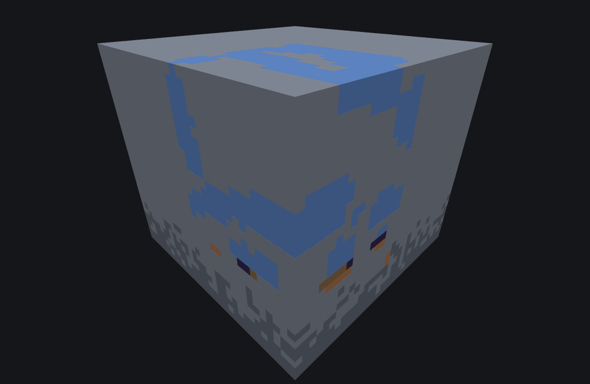

# Underwater cave carver feature

<VersionBadge><CoverageBadge /></VersionBadge>

**`minecraft:underwater_cave_carver_feature` digs exactly the caves the [cave carver](./cave_carver_feature.md) digs and then fills them with water, lava, magma and obsidian instead of air.** It is the odd one of the three carvers: the other two subtract — they overwrite terrain with a `fill_with` that is normally `minecraft:air`, so the result is a hole — and this one leaves a *flooded* cave under a sea, so a run of it usually reports thousands of `blocksReplaced` and zero `blocksCarved`.

It is the **Carver** category. Reach for it for flooded seabed caves, underwater ravine networks, or any cavity below sea level that should be full of water rather than air — including one with the magma-and-lava floor vanilla's deep ocean caves have, which this type writes for you and no field can switch off.

You do **not** want it above sea level, where it writes nothing at all, and you do not want it in a biome that is not tagged `ocean`, where it also writes nothing at all. Both of those are the commonest ways to conclude it is broken; both are [below](#uw-ocean-tag).

**Read the [cave carver](./cave_carver_feature.md) page first.** This type runs that page's placement, rooms and tunnels unchanged, and shares eight of its nine fields with the same defaults and the same traps: the [17×17 chunk architecture](./cave_carver_feature.md#carver-one-chunk), [`height_limit`'s two jobs and its `0` default](./cave_carver_feature.md#carver-height-limit), [`skip_carve_chance` counting the wrong way round](./cave_carver_feature.md#carver-skip-carve-chance) and [the `range_min`/`range_max` trap](./cave_carver_feature.md#carver-range-spelling) all apply here word for word. What is different is everything that happens once a tunnel step has decided which cells its ellipsoid reaches, and that is what this page is about.

## Start here: a complete example

One file. The eight shared fields carry the same values the cave carver page's example does; only `fill_with`, `replace_air_with` and the type id differ.

```json title="features/underwater_cave_demo.json"
{
  "format_version": "1.21.110",
  "minecraft:underwater_cave_carver_feature": {
    "description": { "identifier": "wiki:underwater_cave_demo" },
    "fill_with": "minecraft:water",
    "replace_air_with": "minecraft:water",
    "width_modifier": 0.0,
    "height_limit": 128,
    "skip_carve_chance": 1,
    "y_scale": { "range_min": 1.0, "range_max": 1.0 },
    "horizontal_radius_multiplier": { "range_min": 1.0, "range_max": 1.0 },
    "vertical_radius_multiplier": { "range_min": 0.7, "range_max": 1.4 },
    "floor_level": { "range_min": -1.0, "range_max": -0.7 }
  }
}
```

What each choice buys you:

- **`fill_with: "minecraft:water"`** is what makes the cave flooded rather than a hole nobody can see. Omit it and the cave is still shaped and the two deep bands are still written, but the whole ordinary band above them is left exactly as it was — 240 cells instead of 2,968, at this seed.
- **`replace_air_with: "minecraft:water"`** is the ninth field, and the only one the other two carvers do not have. On an ordinary seabed it never fires at all; setting it to the same block as `fill_with` is the way to stop it mattering. See [`replace_air_with`](#uw-replace-air-with).
- **The eight shared fields** mean what they mean on the [cave carver](./cave_carver_feature.md#fields) page. `height_limit` is the one that has to be written or nothing happens.



```
featurelab generate --pack <pack> --feature wiki:underwater_cave_demo --env ocean --seed 3 --origin 0,48,0 --min-y 0 --size 32x64x32
```

Run against the `ocean` preset with feature seed `3`, this writes **2,968 cells** inside the origin's own 16×16 chunk column, world X/Z `0..15`, spanning world Y `2..50`: **2,728 water** from Y 11 up, **47 magma and 47 obsidian** on world Y 10 and no other row, and **146 lava** below them. Nothing it wrote is air, so the result reports 2,968 `blocksReplaced` and zero `blocksCarved`.

::: tip The `--min-y 0 --size 32x64x32` is not framing
The `ocean` preset's own default bench starts at world Y 30, and this seed's ellipsoids reach down to Y 2 — so at the preset default most of the carve falls outside the bench and is reported as thousands of out-of-bounds writes rather than drawn (948 cells written and 5,892 lost, measured). Dropping the floor to 0 and giving the volume 64 rows brings the whole carve inside it, with zero out-of-bounds writes, and still reaches the sea, which sits on top of the seabed around world Y 49–62.

The image is a cutaway for the same reason [the cave carver's](./cave_carver_feature.md#start-here-a-complete-example) is: a cave sealed inside rock shows nothing from outside, and a water-filled cave is hidden exactly like an air-filled one. The slice is cut at world Y 27, which is why the top face reads as a floor-plan cross-section through the flooded network. The lava and the magma/obsidian row are not in that cut plane at all — they are visible because the carve runs flush to the bench's own edges, and a face at the edge of a preview is never hidden.
:::

## Fields

Nine keys, all optional to the loader. **Eight of them are the [cave carver](./cave_carver_feature.md#fields)'s, with the same values, the same defaults and the same traps** — the rows below are one-line reminders, and that page is where each one is explained. The ninth, `replace_air_with`, only this type has. The long-form account of every key, in the editor's own words, is the [field reference](#field-reference) further down.

### The two block fields

| Key | Required | Value | Default | What it does |
|---|---|---|---|---|
| `fill_with` | no — **but write it** | block descriptor | *nothing is written* | The block written into every cell of the ordinary band, which is nearly the whole cave. `minecraft:water` is the ordinary answer. Omitted, those cells are left exactly as they were and only the two deep bands appear. |
| `replace_air_with` | no | block descriptor | *nothing is written* | Written instead of `fill_with` when the cell **is already air**. On a real seabed there is no air below the water line, so it almost never fires. See [`replace_air_with`](#uw-replace-air-with). |

### The eight shared with the cave carver

| Key | Required | Value | Default | What it does |
|---|---|---|---|---|
| `height_limit` | no — **but write it** | integer | `0` — carves nothing | Ceiling, and the band systems start in. Its `0` default is the second commonest way to get an empty result out of one of these. [Detail](./cave_carver_feature.md#carver-height-limit). |
| `skip_carve_chance` | no | integer, `1` or more | `0` — never skips | One in N: **bigger is rarer**. Write `1`, not `0`. [Detail](./cave_carver_feature.md#carver-skip-carve-chance). |
| `width_modifier` | no | number or Molang string | `0.0` | Added to every room and tunnel radius. |
| `floor_level` | no | a [range](./cave_carver_feature.md#carver-ranges) — a bare number, `[min, max]`, or `{range_min, range_max}` | `{0, 0}` — half a cave | How much of the bottom of each ellipsoid is left alone. Read by rooms and tunnels alike. |
| `y_scale` | no | a range | `{0, 0}` — room flattened away | Rooms only: vertical size against horizontal. |
| `horizontal_radius_multiplier` | no | a range | `{0, 0}` — room removed | Rooms only. |
| `vertical_radius_multiplier` | no | a range | `{0, 0}` — room removed | Rooms only. |

## Common mistakes

| You wrote | What happens | Do instead |
|---|---|---|
| A rule pointing this feature at a biome with no `ocean` tag | **Nothing, ever.** The file loads clean, the placement reports success, and `blocksChanged` is `0`. Same bench, same seed, nothing changed but the tags: 0 cells without, 3,405 with. | Attach the rule to an ocean biome. In featurelab, use the `ocean` preset or pass `--biome-tags ocean`. |
| A seabed above world Y 63 | Nothing. Every cell at Y 63 or above is skipped before anything else about it is considered, and the line is flat — it does not follow the terrain. | Put the cave below sea level, which for the overworld means below 63. |
| A deep seabed of deepslate | Nothing. Deepslate is **not** on this carver's list, even though it is on the dry carver's. Same bench, same seed: 3,405 cells through stone, **0** through deepslate. | Stone, sand, gravel or dirt. See [what it will and will not dig](#uw-diggable). |
| `"fill_with"` left out | The cave is still shaped and still costs the same, the magma, obsidian and lava rows are still written, and the entire ordinary band above them is left alone. 240 cells instead of 2,968 — which reads far more like "the carver did nothing" than like "a field is unset". | Write it. `minecraft:water` for both block fields. |
| `"replace_air_with"` expecting it to control what the cave is *filled* with | It is not "the block those cells would otherwise become". It is the block for cells that are **already air right now**, and below a seabed there are none. Removing it from this page's example changes nothing at all: same 2,968 cells, same positions, same blocks. | `fill_with` is the one that fills the cave. |
| `"generate a cave without magma"` | There is no field for it. The magma/obsidian row and the lava band below it are at fixed depths and are not configurable; `fill_with` does not apply to either. | Nothing here will do it. Keep the cave above world Y 11. |
| Expecting one magma in four because the roll is 25% | You will see more. The roll really is 25%, but obsidian is on this carver's own diggable list and magma is not, so a second ellipsoid crossing that row re-rolls every obsidian cell and cannot touch a magma one. | Nothing to fix; raise `skip_carve_chance` if you want the ratio closer to the roll. See [the three depth bands](#uw-depth-bands). |
| `{ "min": …, "max": … }` on a range field | Silently substituted with a zero-width `{0, 0}` range, which removes every room. | `{ "range_min": …, "range_max": … }`. [Detail](./cave_carver_feature.md#carver-range-spelling). |

## How it runs

Steps 1 to 5 are the [cave carver](./cave_carver_feature.md#how-it-runs)'s, unchanged: the 17×17 chunk window, the per-neighbour skip roll, the system anchors, the rooms and tunnels, and the test of every ellipsoid against the chunk actually being generated. This type diverges only at step 6, the per-cell carve, which it replaces outright:

1. **If the cell is at or above the dimension's sea level — 63 in the overworld — skip it.** This is decided before anything else about the cell, including what block is there.
2. **If the block there is not on [this type's own list](#uw-diggable), skip it.**
3. **Ask the biome whether it is tagged `ocean`.** If it is not, abandon not just this cell but the whole remaining downward run of this column. Once any one cell anywhere in the call gets a yes, the question is never asked again for the rest of that placement.
4. **Write the block the cell's depth decides**, from [the three bands](#uw-depth-bands): lava below, magma or obsidian on one fixed row, and `fill_with` — or `replace_air_with` — everywhere above.

Two things the cave carver does at every carved cell, this one does not do at all: it never caps a sand column with sandstone, and it never relocates a grass block down onto the dirt below it. Those belong to the dry carver's per-cell behaviour, which this type replaces rather than extends. A grass block or a sand column inside an underwater carve is simply overwritten.

## The `ocean` tag, and what happens without it {#uw-ocean-tag}

**This carver asks the biome it is generating in whether it is tagged `ocean`, and if the answer is no it gives up on the whole column** — not on that one cell, on the entire remaining downward run of it. A carver placed in a biome with no `ocean` tag therefore writes nothing at all, anywhere, however well configured it is, and reports success while doing it.

::: warning A biome with no `ocean` tag makes this feature silently inert
This is the single most common way to get nothing out of it, and it looks exactly like a broken feature: the file loads with no diagnostics, the placement reports success, and `blocksChanged` is `0`.

Measured with this page's own fixture, at the same seed, in the same solid-stone bench, changing nothing but the biome's tags:

| Biome tags | Cells written |
|---|---|
| the bench's own default overworld/plains set | **0** |
| `ocean` (`--biome-tags ocean`) | **3,405** |

If you are testing one of these in featurelab, use the `ocean` environment preset — its biome carries the tag — or pass `--biome-tags ocean` explicitly. If you are testing in a real world, attach the rule to an ocean biome; a rule pointed at a plains biome will run this feature every chunk forever and never place a block.
:::

The check stops being asked as soon as it succeeds once. The first cell anywhere in the call that finds the tag settles it for the rest of that placement; until then, every column that reaches the question and is refused is abandoned on the spot.

## The water line {#uw-water-line}

The carver only ever touches cells **strictly below the dimension's sea level**, which is **63** in the overworld. A cell at Y 63 or above is skipped before anything else about it is considered — before the block test, before the ocean-tag question, before any fill.

The sea level is not sampled per cell. It is a single number the dimension carries, so **the water line is flat across the whole carve and does not follow the terrain**: a seabed that rises to Y 70 is simply out of reach, and a bench whose floor sits above 63 gets nothing.

## The three depth bands {#uw-depth-bands}

Below the water line, what gets written depends only on how deep the cell is, in three bands defined as offsets from sea level. With the overworld's 63 they land on fixed rows:

| Cell's Y | What is written |
|---|---|
| **11 – 62** | `replace_air_with` if the cell is already air, otherwise `fill_with` |
| **exactly 10** | `minecraft:magma` on a roll below 0.25, otherwise `minecraft:obsidian` |
| **9 and below** | `minecraft:lava` |

The magma/obsidian row is **one block thick** — sea level minus 53, and nothing else — and the lava band is everything from sea level minus 54 down. Neither is configurable: `fill_with` does not apply to either of them, and there is no field that moves the offsets. This page's own fixture at seed 3 produces all four blocks in one run: 2,728 water on rows 11 to 50, 47 magma and 47 obsidian on row 10 and no other, and 146 lava on rows 2 to 9.

::: note You will see more magma than one cell in four, and the reason is not the roll
The roll really is 25%. But `minecraft:obsidian` is on this carver's own diggable list and `minecraft:magma` is not, so a second ellipsoid crossing the same row re-rolls every obsidian cell it reaches and cannot touch a magma one. Repeated passes therefore ratchet the finished floor towards magma.

Measured over the same 60 seeds of this page's fixture: with `skip_carve_chance: 1`, where every neighbouring chunk carves and ellipsoids overlap heavily, the finished result is **1,939 magma to 1,705 obsidian**, 53%. Raising `skip_carve_chance` to `30`, so most chunks skip and few ellipsoids overlap, brings it to **92 to 145**, 39% — the same roll, fewer second passes, and the ratio moves back towards it.
:::

## `replace_air_with`, and why it is usually inert {#uw-replace-air-with}

`replace_air_with` is the ninth field, and the only one the other two carver types do not have. It is the block written instead of `fill_with` when the cell being carved **is already air**.

Two things about that are easy to get backwards:

- **The test is on the block that is *there now***, not on what the carve is about to leave behind. "Would otherwise be air" is the wrong reading — a solid cell that `fill_with` is about to turn into water still gets `fill_with`.
- **The test only runs at all if at least one of the cell's four horizontal neighbours — north, south, west, east; Y is never varied — is inside the region being generated.** At a chunk's edge during real generation that is a live constraint; inside a preview bench at least one always is.

The practical consequence is that in an ordinary flooded seabed **`replace_air_with` never fires**, because below sea level there is no air: everything is rock, sediment or water. This page's fixture with `replace_air_with` set to `minecraft:gold_block` produces the same 2,968 cells at the same positions with not one gold block among them, and the same fixture with the field removed entirely produces that result again.

Where it earns its place is a seabed that already has open air in it — a pocket left below the water line by something that ran earlier in the same chunk. Those cells get `replace_air_with` and the solid ground around them gets `fill_with`, which is the only situation in which the two values can produce a visible difference. Set both to `minecraft:water` unless you specifically want that difference.

## What it will and will not dig {#uw-diggable}

The list is **not** the cave carver's list with water added. It is a genuinely different set, and it disagrees with the dry carver in both directions.

**It digs, and the dry carver does not:** `minecraft:water`, `minecraft:flowing_water`, `minecraft:lava`, `minecraft:flowing_lava`, `minecraft:obsidian`, and **air** — so it will carve straight through an existing cave, a lava pocket or an ocean column and rewrite them.

**It refuses, and the dry carver digs:** `minecraft:deepslate`, `minecraft:calcite`, `minecraft:tuff`, `minecraft:packed_ice`, `minecraft:snow_layer`, and the iron and copper ore family (`iron_ore`, `deepslate_iron_ore`, `raw_iron_block`, `copper_ore`, `deepslate_copper_ore`, `raw_copper_block`).

**Deepslate is the one that costs authors real time**, because it is exactly what a deep seabed turns into. Measured on the same bench at the same seed, with the ocean tag supplied so the gate above is not what is being seen, and with nothing changed but the block the bench is made of:

| Bench material | Cave carver | Underwater cave carver |
|---|---|---|
| `minecraft:stone` | 3,329 cells | 3,405 cells |
| `minecraft:deepslate` | 3,329 cells | **0 cells** |

The dry carver does not notice the swap at all. This one stops entirely.

Both carvers also dig `minecraft:stone`, the dirt family, `minecraft:gravel`, `minecraft:podzol`, `minecraft:grass_block`, `minecraft:mycelium`, `minecraft:dirt_with_roots` and the sand and sandstone families; this one adds `minecraft:hardened_clay`. The one remaining disagreement is terracotta: where the dry carver's entries are the sixteen **glazed** terracottas, this one's are the sixteen **plain** coloured ones. The two really do consult different families.

Anything not on the list is left completely untouched even where the carve geometry reaches it.

## Field reference

The long-form account of every key, generated from the editor's own catalogue — the same text the Feature Lab node editor shows in its `?` pane and on hover, with the schema facts (required, kind, absent-key default) the editor's forms are built from. The [tables above](#fields) are the summary; where the two differ in precision, the tables are the measured version.

<!--@include: ../generated/fields/underwater_cave_carver_feature.md-->

## What the bench does differently

featurelab implements this type in full, including the ocean gate, the water line, the three bands and the neighbour test. Four things about reading a preview of one are worth knowing, and the first is the only genuine gap.

- **The sea level is modelled as a flat 63 for every placement.** That is what the overworld really uses, but a custom dimension with a different sea level is not modelled, and this bench has no dimension concept to carry one. Read every row number on this page as an overworld number.
- **Whether an omitted `fill_with` or `replace_air_with` really is skipped here has not been established for this type.** For the [cave carver](./cave_carver_feature.md) that skip is known to be what the game does; this type's write path is a different one. featurelab skips the write, by analogy with its sibling, so treat an omitted value as this tool's best answer rather than a promise. Writing both fields makes the question moot.
- **The preview needs a biome with the tag.** A placement run with no biome supplied at all can never pass the ocean check, so featurelab warns once and the carve writes nothing — which is the correct outcome, not a bench limitation, but it is worth recognising in the diagnostics.
- **`featurelab check` never runs a placement.** It reports a missing or malformed field, including a range written `min`/`max`; it cannot tell you the biome will not have the tag, that the seabed is deepslate, or that the bench floor sits above sea level. Those are `featurelab generate`'s `diagnostics`, and the preview panel's Diagnostics section.

## Advanced: the one value this type spends that its siblings do not {#uw-random-values}

You do not need this section to build one of these. It is for reading a preview value for value against the game. [RNG and determinism](./rng_and_determinism.md) is the model it fits into, and [the cave carver's advanced section](./cave_carver_feature.md#carver-random-values) is the account of everything up to the per-cell carve, which this type shares exactly.

The divergence is a single draw. **The magma/obsidian row spends one float per cell that lands on it, and it is the only per-cell draw any of the three carvers takes.** The dry and Nether carvers write their cells without drawing anything at all; this one advances the generator once for every cell on sea level minus 53, so two otherwise identical carves diverge from the first time one of them reaches that row. The lava band and the ordinary band below and above it draw nothing.

The draw it takes is the local generator's, not the placement's: rooms and tunnels hand their own throwaway generator down into the carve, which is why this type's per-cell draw perturbs the rest of *that tunnel* and not the per-chunk sequence.

### The fixture

The worked example is [`underwater_cave_demo.json`](https://github.com/stirante/featurelab/tree/main/docs/wiki/tools/fixtures/features). Every variant measured on this page is that file with one key changed or removed, or the same file run against a differently-built bench.

## See also

- [Cave carver feature](./cave_carver_feature.md) — the base carver, whose placement, rooms and tunnels this type runs unchanged. Read it for the per-chunk architecture and for the eight shared fields.
- [Nether cave carver feature](./nether_cave_carver_feature.md) — the third carver, which shares the front door and nothing else. Its divergences are the opposite kind: it has fewer behaviours than the base carver where this one has more.
- [Feature rules](./feature_rules.md) — how a carver reaches a world at all, and the `pregeneration_pass` that is the only pass a carver may run in. It is also where the biome filter that has to carry the `ocean` tag is written.
- [RNG and determinism](./rng_and_determinism.md) — the model the advanced section fits into.

## How this page was checked

Everything above is a statement about Bedrock **1.26.50.24**, and holds for **1.26.40.26** too: this type's JSON surface and its whole placement are unchanged between the two.

Every number quoted was produced by running the exact JSON above — or that file with one key changed, or the same file against a differently-built bench — through `featurelab generate` and reading the counts and coordinates back out of the result: the 0-versus-3,405 ocean-tag table, the deepslate table, the magma/obsidian ratios over 60 seeds, the 2,968-cell example with its per-block breakdown and its row-by-row bands, the 240 cells left when `fill_with` is omitted, and the byte-identical results with `replace_air_with` set to gold and removed altogether. The image was rendered from the example's own run by the documentation's own [image pipeline](https://github.com/stirante/featurelab/blob/main/docs/wiki/tools/generate-images.mjs), sliced as the tip describes.

One number was re-measured rather than carried over, and the correction is to how it is reproduced rather than to the number. The deepslate table's two benches are the *same* preset with its material overridden — `--env underground_stone --foundation-material minecraft:deepslate` — not the `underground_deepslate` preset, which sits at world Y −56 to −8 and therefore reports zero cells for **both** carvers, since a carve never goes below world Y 2. Read "nothing changed but the block the bench is made of" literally: the geometry has to stay the same too.

The four horizontal neighbours really are north, south, west and east — Y is never the varied axis.

What this page deliberately does not claim: the behaviour of an omitted `fill_with` or `replace_air_with` on this type is featurelab's answer by analogy with its sibling, not something established about the game, and the bench section says so in those terms. The flat sea level is a limitation of the preview, not of the game.
