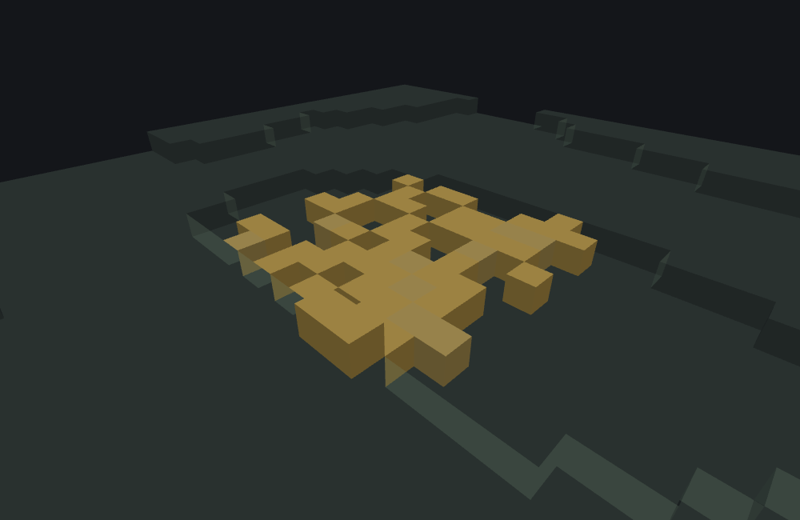
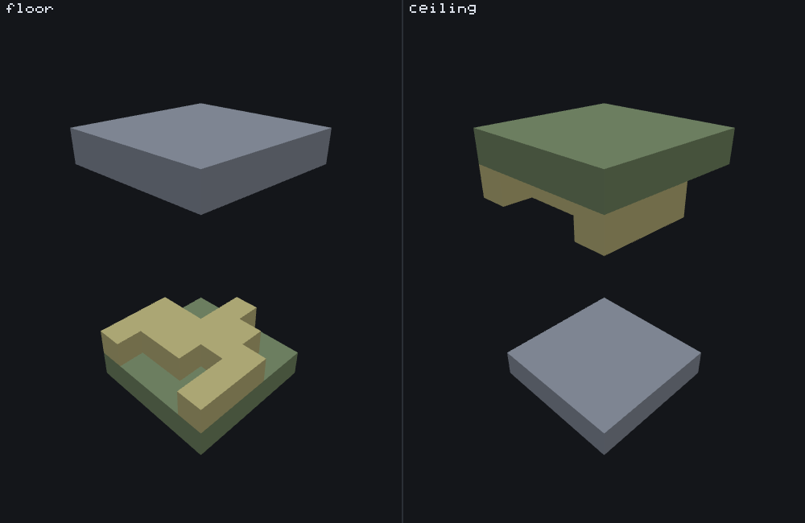
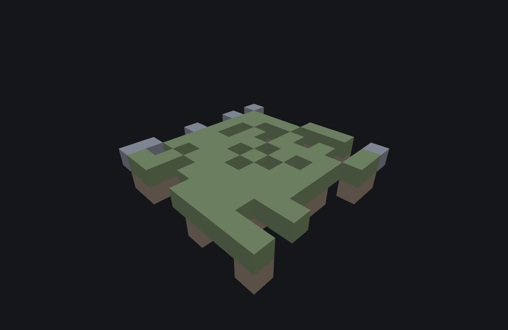

# Vegetation patch feature

<VersionBadge><CoverageBadge /></VersionBadge>

**`minecraft:vegetation_patch_feature` re-surfaces a rectangle of ground with one block and grows another feature out of every column it keeps.** You reach for it when a patch has to follow terrain you did not generate: a clearing of podzol under a grove, a mossy floor in a cave, the moss-and-roots ceiling of a lush cave. It is a **Scene feature** — unlike a [geode](./geode_feature.md), it does not write its own decoration. It finds the ground, lays `ground_block` into it, and hands each column to the feature named in `vegetation_feature`.

Where a [scatter](./scatter_feature.md) picks random offsets and lets the delegate work out whether each one is usable, this one searches every column of its footprint for a real surface first, and only the columns that found one get a delegate at all.

Three things decide whether a patch does anything, and all three are easy to get backwards. The footprint is **wider than `horizontal_radius` says** and then loses its outer ring; `replaceable_blocks` is about the **solid ground**, not the air above it; and `vegetation_chance` defaults to **`0`**, which grows nothing.

## Start here: a complete example

Two files, both complete. The patch re-grasses a square of plains and grows pumpkins on most of it; the block feature it delegates to is the one from the [single block page](./single_block_feature.md), unchanged.

::: code-group

```json [features/vegetation_patch_floor.json]
{
  "format_version": "1.21.110",
  "minecraft:vegetation_patch_feature": {
    "description": { "identifier": "wiki:vegetation_patch_floor" },
    "replaceable_blocks": ["minecraft:grass_block", "minecraft:dirt", "minecraft:stone"],
    "ground_block": "minecraft:grass_block",
    "vegetation_feature": "wiki:pumpkin_patch_block",
    "depth": 1,
    "extra_deep_block_chance": 0.1,
    "vertical_range": 3,
    "vegetation_chance": 0.6,
    "horizontal_radius": 4,
    "extra_edge_column_chance": 0.3,
    "waterlogged": false,
    "surface": "floor"
  }
}
```

```json [features/pumpkin_patch_block.json]
{
  "format_version": "1.21.110",
  "minecraft:single_block_feature": {
    "description": { "identifier": "wiki:pumpkin_patch_block" },
    "enforce_placement_rules": false,
    "enforce_survivability_rules": false,
    "places_block": [
      { "block": "minecraft:pumpkin", "weight": 3 },
      { "block": "minecraft:jack_o_lantern", "weight": 1 }
    ],
    "may_replace": ["minecraft:air"],
    "may_attach_to": { "bottom": "minecraft:grass_block" }
  }
}
```

:::

What each choice buys you:

- **`horizontal_radius: 4` with `extra_edge_column_chance: 0.3`** walks an 11×11 rectangle — each drawn radius is used *plus one* — and keeps its 9×9 interior outright, plus each single-edge column that wins its own 0.3 roll. The four corners are never kept. See [the footprint](#footprint).
- **`replaceable_blocks` lists grass, dirt and stone**, the materials the patch is allowed to eat into. It does **not** list air, and it must not: the cells this list is compared against are solid ground, not the space above it. See [`replaceable_blocks`](#replaceable).
- **`vegetation_chance: 0.6`** is what makes this a *vegetation* patch at all. Left out, it defaults to `0` and the feature lays its ground layer and stops. See [`vegetation_chance`](#vegetation-chance).
- **`depth: 1` plus `extra_deep_block_chance: 0.1`** writes one cell of `ground_block` per column, and a second, deeper one about one column in ten.
- **The delegate is placed in the open cell next to the ground the patch just laid**, not at this feature's origin. `wiki:pumpkin_patch_block` still runs its own `may_attach_to.bottom` check there — and passes, because the cell below it is now `minecraft:grass_block` by construction.



```
featurelab generate --pack <pack> --feature wiki:vegetation_patch_floor --env plains --seed 1
```

Run against the `plains` preset with feature seed `1`, the call changes **66 cells**: 53 pumpkins and jack o'lanterns (51 of them at world `y 63`, two at `y 64` where the terrain steps up), and **13 cells of `minecraft:grass_block`**. The ground layer is much bigger than 13 — it covers every column the patch kept — but almost all of it was already `minecraft:grass_block`, and a cell that already holds `ground_block` counts without being rewritten. The 13 that did change are the deeper cells the `extra_deep_block_chance` roll added, one row further down, and every one of them was `minecraft:dirt`. The call reports the ground cell of the last column it kept, `(5, 62, 3)`.

::: tip A patch on flat ground looks like it did nothing. It did.
This is the commonest surprise with this type: run it on a surface that is already made of `ground_block` and the ground half of the feature is invisible, because it rewrote nothing. The vegetation is the only visible half. That is also why `replaceable_blocks` matters even when the patch "looks fine" — a column whose first ground cell is not replaceable and not already `ground_block` is dropped entirely, vegetation and all.
:::

## Fields

Eleven keys, all on the feature body. "Default" is what the game uses when the key is absent. The long-form account of every key, in the editor's own words, is the [field reference](#field-reference) further down; this table is the short version.

| Key | Required | Value | Default | What it does |
|---|---|---|---|---|
| `vegetation_feature` | yes | feature identifier | — | The feature grown on every kept column, in the open cell beside the ground the patch just laid. Unresolved, the patch is still laid and nothing grows on it. |
| `ground_block` | yes | block descriptor | — | The block the patch's ground layer is made of. Written **into** the surface, continuing away from the open cell. |
| `replaceable_blocks` | yes | array of block descriptors, at least one | — | Which ground materials may be overwritten. **List terrain, not air** — see [below](#replaceable). |
| `depth` | yes | whole number, `[min, max]`, or `{range_min, range_max}` | — | How many cells of `ground_block` each column lays, drawn per column. `0` writes nothing and still keeps the column. See [ranges](#ranges). |
| `horizontal_radius` | yes | the same range shape as `depth` | — | How wide the patch is, drawn once for x and once for z. **Each drawn value is used plus one** — see [the footprint](#footprint). |
| `vertical_range` | yes | whole number, at least `1` | — | How far a column may walk to find its surface, in each of the walk's two phases. |
| `surface` | no | `floor` or `ceiling` | **`floor`** | Which way everything points: the search, the ground fill and the vegetation. See [the two values](#the-two-surface-values). |
| `vegetation_chance` | no | a probability from `0` to `1` | **`0` — never** | Rolled per kept column. **At the default nothing grows at all** — see [below](#vegetation-chance). |
| `extra_deep_block_chance` | no | a probability from `0` to `1` | `0` — never | Rolled per kept column; when it hits, the column's ground layer is one cell deeper. |
| `extra_edge_column_chance` | no | a probability from `0` to `1` | `0` — never | Rolled per column on the footprint's outer ring. At the default the whole ring is dropped and the patch is a clean square. |
| `waterlogged` | no | boolean | `false` | Marks the patch as underwater. **Nothing grows** when it is on — see [below](#waterlogged-and-water). |

### The two `surface` values {#the-two-surface-values}

`surface` is a single mirror. It flips the direction the column walk searches, the direction the ground layer fills, and the direction the vegetation grows — all three together, never one without the others.

| Value | What it does | Reach for it when |
|---|---|---|
| `surface: "floor"` | Searches **downward** for something that can hold the patch on its top face, fills the ground layer **downward** into it, and grows the vegetation **upward**. **The default** when the key is absent. | Anything that sits on the ground: a clearing, a mossy cave floor, a podzol patch under a grove. |
| `surface: "ceiling"` | Searches **upward** for something that can hold the patch on its bottom face, fills the ground layer **upward** into it, and grows the vegetation **downward**. | Anything that hangs: a lush-cave roof of moss with roots below it, a ceiling of nether wart blocks. |

There is no third value. Anything else is not a `surface` this type has — a `wall` or a `random_horizontal` copied over from a [snap to surface](./snap_to_surface_feature.md) is not accepted here.

One picture, two files that differ in one word. Both panels start from the same floating origin on the `void` preset, with a 5×5 stone plate four cells below it and another four cells above it, the same delegate, the same `horizontal_radius` of 2, the same `depth` of 1 and the same seed — and nothing but `surface` changes:



Both panels place exactly **64 cells**: 25 cells of stone plate, 25 cells of `minecraft:moss_block`, and 14 markers. `floor` walks down, coats the lower plate at `y 0`, and stands its markers on top of it at `y 1`. `ceiling` walks up, coats the upper plate at `y 8`, and hangs its markers under it at `y 7`. The plate that the patch ignored is still plain stone in each panel, which is the quickest way to read the picture: **the green plate is the one the patch found.**

Two things in the figure are chosen for legibility rather than realism, and both matter if you copy it. The plates are one block thick, so a `depth` of 1 turns a whole plate to moss rather than coating an underside no camera can see. And the delegate is a bare marker that places anywhere, not the moss-attached hanging roots a real ceiling patch uses: a delegate that checks what it is attached to would grow on one surface and not the other, and the empty panel would read as a broken figure rather than as a mirrored one. [A ceiling patch in a real pack](#ceiling-patch) is further down, with the delegate written the way you would actually write it.

## Common mistakes

| You wrote | What happens | Do instead |
|---|---|---|
| `"replaceable_blocks": ["minecraft:air"]` | **Every column is dropped** unless the ground already happens to be `ground_block`: the first cell the list is compared against is the solid surface, not the air above it. | List the terrain materials the patch should eat into: `["minecraft:stone", "minecraft:dirt", "minecraft:grass_block"]`. |
| No `vegetation_chance` at all | The ground layer is laid and **nothing grows on it**. The feature succeeds, so nothing reports a problem. | Write the probability you want, from `0` to `1`. |
| `"horizontal_radius": 4` expecting a 9×9 footprint | It walks **11×11** — the drawn radius is used plus one — and then the default `extra_edge_column_chance` of `0` drops that outer ring, leaving 9×9. You get the size you expected by a route that surprises you the moment you set an edge chance. | Nothing, if 9×9 is what you want. Set `extra_edge_column_chance` above `0` deliberately, knowing it unlocks a ring one block further out than the number you wrote. |
| `"extra_edge_column_chance": 1` expecting a full square | The four corners are dropped whatever this says. The footprint is 11×11 **minus its four corners**. | Nothing — there is no way to keep a corner. |
| `"depth": [1, 3]` expecting a depth of 3 | The top of a range is exclusive: this gives 1 or 2. | `[1, 4]`. |
| `"depth": {"min": 1, "max": 3}` | This type reads `range_min`/`range_max` only. The game reports the object and quietly uses a zero-width range, so the file loads and the patch is not the depth you wrote. | `{"range_min": 1, "range_max": 4}`, or the `[1, 4]` array. |
| `"waterlogged": true` for a patch that has to work under water | Nothing grows. See [below](#waterlogged-and-water). | Leave it off and let the delegate's own `may_replace` include `minecraft:water`. |
| `"surface": "wall"`, copied from a snap-to-surface feature | Not a value this type has. The game reports `Bad value for surface - should be 'ceiling' or 'floor'`, and featurelab refuses the file rather than picking a direction for you. | `floor` or `ceiling`. For the four side directions you want [snap to surface](./snap_to_surface_feature.md). |
| A `vegetation_feature` no loaded file defines | The whole ground patch is still written and nothing grows on it — the feature reports success. | `featurelab check` reports the reference by name, with a near-match suggestion, before you ever run it. |
| `"vertical_range": 0` | Refused: the field's own minimum is `1`. | At least `1`, and in practice at least the distance from the origin to the surface you mean. |
| Expecting the patch to follow a cliff | Each column walks at most `vertical_range` cells, from the **origin's own height**, not from its neighbour's. A column whose surface is further away than that is dropped, so a patch across a step comes out with a bite taken out of it. | Raise `vertical_range`, or place the patch where the terrain is within it. |

## How it runs

1. **Work out the footprint.** A radius is drawn for x and another for z, independently, from `horizontal_radius` — so a genuine range gives a rectangle rather than a square. **Each drawn value is then used plus one.**
2. **Walk every column** of that rectangle — every `(dx, dz)` offset inside it. A **corner** column — at the extreme on both axes — is always dropped. A column on exactly **one** edge is dropped too, unless `extra_edge_column_chance` is above `0` and its roll succeeds.
3. **Find the surface**, from the origin's own height, in up to two phases. While the cell is open, step *toward* the surface — down for `floor`, up for `ceiling` — at most `vertical_range` times. Then, if that ended on a cell that is **not** open, which is what a column buried in the ground looks like, step back the other way while the cells stay solid, again at most `vertical_range` times. A column still buried after all that is dropped.
4. **Check the ground cell** — the solid cell one step further in the search direction, past the open cell the walk stopped in. It has to be a block that can hold something on the face the walk arrived at: its top face for `floor`, its bottom face for `ceiling`. Most full blocks can; open shapes like fences, torches and rails cannot. A column whose ground cell fails this is dropped.
5. **Write the ground layer.** `ground_block` goes into that cell and into `depth - 1` further cells past it, continuing *into* the solid — plus one more when `extra_deep_block_chance` hits. A cell that already holds `ground_block` counts without being rewritten; a cell listed in `replaceable_blocks` is overwritten; anything else stops the fill there, and drops the column **only** if that happened on the very first cell. A `depth` of `0` writes nothing and keeps the column.
6. **Grow the vegetation.** Only when every column has been walked does the second pass begin: for each kept column, roll `vegetation_chance`, and on success run `vegetation_feature` in the **open** cell from step 3 — one above the ground for `floor`, one below it for `ceiling`. The delegate runs its own checks there and may still refuse; nothing retries.
7. **Report.** At least one kept column is a success, and the position reported is the **ground cell of the last column kept** in walk order. No kept columns at all is a failure, with `Vegetation could not be placed`.

The recursion guard applies to this feature as it does to every type that delegates, and refuses with `Cannot place internal feature` — but it is checked *after* the ground layer has been written, so a refusal leaves the patch's ground in the world and reports failure anyway.

## The footprint: `horizontal_radius` is wider than it says {#footprint}

Two separate surprises stack here, and they very nearly cancel.

**Each drawn radius is used plus one.** A `horizontal_radius` of `r` walks a rectangle `2r + 3` columns on a side, not `2r + 1`: with `horizontal_radius: 4` the walk runs from `-5 to 5` on each axis, `2×(4+1) + 1` columns, an 11×11 rectangle. A `horizontal_radius` of `0` is still a 3×3 walk.

**The outer ring of that widened rectangle is what `extra_edge_column_chance` gates**, and it defaults to `0`. So with the key left out, the ring is dropped in full and what survives is the `2r + 1` interior — `2×4 + 1` columns per axis for that same `horizontal_radius: 4` — exactly the size you would have guessed from the number you wrote. A `horizontal_radius` of 4 keeps a 9×9 interior, 81 columns against flat ground; a `horizontal_radius` of 2 keeps 5×5, 25 columns, which is [the figure](#the-two-surface-values) and is what both of its panels measure.

The two surprises stop cancelling the moment you set an edge chance. `extra_edge_column_chance: 1` on that `horizontal_radius: 4` patch does not fill in the 9×9 — it unlocks the **11×11** ring, giving 121 columns minus the four corners, which are dropped whatever the chance says. The jump is from 81 to 117, not from 81 to 121 and not from 81 to something slightly over 81.

Two more details worth keeping:

- **The two radii are drawn independently**, one for x and one for z. With a genuine range they differ, so the footprint is a rectangle; a bare number gives a square every time.
- **Nothing here is circular.** The footprint is a rectangle with its corners cut, not a disc, at every radius.

## `replaceable_blocks` is about the ground, not the air {#replaceable}

The cell the ground layer starts at is the **solid** one past the air the column walk stopped in — the floor block under it, or the ceiling block over it. That is the cell compared against `replaceable_blocks`, and it is why a list containing only `minecraft:air` can never replace anything: the first cell it is asked about is never air, so every column stops on its very first cell and is dropped. The patch places nothing, anywhere, and reports `Vegetation could not be placed`.

List what the terrain is actually made of. For a floor on plains that is `minecraft:grass_block`, `minecraft:dirt` and `minecraft:stone`; for a lush-cave ceiling it is `minecraft:stone`, and the moss *replaces* the stone rather than coating its underside.

Within a column the fill is not all-or-nothing:

- A cell that already holds `ground_block` **counts** toward `depth` without being rewritten. This is why a patch on ground that already matches looks like it did nothing.
- A cell listed in `replaceable_blocks` is overwritten and counts.
- Anything else **stops the fill there**. The column is dropped only if that happened on its first cell; a column that wrote one cell and then hit bedrock is a kept, partly filled column.

## `vegetation_chance`, and the patch that grows nothing {#vegetation-chance}

`vegetation_chance` defaults to **`0`**, which means never. A patch that omits it lays its whole ground layer, keeps every column, reports success — and grows not one of the things its own name promises. Nothing warns you, because nothing went wrong.

It is rolled **once per kept column**, in a second pass after the entire ground patch has been laid, so the number of things that grow follows the number of columns the patch kept, not the number of cells it rewrote. In the [worked example](#start-here-a-complete-example) a chance of `0.6` produced 53 placements.

The other two probabilities behave the same way and have the same default of `0`: `extra_deep_block_chance` is rolled per kept column and adds exactly one cell when it hits, and `extra_edge_column_chance` is rolled per single-edge column and is the only thing that can keep the outer ring.

## `depth` and `horizontal_radius`: how a range is read {#ranges}

Both fields take the engine's range shape: a bare number, a two-element `[min, max]` array, or a `{range_min, range_max}` object.

- **The top of the range is exclusive.** `[1, 4]` gives 1, 2 or 3. `[1, 3]` gives 1 or 2.
- **A range that spans at most one value is a constant.** A bare number, `[3, 3]` and `[3, 4]` all give exactly `3` — for `[3, 4]`, because the exclusive top leaves `3` as the only possibility.
- **The key names are `range_min` and `range_max`.** The `{min, max}` spelling the [geode](./geode_feature.md) page's own ranges use is not read here: the game reports the object and substitutes a zero-width range, so the file loads in game and the field silently is not what you wrote. featurelab refuses it instead, and says so.

## `waterlogged` {#waterlogged-and-water}

::: warning `waterlogged: true` grows nothing
The game walks the whole patch and writes its ground layer, then throws the column list away and hands the patch to a separate water-surface placement path. Whatever that path does, none of it is the `vegetation_feature` on this file, and the call has no defined result to report afterwards.

If your patch has to work under water, leave `waterlogged` off — or `false` — and give the delegated feature's own `may_replace` `minecraft:water`. featurelab's own handling of this key is the biggest single divergence on this page; read [what the bench does differently](#what-the-bench-does-differently) before you rely on a preview of one.
:::

## Building a ceiling patch {#ceiling-patch}

The lush-cave shape — a stone roof whose underside becomes moss, with something hanging from it — is what `surface: "ceiling"` exists for, and it needs three things to line up:

```json title="features/vegetation_patch_ceiling.json"
{
  "format_version": "1.21.110",
  "minecraft:vegetation_patch_feature": {
    "description": { "identifier": "wiki:vegetation_patch_ceiling" },
    "replaceable_blocks": ["minecraft:stone"],
    "ground_block": "minecraft:moss_block",
    "vegetation_feature": "wiki:hanging_roots_ceiling_block",
    "depth": 1,
    "extra_deep_block_chance": 0.1,
    "vertical_range": 6,
    "vegetation_chance": 0.8,
    "horizontal_radius": 4,
    "extra_edge_column_chance": 0.3,
    "waterlogged": false,
    "surface": "ceiling"
  }
}
```

1. **`replaceable_blocks` lists what the roof is made of**, here `minecraft:stone`. The moss *replaces* the bottom layer of the stone; it is not a coat hung underneath it. A ceiling patch whose `replaceable_blocks` does not contain the roof material keeps no column at all.
2. **The delegate attaches to the ground block from the other side.** `wiki:hanging_roots_ceiling_block` is a [single block feature](./single_block_feature.md) placing `minecraft:hanging_roots` with `may_replace: ["minecraft:air"]` and `may_attach_to.top` set to `minecraft:moss_block` — `top`, because for something hanging, the block it hangs from is the one above it, and it is the mirror of the floor example's own `may_attach_to.bottom: "minecraft:grass_block"`.
3. **`vertical_range` reaches the roof.** The walk starts at the origin's own height and goes up; six cells is enough for a roof up to six above the origin and not one cell more.



```
featurelab generate --pack <pack> --feature wiki:vegetation_patch_ceiling_demo --env void --seed 1 --origin 0,10,0
```

The picture runs this file on the `void` preset, wrapped in an [aggregate](./aggregate_feature.md) with a helper scatter that first lays a slab of `minecraft:stone` five blocks above the origin, purely so there is a roof to patch at all — that scatter is scaffolding for the illustration, not part of the type. At feature seed `1`, from an origin of `(0, 10, 0)`, the result is **105 cells**: 63 cells of scaffolding stone, of which the ceiling scan turns **57 into `minecraft:moss_block`** (the six the scan never reached stay stone), and **42 cells of `minecraft:hanging_roots`** growing downward from the columns that won their `vegetation_chance` roll.

## Field reference

The long-form account of every key, generated from the editor's own catalogue — the same text the Feature Lab node editor shows in its `?` pane and on hover, with the schema facts (required, kind, absent-key default) the editor's forms are built from. The [table above](#fields) is the summary; where the two differ in precision, the table is the measured version.

<!--@include: ../generated/fields/vegetation_patch_feature.md-->

## What the bench does differently

This page documents the game. Four things belong to the **featurelab** bench used to illustrate it:

- **`waterlogged: true` is not modelled, and the bench says so by placing nothing at all.** In the game the ground layer is written and only then is the column list handed to a water-surface path; that path is not implemented here, and rather than show you a dry patch the game would never have left behind, the bench reports the whole call as failed, with `Vegetation could not be placed` and **zero** blocks changed. The ground writes and the per-column rolls the game does make are skipped with it. This is a disclosed gap, not a guess about the game.
- **A `{min, max}` range is refused at load rather than quietly replaced.** Given `{"min": 1, "max": 3}` for `depth` or `horizontal_radius`, the game reports it and substitutes a zero-width range, so the file loads and the field is not what its author wrote. The bench refuses the file and names the spelling, on the grounds that a field that silently is not what you wrote is the worst way for it to be wrong.
- **A `surface` value outside `floor` and `ceiling` is refused at load.** The bench will not pick a direction its author did not write.
- **Two strictnesses are the bench's own and are not confirmed against the game**: `replaceable_blocks` must be a non-empty array, and `vertical_range` must be at least `1`. A file that breaks either is refused here; whether the game refuses it or falls back is not something this page states.

Everything else about this type — both `surface` directions, the widened radius, the two-phase column walk, the support test on the ground cell, the counted-not-rewritten cell, the `depth: 0` column and the order the two passes run in — is implemented and measured.

## Advanced: what this type costs the random stream {#random-draws}

You do not need this section to use a vegetation patch. It is for reading a preview value for value against the game, or for reproducing the engine exactly. [RNG and determinism](./rng_and_determinism.md) is the model these numbers fit into; this is this type's row in it.

The type's own draws, in the order a call takes them:

| When | Cost | Which kind |
|---|---|---|
| Once per call, before anything else | **0 or 2** | The `horizontal_radius` range, sampled twice — x then z. See the int-range rule below. Both are taken **even when `waterlogged` is `true`**, before the discard. |
| Per single-edge column of the footprint | 0 or 1 | One float draw, and **only** when `extra_edge_column_chance` is not exactly `0`. The guard is an exact compare against zero, so a **negative** chance still spends the draw here and then always skips the column. Corners and interior columns cost nothing. |
| Per column that found its surface | 0 or 1 | One float draw for `extra_deep_block_chance`, taken only when that value is above `0`. |
| Per column that found its surface | 0 or 1 | The `depth` range. Taken after the extra-deep roll, never before it. |
| Per kept column, in the second pass | 0 or 1 | One float draw for `vegetation_chance`, taken only when that value is above `0` — and taken **even when `vegetation_feature` resolves to nothing**, so an unresolved delegate does not move the stream. |

**The int-range draw**, shared with [tree](./tree_feature.md) and [growing plant](./growing_plant_feature.md): over `(min, max)` it returns `min` and spends nothing when `min >= max - 1`, and otherwise spends exactly one bounded integer draw of `max - min` added to `min` — uniform over `[min, max - 1]`. That is the whole reason `max` is exclusive, and why `[3, 4]` is a constant rather than a coin flip. It is **not** the same as the `min`/`max` ranges on the [geode](./geode_feature.md) page, which disagree with it at exactly this boundary.

**The two passes are separate**, and that is what fixes the order of everything above: every column's edge, extra-deep and depth draws are taken while the ground patch is being built, and only then does the vegetation pass take one draw per kept column. Nothing interleaves them. A delegate's own draws therefore all come after the last ground draw, never between two of them.

**Walk order** is x outer, z inner, each ascending from `-span` to `+span`, and the position the feature reports is the last kept column's ground cell — `(5, 62, 3)` for the worked example, which is the `dx = +5` edge column at `dz = +3`.

## See also

- [Single block feature](./single_block_feature.md) — the delegate both of this page's examples use, and the most common `vegetation_feature` target in real packs. Its `may_attach_to.<face>` is what makes a ceiling delegate attach upward.
- [Geode feature](./geode_feature.md) — the other Scene feature in this version, and the contrast: it writes its own content instead of delegating, and its `min`/`max` ranges are read differently from this page's.
- [Scatter feature](./scatter_feature.md) — random offsets instead of a real per-column surface search, and the Proxy type this page's ceiling scaffolding is built from.
- [Growing plant feature](./growing_plant_feature.md) — a column that grows up or down from one point, which is what a `vegetation_feature` often is on a ceiling patch.
- [Feature rules](./feature_rules.md) — how any of this reaches a world: a feature file is inert until a rule attaches it to the chunks of the biomes it belongs in.
- [RNG and determinism](./rng_and_determinism.md) — the model the per-column rolls above fit into.

## How this page was checked

Everything above is a statement about Bedrock **1.26.50.24**, and holds for **1.26.40.26** too: this type's JSON surface — every key, enum value and default — and its behaviour are identical in both.

The widened radius, the corner and edge trimming, the two-phase column walk, the support test on the ground cell, the counted-not-rewritten cell, the `depth: 0` column, the exclusive top of a range and the two-pass order are stated as facts about the game. The worked example was run end to end and its changed cells read back out of `featurelab generate` before the prose was written: 66 cells, 13 of them `minecraft:dirt` turning into `minecraft:grass_block` one row below the ground layer, 53 of them pumpkins and jack o'lanterns, and a reported position of `(5, 62, 3)`. The ceiling example was run the same way: 105 cells, 57 moss and 42 hanging roots, with six scaffolding stone cells the scan never reached. The floor-against-ceiling figure's two panels were each run the same way and their changed-cell coordinates read before the caption was written: 64 cells in both, 25 stone plus 25 `minecraft:moss_block` plus 14 markers, with the moss at `y 0` and the markers at `y 1` for `floor` and at `y 8` and `y 7` for `ceiling` — and the same 14 columns growing in both panels, because the two files spend the same values in the same order. All three images were rendered from those exact results by the documentation's own [image pipeline](https://github.com/stirante/featurelab/blob/main/docs/wiki/tools/generate-images.mjs), which runs the real engine against [the fixtures](https://github.com/stirante/featurelab/tree/main/docs/wiki/tools/fixtures) with a fixed seed and a deterministic camera, so re-running it reproduces each picture byte for byte, and which refuses a figure whose panels come out nearly identical.

The fixtures are committed under [`docs/wiki/tools/fixtures/features/`](https://github.com/stirante/featurelab/tree/main/docs/wiki/tools/fixtures/features): `vegetation_patch_floor.json` for the worked example, `vegetation_patch_ceiling.json` with its `hanging_roots_ceiling_block.json` delegate and the `vegetation_patch_ceiling_demo.json` scaffolding for the ceiling example, and for the figure `veg_panel_floor.json` and `veg_panel_ceiling.json` — two aggregates that lay the two plates and then run `veg_panel_patch_floor.json` / `veg_panel_patch_ceiling.json`, which differ in the word `floor` and nothing else — over the shared `veg_panel_slab_grid.json` plate and the `threshold_marker.json` delegate. `featurelab check` is clean on all of them.

What is uncertain is named where it is relevant and collected in [what the bench does differently](#what-the-bench-does-differently): the unmodelled `waterlogged` path, the refusal of the `{min, max}` spelling and of a third `surface` value where the game reports and carries on, and the two load-time strictnesses that are the bench's own.
