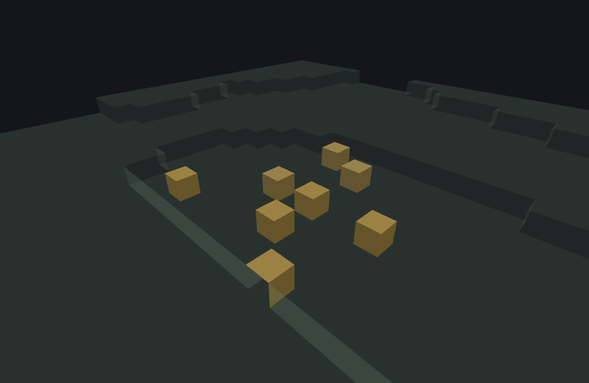
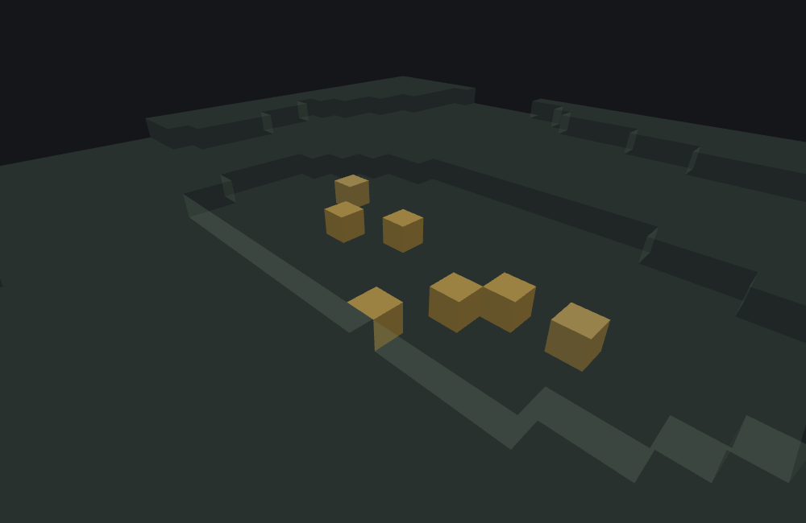

# Aggregate and Sequence Features

This page is a statement about **Minecraft Bedrock 1.26.50.24**
specifically. Both feature types' JSON surface — every key, enum value and default — and their
behaviour are unchanged between 1.26.40.26 and 1.26.50.24, so everything
below describes both versions. Worldgen internals move between releases; nothing here should be
assumed to hold for a different build without checking.

`minecraft:aggregate_feature` and `minecraft:sequence_feature` are two **Proxy features** covered
on one page because they behave as one feature with two modes: both JSON ids share one
algorithm, differing only in which composite kind they are (the
aggregate kind = `aggregate_feature`, the sequence kind = `sequence_feature`). Where
[Weighted Random Features](./weighted-random-feature.md) pick exactly one delegate from a list,
these two walk the same list, in order, every call — differing from each other in exactly
two places: what origin each delegate in the list actually receives, and where their `early_out`
mode comes from (`aggregate_feature` reads it from JSON; `sequence_feature` hard-wires it — see
below).

## What they do

Both variants run the identical algorithm:

1. An empty `features` list fails immediately — no delegation, no RNG. You cannot actually get
   there from a pack: `"features": []` does not load at all (see below), so this step is the
   algorithm's own guard rather than something a file can trigger.
2. Walk `features` in order. For each entry: resolve it, and if resolution succeeds and this
   wrapper is still allowed to place an internal feature (the standard recursion guard, keyed on
   the wrapper, not the delegate), delegate to it.
3. **Here the two variants differ** (see below): what origin that delegation actually uses.
4. Carry ONE piece of state across the whole loop: the **running result** — the position the
   most recent *successful* delegate returned, or nothing if no entry has succeeded so far. A
   delegate that succeeds overwrites it; a delegate whose own `Place()` fails leaves it **alone**
   (it is sticky); the recursion guard denying an entry **clears** it. After every entry,
   `early_out` (see below) tests that running result to decide whether to keep going.
5. Return the running result — `null` if nothing ever succeeded, and also `null` if the *last*
   thing that touched it was a guard denial (the denial clears an earlier success rather than
   preserving it).

No RNG is ever drawn directly by either variant — every draw belongs to whichever delegates
actually run.

### The one difference: which origin each delegate gets

- **`aggregate_feature`** re-targets **every** delegate at the *original, unmodified* origin —
  literally the same context object, reused verbatim, for every entry in the list. Two delegates
  that both want to occupy the *same* cell will genuinely contend for it; two delegates that
  offset themselves internally (a [Scatter Feature](./scatter-feature.md), an [Ore
  Feature](./ore-feature.md)'s own `+8` endpoint offset) simply don't collide, because *they*
  move, not the shared origin.
- **`sequence_feature`** threads the origin forward: the **first** delegate still runs at the
  original origin, but every delegate *after* a success runs at the running result — the
  *previous successful* delegate's own *returned* position — falling back to the original origin
  for as long as nothing has succeeded yet (and again after a guard denial clears the running
  result). A delegate that returns a position far from where it started (a [Snap-to-Surface
  Feature](./snap-to-surface-feature.md), which returns wherever its own scan actually landed,
  not its input origin) changes where every subsequent list entry runs. Only the origin is
  replaced in the threaded context — every other field is copied verbatim.

Molang scope is forwarded identically either way — the same scope object, unmodified, regardless
of which variant is running; only `Origin` ever changes between the two.

### `early_out`

Gates how much of the list actually runs, evaluated after every entry — but the two variants get
their mode from different places, and this is the second real difference between them:

- **`aggregate_feature`** exposes `early_out` as an **optional JSON key**, defaulting to `"none"`.
- **`sequence_feature` has no `early_out` key at all.** Its schema accepts only `features`; the
  mode is hard-wired to `first_failure` and cannot be changed from JSON. Only
  `aggregate_feature` accepts `"early_out"`, `"first_failure"` and `"first_success"`.

| `early_out` | Behavior |
|---|---|
| `"none"` (aggregate default) | Always run every entry in the list. |
| `"first_success"` | Stop immediately after the first delegate that succeeds. |
| `"first_failure"` (sequence, always) | Stop when, after an entry, **nothing has succeeded yet** — the running result is still empty. |

::: note
**`first_failure` means "stop while nothing has succeeded yet", not "stop when an entry fails."**
The test after every entry is simply: is the running result still empty? Two consequences:

- **Before the first success it stops immediately.** If entry 0's own `Place()` fails, no further
  entry runs. This is what makes the guard-first pattern work — and since every
  `sequence_feature` is `first_failure`, putting a cheap probe (a
  [Single Block Feature](./single-block-feature.md) with a `may_replace`/`may_attach_to` test)
  as the **first** entry of a sequence turns the whole list into a conditional: probe fails,
  sequence over.
- **After a success it becomes hard to stop.** A later entry's own `Place()` failure leaves the
  running result untouched (it's sticky), so the walk continues. The only thing that empties it
  again mid-walk is the recursion guard denying an entry — which also means the sequence's
  origin-threading resets to the original origin, and, if it's the last thing that happens, the
  whole call returns `null` despite the earlier success.

Implemented in `features/aggregate.go`.
:::

## Examples

### `aggregate_feature`

```json title="aggregate_feature -- two delegates at the SAME origin"
{
  "format_version": "1.21.110",
  "minecraft:aggregate_feature": {
    "description": { "identifier": "wiki:aggregate_pumpkin_pair" },
    "features": ["wiki:pumpkin_patch_block", "wiki:pumpkin_patch"]
  }
}
```

Both entries name features already introduced on this doc set:
[`wiki:pumpkin_patch_block`](./single-block-feature.md#example) (places one pumpkin/jack
o'lantern directly at its origin) and [`wiki:pumpkin_patch`](./scatter-feature.md#example) (a
14-iteration scatter_feature delegating to that same single_block_feature at offsets up to ±8
blocks). Both receive the identical, unmodified origin — that's the whole point of this example:
they don't collide, because `wiki:pumpkin_patch` moves itself via its own `distribution`, not
because `aggregate_feature` moved it. Run against `plains` with feature seed `9`, the direct pick
places one block at the origin `(0, 63, 0)`, and the scatter — sharing the SAME `Random` stream
immediately after that one draw, not a fresh one — succeeds on 7 of its 14 iterations this time
(a different split than [the scatter page's own standalone run](./scatter-feature.md#example) at
the same seed, because that one draw shifts every subsequent offset by one position in the
stream), for 8 placed blocks total:



```
featurelab generate --pack <pack> --feature wiki:aggregate_pumpkin_pair --env plains --seed 9
```

### `sequence_feature`

```json title="sequence_feature -- threading the snapped position forward into a scatter"
{
  "format_version": "1.21.110",
  "minecraft:sequence_feature": {
    "description": { "identifier": "wiki:sequence_snap_then_scatter" },
    "features": ["wiki:snap_pumpkin_to_floor", "wiki:pumpkin_patch"]
  }
}
```

Step one is [the snap_to_surface_feature example](./snap-to-surface-feature.md#example): given a
floating origin, it scans down to the real floor and places one pumpkin there, returning the
*floor* position, not the floating input. Step two is the same `wiki:pumpkin_patch` scatter
reused above — but here it runs at whatever step one *returned*, not at this sequence's own
original origin. Run against `plains` with feature seed `1` and origin `(0, 71, 0)` — floating 8
blocks above the ground, exactly like the snap_to_surface page's own example — the scatter patch
ends up centered on `(0, 63, 0)`, the floor snap_to_surface actually found, not on the floating
`(0, 71, 0)` this whole call was asked to start from: 6 of the scatter's 14 iterations succeed
this time (again a different split from either standalone run above, for the same "shared Random
stream" reason), plus the one directly-placed pumpkin from step one, for 7 placed blocks total:



```
featurelab generate --pack <pack> --feature wiki:sequence_snap_then_scatter --env plains --seed 1 --origin 0,71,0
```

Contrast this with the `aggregate_feature` example above: swap `sequence_feature` for
`aggregate_feature` in this exact JSON and the second entry would scatter around the ORIGINAL
`(0, 71, 0)` — 8 blocks up, in open air — instead of the floor `sequence_feature`'s threading
found. The origin-threading difference between these two feature types is the entire reason this
page shows both.

## Field reference

`minecraft:aggregate_feature`:

| Field | Required | Shape | Default |
|---|---|---|---|
| `features` | yes | non-empty array of feature reference strings | — |
| `early_out` | no | one of `none`/`first_success`/`first_failure` | `none` |

`minecraft:sequence_feature`:

| Field | Required | Shape | Default |
|---|---|---|---|
| `features` | yes | non-empty array of feature reference strings | — |

`sequence_feature` accepts **no** `early_out` field — the mode is hard-wired to `first_failure`
(see above).

::: warning `"features": []` is a load error, not an empty run
"Non-empty" in the tables above is the schema's own rule, for both types and for
[`weighted_random_feature`](./weighted-random-feature.md) as well: an array that is present must
hold at least one entry. Writing the key as `[]` fails validation with a content-log line of the
form *Array too small (0 < 1)* and the file does not load — it does not load and place nothing.
The same holds one level in for `weighted_random_feature`'s entries, whose tuples must be exactly
two elements long.
:::

## See also

- [Weighted Random Features](./weighted-random-feature.md) — a Proxy feature that picks exactly
  ONE delegate from a list, contrasted with these two walking the whole list every call.
- [Scatter Features](./scatter-feature.md) and [Snap-to-Surface
  Features](./snap-to-surface-feature.md) — the two delegate types both examples above reuse, and
  whose own offset/return-position behavior is what makes the aggregate-vs-sequence contrast
  above visible at all.

## Version and verification notes

Everything above is a statement about 1.26.50.24 specifically, and holds
equally for 1.26.40.26: both ids' JSON surface and behaviour are unchanged between the two
versions.

The JSON examples on this page were run end to end against this project's own worldgen tooling
(`featurelab check` and `featurelab generate`) and produced the described results, which is also
the way a reader can re-check them. The accompanying images were rendered
from those exact results by this doc set's own image pipeline (see
[`docs/wiki/tools/`](./tools/generate-images.mjs)).
