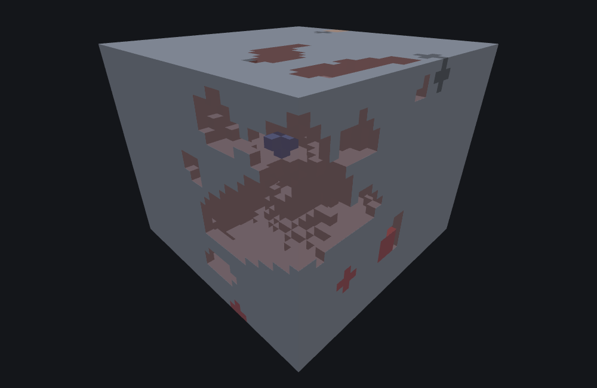
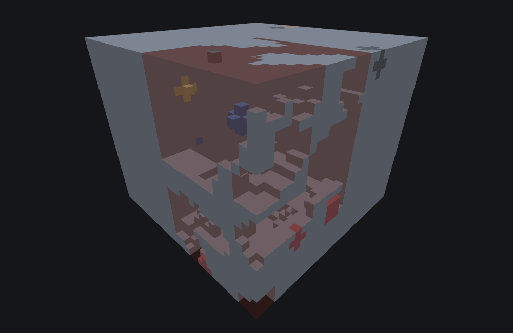

# Cave Carver Features

This page is a statement about **Minecraft Bedrock 1.26.50.24**.
All three carver types behave identically in 1.26.40.26 and 1.26.50.24, so
the page holds for either. Worldgen internals do move between releases; nothing here should be
assumed to hold for a build outside those two without checking.

`minecraft:cave_carver_feature` is a **Carver feature**. Every other feature type on this doc
set — Content, Proxy, or Scene — *adds* material: it writes a block somewhere it wasn't before.
A carver does the opposite: it **removes** material, by overwriting existing terrain with
`fill_with` (typically `minecraft:air`) wherever a room or tunnel's own shape reaches. If
you place a `cave_carver_feature` against solid stone and don't see any new blocks appear, that
is not a bug and not a sign the feature failed — carving doesn't add anything to look at; it
subtracts. `featurelab generate`'s own result reports this distinctly too: a carved cell counts
toward `blocksCarved`, a separate field from `blocksPlaced`/`blocksReplaced` every other feature
type on this doc set reports into.

## What it does

A single `Place` call does not just carve "around the origin" the way, say, an
[Ore Feature](./ore-feature.md)'s vein is centered on its own origin. Instead:

1. It reads its own placement seed and draws two odd multipliers from it.
2. It loops over a **17×17 grid of chunks** (8 in every direction) centered on the chunk that
   contains the origin — 289 neighbors in total, including the origin's own chunk.
3. For each neighbor, it reseeds the shared `Random` stream with a value mixed from that
   neighbor's own chunk coordinates, then rolls a small, RNG-skewed count (usually 0–3,
   occasionally more) of independent room/tunnel **systems** anchored somewhere inside that
   neighbor's own 16-block column — not necessarily anywhere near your origin.
4. Each system is a single ellipsoid **room** (a 1-in-4 chance per system) optionally followed by
   one or more branching, randomly-walking **tunnels** (always at least one; several when the
   room fired) — every tunnel step is itself a small ellipsoid, walked step by step with drifting
   yaw/pitch, occasionally branching into two child tunnels.
5. Every ellipsoid from every system anchored in every one of the 289 neighbors is tested against
   the chunk actually being generated (the one containing your origin) — only ellipsoids that
   geometrically reach into *that* chunk ever write anything; a system anchored three chunks away
   that never wanders close enough is silently skipped.

::: note
**This is why a single `featurelab generate` call only ever shows carving inside the origin's
own 16×16 chunk column**, even though the algorithm above consults 289 chunks' worth of RNG to
decide what carves through it. Regenerating the same feature at an origin one chunk over doesn't
show "more of the same cave" — it shows a *different* chunk's own carve result, computed from
seeds this call already drew from but never got to apply. This matches the game's own
per-chunk carve boundary: caves connect seamlessly across chunk borders in a real, continuously
generated world specifically *because* each chunk's neighbors are consulted this way, not because
carving itself has some larger footprint a single-chunk preview bench can show all at once.
:::

Every individual cell an ellipsoid reaches goes through the carver's single-block carve, which
does four things at that one position, in order:

1. Gates on the carveable-block test — only ordinary natural terrain (stone, the dirt/sand/sandstone
   families, ores, ice, deepslate, calcite, podzol, grass, mycelium, and glazed terracotta) is
   ever carved. A player-placed block, a structure, water, or anything outside that list is left
   completely untouched even where the carve geometry reaches it.
2. Writes `fill_with` at the position — **skipped entirely if `fill_with` was omitted** (see the
   warning below).
3. If the position directly above is capped by three layers of sand-family blocks, caps it with
   `minecraft:sandstone` instead of leaving a floating sand column over the new opening.
4. If the block that was just carved away was itself a surface block (`minecraft:grass_block` or
   `minecraft:mycelium`) and the block directly below it is dirt or coarse dirt, that surface
   block is relocated one layer down onto the dirt, rather than simply deleted — digging straight
   down through a patch of grass moves the grass down with the new floor instead of erasing it.

`Place` itself always succeeds — placement has no failure path at all in the game, and
none here either. Even a call that carves zero cells anywhere (every candidate rejected,
or a degenerate configuration — see the warnings below) still reports success and returns the
origin unchanged; only the *absence* of any `blocksCarved` tells you nothing actually happened.
`featurelab generate` surfaces this as a generic diagnostic, not a feature-specific one:

> `placed successfully but wrote no blocks — every candidate position was rejected, or a nested
> feature placed nothing`

## Fields, defaults, and two ways to carve nothing by accident

All eight of `cave_carver_feature`'s JSON fields are optional, and every one of them defaults
to zero or empty. Two of those defaults are degenerate enough that omitting the field silently
produces **no visible carving at all**, which is exactly the situation this page's own opening
warns about: a carver that appears to do nothing is not necessarily failing, but it can also
genuinely be configured to do nothing, and these two fields are how.

::: warning
**Omitting `fill_with` carves nothing visible.** The game's single-block carve checks
for a configured `fill_with` before writing it — an omitted `fill_with` is not
an error, it is the game's designed behavior for "no fill material configured." Every *other* effect of a carve still happens (the
carveable-block gate still runs, sand columns still get capped, grass still relocates) — only the
carved position's own block is left exactly as it was. In an environment with no sand and no
grass to relocate (a plain stone bench, for instance), this means **zero blocks change at all**:
the same JSON with `fill_with` omitted, run against solid stone, reports
`blocksChanged: 0`. Set `fill_with` — `minecraft:air` for an ordinary overworld cave,
`minecraft:water` for an underwater carve — if you want to actually see anything.

Use `minecraft:air`, not `minecraft:cave_air`. There is no `cave_air` block on Bedrock; the name
is only recognised when translating block names stored in legacy structure
files, and a feature naming it is rejected as an invalid block type. Using it is a Java-Edition
habit rather than anything Bedrock supports.
:::

::: warning
**Omitting `height_limit` clamps carving to just above world floor.** `height_limit` is the JSON
name for a Y-clamp applied to every ellipsoid's own upper bound
(`min(api.MaxY() - 2, height_limit)`), and its default is a genuine **0** —
not a large or "unlimited" sentinel. With `height_limit` omitted, every carve everywhere gets
clamped down near world Y 0 regardless of where the room/tunnel system actually walked, which in
practice suppresses essentially all carving anywhere a normal overworld cave would occur.
The same JSON with only `height_limit` set (radii and everything else left at
their own defaults) still carves thousands of cells through a solid-stone bench; the same JSON
with `height_limit` omitted (even with every other field explicitly set) carves **zero**. Set
`height_limit` to something close to your world's actual usable build height (vanilla worked
examples use `128`).
:::

Two more fields are easy to misread the *direction* of:

::: note
**`skip_carve_chance` is an exclusive upper bound for a roll that skips the whole per-neighbor
call, not a 0–1 probability, and the roll fires on any *non-zero* draw** — so a *larger*
`skip_carve_chance` means the call is skipped *more* often, the opposite of what "chance" might
suggest. `NextIntBound(skip_carve_chance)` lands on exactly `0` (the only outcome that does
*not* skip) with probability `1/skip_carve_chance`; `skip_carve_chance: 4` therefore skips 3
times out of 4.

**Write `1`, not `0`, when you mean "never skip" — and they are not interchangeable.** The
field's default really is `0`, and both values mean "never skip": `NextIntBound(0)` and
`NextIntBound(1)` both always land on `0`, the only outcome that does not skip. They still do not
produce the same cave. A bound of `0` returns **without consuming a draw**; a bound of `1` draws
and takes the result modulo 1. The value is the same, the generator's *position* is not, so every
later draw in the carve — radii, angles, the walk itself — comes out differently. On this page's
own example, the same seed carves **3,229** cells with `skip_carve_chance: 1` and **3,683** with
`0`, with nothing else changed. Whenever a bound can be zero, "returns the same value" and "leaves
the stream in the same place" are different questions, and only the second one decides what the
rest of the feature does.

That zero-bound short circuit is the game's own behaviour, not a convention of this tool — a bound
of `0` really does return without ever reaching the draw, and the two spellings differ in the game
exactly as they differ here. Write `1` and the question does not arise.

Separately, an *explicitly written* `0` is reported to be refused by the schema's own range check,
which requires at least `1`. That is not a contradiction with the default: a default is never
validated, because validation only sees keys the file actually contains. So the default is 0 and
yet 0 is not a legal value to type — omit the field, or write `1`. (That range check is the one
claim in this note that is less certain, which is why
`featurelab check` warns about an explicit `0` instead of refusing the file.)
:::

::: note
**`horizontal_radius_multiplier`/`vertical_radius_multiplier` only scale *room* ellipsoids.**
Tunnel segments compute their own radius from `thickness` (drawn independently per system) and
never read these two fields at all — so leaving them at their own default `{0, 0}` (which would
otherwise zero out a room's radius entirely) still leaves ordinary tunnel carving completely
unaffected; it only suppresses the minority of systems that happen to roll a room. `floor_level`,
by contrast, is read by *both* rooms and tunnels alike: its default of `0` carves only the upper
half of every ellipsoid (the lower half is skipped once the per-block vertical test falls at or
below `floor_level`), which is why vanilla's own worked examples set it to something like `-0.7`
to `-1.0` — most of the ellipsoid, not just its top half.
:::

## Two things that make a carver look broken when it isn't

**A carver can only carve during chunk generation, so `/placefeature` can never demonstrate one.**
On already-generated terrain the command reports success and changes nothing at all — not "usually
nothing", nothing, because the carve path is not reached outside generation. Hand-placing is
therefore not a valid test of a carver. Wire it to a `feature_rule` and generate fresh terrain (new
seed, or a deleted world) if you want to see it work.

**A feature is invisible to `/placefeature` until some `feature_rule` references it.** An orphan
feature file loads with no errors and is simply absent from the command's id list, which surfaces as
a confusing syntax error on the id you just typed rather than as "unknown feature". A rule with
`iterations: 0` is enough to register the id without generating anything.

Neither of these is carver-specific, but the first one costs carver authors the most time, because
it turns every hand-placement test into a false negative.

## Field reference

::: warning
**Range fields are spelled `range_min` / `range_max`, and getting that wrong fails silently.**
`y_scale`, both radius multipliers and `floor_level` are range objects. Write
`{ "range_min": …, "range_max": … }`. If you write `{ "min": …, "max": … }` instead, the game does
not reject the field — it logs an error and substitutes a zero-width `{0, 0}` range, which collapses
every multiplier to zero and makes the carver dig nothing while looking perfectly well-formed. This
page's own example used to make exactly that mistake.

Do not over-correct, though: several fields on other feature types genuinely do use `min`/`max`,
because they are not range objects at all — `canopy_offset` and `branch_altitude_factor` on trees,
`search_volume` on searches. Mojang's own vanilla tree features use both spellings in a single file,
and it tracks the field's type exactly. `featurelab check` now refuses the wrong spelling per field
rather than quietly accepting it.
:::

| Field | Required | Shape | Default |
|---|---|---|---|
| `fill_with` | no | block descriptor | none written — position left untouched, see warning above |
| `width_modifier` | no | number or Molang expression string — an expression that uses the `math.random` family draws from a deterministic per-seed stand-in in this tooling (the game's own source for those draws is not reproducible even run-to-run), disclosed as a build warning | `0.0` |
| `skip_carve_chance` | no | non-negative integer, exclusive upper bound | `0` — never skips, see note above |
| `height_limit` | no | integer | `0` — degenerate, see warning above |
| `y_scale` | no | number, 2-element `[min, max]` array, or `{range_min, range_max}` object | `{0, 0}` — room-only vertical squash |
| `horizontal_radius_multiplier` | no | number, 2-element `[min, max]` array, or `{range_min, range_max}` object | `{0, 0}` — room-only, see note above |
| `vertical_radius_multiplier` | no | number, 2-element `[min, max]` array, or `{range_min, range_max}` object | `{0, 0}` — room-only, see note above |
| `floor_level` | no | number, 2-element `[min, max]` array, or `{range_min, range_max}` object | `{0, 0}` — rooms AND tunnels, see note above |

Every range field above draws with the same rule: exactly `range_min` when
`range_min == range_max` (no draw at all), otherwise one `NextFloat()`-weighted draw uniformly
between them.

## Example

```json title="cave_carver_feature -- rooms and branching tunnels through solid stone"
{
  "format_version": "1.21.110",
  "minecraft:cave_carver_feature": {
    "description": { "identifier": "wiki:cave_demo" },
    "fill_with": "minecraft:air",
    "width_modifier": 0.0,
    "height_limit": 128,
    "skip_carve_chance": 1,
    "y_scale": { "range_min": 1.0, "range_max": 1.0 },
    "horizontal_radius_multiplier": { "range_min": 1.0, "range_max": 1.0 },
    "vertical_radius_multiplier": { "range_min": 0.7, "range_max": 1.4 },
    "floor_level": { "range_min": -1.0, "range_max": -0.7 }
  }
}
```

Run against this project's `underground_stone` environment preset (solid stone, no natural
caves) with feature seed `1` and origin `(0, 32, 0)`, this carves 3,229 cells within the origin's
own chunk column (world X/Z `0..15`, spanning world Y `8..52`):



```
featurelab generate --pack <pack> --feature wiki:cave_demo --env underground_stone --seed 1 --origin 0,32,0
```

::: note
Like the [Ore Features](./ore-feature.md#example) diamond vein and the
[Geode Features](./geode-feature.md#example) page, a cave system sealed on every side by solid
stone is fully face-occluded from outside — every carved cell borders either more open space (no
face drawn) or stone that is itself inside the volume's own bounds (occluded). The image above is
sliced (world Y 8 through 33) and rendered with the surrounding rock **solid**, the same cutaway
convention those two pages use, exposing a floor-plan-style cross-section through the room/tunnel
network at and below that height — a wide band, rather than the ore vein's thin one, because cave
carving wanders across a much larger Y range (this seed's own carved cells span world Y 8–54) and
a thin slice would miss most of the system. This is a viewing choice for the screenshot, not a
change to what the feature actually carved.
:::

## The same carver, one chunk over

The note above says a single `generate` call only ever shows carving inside the origin's own
16×16 chunk column. That is a claim worth a picture rather than a sentence, because it is exactly
the claim that goes wrong quietly: a carver that used chunk-local coordinates where the block API
wants world ones behaves *identically* at origin 0, where the two agree, and writes nothing at
all anywhere else. One of this family's two most recent defects was precisely that, and it
survived every test rooted at the origin.

So here is the same fixture, at the same seed, with the same slice, moved one chunk-aligned step
to `(96, 32, 96)`:



```
featurelab generate --pack <pack> --feature wiki:cave_demo --env underground_stone --seed 1 --origin 96,32,96
```

| Origin | Cells carved | Where they landed |
|---|---|---|
| `0,32,0` | 3,229 | world X/Z `0..15`, world Y `8..52` |
| `96,32,96` | 7,097 | world X/Z `96..111`, world Y `8..54` |
| `-96,32,-96` | 3,057 | world X/Z `-96..-81`, world Y `8..52` |

Three things to read out of that:

- **The footprint follows the origin into world space**, negative coordinates included. It is not
  pinned to `0..15`, and it is not offset by half a chunk either — it is the 16×16 column of the
  chunk that actually contains the origin.
- **The cave itself is completely different.** 7,097 cells is not "more of the same cave"; it is a
  different chunk's own carve, computed from a different set of the 289 neighbour seeds. Moving
  the preview does not pan across one continuous cave system, and expecting it to is the most
  common way to misread these two pictures.
- **The count varies a lot between chunks** — better than 2:1 across these three — which is what a
  per-chunk carve looks like from inside a single-chunk preview. In a real world those differences
  are invisible, because every chunk is generated and the systems join across the borders.

## See also

- [Underwater Cave Carver Features](./underwater-cave-carver-feature.md) — the sibling that
  inherits everything above and replaces only what happens at each cell: a water line, three
  depth bands, its own diggable list, and a biome tag that turns it off.
- [Nether Cave Carver Features](./nether-cave-carver-feature.md) — the sibling that shares only
  the front door: its own walk, a three-block diggable list, a lava veto, and three of these
  eight fields doing nothing.
- [Ore Features](./ore-feature.md) — another self-contained leaf that writes an irregular,
  ellipsoid-derived shape in one call, contrasted here by direction (this page removes material;
  ore_feature adds it).
- [Geode Features](./geode-feature.md) — the other type in this version that builds its shape from
  several randomly-placed anchor points combined into one field, contrasted by what happens once
  that shape is computed.

## Version and verification notes

Everything above holds for **1.26.50.24**, and — because all three carver types are
behaviourally identical between the two versions — for 1.26.40.26 as well.

Three details are easy to get wrong: a carve covers the row *above* the row the ellipsoid
test uses, not one row below it; the thin-sand and lava-at-depth checks consult that test row
rather than the carved one; and a room's angle uses full float precision, not a value
truncated to four decimal places.

The two "carves nothing" defaults documented above, and the `skip_carve_chance` direction, can be
checked by running the actual JSON bodies described here through this project's own worldgen
tooling (`featurelab check` and `featurelab generate`) and reading the resulting
`blocksChanged`/`blocksCarved` counts. That is the part of this page a reader can reproduce, and it is worth doing if you are
relying on a number here. The accompanying image was rendered from
that exact result by this doc set's own image pipeline (see
[`docs/wiki/tools/`](./tools/generate-images.mjs)), sliced for visibility as described above.

## The two sibling carvers

`minecraft:underwater_cave_carver_feature` and `minecraft:nether_cave_carver_feature` are **also
available in this version**, alongside the type above — all three are real, usable feature types.

Both now have pages of their own — [Underwater Cave Carver
Features](./underwater-cave-carver-feature.md) and [Nether Cave Carver
Features](./nether-cave-carver-feature.md) — each with its own worked example and figure. What
follows is the summary that decides which page you want; everything specific to a variant lives
there.

### JSON surface

The three types share almost their entire configuration. Every field this page documents above is
accepted by all three:

| Field | `cave_carver` | `nether_cave_carver` | `underwater_cave_carver` |
|---|:-:|:-:|:-:|
| `fill_with` | ✓ | ✓ | ✓ |
| `width_modifier` | ✓ | ✓ | ✓ |
| `skip_carve_chance` | ✓ | ✓ | ✓ |
| `height_limit` | ✓ | **accepted, inert** | ✓ |
| `y_scale` | ✓ | **accepted, inert** | ✓ |
| `horizontal_radius_multiplier` | ✓ | **no geometric effect** | ✓ |
| `vertical_radius_multiplier` | ✓ | **no geometric effect** | ✓ |
| `floor_level` | ✓ | ✓ | ✓ |
| `replace_air_with` | — | — | **✓** |

So the Nether variant adds **no** JSON field of its own: an identical body loads against either
type, and the id alone selects the behaviour. It does, however, *ignore* several of the fields it
accepts — see [its own page](./nether-cave-carver-feature.md#three-of-the-eight-fields-do-nothing-here)
for the measurements. The underwater variant adds exactly one field and reads all nine.

### Where the variants genuinely differ

The differences are internal, and they change the *result* rather than just the code path:

- **The Nether carver is not a re-skin.** It does not share the base carver's placement, tunnel or
  room behaviour — it has its own. What it *does*
  share is the front door: the per-neighbour random reseeding uses the **same seed-mixing formula**
  over the **same 17×17 chunk window** as the base carver, so both carvers visit the same neighbours
  with the same 289 seeds. Everything downstream of that differs — the draw cadence, the walk, the
  carve — so the same seed and the same configuration still do not produce the same cave system
  under the two ids. It also digs a **three-block** list where this page's carver digs a few dozen,
  and it vetoes a whole tunnel step that would break into lava.
- **The underwater carver inherits this page's placement, room and tunnel behaviour wholesale** and
  replaces only what happens at each cell. That is where all of its differences live: a hard water
  line at sea level, three depth bands with their own fills, the one RNG draw the other two carvers
  never spend, its own inverted diggable list, and a biome-tag gate that makes it inert outside an
  ocean-tagged biome. It is also the only one of the three that varies its per-cell neighbour scan,
  and it does so on the horizontal axes only — north, south, west and east. Y is the one axis it
  never varies.

::: note
Both siblings are implemented in this project's tooling. One accuracy caveat belongs to the
**tooling**, not the game: the underwater carver's sea level is modelled as a flat scalar — 63,
which is what the overworld really uses, but not what a custom dimension would.

The Nether carver uses the same 17×17 neighbouring-chunk window, so cave systems continue across
chunk borders for the Nether id too.
:::
