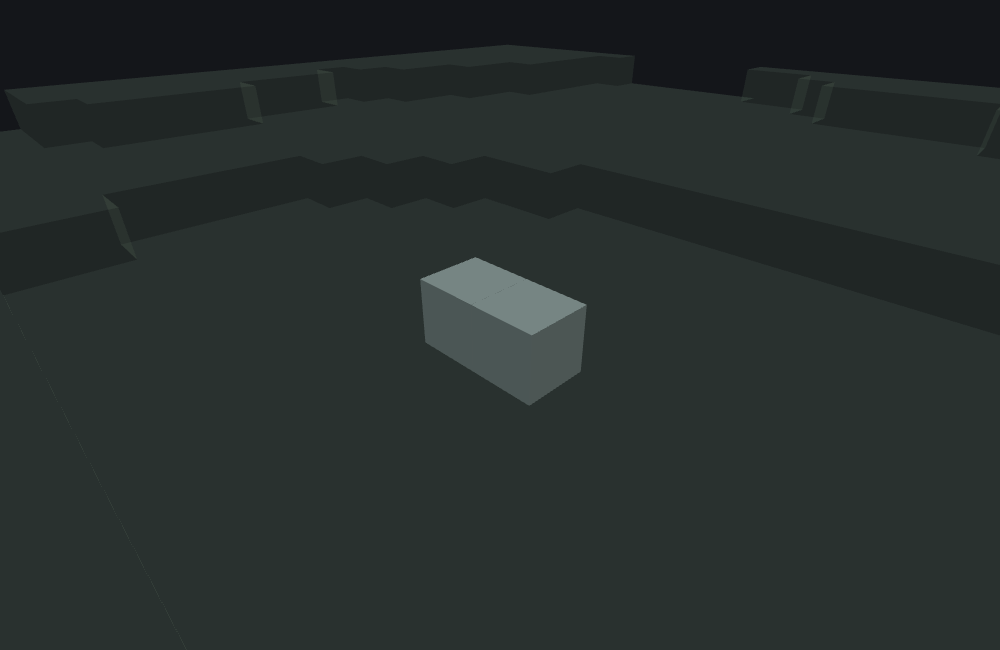

# Multiface Features

This page is a statement about **Minecraft Bedrock 1.26.50.24**
specifically. This feature type's JSON surface — every key, its bounds and its required/optional
status — its placement and its spreading are unchanged between 1.26.40.26 and 1.26.50.24, so the
page describes both versions.
Worldgen internals move between releases; nothing here should be assumed to hold for a different
build without checking.

`minecraft:multiface_feature` is a **Content feature**: it places a single multi-face block
(glow lichen, sculk vein) at or near the origin, optionally spreading a copy one step further
if `chance_of_spreading` fires. Unlike most Content features, it does not simply overwrite the
target position — if the position already holds the same block type, the new face bit is OR-ed
into the existing block's `multi_face_direction_bits` state, so a glow lichen that already
covers a block's north face gains an additional south-face bit rather than being replaced
outright.

## What it does

Given an origin, `place()` runs these steps in order:

1. If the origin is neither air nor water: log `"Location does not contain air or water"` and
   fail. Zero RNG draws, zero writes.
2. Build the candidate direction pool from the three `can_place_on_*` flags — Down if
   `can_place_on_floor`, Up if `can_place_on_ceiling`, North/East/South/West if
   `can_place_on_wall` — in that exact order (see "Direction pool order" below).
3. Attempt the **guarded block write** (below) at the **origin itself**, using the full pool
   as candidate faces. On success, return the origin immediately — no further search.
4. If the pool is empty: log `"No adjacent locations contain air or water"` and fail.
5. Otherwise, for each direction `dir` in the pool (in pool order):
   - `neighborPos` := one step from origin in direction `dir`.
   - If `neighborPos` is neither air, water, nor already the same block type as `places_block`:
     skip to the next direction.
   - Attempt the guarded block write at `neighborPos`, with the pool **minus `dir`'s
     opposite** as candidate faces. On success, return `neighborPos`.
6. If nothing succeeded: log `"No adjacent locations contain air or water"` and fail.

### The guarded block write — face selection, the state-bit write, and spreading

For a given position and a list of candidate faces:

1. **Face selection**: try each candidate face in order. For each, check the **support block**
   one step in that face's direction. Accept the first face whose support block satisfies
   `can_place_on` (or `can_place_on` is empty, i.e. any support is fine). If no face is
   accepted, fail — nothing is written, zero RNG draws.
2. **Support test**: the accepted face's support block also has to be able to hold a face at
   all — a separate question from `can_place_on`, which is optional and gates nothing when you
   omit it. If it cannot, nothing is written, no RNG draw, no spread, and the loop in step 1 does
   **not** resume on the next candidate face: the first `can_place_on`-accepted face is the only
   one ever tried. See the note below for how faithfully this step is modelled.
3. **State-bit write**: if the block already at this position is the same type as
   `places_block`, start from its existing `multi_face_direction_bits` and OR in the accepted
   face's bit. Otherwise, start from `places_block` with just that one bit. If the resulting
   block is identical to what was already there (face was already set), no write and no RNG
   draw.
4. **Spread roll**: only when step 3 actually changed the block, draw one `NextFloat()` from
   the placement's own RNG. If the roll is below `chance_of_spreading`, attempt
   a spread from this position and face (see below).
5. Return success regardless of whether step 3's write actually happened — "success" means
   a valid face was found, not necessarily that the world changed. A face that step 2 refused
   counts as success too, and writes nothing.

::: note
**Step 2 is a stand-in, and a coarse one.** This tool treats a block as able to hold a face when
it is solid or glass, and everything else — air, liquids, plants — as unable to. The game's own
version of that test has not been established here, so it may well be finer-grained than
solid-or-glass: a block that holds a face on some sides and not others would be modelled wrong in
both directions by a whole-block answer. What the step does get right is that it exists and that
it applies to the main placement and to spreading alike, so omitting `can_place_on` does not let
this feature hang a block in open air.
:::

### Direction pool order

::: warning
**The order faces are tried in is this tool's declared pool order, not the game's
shuffle.** The game shuffles the candidate-face list — both the full list and the
list with one face removed — drawing from a generator seeded from OS entropy,
with **no connection to the world seed**. That shuffle costs zero draws from the placement's
own `Random`, so it cannot affect ANY other feature's RNG sequence, but it does mean the
game's own face-pick order is not reproducible from the world seed at all.

This tool uses the pool's own declared order — Down, Up, North, East, South, West (filtered
by the three `can_place_on_*` flags) — deterministically. This cannot change **whether** a
block is placed at a position, only **which** of several simultaneously-valid faces receives
it: if the north and east faces both pass `can_place_on`, a real game run might pick east
first (depending on that run's own random state), while this tool always picks north
(the earlier pool entry). No implementation — including the game's own — can reproduce the
face pick order run to run.
:::

### Multi-face state bits

`multi_face_direction_bits` is a 6-bit integer state (values 0–63) where each bit represents
one face: Down=1, Up=2, North=16, South=4, West=8, East=32. When a multiface block is placed
at a position that already holds the same block type, the new face's bit is OR-ed into the
existing value — a glow lichen already covering the floor (bit 1) that gains a ceiling
attachment becomes bits 1|2 = 3, not a fresh block with only bit 2.

## Spreading

When `chance_of_spreading` succeeds (a single `NextFloat()` roll), the feature spreads:
it shuffles all six facing directions, then tries each
in order until one produces a block-changing placement. For each shuffled direction `toward`,
the spreader tries three modes in fixed order:

1. **Mode 0 (same position)**: add `toward`'s bit at the current position.
2. **Mode 1 (move to neighbor)**: step one block toward `toward` and, if that position is
   air/water/same-block-type, add the original face's bit there.
3. **Mode 2 (wrap around corner)**: step one block along the original face (off the support),
   then one block toward `toward` (sideways), and add `toward`'s opposite face's bit at the
   result — the "grow around a convex corner" case.

The first mode that produces a block change wins and the spread stops. All three modes require
a solid or glass block on the target face for support.

::: warning
**Multiface spreading is deterministic in this tool and non-deterministic in the game.** The
game shuffles spread directions from a generator seeded from OS entropy,
with no connection to the world seed. The same world, same seed, and same chunk produce a
**different** spread on every run of the game.

This tool deliberately derives its spread shuffle from a separate generator seeded from the
world seed mixed with the spread position, so previews stay reproducible while you edit.
Spread blocks may therefore sit differently than in your world. No implementation — including
the game's own — can reproduce spread layout run to run.

The `chance_of_spreading` roll itself (whether spreading is attempted at all) uses the
placement's own world-seeded RNG and IS reproducible — only the direction the spread walks
once it fires is non-reproducible in the real game.
:::

## Example

```json title="multiface_feature -- glow lichen on stone/grass/dirt, all faces, 50% spread"
{
  "format_version": "1.21.110",
  "minecraft:multiface_feature": {
    "description": { "identifier": "wiki:glow_lichen" },
    "places_block": "minecraft:glow_lichen",
    "search_range": 10,
    "can_place_on_floor": true,
    "can_place_on_ceiling": true,
    "can_place_on_wall": true,
    "chance_of_spreading": 0.5,
    "can_place_on": ["minecraft:stone", "minecraft:grass_block", "minecraft:dirt"]
  }
}
```

Run against this project's `plains` environment preset with feature seed `1` and origin
`(0, 64, 0)` — which is **two** blocks above the grass surface, since that preset's top solid
block at `(0, 0)` is `Y 62` — this places 2 glow lichen blocks, at `(0, 63, 0)` and
`(-1, 63, 0)`. Neither is at the origin: the origin cell has no eligible neighbour (its Down
neighbour at `Y 63` is air, not one of the `can_place_on` blocks), so the origin attempt fails
and placement falls through to step 5 of the algorithm above, which tries the Down neighbour —
`(0, 63, 0)`, where the grass_block below *is* eligible — and spreads once from there:



```
featurelab generate --pack <pack> --feature wiki:glow_lichen --env plains --seed 1 --origin 0,64,0
```

## Field reference

| Field | Required | Shape | Bounds |
|---|---|---|---|
| `places_block` | yes | block descriptor | — |
| `search_range` | yes | integer | `[1, 64]` |
| `can_place_on_floor` | yes | boolean | — |
| `can_place_on_ceiling` | yes | boolean | — |
| `can_place_on_wall` | yes | boolean | — |
| `chance_of_spreading` | yes | number | `[0.0, 1.0]` |
| `can_place_on` | no | array of block descriptors, min 1 when present | empty — any support accepted |

All seven fields except `can_place_on` are required — the build fails if any is missing.
`can_place_on`, when omitted, means any solid/glass block can serve as support.

### `search_range`

`search_range` is schema-bounded to `[1, 64]` and nominally controls how many retry attempts
the game makes at each neighbor position's guarded block write. In practice, a
failing attempt at a given position with a given candidate-face list is guaranteed to fail
identically on every retry (zero RNG draws, zero writes on failure, same world state), so this
tool makes exactly one attempt — observably identical to the game's up-to-`search_range`
attempts.

### `can_place_on_wall`

Setting `can_place_on_wall` to `true` adds four directions to the pool — North, East, South,
West — in that exact order. All four are added together or not at all; there is no per-wall-face control.

## See also

- [Single Block Features](./single-block-feature.md) — the other Content feature that places
  exactly one block at the origin, contrasted here by the state-bit OR vs. a plain overwrite.
- [Scatter Features](./scatter-feature.md) — the usual way to place multiple multiface blocks
  across a region: wrap a `multiface_feature` in a `scatter_feature` and delegate at each
  offset.

## Version and verification notes

Everything above is a statement about 1.26.50.24, and holds equally for
1.26.40.26: this type's JSON surface, its placement and its spreading are unchanged between the
two versions, including the non-reproducible shuffle, so the two warnings above about
reproducibility hold for both versions exactly as written.

What it does not claim: the game's own test for whether a block can hold a face at all — step 2 of
the guarded block write — is not modelled exactly, and the note at that step says what stands
in for it. The JSON example on this page was run end to end against this project's own worldgen
tooling (`featurelab check` and `featurelab generate`, 1.26.50.24 target) and produced the
described result — the two placed positions quoted above come from that run; the
accompanying image was rendered from that exact result by this doc set's own image pipeline (see
[`docs/wiki/tools/`](./tools/generate-images.mjs)).
