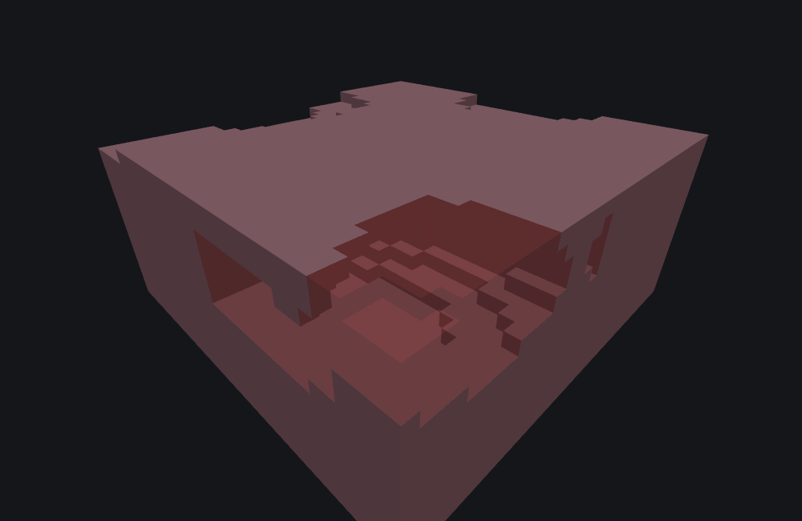

# Nether Cave Carver Features

This page is a statement about **Minecraft Bedrock 1.26.50.24**.
This carver behaves identically in 1.26.40.26 and 1.26.50.24, so the page holds for
either. Worldgen internals do move between releases; nothing here should be assumed to hold for a
build outside those two without checking.

`minecraft:nether_cave_carver_feature` is a **Carver feature**: it overwrites existing terrain
with `fill_with` wherever a tunnel's own shape reaches, rather than adding anything. Everything
the [Cave Carver](./cave-carver-feature.md) page says about what that means for a preview — a
carve adds nothing to look at, `featurelab generate` reports it as `blocksCarved` rather than
`blocksPlaced`, and `/placefeature` can never demonstrate one because the carve path is only
reached during chunk generation — applies here unchanged.

::: note
**Naming.** This version's id is `minecraft:nether_cave_carver_feature`. Older material (such as
wiki.bedrock.dev's current page) shows `minecraft:hell_cave_carver_feature` instead — that is the
same carver under its previous id, and the old id does not resolve here.
:::

## It shares the front door and nothing else

The three carvers all begin identically. `place()` reads its own placement seed, draws two odd
multipliers from it, and walks a **17×17 grid of chunks** centred on the chunk containing the
origin — 289 neighbours — reseeding the shared stream from each neighbour's own coordinates and
asking that neighbour to contribute room and tunnel systems. The seed-mixing formula and the
window are the same for all three, so all three visit the same 289 neighbours with the same 289
seeds. The [Cave Carver](./cave-carver-feature.md#what-it-does) page describes that architecture
in full, and it is worth reading first.

Past that point this type shares no behaviour with its siblings. It has its own per-neighbour
step, its own room, its own tunnel walk and its own per-cell carve. The same JSON body under the two ids therefore does not produce the same
cave system, even at the same seed.

The differences that actually change the result are below, and three of them are fields that
look configurable and are not.

## Three of the eight fields do nothing here

The Nether carver accepts the same eight fields the base carver does — the loader takes them, and
`featurelab check` reports no problem with them — but only five reach anything.

**`height_limit` and `y_scale` are inert.** The base carver clamps every ellipsoid's upper bound
against `height_limit`; this one does not read it at all. Its vertical range is fixed, and no
field moves it: a system's anchor Y is a uniform draw over **0–127**, and every row it writes is
clamped into **3–120** on the way out, whatever the JSON says. (Checked by running the fixture in
a bench 128 rows tall: the highest cell any seed writes is world Y 120, exactly.) `y_scale` is
read by the base carver's rooms and by nothing here.

Verified directly: the same fixture with `height_limit: 8` and `y_scale: {range_min: 0.1,
range_max: 9.0}` added produces the identical 423 cells at the identical positions as the same
fixture without them.

**`horizontal_radius_multiplier` and `vertical_radius_multiplier` change the cave, but never its
radii.** A tunnel step's horizontal radius here is derived entirely from the system's own
`thickness` draw, its taper along the walk, and `width_modifier`; the vertical radius is that
number times a fixed per-walk scale. Neither multiplier is ever applied to either.

They are still *drawn*, though, and that is not nothing. A range field with `range_min !=
range_max` spends one draw; a degenerate one spends none. So on this type the two multipliers
move the RNG stream and change the cave that way, while the values themselves are discarded.
Measured, same fixture, same seed, same bench:

| `vertical_radius_multiplier` | Cells carved |
|---|---|
| `{0.7, 1.4}` | 1,322 |
| `{6.0, 9.0}` | **1,322**, at the same positions |
| `{0.0, 0.001}` | **1,322**, at the same positions |
| `{1.0, 1.0}` (degenerate — no draw) | 423 |
| `{6.0, 6.0}` (degenerate — no draw) | 423 |

Three different non-degenerate ranges give byte-identical output; two different degenerate ones
give a different byte-identical output. Only "does this field draw?" is observable.

**`floor_level` is live**, and is read by rooms and tunnels alike, exactly as on the base carver:
its default of `0` carves only the upper half of every ellipsoid. Same fixture, same seed, both
spellings degenerate so neither spends a draw: `{-1.0, -1.0}` carves 105 cells and `{0.0, 0.0}`
carves 58.

`fill_with`, `width_modifier` and `skip_carve_chance` all behave as the base carver's page
describes.

## `fill_with` is the one field you must write

::: warning
**Always write `fill_with` on a Nether carver.** The game's own loader marks it optional and will
accept a file without it — but unlike the base carver, which checks for a missing value before
writing and simply skips the write, this type hands the field straight to the block API the first
time it carves anything. There is no "omitted" behaviour to fall back on.

This tool is deliberately stricter than the game here and **refuses to load the file at all**,
with an error saying why, rather than reproducing what an unwritten value does. That is the one
place on this page where the tooling does not match the loader, and it is on purpose.
:::

## What it will dig — a very short list

This is the biggest practical difference between this carver and its siblings, and the fastest
way to conclude the feature is broken when it is working perfectly.

**The Nether carver digs exactly three things:** `minecraft:netherrack`,
`minecraft:grass_block`, and the dirt family (`minecraft:dirt` and `minecraft:coarse_dirt`).

That is the whole list. Not stone. Not deepslate. Not soul sand, soul soil, basalt, blackstone,
nether brick, magma, gravel, quartz ore or ancient debris. Anything else is left completely
untouched even where the tunnel geometry reaches it, so a Nether carver run over anything but
netherrack (or a patch of dirt or grass) writes nothing and reports success.

Measured with this page's own fixture, same seed, same origin: **0 cells** in this project's
`underground_stone` bench, **1,322** in its `nether` bench.

::: note
The `nether` environment preset hollows a cavern through the middle of its netherrack, and
**air is not on the list either** — so the carve in the figure below appears in two separated
bands, in the solid netherrack under the cavern and over it, with the open space between them
left alone. That is the diggable list working, not a gap in the carve.
:::

## Lava stops a tunnel step before it starts

Before carving a step's ellipsoid, this carver scans the region that ellipsoid would touch for
`minecraft:lava` or `minecraft:flowing_lava`, and **if it finds any, the whole step is skipped** —
not the individual cells near the lava, the entire ellipsoid.

The scan is not a full box sweep. The edge columns of the region are checked over their whole
height plus a two-row margin above and below; the interior columns are checked at only three
rows — two above the region's top, and one and two below its bottom. So the carver is looking for
lava it would *break into* — a lava sea below, a pool the tunnel would open from the side — rather
than lava embedded in the middle of the rock it is digging through.

This is the mechanism that keeps Nether tunnels from routinely draining the lava sea into
themselves. It also means a carver configured to dig near the lava level will produce visibly
fewer, shorter tunnels there than the same configuration higher up, with nothing in the JSON to
explain it.

The base and underwater carvers have no equivalent — the base carver's lava handling is a
per-cell check inside its own carve, not a step-level veto.

## The walk, in the shape an author can predict

Per contributing neighbour chunk, after the `skip_carve_chance` roll:

1. A count of **0–9**, drawn three times and narrowed each time (a draw from 0–9, then one from
   0 up to that, then one from 0 up to *that*), so low counts dominate and 0 is much the most
   likely outcome. The base carver runs the same three-draw shape from a bound of **40** rather
   than 10, so a Nether chunk contributes far fewer systems than an overworld one from the same
   `skip_carve_chance`.
2. Each system picks an anchor anywhere in that neighbour's own 16×16 column, at a **uniform Y in
   0–127**.
3. A **1-in-4** chance the system opens with a **room**. The room is not a separate shape and has
   no geometry of its own: it is one call into the same tunnel walk, stopped after a single step,
   taken at the point of the walk where the taper is widest, with a thickness drawn between 1 and
   7. When it fires, the system then runs **1 to 4** tunnels; when it does not, exactly one.
4. Each tunnel walks **85–112** steps (112 minus a draw of 0–27), drifting its yaw and pitch a
   little each step. The pitch decays towards horizontal by a factor drawn **once per tunnel**:
   `0.7` normally, and `0.92` on a 1-in-6 draw — the occasional tunnel that keeps its slope
   instead of flattening out.
5. Every step carves a small ellipsoid, except that a non-room tunnel **skips the carve on a
   1-in-4 draw** — the reason a Nether tunnel reads as a chain of connected chambers rather than
   a smooth bore.
6. At one step partway along — drawn per tunnel, somewhere between a quarter and three quarters
   of the way — a tunnel whose thickness is over 1 **forks**: two children at right angles to the
   parent's heading, each a third of its pitch, each walking the parent's remaining steps, and
   the parent stops there rather than continuing past the fork. Rooms never fork.

Every ellipsoid from every system anchored in every one of the 289 neighbours is tested against
the chunk actually being generated, and only the ones that geometrically reach into it write
anything.

## Field reference

| Field | Required | Shape | Effect here |
|---|---|---|---|
| `fill_with` | **yes, in this tool** | block descriptor | the block every carved cell becomes |
| `width_modifier` | no | number or Molang expression string | added to every tunnel step's radius |
| `skip_carve_chance` | no | non-negative integer, exclusive upper bound | skips a whole neighbour's contribution; `1` means never — see the [Cave Carver page](./cave-carver-feature.md#field-reference) for why `0` and `1` are not interchangeable |
| `height_limit` | no | integer | **none** — read and discarded |
| `y_scale` | no | number, `[min, max]`, or `{range_min, range_max}` | **none** — read and discarded |
| `horizontal_radius_multiplier` | no | same three shapes | **no geometric effect**; a non-degenerate range still spends a draw |
| `vertical_radius_multiplier` | no | same three shapes | **no geometric effect**; a non-degenerate range still spends a draw |
| `floor_level` | no | same three shapes | live — default `0` carves only the upper half of every ellipsoid |

::: warning
**Range fields are spelled `range_min` / `range_max`.** `{ "min": …, "max": … }` is not rejected —
it logs an error and substitutes a zero-width `{0, 0}` range. On this type that is doubly easy to
miss, because for the two radius multipliers it produces no visible change in shape at all; it
only quietly turns a drawing field into a non-drawing one and moves the whole cave. `featurelab
check` refuses the wrong spelling per field.
:::

## Example

```json title="nether_cave_carver_feature -- tunnels through solid netherrack"
{
  "format_version": "1.21.110",
  "minecraft:nether_cave_carver_feature": {
    "description": { "identifier": "wiki:nether_cave_demo" },
    "fill_with": "minecraft:air",
    "width_modifier": 0.0,
    "skip_carve_chance": 1,
    "horizontal_radius_multiplier": { "range_min": 1.0, "range_max": 1.0 },
    "vertical_radius_multiplier": { "range_min": 0.7, "range_max": 1.4 },
    "floor_level": { "range_min": -1.0, "range_max": -0.7 }
  }
}
```

`height_limit` and `y_scale` are left out deliberately — they would be accepted and would do
nothing, and this file is meant to be copyable.

Run against this project's `nether` environment preset with feature seed `3`, **at origin
(96, 48, 96)**, this carves 1,322 cells, every one of them inside world X/Z `96..111` — the
origin's own 16×16 chunk column, at those coordinates — in two bands at world Y `30..38` and
`64..71`:



```
featurelab generate --pack <pack> --feature wiki:nether_cave_demo --env nether --seed 3 --origin 96,48,96
```

::: note
**The non-zero origin is the point of this example, not a detail of it.** A carver's footprint is
world-space: it lands in the chunk column that actually contains the origin, and nowhere else. At
origin `(0, 48, 0)` a chunk-local mistake and a world-space one produce exactly the same picture,
because the two coordinate systems agree there — so an example rooted at the origin cannot
distinguish them. This one can, and does: 96..111, not 0..15.

The same seed at origin `(0, 48, 0)` carves 9 cells inside X/Z `0..15`. That is not "less of the
same cave" — it is a different chunk's own carve result, computed from seeds the other call also
drew from but never got to apply. See the [Cave Carver
page](./cave-carver-feature.md#the-same-carver-one-chunk-over) for the same comparison made with
two pictures.

The image is a cutaway, sliced between world Y 24 and 37, for the same reason the Cave Carver and
[Ore](./ore-feature.md#example) pages slice theirs: a cave sealed inside solid rock is fully
face-occluded from outside and renders as an ordinary solid block. The cut keeps the lower of the
two carved bands, which is the one that reads as a room-and-tunnel network.
:::

## See also

- [Cave Carver Features](./cave-carver-feature.md) — the base carver. Read it for the per-chunk
  architecture this type shares, and for the fields that behave the same way on both.
- [Underwater Cave Carver Features](./underwater-cave-carver-feature.md) — the third carver,
  which inherits the base carver's behaviour wholesale and diverges only in what it writes per
  cell. The opposite shape of divergence from this one.
- [Feature Rules](./feature-rules.md) — how a carver reaches a world at all. Carvers are the only
  feature type the `pregeneration_pass` accepts, and a carver placed by hand on already-generated
  terrain does nothing.

## Version and verification notes

Everything above holds for **1.26.50.24** and, because this type is behaviourally
identical between the two versions, for 1.26.40.26 as well. All three carvers use the same
odd-number adjustment in their seed mixing.

Every number quoted on this page — the two inert-field comparisons, the five-row radius
multiplier table, the `floor_level` pair, the 0-versus-1,322 diggable-list measurement and the
example's own counts and coordinates — was produced by running the exact JSON above through this
project's own tooling and reading the counts and coordinates back out of the result. That is the
part of this page a reader can reproduce.

This carver's coordinate handling in this tool was wrong until recently: chunk-local X and Z
reached a world-space block API, which meant it carved correctly at origin 0 and carved *nothing*
anywhere else. It was fixed, and the fixture and figure above are rooted at a non-zero origin
specifically so that the same mistake cannot be made again without a picture on this page
changing.
