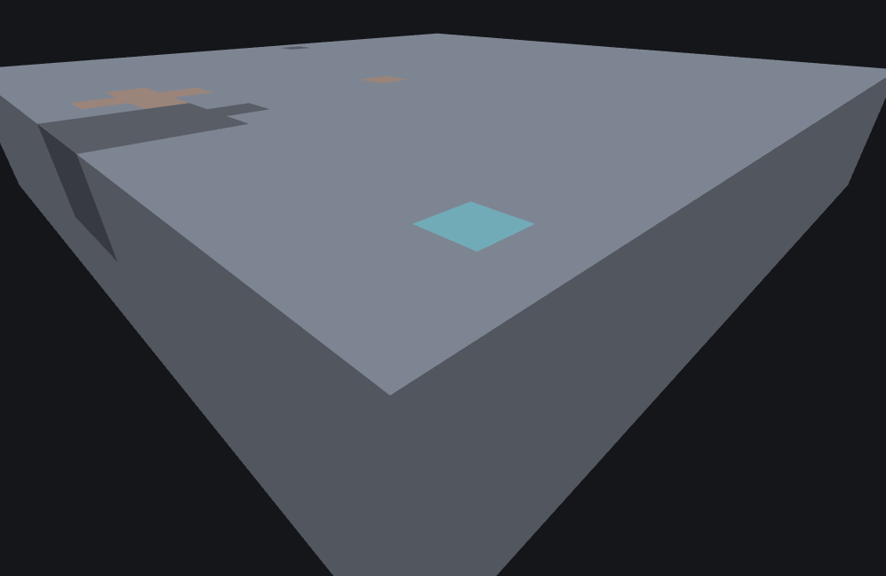

# Ore Features

This page is a statement about **Minecraft Bedrock 1.26.50.24**
specifically. `ore_feature`'s JSON surface — every key, enum value and default — and its
behaviour are unchanged between 1.26.40.26 and 1.26.50.24, so this page
describes both versions. Worldgen internals move between releases; nothing here should be assumed to
hold for a different build without checking.

`minecraft:ore_feature` is a **Content feature**: it places an ellipsoidal vein of blocks along
a randomly-angled axis through its origin, resolving each candidate cell against an ordered list
of replace rules. Unlike [Single Block Features](./single-block-feature.md) and
[Scatter Features](./scatter-feature.md), it is a self-contained leaf — it never delegates to
another feature, so a whole vein is placed in one call.

## What it does

1. Draw a random **angle** and derive two endpoints, offset `+8` on X and Z from the origin (see
   the note below — this is a preserved detail from the classic vanilla vein algorithm, not an
   approximation).
2. Draw **two** independent Y bounds, each `origin.y + random(0..2) - 2`.
3. Fail if `replace_rules` is empty. The field is **optional** in the schema, so a file that omits
   it loads without complaint and then simply never places a block — the failure is a
   placement-time one, not a load-time one. Optional is not the same as "may be empty", though:
   if you write the key as `"replace_rules": []`, the file is rejected at LOAD time instead, with
   a content-log line of the form *Array too small (0 < 1)*. Leave the key out if you want the
   place-nothing behaviour. Note where in the order this check sits: *after* the
   three draws above, not before them. A vein with no rules still consumes three values from the
   feature's random stream, so removing the rules from a file shifts everything placed after it in
   the same chain rather than leaving the chain untouched.
4. For each of `count` spheres along the line between those endpoints: lerp its center (no RNG),
   then draw one random value to size its radius. Radius follows a sine curve along the vein's
   length, so spheres near the two ends are small and spheres near the middle are largest —
   a lens shape, not a uniform tube.
5. Prune spheres that are fully enclosed by a later sphere (pure geometry, no RNG) — the last
   sphere in the list is always kept.
6. Walk every cell inside the surviving spheres' union. For each occupied cell, walk
   `replace_rules` **in order**; the first rule whose `may_replace` matches the cell's current
   block, and whose `discard_chance_on_air_exposure` gate (below) doesn't reject it, writes that
   rule's `places_block` and moves on to the next cell.

::: note
**The vein's endpoints are offset `+8` on X and Z from the origin — it is not centered on the
position you asked it to place at.** This is a literal, preserved artifact of the classic
vanilla ore-vein algorithm (the `+8.0` is part of the endpoint math): it cancels out of the
endpoint-to-endpoint *direction*, but not out of the spheres' *absolute* centers. A `count: 9`
vein placed at origin `(0, 32, 0)` centers around roughly `(8, 31, 8)`, not `(0, 32, 0)` — worth
knowing before you conclude a vein "isn't showing up" at the position you placed it at.
:::

### `discard_chance_on_air_exposure`

Rolled **per rule-match attempt** — once a cell's block already matched a rule's `may_replace`,
not once globally for the whole vein — against whether that specific cell is exposed to air on
any of its 6 faces:

| `discard_chance_on_air_exposure` | Behavior |
|---|---|
| `<= 0` (default `0`) | Always place. No roll, no exposure check. |
| `>= 1.0` | Always check exposure — but the roll itself is skipped (short-circuited), since no value could make it fail. Exposed cells are discarded unconditionally. |
| between `0` and `1.0` | Roll once; only if the roll is **less than** the configured chance does the feature even check exposure. Only an exposed cell that also passed that roll is discarded. |

A rejected cell isn't left alone — the walk falls through to the *next* matching rule at that
same position, if one exists, rather than giving up on the cell entirely.

## Example

```json title="ore_feature -- a 9-sphere diamond vein through stone"
{
  "format_version": "1.21.110",
  "minecraft:ore_feature": {
    "description": { "identifier": "wiki:diamond_vein" },
    "count": 9,
    "discard_chance_on_air_exposure": 0.5,
    "replace_rules": [
      {
        "places_block": "minecraft:diamond_ore",
        "may_replace": ["minecraft:stone"]
      }
    ]
  }
}
```

One rule: replace stone with diamond ore, discarding half of the cells that would otherwise
break into open air. Run against this project's `underground_stone` environment preset (solid
stone, no caves) with feature seed `1`, this places 10 diamond-ore blocks in a small cluster
around world `(7–9, 30–32, 7–8)` — note the `+8` offset from the requested origin `(0, 32, 0)`
described above.

`underground_stone` has no natural air pockets, so `discard_chance_on_air_exposure` never
actually rejects a cell here (nothing is ever exposed) — every one of the vein's matching cells
gets placed. An ore vein fully buried in solid rock is, correctly, invisible from directly
outside it — face-culled rendering shows nothing at all for a cell with solid neighbors on every
side, the same as it would be in-game — so the image below is a *cutaway*, not a plain render:
sliced to the vein's own top layer (world Y 29–32, exposing its top face instead of burying it
under more stone) and rendered with the surrounding rock **solid**, not ghosted, so the stone
reads as actual material and not empty space. Both are viewing choices, not a change to what the
feature placed. The preview volume itself is also deliberately narrowed to `22x48x22` (vs. the
32-wide default) for this one image: `frontend/src/mesher.ts`'s face culling never draws a face
whose neighbor is outside the *volume's own bounds*, slice or no slice, so shrinking the preview
brings that boundary close enough to the vein to read as a rock wall in the shot, without the
wall actually touching the vein — touching it changes the real result (see the note below) rather
than just the view:



```
featurelab generate --pack <pack> --feature wiki:diamond_vein --env underground_stone --seed 1 --size 22x48x22
```

::: note
**`--size` is a preview-bench control, not an engine one, and shrinking it too far changes the
real result, not just the view.** `discard_chance_on_air_exposure`'s exposure check (above) reads
the block at each of a candidate cell's 6 neighbor positions; with this
exact JSON, a neighbor position that falls *outside the previewed volume* reads back as
non-solid — there is no real block there for the bench to report, so the query treats it as air,
which the exposure check cannot tell apart from a real air pocket. Shrinking `--size` so the
volume boundary lands directly against the vein (`--size 20x48x20`, tried while producing this
image) spans world x `-10` to `9`, so this same seed's two `x = 9` cells, `(9, 31, 8)` and
`(9, 32, 8)`, have a neighbor at `x = 10` that is off the edge of the preview; both register as
"exposed", and `discard_chance_on_air_exposure: 0.5` then discards both, leaving 8 blocks placed
instead of 10. Setting the same file's `discard_chance_on_air_exposure` to `0` and re-running at
`20x48x20` brings all 10 back, which is the check that the two missing cells are the gate reacting
to the preview edge rather than the geometry changing. That is a limitation of this project's own
preview bench (an unbounded world has no such edge), not a claim about the game, and not what the
image above shows: `22x48x22` was chosen specifically because it keeps the boundary one full cell
away from every vein cell, and it reproduces the same 10 cells at the same positions as the
unshrunk default volume.
:::

## A second rule, and what the gate does to it

The example above has one rule and lives in cave-free stone, so its `discard_chance_on_air_exposure`
never actually rejects anything — the gate and the fall-through it feeds are described in step 6
and then never exercised. This second example does exercise both:

```json title="ore_feature -- a surface-breaking vein with a fallback rule"
{
  "format_version": "1.21.110",
  "minecraft:ore_feature": {
    "description": { "identifier": "wiki:surface_clay_vein" },
    "count": 12,
    "discard_chance_on_air_exposure": 0.5,
    "replace_rules": [
      {
        "places_block": "minecraft:clay",
        "may_replace": ["minecraft:dirt", "minecraft:grass_block"]
      },
      {
        "places_block": "minecraft:gravel",
        "may_replace": ["minecraft:dirt", "minecraft:grass_block"]
      }
    ]
  }
}
```

Two rules with the **same** `may_replace` list. That looks redundant and is not: because the first
rule matches everything the second one does, the second is reachable *only* through the
fall-through — at a position the first rule matched and the exposure gate then rejected. Whatever
gravel comes out of this file is a direct sighting of "the walk falls through to the next matching
rule" actually happening.

Run against `plains` — not `underground_stone`; the whole point here is a vein that reaches
daylight — with feature seed `1`:

```
featurelab generate --pack <pack> --feature wiki:surface_clay_vein --env plains --seed 1
```

the origin resolves to `(0, 63, 0)`, and the `+8` offset described above puts the vein's cells at
world `x 6–9, y 61–63, z 7–8`. The plains column there is grass at `y 63` over dirt at `y 60–62`,
so the vein's own top row is exactly the part of it that touches air, and the rows beneath it are
sealed.

Eleven blocks are written: ten `minecraft:clay` and one `minecraft:gravel` at `(9, 63, 8)`. The
ten clay cells all sit at `y 61–62`, buried on all six faces — the roll still happens there, and
sometimes comes up under `0.5`, but the exposure check it gates then finds solid material in every
direction and nothing is discarded. Exactly one of the vein's cells reaches the top row at `y 63`,
and that one is the gravel: the first rule rolled under `0.5`, saw open sky, and discarded the
cell; the walk moved on to the second rule, whose own fresh roll came up at or above `0.5`, and the
gravel block is what that rescue looks like from outside. One cell is a thin sighting, but it is an
unambiguous one — the first rule cannot produce a gravel block at all, so nothing else could have
put it there.

Editing your own copy of this file to set `discard_chance_on_air_exposure` to `0` and re-running
the same command is the check: the same eleven cells come back, every one of them clay.

::: warning
**A second rule is not an `else` branch.** `discard_chance_on_air_exposure` is a *feature-level*
field, not a per-rule one, so a cell that falls through meets the same gate again, at the same
chance, with only the roll being new. There is no way to spell "clay where I am buried, gravel
where I am exposed" in two rules: at `0.5` the second rule rescues an exposed cell only about half
the time, and at `>= 1.0` it rescues nothing at all — that value skips the roll entirely and
discards every exposed cell unconditionally, in the second rule exactly as in the first.
:::

::: note
The roll is spent on **every** rule match, exposed or not: the roll gates the exposure *check*, not
the other way round (see the table above). This vein therefore spends eleven rolls getting its
eleven cells through the first rule — including the ten buried ones that were never near air — plus
one more for the single cell that fell through to the second, twelve in all. Its whole run is 27
draws: one for the angle, two for the Y bounds, twelve to size its twelve spheres, and those twelve
gate rolls. What the rolls cannot do is move the vein: the angle, both endpoints, every sphere
centre and every radius are drawn in steps 1–4, before a single cell is looked at, so turning this
gate on and off changes which of a vein's cells get written and never which cells were candidates
in the first place.
:::

## Field reference

| Field | Required | Shape | Default |
|---|---|---|---|
| `count` | yes | positive number | — |
| `replace_rules` | no | non-empty array of `{places_block, may_replace}` | — (a feature that OMITS the key loads, and then never places anything: see step 3) |
| `replace_rules[].places_block` | yes | block descriptor | — |
| `replace_rules[].may_replace` | no | array of block descriptors | no constraint (matches nothing without this — see below) |
| `discard_chance_on_air_exposure` | no | number | `0` (never discard) |

::: warning
An empty or absent `may_replace` on a rule is **not** the same "no constraint, matches anything"
shorthand `may_replace` has on a single_block_feature — the game runs the same list-membership
test on a rule either way, so a rule with nothing in its list simply never fires in
practice. Always give `replace_rules[].may_replace` an explicit list (`["minecraft:stone"]` and
similar) for the block(s) the vein is meant to cut through.
:::

## Coverage note

This page used to disclose here that the bench computed a vein's geometry in 64-bit floating point
where the game uses 32-bit. **That gap is closed.** The axis angle, both endpoints, every sphere
centre, every radius, the enclosure test and the cell membership test are all 32-bit now, in the
game's own operation order and using its precomputed `1/count` reciprocal rather than a division
per sphere. Closing it moved nothing by itself — measured across 1,980 vein placements spanning
eleven counts and sixty seeds, not one cell changed.

What *did* move every vein was a second thing fixed alongside it: a cell
belongs to a sphere when the cell's **centre** is inside it, and this bench had been testing the
cell's corner, which laid every vein half a block off in each axis. Veins previewed by this tool
moved by that half block, and they are now where the game puts them. The examples and images above
were re-derived after the fix.

One narrower difference remains, and it is the larger of the two in magnitude. The sine and cosine
that set the vein's axis and its radius curve are computed at full precision here, where the game
reads them from a coarse lookup table — a difference of roughly one part in ten thousand in the
angle, enough to move a boundary cell of a vein now and then. Several other feature types share
that lookup, so it is being closed once, in one place, rather than separately here.

## See also

- [Single Block Features](./single-block-feature.md) — a simpler Content feature that places one
  block per call, contrasted with ore_feature's whole-vein-per-call shape.
- [Molang in World Generation](./molang-in-world-generation.md) — `math.random`/`math.die_roll`
  draw from the same `Random` stream this page's angle/radius/exposure rolls do, for a feature
  higher up a delegation chain that also uses Molang.
- [Geode Features](./geode-feature.md) and [Cave Carver Features](./cave-carver-feature.md) —
  two more self-contained leaves that write a whole ellipsoid-derived structure in one call with
  no delegation, contrasted here by shape and, for the carver, by direction (it removes material
  instead of adding it).

## Version and verification notes

Everything above is a statement about 1.26.50.24 specifically, and holds
for 1.26.40.26 as well: this feature type's JSON surface and its placement are unchanged between
the two versions. `features/ore.go`'s own header comment carries the details.

Both JSON examples on this page were run end to end against this project's own worldgen
tooling (`featurelab check` and `featurelab generate`) and produced the described results, which is
also how a reader can reproduce them. Two figures do not come from the
commands printed beside them, and both are named as control runs in the text that uses them: the
`20x48x20` count in the first example's `--size` note, and the "same eleven cells, all clay" result
in the second, each come from re-running the same file with `discard_chance_on_air_exposure` set to
`0` — the edit each passage asks the reader to make for themselves. The accompanying image was
rendered from that exact result by this doc set's own image pipeline (see
[`docs/wiki/tools/`](./tools/generate-images.mjs)), sliced for visibility as described above.
