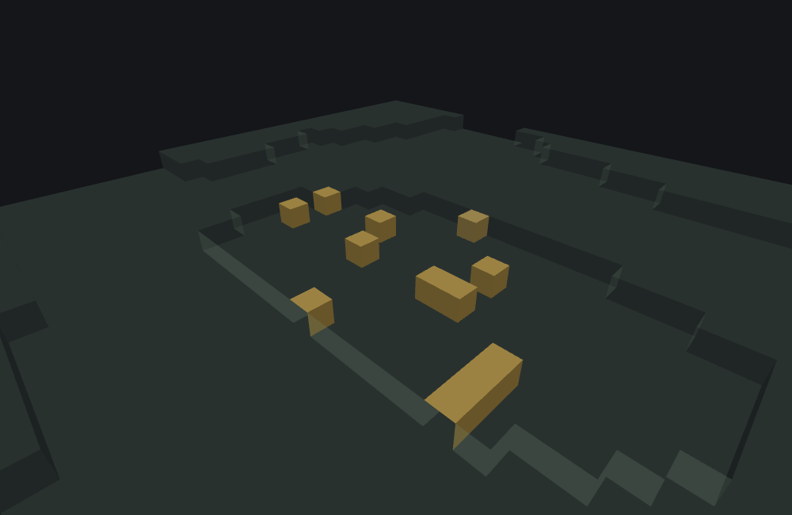

# Scatter Features

This page is a statement about **Minecraft Bedrock 1.26.50.24**
specifically. `scatter_feature`'s JSON surface — every key, enum value and default — is unchanged
from 1.26.40.26, and so is its behaviour: identical draw kinds, identical bounds and identical
ordering, so everything described below is the same in both versions. Worldgen internals move between releases; nothing here should be
assumed to hold for a different build without checking.

`minecraft:scatter_feature` is a **Proxy feature**: it places nothing itself. Instead it
repeatedly picks an offset from its own origin — via a `distribution` block — and delegates to
another feature, named by `places_feature`, at each offset. It is the single most common feature
type in real published packs, precisely because almost everything that isn't "one block, one
spot" (patches, veins scattered across a chunk, undergrowth, decoration) is authored as a
scatter_feature wrapping something simpler, most often a
[Single Block Feature](./single-block-feature.md).

## What it does

1. Resolve `places_feature`. If it doesn't resolve, or this scatter is disallowed from placing
   an internal feature, the whole call fails with no RNG spent.
2. If `project_input_to_floor` is set, descend the origin straight down through air (a pure
   `GetBlock` scan — no RNG) until it lands on solid ground or the world floor.
3. Roll `scatter_chance` once to decide whether to scatter *at all* this call.
4. If it passed, evaluate `iterations` and run that many rounds: each round samples an x/y/z
   offset from `distribution`, adds it to the origin, and delegates to the resolved feature at
   that position — every round runs to completion regardless of whether earlier rounds
   succeeded or failed.

The last **successful** round's result is what this scatter_feature reports as its own — a
round that fails does not erase it. So a scatter whose final iteration failed still returns the
position an earlier one reached, and a scatter is a failure only when *no* round succeeded. That
distinction is load-bearing one level up: this is the value a
[sequence_feature](./aggregate-and-sequence-feature.md#sequence_feature) threads into the next
delegate's origin, and the value an aggregate's `early_out` tests.

### `distribution.x`/`y`/`z` and `coordinate_eval_order`

Each axis is independently either a bare number/Molang string (a fixed offset — evaluated, but
**zero** `Random` draws), or an object naming a `distribution` kind and an `extent: [min, max]`.
Kinds and how many draws each one costs per axis, per iteration:

| `distribution` kind | Draws | Notes |
|---|---|---|
| (bare number/string) | 0 | Fixed value — this is `distribution: "kind"` absent entirely. |
| `uniform` | **0 or 1** | See the warning below — degenerates to 0 draws when `max <= min`. |
| `gaussian` | **0 or 2** | Two draws of the same bound — but that bound is `(max - min) >> 1`, so an axis narrower than 2 has a bound of `0` and spends nothing at all. |
| `inverse_gaussian` | **1, or 3** | The same two draws, plus an unconditional boolean-draw tie-break. When the two halves collapse (extent narrower than 2) only the tie-break is left, so this kind never spends zero. |
| `fixed_grid` | 0 | Deterministic — walks a grid index, no RNG at all. |
| `jittered_grid` | 0 or 1 | Only draws when `step_size >= 2` — and the jitter is bounded by `step_size`, so it never leaves its own grid step. |
| `triangle` | 2 | Always two draws — including when the extent is degenerate, because `nextIntInclusive` skips its draw only when `max` is **strictly** below `min`, and `max == min` still calls `nextInt(1)`. Different distribution shape from gaussian, and **inclusive** of each half's top value (see below). |

::: note
**Which `Random` method each kind calls** is part of a distribution's contract, because it decides
the value ranges as well as the stream. `uniform` draws
`nextInt(max - min)`; `gaussian` and `inverse_gaussian` draw `nextInt(half)` twice (plus a
boolean draw on an exact inverse-gaussian tie); `jittered_grid` draws `nextInt(step_size)`;
`triangle` draws `nextIntInclusive(0, half)` twice, which is `nextInt(half + 1)` — so unlike every
other kind, each of a triangle's two halves **can** produce its top value. `fixed_grid` and a bare
number/Molang string draw nothing at all.
:::

`coordinate_eval_order` (default `xzy` — x, then z, then y) fixes which axis is evaluated first,
second, third — and because axis evaluation order *is* draw order, it changes which random values
end up on which axis whenever more than one axis actually draws. It also decides **which axis's
Molang expression can see which other axis's result**, because the game publishes each axis's
coordinate to Molang the moment it's computed — see [Molang variables](#molang-variables) below.

::: tip The default is `xzy`, and it moves blocks — not just Molang
`y` last is deliberate: a vertical coordinate usually depends on the lateral ones, so evaluating it
last is what lets its expression read them. But the same ordering is the draw order, so the default
is load-bearing in a scatter with no Molang in it at all. Two committed fixtures are identical
except for the key, and both give `y` **and** `z` a genuinely non-degenerate range so the order
decides something:

```
featurelab generate --pack <pack> --feature wiki:rng_scatter_evalorder_default --env void --seed 42 --size 64x16x64
featurelab generate --pack <pack> --feature wiki:rng_scatter_evalorder_xyz     --env void --seed 42 --size 64x16x64
```

Both spend exactly 24 draws and place exactly 8 blocks. They just land the same random values on
different axes, and not one of the eight positions survives the swap (`x` is a constant `5` in both):

| order | resulting `(y, z)`, sorted |
|---|---|
| `xzy` (the default, key omitted) | `(0,16) (1,0) (1,10) (2,12) (3,7) (3,14) (4,2) (5,13)` |
| `xyz` (written out) | `(-3,4) (-3,14) (-1,7) (-1,15) (0,18) (1,6) (3,13) (4,6)` |

The scatter also *returns* a different position — its last iteration — which is what an enclosing
feature sees. If your scatter's `y` and `z` both draw, writing the key out explicitly is worth it:
not because the default is unclear, but because a reader of your file should not have to know this
to predict where the blocks go.
:::

::: note
**A grid axis's index counts DOWN.** `fixed_grid`/`jittered_grid` walk their grid by an
iteration index, and that index runs `iterations - 1` down to `0`, not `0` up. The set
of cells visited is the same either way, but the *order* is reversed — which decides which
placement wins when two grid cells resolve to the same block position, and which position the
scatter returns as its own result (the last round's).
:::

::: warning
**A `uniform` axis silently draws zero random numbers when its extent is degenerate
(`max <= min`)** — the draw is skipped entirely under that condition rather than drawn and
discarded. This matters because
nothing about writing
`{"distribution": "uniform", "extent": [5, 5]}` looks different, at a glance, from a genuinely
random axis — but it behaves exactly like writing the bare number `5`, including consuming
**no** draw, which shifts every subsequent axis's value compared to what you'd get if you
assumed "uniform" always draws.

This is not theoretical: running the same 8-iteration scatter with `distribution.x`
set three different ways (seed 42, `distribution.z` fixed at `uniform, extent:[0,20]` in every
run) produces these `z` outcomes:

| `distribution.x` | resulting `z` values (world Z, sorted) |
|---|---|
| `5` (bare number) | `0, 2, 6, 10, 11, 16, 18` |
| `{"distribution":"uniform","extent":[5,5]}` | `0, 2, 6, 10, 11, 16, 18` — **identical** |
| `{"distribution":"uniform","extent":[5,6]}` | `4, 6, 7, 13, 14, 15, 18` — different |

The bare-number and degenerate-uniform rows are byte-identical; only the genuinely non-degenerate
range shifts the `z` stream. Reproduce it yourself:

```
featurelab generate --pack <pack> --feature wiki:rng_scatter_bare          --env void --seed 42 --size 64x16x64
featurelab generate --pack <pack> --feature wiki:rng_scatter_degenerate    --env void --seed 42 --size 64x16x64
featurelab generate --pack <pack> --feature wiki:rng_scatter_nondegenerate --env void --seed 42 --size 64x16x64
```

(the three `wiki:rng_scatter_*` features and their shared `wiki:rng_marker` delegate are
committed under [`docs/wiki/tools/fixtures/features/`](./tools/fixtures/features/) — see
`rng_scatter_bare.json`, `rng_scatter_degenerate.json`, `rng_scatter_nondegenerate.json`,
`rng_marker.json`; the two `rng_scatter_evalorder_*` files above live there too).
:::

### `scatter_chance`

Gates the *entire* scatter — a failed roll here means zero iterations run, not fewer. Two JSON
shapes: a bare percent (number or Molang string, default **100**, meaning "always scatter, no
RNG spent") or `{numerator, denominator}` (a fraction, drawn via `nextIntBound(denominator) <
numerator`, except when `numerator == denominator`, which is also RNG-free). A percent of
`>=100` is likewise RNG-free — the draw only happens when the outcome is genuinely in question.

::: warning A constant `scatter_chance` outside `0 < chance <= 100` does not mean "never"
The accepted range for a **constant** percent is *above* 0 and up to 100. A value outside it —
`0`, a negative, `150` — is not honoured and is not an error that stops the file loading: the
game reports it in the content log and then uses **100**, so the scatter runs **every time**.
`scatter_chance: 0` is therefore the opposite of what it looks like. To make a scatter place
nothing, set `iterations` to `0` or remove the feature from the rule that calls it.

A **Molang string** is exempt from that check unless it is a constant — an expression that
evaluates to `0` at run time really does skip the scatter, without spending a draw.

Two more values the game rewrites rather than refuses:

- **`numerator` and `denominator` are whole numbers.** A fractional value is truncated toward
  zero before the gate sees it, so `{"numerator": 1.5, "denominator": 4}` is a one-in-four
  chance, not one-and-a-half-in-four.
- **`denominator` must be greater than `numerator`.** If it is not, the game reports it and uses
  a denominator of `1`, which makes the gate pass every time.
:::

### `project_input_to_floor`

When set, the origin descends straight down (no RNG) through air until it hits something solid
or the world floor, *before* `distribution` is evaluated — useful when the scatter's own origin
might land mid-air and every delegated placement should instead be relative to the ground below
it.

### Molang variables

A scatter_feature shares its Molang `variable.`/`temp.` scope, unmodified, with whatever it
delegates to — see [Molang in World
Generation](./molang-in-world-generation.md#scope-lifetime-temp-versus-variable) for scope
lifetime. What it *writes* into that scope, and exactly when, is part of this type's contract:

- **`variable.originx` / `originy` / `originz` — written once, up front**, from this scatter's
  own origin (after `project_input_to_floor`, if set). They stay fixed for the whole call, so
  every expression in the `distribution` block can read the origin regardless of evaluation
  order.
- **`variable.worldx` / `worldy` / `worldz` — written per axis, per iteration**, each holding
  that axis's **absolute** coordinate (the sampled offset plus the origin's own component), the
  moment that axis is evaluated. Consequences worth knowing:
  - An axis expression sees the axes evaluated **before** it in
    `coordinate_eval_order` — under the default `xzy`, `y` is evaluated last, so its expression
    can read both the `x` and the `z` this iteration just produced. (That ordering is the reason
    the default is what it is: a vertical coordinate usually depends on the lateral ones.) It sees the axes evaluated *after* it as whatever the **previous iteration** left
    (or whatever an enclosing feature left, on the first iteration).
  - `iterations` and `scatter_chance` are evaluated *before* any axis, so they read whatever
    `world*` already held — **not** this scatter's origin. Use `origin*` if you want the origin.
  - After the call, `world*` holds the last iteration's absolute position, which is what a
    delegated feature's own Molang reads unless that feature overwrites it.


### Before 1.21.10 the parameters were flat, not nested

The nested `distribution` object is not how this feature has always been written. The game
keeps a separate schema per `format_version` band, and `distribution` arrived in the **1.21.10**
band. A file declaring anything older writes the same parameters as keys directly on the feature
body:

```jsonc
{
  "format_version": "1.20.0",
  "minecraft:scatter_feature": {
    "description": { "identifier": "wiki:legacy_scatter" },
    "places_feature": "wiki:pumpkin_patch_block",
    "iterations": 8,
    "x": { "distribution": "uniform", "extent": [-7, 7] },
    "y": 0,
    "z": { "distribution": "uniform", "extent": [-7, 7] }
  }
}
```

The six flat keys are `iterations` (required), `x`, `y`, `z`, `scatter_chance` and
`coordinate_eval_order` — the same names, in the same value shapes, as their nested counterparts:
each axis still takes either a bare number/Molang string or a `{distribution, extent}` object.
`places_feature` and `project_input_to_floor` are outside the split and are written on the
feature body in both spellings.

The two shapes are mutually exclusive, not alternatives. In a file below `1.21.10`, a
`distribution` object is an unrecognised member: the game reports it by name, drops it, and
then fails the file for missing the required flat `iterations`. In a file at `1.21.10` or newer,
the flat keys are unrecognised in exactly the same way and `distribution` is required. Raising a
pack's `format_version` across 1.21.10 therefore means restructuring every scatter_feature in it.

## Example

```json title="scatter_feature -- 14 iterations delegating to a single_block_feature"
{
  "format_version": "1.21.110",
  "minecraft:scatter_feature": {
    "description": { "identifier": "wiki:pumpkin_patch" },
    "places_feature": "wiki:pumpkin_patch_block",
    "distribution": {
      "iterations": 14,
      "x": { "distribution": "uniform", "extent": [-8, 8] },
      "y": 0,
      "z": { "distribution": "uniform", "extent": [-8, 8] }
    }
  }
}
```

`places_feature` names the `wiki:pumpkin_patch_block` single_block_feature from
[the previous page](./single-block-feature.md#example) verbatim — this JSON doesn't repeat its
`places_block`/`may_attach_to`/`may_replace` logic, it just runs it 14 times at scattered
offsets. `y` is a bare `0` (no draw, no vertical offset — the delegate's own `may_attach_to`
already pins it to the surface); `x`/`z` are non-degenerate `uniform` ranges, 17×17 blocks wide
around the origin.

Run against `plains` with feature seed `9`, 12 of the 14 iterations attach successfully (11
pumpkins, 1 jack o'lantern — the delegate's 3:1 weighting is a per-draw probability, not a quota,
and twelve draws are far too few to expect it to show) and 2 fail their delegate's own
`may_attach_to` check — the terrain isn't perfectly flat across a 17-block spread, so a couple of
offsets land where the block below isn't grass:



```
featurelab generate --pack <pack> --feature wiki:pumpkin_patch --env plains --seed 9
```

::: tip
The two failed iterations aren't a bug to work around — they're `wiki:pumpkin_patch_block`'s
own `may_attach_to.bottom` doing exactly its job at a couple of the sampled offsets. A
scatter_feature reports every iteration's delegate diagnostics the same way any other delegated
call does; `featurelab check`/`generate`'s diagnostics array names the exact position and
delegation chain for each one, rather than silently dropping the failure.
:::

## Field reference

| Field | Required | Shape | Default |
|---|---|---|---|
| `places_feature` | yes | feature identifier string | — |
| `distribution.iterations` | yes | number or Molang string (a negative constant is reported and becomes `1`) | — |
| `distribution.x`/`y`/`z` | no | number, Molang string, or `{distribution, extent}` | fixed `0` |
| `distribution.coordinate_eval_order` | no | one of `xyz`/`xzy`/`yxz`/`yzx`/`zxy`/`zyx` | `xzy` |
| `distribution.scatter_chance` | no | percent (number/Molang, constants must be `> 0` and `<= 100`) or `{numerator, denominator}` (whole numbers, `denominator > numerator`) | percent `100` (always) |
| `project_input_to_floor` | no | boolean | `false` |

## See also

- [Single Block Features](./single-block-feature.md) — the delegate type this example uses, and
  the single most common `places_feature` target in real packs.
- [Molang in World Generation](./molang-in-world-generation.md) — scope lifetime for
  `variable.`/`temp.` across a scatter's delegation chain, and how `math.random` inside a
  `distribution` expression shares the same `Random` stream this page describes.
- [Aggregate and Sequence Features](./aggregate-and-sequence-feature.md) — this page's own
  `wiki:pumpkin_patch` is reused, unmodified, as one delegate in both of that page's examples,
  demonstrating the difference between those two Proxy types by how each one's origin reaches
  this scatter.
- [Feature Rules](./feature-rules.md) — a scatter still needs something to invoke it. A rule is
  the same distribution machinery attached to a chunk instead of to a caller, which is how
  anything on this page reaches a world at all.
- [RNG and Determinism in World Generation](./rng-and-determinism.md) — where the stream a
  distribution draws from comes from, and which of the kinds above spend nothing.

## Version and verification notes

Everything above is a statement about 1.26.50.24 specifically, and holds for 1.26.40.26 too: the
draw kinds, the bounds each kind draws against and the order everything happens in are identical
in both versions. `features/scatter.go` and `features/distribution.go` carry the details in their
own header comments.

Two findings can be reproduced directly. The degenerate-`uniform` skip is shown by
the three-way comparison run above, whose fixtures are committed in this repo. And the JSON examples
on this page were run end to end against this project's own worldgen tooling (`featurelab check` and
`featurelab generate`), with the placed-block counts and per-iteration diagnostics read back out of
each result; the accompanying image was rendered from that exact result by this doc set's own image
pipeline (see [`docs/wiki/tools/`](./tools/generate-images.mjs)).
