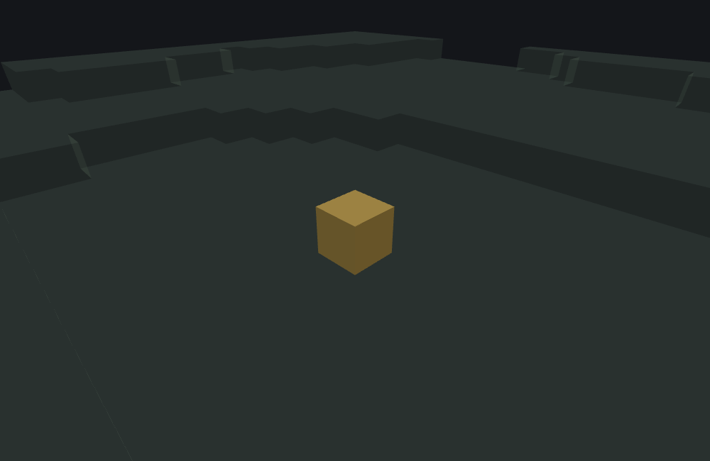

# Single Block Features

This page is a statement about **Minecraft Bedrock 1.26.50.24**
specifically. `single_block_feature`'s JSON surface — every key, enum value and default — and its
behaviour are unchanged between 1.26.40.26 and 1.26.50.24, so everything
here describes both versions. Worldgen internals move between releases; nothing here should be assumed
to hold for a different build without checking.

`minecraft:single_block_feature` is a **Content feature**: it places exactly one block per
call, at the origin it's given, and nothing else. It has no footprint search, no delegation to
another feature, and no loop — everything more elaborate than "one block here" (patches, veins,
columns, rings) is a different feature type built *around* a single_block_feature, most often a
[Scatter Feature](./scatter-feature.md) repeatedly delegating to one. That makes this the
feature almost every pack ends up authoring at least once, directly or as someone else's
delegate target, and the natural starting point for this doc set.

## What it does

Given an origin, single_block_feature runs these steps, in this order, and stops at the first
one that fails:

1. Checks the origin's neighbors against `may_not_attach_to`, if configured — a deny list.
2. Weighted-picks one candidate from `places_block` (the only guaranteed `Random` draw).
3. Checks the origin's neighbors against `may_attach_to`, if configured — and, with
   `auto_rotate`, picks the block's orientation from the matching side.
4. Checks the target position against `may_replace`, if configured.
5. With `randomize_rotation`, draws a random direction and rotates the block toward it.
6. Writes the block at the origin.

Nothing here reads or writes any position other than the origin itself and, for steps 1 and 3,
the origin's immediate neighbors — this feature never touches a second block.

### Weighted candidate list

`places_block` accepts a single block descriptor (a name string, or `{name, states}`) as
shorthand for "always this block", or an array of `{block, weight}` entries for a weighted
pick. The pick costs exactly **one** `Random` draw regardless of how many candidates are
listed — every candidate's weight is summed once, the draw lands somewhere in `[0, total)`,
and the first candidate whose cumulative weight passes that point wins.

### Attach conditions — nine keys, two different kinds of check

`may_attach_to` restricts placement to positions whose neighbors already match specific
blocks — the mechanism behind torches, vines, and anything else that must be stuck to
something. It takes **nine** face keys, not six: the individual `top`, `bottom`, `north`,
`south`, `east`, `west`, plus three group keys — `all` (every checked neighbor, including the
four horizontal diagonals), `sides` (the four cardinal horizontals as a group), and `diagonal`
(the four horizontal diagonal neighbors `x±1, z±1`). Each takes a block descriptor or list.

The game treats the directions as **two different kinds of check** — this is the load-bearing
fact on this page, and no published description mentions it:

- **`top`, `bottom`, and the four diagonals are hard gates.** Each one that's configured (its
  own key, or `all`) must match its neighbor, individually, or the placement fails outright.
  They are not counted, and `min_sides_must_attach` has no effect on them.
- **The four cardinal sides are counted.** Each side — checked against its own key, `sides`,
  and `all` — either matches or doesn't, and the number of matching sides must reach
  `min_sides_must_attach`. A side with **nothing configured for it counts as matching, for
  free.**
- `min_sides_must_attach` defaults to **4**, not 1 — an integer. The two facts combine into the intuitive outcome for
  simple packs: a `may_attach_to` that configures no side lists at all (only `bottom`, say, or
  nothing but `{}`) passes the side count trivially (4 free matches ≥ 4), while every side
  list you *do* configure must actually match unless you lower `min_sides_must_attach`.

::: warning
**Configuring several side lists means ALL of them must match by default.** With
`"east": "minecraft:dirt"` alone, the default `min_sides_must_attach` of 4 demands east
matches (3 free + east). With east *and* west configured, both must match. This is the
opposite of a "how many of the configured faces must match, default 1" model — that model does
not exist in the game.
:::

`may_not_attach_to` is the mirror image: the same nine face keys, but as a **deny list** —
if any configured list matches its corresponding neighbor, the placement fails before any RNG
is drawn. There is no counting and no `min_sides_must_attach` here; one match kills the
placement. (`all` again covers the six faces plus the four horizontal diagonals.)

::: note
**`may_attach_to.<face>` accepts a single block descriptor as shorthand for a one-element
list** — a bare name string, or a `{name, states?}`/`{tags}` object, not wrapped in an array.
This is specific to `may_attach_to`/`may_not_attach_to`'s per-face fields — it is **not** a
general rule for every "list of block descriptors" field in the worldgen JSON schema.
`may_replace` and `allowed_surface_blocks`, for example, accept only arrays.
:::

### Rotation — `auto_rotate` and `randomize_rotation`

Two fields rotate the placed block's directional states:

- **`auto_rotate`** (inside `may_attach_to`, default **true** — active
  whenever `may_attach_to`/`may_not_attach_to` is configured) rotates the block toward the
  **last matching cardinal side** during the attach check. Sides are checked in the order
  north, east, south, west, and each match re-derives the orientation from the *original*
  block, so the last match wins — for a fully-unconfigured side set, that's west.
- **`randomize_rotation`** (top-level, default false) draws one extra `Random` value — a
  *raw* 32-bit draw mod 4, a different draw type than the weighted
  pick's — after the `may_replace` check, and rotates the block toward that direction.
  When `randomize_rotation` is set, `auto_rotate` is ignored (the randomize draw happens
  later and unconditionally).

Rotation only changes blocks that carry one of sixteen directional states; a stone or dirt block
passes through unchanged. The full list: `portal_axis`, `minecraft:cardinal_direction`, `minecraft:facing_direction`,
`minecraft:block_face`, `direction`, `facing_direction`, `rail_direction`,
`torch_facing_direction`, `ground_sign_direction`, `weirdo_direction`, `coral_direction`,
`lever_direction`, `pillar_axis`, `vine_direction_bits`, `multi_face_direction_bits`,
`orientation`. Note what is *not* there: `rotation` (standing banners and signs) and
`minecraft:vertical_half` are untouched by rotation, despite being directional-looking.

Three things about the transform surprise people:

- **It is an absolute set, not a turn.** The rotation never reads the state you wrote. Whatever
  `places_block` said, the direction the rotation names replaces it — a block written as
  `pillar_axis: y` comes out as `x` or `z`, not left alone.
- **Every state the block carries is rewritten, in one pass.** A block carrying both
  `minecraft:block_face` and `pillar_axis` gets both set. There is no "first match wins".
- **`rail_direction` is a special case, and it looks like a bug.** Its mapping has no entry for
  any horizontal direction at all, so a rail caught by a rotation is set to `rail_direction: 0`
  whichever way the rotation points. That is the game's behaviour, not a rounding of it.

For each of the sixteen, the value the game picks for a given direction is known. For the six
families real packs actually use — `minecraft:block_face`, `minecraft:cardinal_direction`,
`pillar_axis`, `ground_sign_direction`, `vine_direction_bits` and `multi_face_direction_bits` —
the *name* that value is written under is known too. For the other ten it is taken from
vanilla block definitions and less certain, and `featurelab check` says so when you use one.

### Replace rules

`may_replace` restricts placement to positions whose *current* block matches one of a listed
set — most commonly `["minecraft:air"]`, so the feature doesn't overwrite existing terrain.
Unlike `may_attach_to`, this field takes only an array; there is no single-descriptor shorthand
here (see the note above). Leaving `may_replace` out entirely removes the constraint — the
feature will happily overwrite whatever is already at the origin.

::: tip A bare block name matches that block in **any** state
`"minecraft:oak_log"` in a `may_replace` matches an oak log lying on its side just as well as
one standing upright — the comparison is on the block *type*, and every state of one block
shares one type. Write states out only when you mean to narrow the match:

```json
{ "name": "minecraft:oak_log", "states": { "pillar_axis": "y" } }
```

and then **only the states you wrote are compared.** A candidate carrying `pillar_axis: "y"`
matches whatever else it happens to carry; one carrying `pillar_axis: "x"` does not. This is
worth knowing because it is easy to write states out of a wish to be precise and end up matching
nothing: in practice nearly all block descriptors in real packs are bare names, and that is usually
the right call.

Two fields do **not** work this way, and both are documented on their own pages:

| Field | Comparison |
|---|---|
| `may_replace`, `may_attach_to`, `may_grow_on`, `replaceable_blocks`, `block_allowlist`, tree lists… | block type for a bare name; name **plus only the states you wrote** otherwise |
| [`ore_feature`'s `replace_rules[].may_replace`](./ore-feature.md) | block type **always** — states you write there are discarded |
| [`scatter_feature`'s `allowed_surface_blocks`](./scatter-feature.md) | the **whole** block: name and *every* state at its concrete value |

The last row is the one that surprises people. A bare `minecraft:oak_log` in
`allowed_surface_blocks` is completed to that block's default state before the comparison, so it
does **not** match a log that some other feature placed on its side.
:::

::: warning What this bench cannot decide, and what it does instead
When you spell states out and the candidate cell was written *without* them, the cell stands for
its block type's default state — and this tool has no per-block-type registry of default states
to complete it with. It reports **no match** rather than guess, which can make such a list look
narrower here than in game, and it warns when a list contains a stated entry so the difference is
never silent. A bare entry avoids the question entirely.

Two committed fixtures pin the common case, `wiki:matchmode_stated_log` (which places a log with
`pillar_axis: "x"`) and `wiki:matchmode_bare_may_replace` (whose bare `may_replace` then replaces
it), run together by `wiki:matchmode_bare_vs_stated`:

```
featurelab generate --pack <pack> --feature wiki:matchmode_bare_vs_stated --env void --seed 42
```

One cell changes, and it ends up holding `minecraft:gold_block`: the rotated log is written
first, then the bare `may_replace` matches it and the gold block takes its place. If a bare name
did *not* match a rotated log, that cell would hold the log instead and the run would report
`may_replace rejected this position: it holds minecraft:oak_log` — which is precisely the shape
of the mistake this section exists to describe.
:::

### `enforce_placement_rules` / `enforce_survivability_rules` — required, and inert in worldgen

Both keys are **required** by the schema — a single_block_feature JSON without them does not
load. And yet, during world generation, they do
nothing: each one gates a "may this block be placed here" / "can this block survive here" check,
and during chunk generation both of those checks always pass. Outside chunk generation the same
two checks are real, so the fields presumably matter
somewhere beyond world generation — but for feature placement in generated chunks, both are inert
regardless of their value.

### Your file's `format_version` decides which of these keys exist

The game keeps a separate schema per `format_version` band, and four parts of this feature's
JSON surface arrived in the **1.21.40** band. In a file declaring anything older they are not
"ignored" — they are not keys at all, so the game reports each one by name ("this member was
found in the input, but is not present in the Schema") and drops the value:

| Key | Available from |
|---|---|
| `places_block` as an **array** of `{block, weight}` | `1.21.40` — below it, `places_block` is a single block descriptor, and an array fails to parse. Since the key is required, the file then does not load at all. |
| `randomize_rotation` | `1.21.40` — below it, the block is always placed unrotated. |
| `may_not_attach_to` | `1.21.40` — below it, there is no deny list. Note this also means the key cannot switch the attach test on, so `auto_rotate` has nothing to orient from unless `may_attach_to` is present too. |
| `may_attach_to.diagonal` / `may_not_attach_to.diagonal` | `1.21.40` — below it, the four horizontal diagonal neighbours are not tested. The other eight face keys exist at every version. |

Everything else on this page — both `enforce_*` keys, `may_replace`, the other eight faces,
`min_sides_must_attach` and `auto_rotate` — is in the schema at every `format_version` a feature
file can legally declare, and `auto_rotate` behaves identically at every version.

The practical consequence: raising a pack's `format_version` can *add* working keys to files
that already contained them, and lowering it silently removes them. If a `single_block_feature`
places an unrotated block when you asked for `randomize_rotation`, check the file's
`format_version` before anything else.

## Example

```json title="single_block_feature -- a weighted pumpkin/jack o'lantern pick, attached to grass"
{
  "format_version": "1.21.110",
  "minecraft:single_block_feature": {
    "description": { "identifier": "wiki:pumpkin_patch_block" },
    "enforce_placement_rules": false,
    "enforce_survivability_rules": false,
    "places_block": [
      { "block": "minecraft:pumpkin", "weight": 3 },
      { "block": "minecraft:jack_o_lantern", "weight": 1 }
    ],
    "may_replace": ["minecraft:air"],
    "may_attach_to": { "bottom": "minecraft:grass_block" }
  }
}
```

Three out of four picks (weight 3 of a 4-total) land on `minecraft:pumpkin`; the remaining
quarter lands on `minecraft:jack_o_lantern`. `may_attach_to.bottom` uses the single-descriptor shorthand
from the note above and is a hard gate: the block directly below must be grass. No side lists
are configured, so all four sides match for free and the default `min_sides_must_attach` of 4
is met trivially. `may_replace` keeps it from overwriting anything that isn't air. (With
`may_attach_to` configured, the default-true `auto_rotate` also applies — a pumpkin has a
`minecraft:cardinal_direction` state, so in the game this exact JSON also orients the
pumpkin toward the last matching side; see the rotation section above.)

Run against this project's `plains` environment preset (grass over dirt over stone) with feature
seed `1`, the weighted pick lands on `minecraft:pumpkin`, the origin resolves to the top of the
terrain column at `(0, 0)`, and the block directly below is grass — every check passes:



::: note
`minecraft:pumpkin` has no hand-written entry in the viewer's block-color table; its color comes
from `frontend/src/generated/blockColors.ts`, which averages each block's actual textures per
face, so it is in the right family rather than deliberately accurate. Blocks that reach neither
the curated nor the generated table fall through to a deterministic hash-derived color
(`frontend/src/colors.ts`'s `hashColor`), which is unrelated to how the block looks. This is the
same viewer the VS Code extension embeds, not a wiki-only rendering path. Treat every image on this page's set as "which cells did this
feature touch, and what shape do they form", not as a texture-accurate preview.
:::

Command run to produce the JSON result behind this image (see
[the image pipeline](./tools/generate-images.mjs) for the full, reproducible version of this
same call):

```
featurelab generate --pack <pack> --feature wiki:pumpkin_patch_block --env plains --seed 1
```

## Field reference

| Field | Required | Shape | Default |
|---|---|---|---|
| `places_block` | yes | block descriptor, or array of `{block, weight}` | — |
| `enforce_placement_rules` | **yes** | boolean | — (required; inert during worldgen, see above) |
| `enforce_survivability_rules` | **yes** | boolean | — (required; inert during worldgen, see above) |
| `randomize_rotation` | no | boolean | `false` |
| `may_replace` | no | array of block descriptors | no constraint (replaces anything) |
| `may_attach_to.<face>` | no | block descriptor **or** array; faces: `top`/`bottom`/`north`/`south`/`east`/`west`/`all`/`sides`/`diagonal` | direction not checked (counts as matching) |
| `may_attach_to.min_sides_must_attach` | no | non-negative integer | `4` |
| `may_attach_to.auto_rotate` | no | boolean | `true` |
| `may_not_attach_to.<face>` | no | same nine faces as `may_attach_to` | direction not denied |

## Coverage note

One thing on this page belongs to the **featurelab** bench used to illustrate it,
rather than to Bedrock, and it is the largest gap in this type:

**Rotation is performed, but only on the states you spell out.** The bench applies the same
rewrite the game does, for all sixteen families listed above. What it cannot reproduce is the
*test* the game uses to decide whether a state gets rewritten: the game asks the block's **type**
whether it can ever carry that state, regardless of whether your JSON mentioned it. The bench can
only see the states `places_block` actually writes. So:

```json
"places_block": "minecraft:torch"
```

is placed unrotated here, while the game turns it — `torch_facing_direction` is part of the torch's
type whether or not you wrote it. Spell the state out and the preview is right:

```json
"places_block": { "name": "minecraft:torch", "states": { "torch_facing_direction": 1 } }
```

The gap only ever *under*-rotates; it never invents a rotation that the game does not perform.

The other, smaller caveat is naming. For ten of the sixteen families the direction the game picks
is exact, but the word or number that direction is written under is taken
from vanilla block definitions and less certain. `featurelab check` warns when a file leans on one of those ten, and
says exactly that: the direction is right, the spelling may not be. The families real packs use in
practice are not among them.

Rotation is not a rare corner: real packs commonly write `may_attach_to` — often as a bare `{}` —
so `auto_rotate`'s default of **true** is active, and in the game each such block is rotated toward
the last freely-matching side.

## See also

- [Scatter Features](./scatter-feature.md) — the feature type that most often delegates to a
  single_block_feature, repeatedly, across an area.
- [Ore Features](./ore-feature.md) — a different Content feature that also places blocks
  directly, but as a whole vein in one call rather than one block per delegated call.
- [Snap-to-Surface Features](./snap-to-surface-feature.md), [Weighted Random
  Features](./weighted-random-feature.md), and [Aggregate and Sequence
  Features](./aggregate-and-sequence-feature.md) — three more Proxy feature types whose own
  examples reuse this page's `wiki:pumpkin_patch_block` verbatim as their delegate.
- [Vegetation Patch Features](./vegetation-patch-feature.md) — a Scene feature that also reuses
  `wiki:pumpkin_patch_block` as its own `vegetation_feature` delegate, layered underneath a real
  ground-patch footprint search instead of a bare offset.
- [Feature Rules](./feature-rules.md) — how any of this reaches a world: a feature file on its
  own is inert until a rule attaches it to the chunks of the biomes it belongs in.
- [Feature Delegation and Composite Features](./feature-delegation.md) — what a delegating
  feature does and does not hand this one, which is the other half of every chain that ends
  here.

## Version and verification notes

Everything above is a statement about 1.26.50.24 specifically, and holds
for 1.26.40.26 as well: this type's JSON surface and its behaviour are unchanged between the
two versions.

The attach semantics are implemented and regression-tested in
`features/single_block.go` and `features/single_block_attach_test.go`, which is where a reader can
see each rule pinned to a test. The per-state-family direction mappings are in
`block/rotate.go`; what remains is the type-level state test described under Coverage above. The
JSON example on this page was run end to end against
this project's own worldgen tooling (`featurelab check` and `featurelab generate`) and produced the
described result; the
accompanying image was rendered from that exact result by this doc set's own image pipeline (see
[`docs/wiki/tools/`](./tools/generate-images.mjs)).
