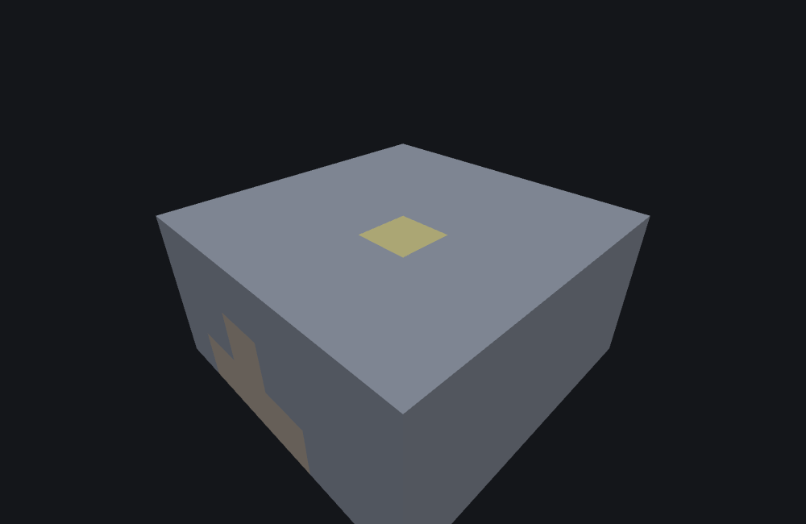

# Surface Relative Threshold Features

This page is a statement about **Minecraft Bedrock 1.26.50.24**
specifically. This type's JSON surface — both keys, their shapes and the default — and its
behaviour are unchanged between 1.26.40.26 and 1.26.50.24, so the page
describes both versions. Worldgen internals move between releases; nothing here should be assumed to
hold for a different build without checking.

`minecraft:surface_relative_threshold_feature` is a **Proxy feature**: it places nothing itself.
It compares its own origin's height against the surface directly above it and delegates to one
wrapped feature — but only when the origin sits deep enough below that surface. Where [Snap-to-
Surface Features](./snap-to-surface-feature.md) *search* for a surface and move to it, this type
never moves anything; it just gates a delegation on where the origin already happens to be.

## What it does

1. Read the surface height from the game's **preliminary surface level** — a grid built during
   terrain generation and queried at `(x >> 2, z >> 2)`, i.e. at **quarter resolution**, so a
   single surface value covers each 4x4 block of columns rather than varying per column. If that
   lookup yields nothing, the feature fails with `"Surface level could not be found"`.
2. Compute `threshold = surfaceHeight - minimum_distance_below_surface`. If the origin's own `y`
   is at or above that threshold, fail immediately — no delegation, no RNG. The origin must sit
   **strictly below** the threshold, not merely at or below the raw surface height offset by the
   distance: sitting *exactly* `minimum_distance_below_surface` blocks under the surface still
   fails; it takes one more block of depth to pass.
3. Resolve the wrapped feature (`feature_to_place`). An unresolved reference fails with the same
   message as step 2.
4. Delegate to it under the standard recursion guard (keyed on this wrapper, not the delegate) —
   with the **same, unmodified context**: no position substitution, the Molang scope forwarded as-is,
   the same no-op-relative-to-origin contract [Aggregate
   Features](./aggregate-and-sequence-feature.md#aggregate_feature) use for every one of their own
   delegates.

No RNG is ever drawn directly by this feature type — every draw belongs to whatever the delegate
itself does.

::: note
**The recursion-guard failure path is silent; the threshold failure path logs a message.**
The game logs a message on the threshold-fail and unresolved-reference
paths (both report `"Target location is not within the minimum distance to surface"`, reused
verbatim for both), but the recursion-guard denial in step 4 returns empty with no message
at all. If a `check`/`generate` run reports blocks missing with no diagnostic to explain
why, a live recursion-guard denial deeper in a delegation chain is a candidate this project's own
tooling cannot currently surface any more clearly than the game itself does.
:::

### What "surface height" means here, precisely

The game reads a **preliminary surface level** — a
pre-generation height estimate computed before a chunk's blocks are fully written, and *not*
necessarily "the Y of the first free cell above whatever block actually ended up there". Two facts
about it are worth knowing when authoring:

- It is queried at **`(x >> 2, z >> 2)`** — quarter resolution. One surface value therefore covers
  each 4x4 block of columns, so moving a feature by one or two blocks horizontally often does not
  change the surface height this gate compares against, while crossing a 4-block boundary can.
- The lookup can fail outright (no value for that cell), which fails the feature with its own
  distinct message rather than the threshold one.

**This project substitutes the volume's own `GetHeight` — the already-placed terrain's topmost
non-air cell plus one — sampled at the enclosing 4x4 cell's anchor**, so that the "one value per
4x4 cell" property holds as it does in the game. The VALUE still comes from finished terrain
rather than a pre-generation estimate; for a flat preset like `plains` the two readings coincide,
and whether they diverge mid-generation is unknown here. Treat the surface *value* as this
project's approximation; the quarter-resolution granularity is the game's own.

## Example

```json title="surface_relative_threshold_feature -- delegating only when deep enough underground"
{
  "format_version": "1.21.110",
  "minecraft:surface_relative_threshold_feature": {
    "description": { "identifier": "wiki:threshold_deep" },
    "feature_to_place": "wiki:threshold_marker",
    "minimum_distance_below_surface": 5
  }
}
```

`wiki:threshold_marker` is a bare `single_block_feature` placing `minecraft:gold_block`
unconditionally (no `may_replace`/`may_attach_to` — see [Single Block
Features](./single-block-feature.md), whose own field reference covers why an absent
`may_replace` means "replaces anything"), so the only thing this example is actually testing is
the gate itself, not whatever the delegate's own placement rules might separately reject. Run
against `plains` (surface height `63` at this column) with feature seed `1` and origin
`(0, 50, 0)` — 13 blocks below the surface, more than the `5` required — `50 < 63 - 5` holds, the
gate passes, and the gold block lands exactly at the origin:



```
featurelab generate --pack <pack> --feature wiki:threshold_deep --env plains --seed 1 --origin 0,50,0
```

::: tip
The SAME JSON, run at origin `(0, 60, 0)` instead — only 3 blocks below the surface, less than the
`5` required — fails outright: `60 < 63 - 5` (`60 < 58`) does not hold, so the gate rejects it
before the delegate is even resolved:

```
featurelab generate --pack <pack> --feature wiki:threshold_deep --env plains --seed 1 --origin 0,60,0
```

produces a single `"level":"warning"` diagnostic, `"message":"Target location is not within the
minimum distance to surface"`, and zero blocks changed.
:::

## Field reference

| Field | Required | Shape | Default |
|---|---|---|---|
| `feature_to_place` | yes | feature identifier string | — |
| `minimum_distance_below_surface` | no | number (stored as a 32-bit int, so it truncates) | `0` |

::: note
**There are exactly two fields:** `feature_to_place` (required) and
`minimum_distance_below_surface` (optional, default `0`).

Names that are **not** fields of this type, and that the game will reject: `feature`,
`wrapped_feature`, `places_feature`, `min_distance_below_surface`.

`minimum_distance_below_surface` is stored as a 32-bit integer, so a fractional value truncates —
`10.9` behaves as `10`.
:::

## See also

- [Snap-to-Surface Features](./snap-to-surface-feature.md) — a Proxy feature that actively
  *searches* for a surface and moves its delegate there, contrasted with this type's passive
  gate-in-place.
- [Single Block Features](./single-block-feature.md) — the delegate type this page's example
  uses, and the page whose own field reference explains why an absent `may_replace` matches
  anything.

## Version and verification notes

Everything above is a statement about 1.26.50.24 specifically, and holds
for 1.26.40.26 too: the type's JSON surface and its behaviour are unchanged between the two
versions. `features/surface_relative_threshold.go`'s own header comment carries the details.

What remains this project's substitution — flagged in its own section above rather than presented as
game fact — is the surface *value*, since a bench has no pre-generation height estimate to read;
the quarter-resolution granularity around it is the game's. Its regression coverage is
`features/surface_relative_threshold_test.go` and the fixture baseline. Both JSON examples on
this page (the passing depth and the deliberately-failing shallow variant) were run end to end
against this project's own worldgen tooling (`featurelab check` and `featurelab generate`) and
produced the described results, which is also how a reader can re-check both. The
accompanying image was rendered from the passing result by this doc set's own image pipeline (see
[`docs/wiki/tools/`](./tools/generate-images.mjs)), rendered as a solid cutaway for the same
buried-feature reason [the ore vein page](./ore-feature.md#example) is.
