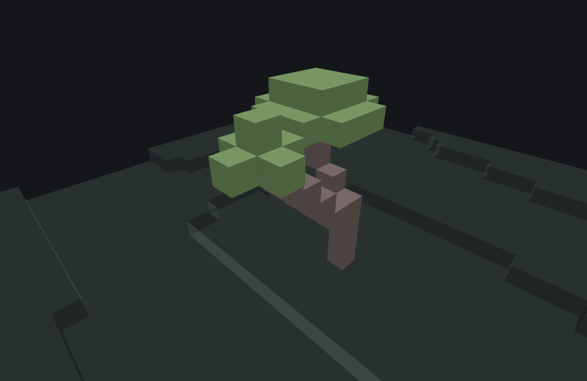
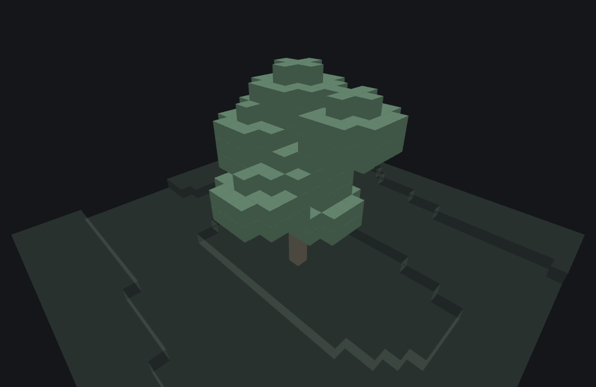
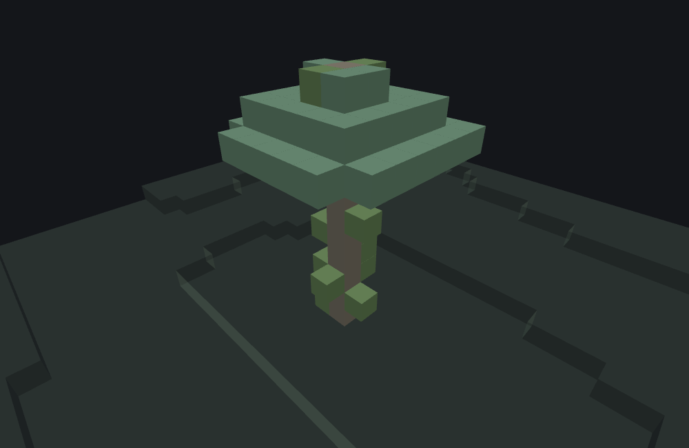

# Tree Features

This page is a statement about **Minecraft Bedrock 1.26.50.24** specifically. Worldgen internals move between releases; nothing here should be assumed to hold for a different build without checking. Everything on this page except the poplar shapes also holds for 1.26.40.26; `poplar_trunk` and `poplar_canopy` are new in 1.26.50.24 and earlier builds reject those keys.

`minecraft:tree_feature` is a **Content feature**: it grows a tree at the origin. Structurally it is the most configurable content feature in the system, because it is not one algorithm but a **trunk shape paired with a canopy shape**, each selected by its own JSON key, each with its own field set. A trunk grows a column of logs (possibly leaning, possibly branching); a canopy grows leaves around a position the trunk hands it.

It does not delegate to another feature. The one exception looks like delegation but is not: a trunk's `branches.branch_canopy` nests a canopy *shape*, not a feature reference.

## Architecture: one trunk key, one canopy key

A tree body contains **exactly one** trunk key and **exactly one** canopy key. Which keys are present is what selects the algorithm — there is no `"type"` field.

| Trunk key | Shape |
|---|---|
| `trunk` | [A plain vertical column](#the-plain-column-trunk). It is the only trunk that can start *below* its origin: `can_be_submerged` lets it descend through `may_grow_through` cells (water, mud) and grow from the deepest one it reaches. It hands the canopy a single anchor and an **empty** anchor list. |
| `acacia_trunk` | A column that can lean diagonally and grow a side branch. Despite the name, the shape is not tied to acacia wood — it is what vanilla's savanna and roofed trees use. |
| `fancy_trunk` | A scaled column that scatters foliage clusters around itself and grows a limb out to each. |
| `mega_trunk` | A wide (2×2 or larger) column with branches and trunk decoration. |
| `cherry_trunk` | A column with multi-anchor branch tips. |
| `mangrove_trunk` | A column with aerial roots and hanging decoration. |
| `fallen_trunk` | A horizontal log lying on the ground. Since 1.26.50.24 the log also drops through and replaces ground cover such as leaf litter instead of failing on it. |
| `poplar_trunk` | A straight column crowned by a ring of short sideways branch stubs. New in 1.26.50.24. |

| Canopy key | Shape |
|---|---|
| `canopy` | [A step pyramid](#the-step-pyramid-canopy): a stack of square layers narrowing with height. |
| `acacia_canopy` | Flat, wide octagonal layers — the umbrella silhouette. |
| `pine_canopy` | Tiered rings that shrink and regrow with height. |
| `spruce_canopy` | Similar tiering with a different layer schedule. |
| `fancy_canopy` | A stack of tapered discs. |
| `roofed_canopy` | A thick slab with a randomized peak. |
| `mega_canopy` / `mega_pine_canopy` | Wide crowns sized from the trunk width. |
| `mangrove_canopy` | A scattered crown with hanging blocks. |
| `cherry_canopy` | A crown placed per branch tip. |
| `random_spread_canopy` | Leaves scattered randomly around several trunk positions rather than in layers. |
| `poplar_canopy` | A tall rounded crown built from stacked diamonds, with a log cross buried inside it. New in 1.26.50.24. |

::: note
The trunk decides the canopy's **position**, not its shape, and it does so by collecting *anchors* as it places logs. Most canopies use only the last anchor — the top of the trunk. `random_spread_canopy` and `mangrove_canopy` are the two that read the whole anchor list, which is why the same `min_height_for_canopy` value can be invisible with one canopy and change the result with another.

Not every trunk fills that list. `trunk` and `cherry_trunk` hand the canopy an **empty** one, and both of those canopies return immediately when it is empty — without placing a leaf and without drawing a random number. So `trunk` paired with `random_spread_canopy` or `mangrove_canopy` grows a bare pole, not a tree. That is engine behaviour, not a bench limitation. Pair those two canopies with `acacia_trunk`, `mega_trunk` or `mangrove_trunk`, which push every placed log onto the list.
:::

## The plain column (`trunk`)

`trunk` is the simplest trunk shape and the one most of vanilla's own trees are built from — oak, birch, jungle, spruce, pine and swamp trees all use this key. It grows a **straight vertical column** and nothing else: no lean, no branch, no direction draw anywhere in it. What makes those trees look different from one another is the canopy paired with the column, not the column.

It is also the only trunk that can start *below* the origin it was handed.

Given an origin, the engine executes the following in exact order:

1. **Height sample.** `trunk_height` is an IntRange with the usual *exclusive* maximum.
2. **The descent** (`can_be_submerged`). The cell below the origin is tested against `may_grow_through`. While it passes and the depth budget allows, the trunk steps one cell further down, and the deepest passing cell becomes the position it grows from. This costs no random numbers at all. If the very first probe fails, nothing moves. `can_be_submerged` chooses only the depth: `true` means 255, `{ "max_depth": n }` means `n`, and absent or `false` means zero — no descent.
3. **Ground check**, at the *descended* position rather than the original one. The tree fails here — with the height draw already spent — if the trunk would not fit under the build height, or if the cell below does not match `may_grow_on`.
4. **Height modifier.** `height_modifier` is drawn and added to the sampled height. A combined height below 1 fails the tree, after both draws are already spent.
5. **Column loop.** One log per cell, straight up from the descended position. Cells **below the original origin** — the ones the descent walked past — are gated on `may_grow_through`; cells at or above it are gated on `may_replace`. `trunk_decoration` rolls against **all four** horizontal sides of every placed log, unlike `acacia_trunk`, which only offers the sides facing out of its own footprint.
6. **Canopy.** Placed once, one cell **above** the topmost log that was actually placed — not on it — with an empty anchor list (see the note under the architecture table).
7. **Ground fixup.** Only now, after the canopy, is the cell under the descended position compared against `base_block` and converted to that list's first entry if it does not already match. An absent or empty `base_block` means no fixup at all.

::: note
The descent is what gives `may_grow_through` teeth on this key, and it is the only thing that does. Without `can_be_submerged`, every cell of the column is at or above the origin and gated on `may_replace` alone, so the field is read, accepted, and never consulted. Vanilla's own oak, birch and spruce all write `may_grow_through` in exactly that inert position.

The dependency does not run the other way. Vanilla's swamp tree sets `can_be_submerged` and writes **no** `may_grow_through` at all — and an absent or empty list means "no restriction", so its descent steps down through whatever happens to be under it.
:::

### The step pyramid (`canopy`)

`canopy` is the matching default crown, and the one most of vanilla's trees use: a stack of filled square layers, widest at the bottom, narrowing with height. Each layer's half-width comes from one formula:

```
radius = slope(canopy_offset.max) + min_width - slope(dy)
slope(d) = truncate(canopy_slope.rise * d / canopy_slope.run)
```

`dy` runs from `canopy_offset.min` to `canopy_offset.max` and is measured from the anchor the trunk handed over, so a negative `min` puts layers *below* it. With the default 1:1 slope, `min_width` 0 and `canopy_offset` `{ "min": -3, "max": 0 }`, that is radii 3, 2, 1 and 0 from the bottom up — the familiar oak crown. `min_width` widens every layer at once; `canopy_slope` changes how fast they taper.

`variation_chance` is the only part of this canopy that draws random numbers, and it applies to **corners only** — a cell where `|dx|` and `|dz|` both equal that layer's radius. There are four such cells per layer, each rolled once, and a successful roll leaves that corner out, which is what rounds the square off. The value is either one chance shared by every layer, or an array with one entry per layer, ordered from `canopy_offset.min` upward.

::: note
The corner test is **not** guarded against a radius of 0. On a one-cell layer, `|dx|` and `|dz|` are both zero and both equal the radius, so that single cell *is* a corner and gets rolled — and a chance that always succeeds deletes the layer outright. Vanilla's own oaks end their `variation_chance` array with `{ "numerator": 1, "denominator": 1 }` on exactly that layer, so the crown is capped by the square below it rather than by one leaf poking out of the top.

That entry costs nothing to evaluate: a fraction whose numerator equals its denominator succeeds without drawing, and one with a zero denominator fails without drawing — the same "no draw at the extremes" rule the percentage form follows.
:::

`canopy_decoration` hangs a block off the crown. Each leaf the canopy places rolls `decoration_chance` once per horizontal neighbour; a successful roll on a neighbour that is air draws `num_steps` (inclusive of its maximum) and writes that many cells straight **down** from it, stopping at the first cell that is not air. It is how vanilla's swamp oak gets its hanging vines.

::: note
`canopy_offset` is **not** an IntRange despite looking like one. It is a plain object with `min` and `max` members, spelled that way and only that way — the `range_min`/`range_max` and `[a, b]` spellings the range fields below accept do not apply to it. `mega_trunk`'s `branch_altitude_factor` is the same kind of field. Both spellings turn up in the same vanilla definition, each on the field that wants it: vanilla's mega jungle tree writes `branch_interval` as `range_min`/`range_max` and `branch_altitude_factor` as `min`/`max`, four lines apart.
:::

## The leaning trunk (`acacia_trunk`)

This is the most involved trunk shape, and the one behind vanilla's savanna and roofed trees, so it is worth walking through in full. Given an origin, the engine executes the following in exact order:

1. **Height sample.** `trunk_height.base` plus one draw per entry in `trunk_height.intervals`, so `{ "base": 5, "intervals": [3, 3] }` yields 5 + `nextIntBound(3)` + `nextIntBound(3)`, i.e. 5..9.
2. **Ground preparation.** The cell below each footprint column is checked against `may_grow_on` and converted to `base_block`. If the ground does not match, placement fails here with no further draws.
3. **Lean direction.** One `nextInt(4)` picks one of the four cardinal directions.
4. **Lean start.** `lean_height` is drawn and **subtracted from the sampled height**. The lean therefore begins that many cells *below the top of the trunk*, not that many cells above the ground — a `lean_height` of 1 leans almost the whole trunk, and a value equal to the height leans none of it.
5. **Lean steps.** `lean_steps` is drawn: the maximum number of cells the trunk may shift horizontally.
6. **Lean length.** `lean_length` is drawn and **added to the number of loop iterations**, not to the height. See below.
7. **Column loop.** For each index from 0 to `height + lean_length - 1`:
   - If the index has reached the lean start and steps remain, the column shifts one cell in the lean direction and one step is consumed.
   - The cell's Y is `origin.Y + index` **only while the index is below the sampled height**. Past that point Y is frozen, so the remaining iterations march sideways at the top log's level. That is the whole effect of `lean_length`: a horizontal run at the crown, not a taller tree.
   - Every cell in the `trunk_width` × `trunk_width` footprint is tested against `may_replace` / `may_grow_through` and placed if it passes.
   - A placed cell becomes a **canopy anchor** if its index is at or above `min_height_for_canopy`.
8. **Canopy.** The canopy runs once, at the last anchor collected.
9. **Branches.** One of two routines runs, chosen by `trunk_lean.allow_diagonal_growth`. Both run on *every* tree, whether or not `branches` was configured.

### `lean_height` is measured from the top

This is the field most likely to be set to the wrong end of the range by someone reasoning from the name. `lean_height` is the distance from the **crown** at which leaning starts:

```
lean_height: 1              lean_height: 5 (== height)
                      #
                    #       #
                  #         #
                #           #
              #             #
```

### The two branch routines

`branches` describes *one* branch concept but is consumed by two different routines with genuinely different geometry. Which one runs depends on `allow_diagonal_growth`:

| | `allow_diagonal_growth: true` | `allow_diagonal_growth: false` |
|---|---|---|
| Branches grown | At most **one** | Up to one **per perimeter cell** |
| Direction | One `nextInt(4)`; if it matches the trunk's own lean direction the branch is **abandoned** | No direction draw — the sweep covers all sides |
| Shape | Steps diagonally outward *and upward*, one cell per step | A **downward** column below the crown |
| Starting point | `lean_start - branch_position` cells up the trunk | `branch_position` cells below the canopy anchor |
| Length meaning | Steps taken, bounded by the trunk height | Cells in the column |
| Decoration | `trunk_decoration` applies | Does not apply |

The non-diagonal sweep walks every offset from −1 through `trunk_width` on both horizontal axes and considers only cells **outside** the trunk footprint — the ring around it. Interior cells are skipped without consuming a chance roll.

`allow_diagonal_growth` is a **required** field, which is easy to miss because it also has a default of `true` behind it. The default only ever applies to trees that supply no `trunk_lean` block at all — and `trunk_lean` is itself required, so in practice every tree definition states it explicitly. Leaving it out is a load error, not a silent fallback to `true`; every `acacia_trunk` in vanilla's own definitions sets it.

::: note
The two routines also draw `branch_length` and `branch_position` in **opposite order**: the diagonal routine draws `branch_position` first, the sweep draws `branch_length` first. This is invisible unless both ranges are non-degenerate, but it does mean the same JSON and the same seed produce different trees depending only on `allow_diagonal_growth`.
:::

A branch that never manages to place a single log grows no `branch_canopy`. One that does places its canopy at the branch's final horizontal position and the **last log's** height — if the branch's last step or two landed in blocked cells, the canopy ends up offset from the last log rather than on top of it.

### `branch_chance` is required, and its absence is not the same as zero

Once `branches` is present, all three of `branch_length`, `branch_position` and `branch_chance` are required. Omitting the whole `branches` object is fine and means "no branches" — but note that the branch routine still *runs*, and on the diagonal path it still spends its direction draw. Two trees that differ only by having an empty vs. absent `branches` object therefore consume the same random numbers.

### `min_height_for_canopy`

Only trunk cells at or above this index become canopy anchors. It never affects which logs are placed. If the trunk is short enough that **no** cell qualifies, the canopy is handed an unset anchor rather than the trunk top, and effectively does not appear at the tree. A `min_height_for_canopy` larger than the smallest height `trunk_height` can sample is therefore a way to accidentally grow bare trunks some fraction of the time.

## The scattered-foliage trunk (`fancy_trunk`)

`fancy_trunk` is the one trunk shape that does not work by "grow a column, put a crown on top". It
builds a **set of foliage coordinates** scattered around the trunk, grows a canopy at *every one of
them*, and then draws a **limb** from the trunk out to each. The familiar big-oak silhouette — a
lumpy, multi-lobed crown rather than a tidy pyramid — falls out of those canopies overlapping.

Its phases, in the order the engine runs them:

1. **Ground, then the trunk line.** The cell below the origin is checked against `may_grow_on`, then
   the straight line from the origin to `origin.y + height - 1` is walked. A blocked line does
   **not** fail the tree — it *shortens* it, the blocked index becoming the new height. Only an
   obstruction at or below `trunk_height.base` aborts placement.
2. **Foliage coordinates.** One coordinate is always seeded directly above the trunk. Then, for each
   level from `height - (variance+1)/3` down to 0, a radius is computed from a semicircular profile
   and `density` decides how many clusters that level attempts. A level below
   `height * foliage_altitude_factor` gets no radius and is skipped entirely. Each cluster is
   accepted only if the space above it is clear *and* the limb path back to the trunk is clear.
3. **Placement.** Canopies first, at every accepted coordinate; then the trunk itself, drawn as
   `trunk_width²` vertical columns up to `trunk_height.scale` of the sampled height; then a limb to
   each coordinate whose attachment height clears `height * min_altitude_factor`. Canopies going
   first is why logs sit on top of leaves where the two overlap, and not the other way round.

::: note
Two consequences that look like bugs and are not. The trunk stops at `trunk_height.scale` of the
sampled height, so **foliage routinely sits above the highest log**; the limbs are what connect them.
And because the height is `base + variance` sampled per tree, a low draw produces a genuinely
stunted tree whose foliage overlaps its own trunk — vanilla's oak samples 5..16, so the same
definition yields anything from a shrub to a full canopy tree.
:::

`branches` is **required** for `fancy_trunk`, as are all three of its fields — the opposite of
`acacia_trunk`, where the whole object is optional. `slope` tilts each limb's attachment point down
the trunk in proportion to how far out its cluster sits; `density` scales the cluster count with
height; `min_altitude_factor` sets the height below which a coordinate keeps its canopy but grows no
limb.

## The branch-crowned trunk (`poplar_trunk`) — new in 1.26.50.24

`poplar_trunk` is the newest and simplest of the branching trunks: a perfectly straight column
that never leans, topped by a ring of short sideways branch stubs just below the crown. Its whole
character comes from where it puts the canopy — not on the trunk top, but a fixed number of cells
**below** it, so the upper trunk spears through the crown.

Given an origin, the engine executes the following in exact order:

1. **Height sample.** `trunk_height` is an IntRange with the usual *exclusive* maximum — the
   engine's own default of `{7, 9}` yields 7 or 8, never 9.
2. **Ground preparation.** The tree fails (after the height draw is already spent) if the cell
   below the origin does not match `may_grow_on`, or the trunk would not fit under the build
   height. If the cell below does not match `base_block`, it is overwritten with the first
   `base_block` entry.
3. **Branch level.** `remaining_trunk_height_above_branches` is drawn — this one *includes* its
   maximum — and subtracted from the height. The result is where the crown sits: the branches grow
   at `height - remaining - 1`, the canopy one cell above them, and `remaining` trunk cells
   continue up *through* the canopy.
4. **Column loop.** One log per cell from the origin up, each gated by `may_replace`.
   `trunk_decoration` applies to each placed log with all four sides eligible. If
   `log_decoration_feature` names a feature, it runs at **every** column cell — including cells
   whose own log was blocked.
5. **Branch stubs.** The four cardinal directions are shuffled, then
   `amount_of_foliage_support_branches` (inclusive) picks how many of them — in shuffled order —
   get a single sideways log at the branch level. The stubs use the trunk's own block lying on its
   side (`pillar_axis` follows the branch direction), and `trunk_decoration` applies to them too.
   There are only four distinct directions, so values above 4 add nothing.
6. **Canopy.** Placed once, at the cell directly above the branch stubs.

::: note
Unlike most of this page's ranges, `remaining_trunk_height_above_branches`,
`amount_of_foliage_support_branches`, and the canopy's `height` all sample **inclusive** of their
maximum, and a range with `min == max` consumes no draw at all. `trunk_height` keeps the usual
exclusive-max rule. Mixing the two conventions in one definition is easy to get wrong when
reasoning about seeds.
:::

### The poplar crown (`poplar_canopy`)

`poplar_canopy` builds a tall, rounded crown out of stacked diamond-shaped layers, then buries a
small cross of horizontal logs inside it. Three decisions are made up front:

1. **Radius.** `radius` is a *weighted list* of `{ "value": n, "weight": m }` entries (`weight`
   defaults to 1). One entry is picked in proportion to its weight, and the working radius is its
   `value` **minus one** — an entry of `{ "value": 3 }` produces radius-2 layers.
2. **Height.** The canopy's own `height` IntRange, inclusive of its maximum.
3. **A coin flip** that picks one diagonal pair of quadrants to bulge outward by one cell — either
   north-west/south-east or north-east/south-west. The whole crown shares one flip, which is what
   gives a poplar its slightly lopsided, natural silhouette.

The layers then go down from the top: the topmost layer at radius − 2, two layers at radius − 1,
the middle of the crown at the full radius, one more radius − 1 layer level with the anchor, and a
small cap **below** the anchor. On the top two layers the outermost row and column are trimmed, so
the crown rounds off rather than ending in a slab. Every remaining cell rolls once against
`side_hole_chance`; a successful roll shrinks that one cell's effective radius by 1, pitting the
crown's surface. Cells are only written where `may_replace` allows.

Finally, at four cells below the crown's top layer, leaves along the two horizontal axes are
**replaced with `branch_block` logs** — a cross reaching out to `radius - 4` cells from the
center, each log's `pillar_axis` following its arm. With a working radius below 4 (a `value`
below 5) the cross vanishes entirely and `branch_block` goes unused, which is the case for
small poplars.

::: note
`trunk_width` exists on the canopy only as a consistency assertion against the trunk's width; it
does not change the crown's geometry for any trunk this feature can currently pair it with —
every trunk hands its canopy a 1×1 crown footprint.
:::

## Example

```json title="tree_feature -- a leaning trunk with a branch that carries its own canopy"
{
  "format_version": "1.21.110",
  "minecraft:tree_feature": {
    "description": { "identifier": "wiki:acacia_branching_tree" },
    "acacia_trunk": {
      "trunk_width": 1,
      "trunk_height": { "base": 5, "intervals": [3, 3], "min_height_for_canopy": 3 },
      "trunk_block": { "name": "minecraft:log2", "states": { "new_log_type": "acacia" } },
      "trunk_lean": {
        "allow_diagonal_growth": true,
        "lean_height": { "range_min": 1, "range_max": 5 },
        "lean_steps": { "range_min": 1, "range_max": 4 }
      },
      "branches": {
        "branch_chance": 100.0,
        "branch_length": { "range_min": 4, "range_max": 6 },
        "branch_position": { "range_min": 1, "range_max": 3 },
        "branch_canopy": {
          "acacia_canopy": {
            "canopy_size": 1,
            "leaf_block": { "name": "minecraft:leaves2", "states": { "new_leaf_type": "acacia" } },
            "simplify_canopy": true
          }
        }
      }
    },
    "acacia_canopy": {
      "canopy_size": 2,
      "leaf_block": { "name": "minecraft:leaves2", "states": { "new_leaf_type": "acacia" } },
      "simplify_canopy": true
    },
    "base_block": ["minecraft:dirt"],
    "may_grow_on": ["minecraft:dirt", "minecraft:grass_block", "minecraft:podzol"],
    "may_replace": ["minecraft:air", "minecraft:leaves2"],
    "may_grow_through": ["minecraft:air", "minecraft:grass", "minecraft:dirt", "minecraft:grass_block"]
  }
}
```

`branch_chance` is 100 so the branch always survives its roll, which makes the two-canopy silhouette reproducible. Running this in a `plains` environment with seed `3` writes 47 blocks:



```
featurelab generate --pack <pack> --feature wiki:acacia_branching_tree --env plains --seed 3
```

The trunk leans away from its base; the branch steps diagonally out of it and up; the large canopy sits on the trunk top and the small one on the branch tip. Note that the branch direction is a draw — at other seeds it can come out on the opposite side, or match the trunk's lean and not appear at all.


### A `fancy_trunk` for comparison

Vanilla's own `fancy_oak_tree_feature` body, run at seed `3`:



```
featurelab generate --pack <pack> --feature wiki:fancy_oak_tree --env plains --seed 3
```

The crown is not one canopy but many, each grown at its own foliage coordinate, with limbs reaching
out to them from the trunk. Compare the shape with the acacia above: no lean, no single branch, and
a trunk that deliberately stops short of the foliage.

### A plain `trunk` for comparison

This page's simplest shape, at seed `3`, committed as [`fixtures/features/tree_plain_trunk.json`](./tools/fixtures/features/tree_plain_trunk.json):



```
featurelab generate --pack <pack> --feature wiki:plain_trunk_tree --env plains --seed 3
```

Twelve logs, dead straight, with the crown's widest layer two cells below the topmost log so the last two run up through it. The vines are `trunk_decoration` at a 1-in-3 chance rolled against all four sides of every log — compare the acacia above, where only two sides of each log are ever offered.

The definition sets `can_be_submerged` to `{ "max_depth": 1 }` and lists `minecraft:grass_block` under `may_grow_through`, so the descent takes one step: the bottom log is at world Y **62**, one below the requested origin of 63, and it replaced the grass block that was there rather than standing on it. Drop `minecraft:grass_block` from `may_grow_through` and the whole trunk moves back up a cell — the probe fails, the descent never happens, and Y 62 gets a `base_block` conversion instead of a log.

## Field reference

### Shared fields (any trunk/canopy pair)

| Field | Required | Shape | Notes |
|---|---|---|---|
| `base_block` | no | block descriptor or array | Placed in the cell below the trunk footprint. |
| `may_grow_on` | no | array of block descriptors | Ground must match. An empty/absent list means no restriction. |
| `may_replace` | no | array of block descriptors | Cells the tree may overwrite. |
| `may_grow_through` | no | array of block descriptors | Cells the trunk may pass through. Applied by the bench on the plain `trunk` key only — see the coverage note. |
| `base_cluster` | no | object | Ground-level cluster of replaced blocks. Consumed by `mega_trunk` only. |
| `mangrove_roots` | no | object | The aerial-root pass. Top-level, and it runs for **every** trunk key — see below. |

`mangrove_roots` is worth calling out because it is easy to read as belonging to `mangrove_trunk`. It does not. It is a sibling of the trunk key, and the engine runs it for the feature: the tree's height is drawn first, then the root pass runs, and **the position it returns becomes the trunk's origin**. So the roots do not just decorate the base — they decide where the trunk starts. If the root pass fails, the whole feature fails: no trunk, no canopy, nothing placed. Pair it with `mega_trunk` or `fallen_trunk` and it still runs.

`trunk_decoration` is a per-trunk field rather than a shared one, but it behaves the same wherever it appears: an `{ decoration_block, decoration_chance }` object whose block is attached to the sides of trunk logs, rolled per side. `trunk`, `acacia_trunk`, `mega_trunk`, `mangrove_trunk`, `fallen_trunk` and `poplar_trunk` accept it; `fancy_trunk` and `cherry_trunk` do not. It is how vanilla's vine-covered oak, spruce, jungle and roofed trees get their vines.

Instead of a single `decoration_block`, the object may carry `decoration_blocks_sequence` — an ordered array of `{ "block": ..., "count": IntRange }` runs placed one after another from the same starting cell. Multi-block runs extend in the direction `step_direction` selects: `0` **down** (the default), `1` up, `2` outward away from the log, and any other value keeps every block on the starting cell. Each run stops early the moment its next cell is not air. The object also accepts a `num_steps` integer, which is stored but never read by the placement code — it has no effect.

The mask of which sides are eligible differs by shape. `trunk` enables all four horizontal sides on every log. `acacia_trunk` enables only the sides that face outward from the trunk footprint, and it evaluates the −X/−Z edges first: at `trunk_width` 1, where a cell is simultaneously on every edge, only the −X and −Z sides are decorated.

### `trunk`

| Field | Required | Shape | Default |
|---|---|---|---|
| `trunk_block` | yes | block descriptor | — |
| `trunk_height` | yes | IntRange | — (**max exclusive**) |
| `height_modifier` | no | IntRange | `{0, 0}` — no draw, no effect |
| `can_be_submerged` | no | boolean or `{ "max_depth": n }` | absent — depth 0, no descent |
| `trunk_decoration` | no | object | absent |

### `canopy`

| Field | Required | Shape | Default |
|---|---|---|---|
| `leaf_block` | yes | block descriptor | — |
| `canopy_offset` | yes | object with `min` and `max` | — (not an IntRange — see [The step pyramid](#the-step-pyramid-canopy)) |
| `min_width` | no | integer | `0` |
| `canopy_slope` | no | object with `rise` and `run` | `{ "rise": 1, "run": 1 }`; `run` must be non-zero |
| `variation_chance` | no | one chance, or an array with one per layer | absent — no draws, no corners removed |
| `canopy_decoration` | no | object | absent |

### `acacia_trunk`

| Field | Required | Shape | Default |
|---|---|---|---|
| `trunk_block` | yes | block descriptor | — |
| `trunk_width` | yes | integer ≥ 1 | — |
| `trunk_height` | yes | object | — |
| `trunk_height.base` | yes | integer | — |
| `trunk_height.intervals` | no | array of integers | `[]` (no draws) |
| `trunk_height.min_height_for_canopy` | no | integer | `3` |
| `trunk_lean` | yes | object | — |
| `trunk_lean.allow_diagonal_growth` | **yes** | boolean | — (see note) |
| `trunk_lean.lean_height` | yes | IntRange | — |
| `trunk_lean.lean_steps` | yes | IntRange | — |
| `trunk_lean.lean_length` | no | IntRange | `{0, 0}` (no draws, no effect) |
| `branches` | no | object | absent — no branches |
| `trunk_decoration` | no | object | absent |

### `mega_trunk.branches`

Every field here is required once `branches` is present.

| Field | Required | Shape | Notes |
|---|---|---|---|
| `branch_length` | **yes** | number | Steps walked outward from the trunk. Not an IntRange. |
| `branch_slope` | **yes** | number | Vertical change per step. **May be negative — see below.** |
| `branch_interval` | **yes** | IntRange | Vertical gap between successive branch levels. |
| `branch_altitude_factor` | **yes** | object with `min`/`max` | The band of the trunk's height branches may start in. `min`/`max` only — not an IntRange, the same trap `canopy_offset` has. |
| `branch_canopy` | no | object with exactly one canopy key | Grown at the branch tip. |

::: warning A negative `branch_slope` anchors the END of the branch, not the start
Nothing rejects a negative `branch_slope`, and a negative value does not merely
tilt the branch downward — it moves where the branch **begins**.

The engine places a branch by first computing a start height from the level it
is attached to and then walking outward: `startY = level - 1 - slope × (length - 1)`,
then each step sits at `startY + slope × step`. The subtraction means the branch
always **ends** at `level - 1`, whatever the slope is. A positive slope therefore
starts the branch below its level and rises to it; a negative slope starts it
**above** and descends to it, and the steeper the negative value, the higher the
start.

For a branch of length 6 attached at level 20:

| `branch_slope` | start | heights along the branch |
|---|---|---|
| `0.5` | 16 | 16 16 17 17 18 18 |
| `0.0` | 19 | 19 19 19 19 19 19 |
| `-0.5` | 21 | 21 20 20 19 19 18 |
| `-1.0` | 24 | 24 23 22 21 20 19 |
| `-2.0` | 29 | 29 27 25 23 21 19 |

At `-2.0` the branch starts nine blocks above the level it belongs to — which can
be above the trunk entirely, leaving branches hanging in the air over the tree.
Because branches radiate at random angles and each one can carry its own
`branch_canopy` at its tip, a negative slope turns the crown into a downward cone
of branches with the apex at the top. That is a real shape you can build on
purpose; it is only a surprise if you expected the value to change the angle
without moving the origin.
:::

### `acacia_trunk.branches`

| Field | Required | Shape | Notes |
|---|---|---|---|
| `branch_length` | **yes** | IntRange | Steps (diagonal) or column cells (sweep). |
| `branch_position` | **yes** | IntRange | Offset from the lean start (diagonal) or below the anchor (sweep). |
| `branch_chance` | **yes** | number or `{numerator, denominator}` | A number is a percentage; ≥ 100 always succeeds and consumes no draw, ≤ 0 always fails and consumes no draw. |
| `branch_canopy` | no | object with exactly one canopy key | Grown at the branch tip, sized as a 1×1 branch regardless of `trunk_width`. |

### `fancy_trunk`

Every field here is required, including `branches` and everything inside it.

| Field | Required | Shape | Notes |
|---|---|---|---|
| `trunk_block` | yes | block descriptor | Used for the trunk columns and the limbs alike. |
| `trunk_width` | yes | integer ≥ 1 | The trunk is drawn as `trunk_width²` vertical columns. |
| `trunk_height.base` | yes | integer | |
| `trunk_height.variance` | yes | integer ≥ 1 | Height is `base + nextIntBound(variance)`. |
| `trunk_height.scale` | yes | number | Fraction of the sampled height the trunk actually reaches, capped at `height - 1`. |
| `width_scale` | yes | number | Multiplies each level's radius, i.e. how far clusters spread horizontally. |
| `foliage_altitude_factor` | yes | number | Levels below `height ×` this get no clusters at all. |
| `branches.slope` | yes | number | Drops each limb's attachment point down the trunk in proportion to the cluster's horizontal distance. |
| `branches.density` | yes | number | Scales the number of clusters attempted per level. |
| `branches.min_altitude_factor` | yes | number | Coordinates whose attachment height is below `height ×` this keep their canopy but get no limb. |

Each cluster costs **two** random draws — one for its distance from the trunk, one for its angle —
and both are spent before the clearance checks, so a cluster that gets rejected still consumes them.

### `poplar_trunk`

| Field | Required | Shape | Default |
|---|---|---|---|
| `trunk_block` | yes | block descriptor | — |
| `trunk_height` | yes | IntRange | `{7, 9}` — **max exclusive**, so 7..8 |
| `remaining_trunk_height_above_branches` | no | IntRange | `{4, 4}` — max **inclusive**, no draw when degenerate |
| `amount_of_foliage_support_branches` | no | IntRange | `{1, 4}` — max **inclusive**; only 4 directions exist |
| `trunk_decoration` | no | object | absent |
| `log_decoration_feature` | no | feature reference string | absent |

### `poplar_canopy`

| Field | Required | Shape | Default |
|---|---|---|---|
| `leaf_block` | yes | block descriptor | — |
| `branch_block` | yes | block descriptor | — (unused below `radius` value 5) |
| `radius` | yes | non-empty array of `{value, weight}` | `weight` defaults to `1`; working radius is `value - 1` |
| `height` | yes | IntRange | `{5, 6}` — max **inclusive** |
| `side_hole_chance` | no | number 0..1 | `0.0` |
| `trunk_width` | no | integer | `1` (consistency assertion only) |

### IntRange shape

Range fields accept `{ "range_min": a, "range_max": b }`, `{ "min": a, "max": b }`, `[a, b]`, or a bare number. The sampled value is uniform over **`[min, max)`** — the maximum is exclusive, and a range whose `min` is at or above `max - 1` returns `min` without consuming a random number at all. That last point matters when reasoning about seeds: making a range degenerate changes the draw sequence of everything after it.

## Coverage note

This page documents the engine. The following are limitations of the **featurelab** bench used to illustrate it, not of Bedrock:

- Sideways logs (branch stubs, fallen trunks, cherry and poplar branches) are modeled through the `pillar_axis` block state; block families that express orientation through some other state are not rewritten per family. A handful of block predicates are also approximated: the bench has no per-block-type material registry, so checks like "can this ground cover be built over" run against a fixed list of the vanilla blocks that qualify, and a few solidity tests use the bench's own block classification.

- **`may_grow_through` is applied on the plain `trunk` key only.** The engine hands both `may_replace` and `may_grow_through` to the routine that clears a trunk's column; the bench approximates that routine for the seven `<shape>_trunk` keys and gates their columns on `may_replace` alone, so a cell this field would have let the trunk pass through blocks it instead. The plain `trunk` key reads the field for real, on its `can_be_submerged` descent probe and on every column cell below the original origin. It consults it whether or not `can_be_submerged` is written — that field only picks how deep the descent may go — but with no descent there are no cells below the origin for it to gate, so it is a file's `can_be_submerged` that decides whether the field changes anything. See [The plain column](#the-plain-column-trunk). Writing `may_grow_through` on any of the other seven trunk kinds produces a diagnostic saying it will not be applied — see the note below.

- **`canopy_decoration` is read only with `step_direction: "down"`.** That is the value vanilla's own definitions use and the only one whose behaviour has been established here; the bench refuses a file spelling it any other way rather than guessing at the difference.

Every trunk shape and every canopy shape on this page is otherwise implemented, including all of `cherry_trunk`.

Where a field is unimplemented, the bench says so in its diagnostics instead of silently ignoring it — a file that loads without warnings is one whose fields were all applied.

## See also

- [Single Block Features](./single-block-feature.md) — the simplest content feature, and what most other features end up delegating to.
- [Vegetation Patch Features](./vegetation-patch-feature.md) — ground/ceiling patches that commonly delegate to trees.
- [Scatter Features](./scatter-feature.md) — how a tree gets placed many times across a chunk.
- [Weighted Random Features](./weighted-random-feature.md) — picking between several tree variants.
