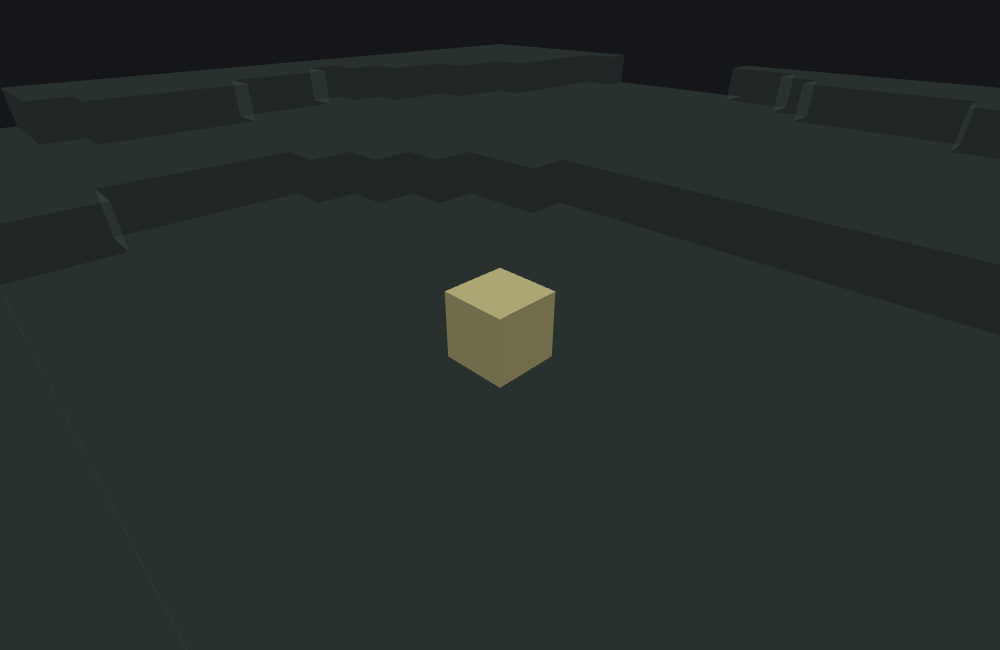

# Weighted Random Features

This page is a statement about **Minecraft Bedrock 1.26.50.24**
specifically. This type's JSON surface — its one key and both accepted entry shapes — and its
behaviour are unchanged between 1.26.40.26 and 1.26.50.24, so the page
describes both versions. Worldgen internals move between releases; nothing here should be assumed to
hold for a different build without checking.

`minecraft:weighted_random_feature` is a **Proxy feature**: it places nothing itself. It makes
exactly one weighted pick from a list of feature references and delegates to that one, at its own
unmodified origin — the same one-`Random`-draw weighted pick
[Single Block Features](./single-block-feature.md#weighted-candidate-list)' `places_block` uses
(both use the same weighted pick), just choosing between whole *features*
instead of block descriptors.

## What it does

1. Sum every entry's weight and draw **one** `Random` value against that total — the identical
   mechanism `places_block`'s own weighted pick uses (see the cross-reference above): the pick
   costs exactly one draw regardless of how many entries are listed. That draw is
   `nextInt(total)`, an integer in `[0, total)`, and the running sums are **truncated to integers
   at every step** (see the note below).
2. Resolve the picked entry's feature reference. If it doesn't resolve, or this feature is
   disallowed from placing an internal feature (the same recursion-guard check every Proxy
   feature on this doc set makes), fail with no further RNG spent.
3. Delegate to the resolved feature **once**, at the original, unmodified context — origin,
   Molang scope, everything forwarded as-is, under the standard recursion guard keyed on this
   wrapper (not the delegate).

That's the entire feature: one draw, one delegation, nothing else. Every other entry in the list
is simply never visited on this call — a weighted_random_feature never tries a second candidate
after the first one fails, unlike an [Aggregate or Sequence
Feature](./aggregate-and-sequence-feature.md) walking its whole list.

::: warning
**Fractional weights do not work the way they look.** The game's weighted pick accumulates
`total = (int)(float)(total + weight)` — one truncation per entry — and subtracts the same way
while walking the list. Two entries weighted `0.5` therefore total **0**, no draw happens, and
**nothing is picked at all** (the feature reports "Feature could not be selected"). Weights of
`1.6` and `1.6` total `2`, not `3.2`. Use integers. The draw itself is the integer
`nextInt(total)`, not a float scaled by the total.
:::

### `features`

An array of two-element `[featureReference, weight]` tuples — the shape real packs use, and the
shape this page's example uses. An object form,
`{feature, weight}` (or `{places_feature, weight}`), is also accepted defensively, but it is not
known to work in the game; treat it as plausible, not certain. `weight` may be omitted on the object form (defaults to `1`); the tuple
form always requires both elements explicitly.

## Example

```json title="weighted_random_feature -- an even pick between two single_block_feature delegates"
{
  "format_version": "1.21.110",
  "minecraft:weighted_random_feature": {
    "description": { "identifier": "wiki:weighted_pick_feature" },
    "features": [
      ["wiki:pumpkin_patch_block", 1],
      ["wiki:weighted_pick_alt", 1]
    ]
  }
}
```

Two candidates, equal weight (1:1 — a fair coin flip): `wiki:pumpkin_patch_block` is [the same
single_block_feature from the first page in this set](./single-block-feature.md#example)
(pumpkin/jack o'lantern, attached to grass); `wiki:weighted_pick_alt` is a second, otherwise
identical single_block_feature that places a plain `minecraft:gold_block` instead, so the two
candidates are visually unambiguous no matter which one wins. Run against `plains` with feature
seed `1`, the draw selects `wiki:weighted_pick_alt` and a gold block lands on the grass:



```
featurelab generate --pack <pack> --feature wiki:weighted_pick_feature --env plains --seed 1
```

::: tip
The draw genuinely depends on the seed, both on which of the two top-level candidates wins and
(when `wiki:pumpkin_patch_block` wins) which of *its own* internal weighted pick — pumpkin or
jack o'lantern — fires. Seed `2` against this same JSON, for comparison, lands on
`wiki:pumpkin_patch_block`'s branch and then that delegate's own 1-of-4-weight jack o'lantern
candidate — two nested weighted picks resolving independently, exactly as the algorithm above
predicts. Seed `3` lands on the same branch but draws the pumpkin instead, which is the more
likely of that delegate's two outcomes: the second pick is a fresh 3:1 draw every time, not a
consequence of the first.
:::

## Unequal weights

The example above is a 1:1 list, which is the one case where the weight arithmetic has nothing to
say. Give the same two candidates a lopsided split and the mechanism becomes visible:

```json title="weighted_random_feature -- a 5:1 split between the same two delegates"
{
  "format_version": "1.21.110",
  "minecraft:weighted_random_feature": {
    "description": { "identifier": "wiki:weighted_pick_lopsided" },
    "features": [
      ["wiki:pumpkin_patch_block", 5],
      ["wiki:weighted_pick_alt", 1]
    ]
  }
}
```

The accumulate runs `0 -> 5 -> 6`, so the draw is `nextInt(6)`, an integer in `[0, 6)`. The walk
then subtracts each weight in turn and takes the first entry that drives the running value
**below zero**: `d - 5 < 0` for `d` in `0..4`, so the first candidate owns five of the six
possible draw values, and only `d = 5` survives to the second candidate, where `5 - 5 = 0` is not
yet negative and `0 - 1 = -1` is. Five chances in six, one in six — the ratio you wrote, with no
rounding anywhere, because both weights are already integers.

Run against `plains` with feature seed `1`, the pick lands on the weight-5 candidate,
`wiki:pumpkin_patch_block`, and that delegate's *own* 3:1 block pick then draws its
1-of-4-weight candidate, so a `minecraft:jack_o_lantern` lands at `(0, 63, 0)`:

```
featurelab generate --pack <pack> --feature wiki:weighted_pick_lopsided --env plains --seed 1
```

Seed `1` is the same seed that picks the *other* branch — the gold block — in the 1:1 example
above, which is worth pausing on. The two lists do not share a draw whose boundary moved: the
draw's **bound is the total**, so a 1:1 list draws `nextInt(2)` and a 5:1 list draws `nextInt(6)`,
two different calls into the same stream returning two unrelated integers. Changing a weight
changes the number that comes out, not just which band it falls in.

Over feature seeds `1` through `12`, run one at a time, the 5:1 list picks the weight-5 candidate
ten times and the weight-1 candidate twice (seeds `5` and `10`) — 10:2 against a 10:2 expectation,
which is luck as much as arithmetic at this sample size, but it is at least the right shape. The
1:1 list over those same twelve seeds splits 5:7, with the *first* candidate now the rarer of
the two. Both tallies are counts of real runs of the two commands, one seed at a time, not a
probability calculation.

::: tip
Zero is a legal weight and behaves exactly as the subtraction implies: `remaining - 0` is never
negative on its own, so a zero-weighted entry can never be the first to cross below zero and is
**unreachable** — it does not even get the "only if everything before it is skipped" chance it
might look like it has. It still costs nothing: the total is unchanged, so the rest of the list
keeps the odds it would have had if you had deleted the entry outright.
:::

## Field reference

| Field | Required | Shape | Default |
|---|---|---|---|
| `features` | yes | non-empty array of `[featureReference, weight]` tuples (or, less certain, `{feature\|places_feature, weight}` objects) | — |

## See also

- [Single Block Features](./single-block-feature.md#weighted-candidate-list) — the weighted-pick
  mechanism this feature type reuses verbatim, just choosing between features instead of block
  descriptors.
- [Aggregate and Sequence Features](./aggregate-and-sequence-feature.md) — Proxy features that
  delegate to *every* listed feature (in order), contrasted with weighted_random_feature's
  exactly-one-of-many pick.

## Version and verification notes

Everything above is a statement about 1.26.50.24 specifically, and holds
for 1.26.40.26 too: the type's JSON surface and its behaviour are unchanged between the two
versions. `features/weighted_random.go`'s own header comment carries the details.

The `[ref, weight]` tuple shape is the one real packs use; the object-shaped entry is accepted
defensively and is **not** known to be accepted by the game — flagged as such above. Both JSON
examples on this page were run end to end against this project's own worldgen tooling
(`featurelab check` and `featurelab generate`) and produced the described results; the
accompanying image was rendered from the first
of those results by this doc set's own image pipeline (see
[`docs/wiki/tools/`](./tools/generate-images.mjs)). The twelve-seed tallies in the unequal-weights
section are counts of twelve real runs of each command, one seed at a time — not a probability
calculation dressed up as a measurement, and far too small a sample to be one.
